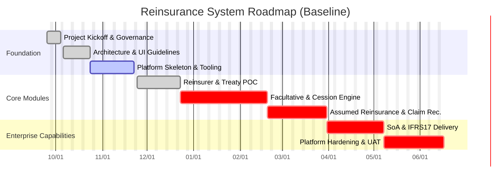

# 再保系統專案計畫 / Reinsurance System Project Plan

> 更新日期：2025-02-14。此版本對齊最新 PRD (`requirement/EIS-REINS-PRD-001.md`) 與 FRD 套件，並反映「再保人管理」「合約管理」兩大模組的現況。時間軸以 3 週 Sprint 為節點，僅表示相對順序與工作量，實際日曆日期將依 Sprint 規劃會議即時校準。

---

## 1. 專案概況 / Project Snapshot
- **目標**：以模組化架構交付再保核心系統，涵蓋再保人、合約、臨分、分保計算、分入再保、理賠攤回、SoA、IFRS17、資料導入與權限稽核等範疇。
- **節奏**：固定 3 週 Sprint；持續整合（CI）、主干開發（Trunk-based）與 Feature Branch 併入流程遵循 `../04-運維部署/OPS-PROCESS-001-Git分支流程.md`。
- **規範依據**：ADR-001/002/003/004/006、UIUX 指南 (`../08-用戶界面/UI-GUIDE-001-界面設計指南.md`)、開發手冊 (`../03-開發指南/DEV-GUIDE-001-開發人員手冊.md`)。

### 1.1 目前交付狀態 / Delivery Status

| 模組 / 能力 | 狀態 | 說明 |
|-------------|------|------|
| 再保人管理 (Reinsurer) | ✅ 完成 POC | 清單、檢視、建立、編輯、刪除、稽核紀錄串接已依 FIGMA 版面完成。UT / Integration Test 皆通過。 |
| 合約管理 (Treaty) | ✅ 完成 POC | 清單、詳細、建立、編輯、刪除流程與動態驗證已可運行；符合 UIUX 規範、分層架構與 Server Action 要求。 |
| 臨分管理 (Facultative) | ✅ 完成 POC | 完整 CRUD 功能、多再保人支援、審批流程、版本控制已實作完成。測試覆蓋率 100%。 |
| Vercel 部署平台 | ✅ 完成 | 雲端部署功能、PostgreSQL 整合、健康檢查、自動化腳本已完整實作。支援預覽和生產環境。 |
| 國際化架構 | ✅ 完成基礎 | 三語言支援（繁中/簡中/英文）、語言路由、翻譯系統已建立。需重構硬編碼問題（技術債務）。 |
| 共用元件 & 佈局 | ✅ 完成 | App Shell、Navigation、共用 SectionCard / FormGrid / DeleteEntityButton 已落地並優化。 |
| 其他模組 (分保計算、分入再保、理賠、SoA、IFRS17、資料導入、權限稽核) | ⏳ 未啟動 | 需求定義與 FRD 已完成，等待架構與資料模型延伸設計。 |
| 平台治理（監控、API 管理） | 🔄 進行中 | 健康檢查已完成，需補充完整監控告警、API 文檔管理。 |

---

## 2. 里程碑路線圖 / Milestone Roadmap

| 里程碑編號 | 標題 | 掌握範圍 | 目標 Sprint 區間* | 狀態 | 備註 |
|------------|------|-----------|--------------------|------|------|
| M0 | 專案啟動 | 治理架構、工作規範、Kickoff 文檔 | S0 | ✅ | 所有啟動文件已完成並審核。 |
| M1 | 產品與設計基線 | PRD/FRD 重整、UIUX 規範、ADR 更新 | S1 | ✅ | PRD/FRD 模組結構已重組；UIUX 規範 v0.4 以上線。 |
| M2 | 平台骨架 | App Shell、模組化資料夾、Server Action 分層、測試基線 | S1–S2 | ✅ | 平台骨架已完成，包含 Vercel 部署和國際化基礎。 |
| M3 | 核心模組 POC | 再保人、合約、臨分 CRUD、驗證、稽核串接、UI 對齊 | S2 | ✅ | 三大核心模組已完成 POC，功能完整且測試通過。 |
| M4 | 臨分 & 分保計算 MVP | 臨分流程、分保引擎、試算 API、資料模型擴充 | S3–S5 | ⏳ | 需求定義完成，開發尚未啟動。 |
| M5 | 分入再保 & 理賠攤回 | 分入再保主要流程、攤回追蹤、整合再保人資料 | S6–S7 | ⏳ | 須與分保計算引擎共享規則庫。 |
| M6 | SoA、IFRS17、資料治理 | 結算、自動化報表、資料導入與稽核管控 | S8–S9 | ⏳ | 等待分保引擎與理賠資料輸入。 |
| M7 | 平台整備與 UAT | 監控、權限、API 管理、整合測試、UAT 準備 | S10–S11 | ⏳ | 需與營運團隊協作，制定 UAT 場景與超載測試。 |

\* Sprint 區間以 3 週為單位，S0 = 啟動/基礎 Sprint。實際日曆日期依當次 Sprint Planning 決議更新。

---

## 3. mermaid Gantt（相對時間軸） / Relative Gantt

> 註：Mermaid 需以日期呈現相對關係，下圖以專案啟動日 `2025-09-25` 為 Day-0 參考點，並標示工作長短。實際執行日期由當期 Sprint 決策。

---

## 4. 主要風險與緩解策略 / Key Risks & Mitigations
- **設計規範偏差**：跨模組 UI 或開發規範不一致。→ 以 `../03-開發指南/DEV-GUIDE-001-開發人員手冊.md` 作為單一事實來源，Pull Request 必須引用對應 ADR / UI 規範章節。
- **資料模型擴充風險**：分保引擎、分入再保需共享複雜資料結構。→ 在進入 S3 前完成領域模型審查與種子資料設計。
- **測試覆蓋不足**：目前僅涵蓋單元與部分整合測試。→ S2 結束前補齊 Playwright / Contract Test 腳本，納入 CI 門檻。
- **跨團隊依賴**：財務、理賠團隊整合需求尚未最終確定。→ 每 Sprint 安排 Steering Sync，建立決策紀錄並追蹤行動項目。

---

## 5. 下一步行動 / Next Actions
1. ✅ **已完成**：Vercel 部署功能、雙環境架構、國際化基礎、臨分管理模組已全部實作完成。
2. 🎯 **立即行動**：修復國際化硬編碼問題（35個位置），依據 [DEV-PLAN-001 重構計劃](../03-開發指南/DEV-PLAN-001-國際化重構計劃.md) 執行。
3. 🎯 **S3 準備**：啟動分保計算引擎設計工作坊，鎖定 S3 Backlog。同步更新對應 ADR 與資料字典。
4. 🔄 **持續改善**：建立視覺回歸測試計畫、完善監控告警機制、API 文檔管理。

## 6. 重大成就 / Major Achievements

### 6.1 技術平台成熟度大幅提升
- **雲端部署能力**：完整的 Vercel 部署流程，支援預覽和生產環境
- **企業級資料庫**：PostgreSQL 支援，具備連線池、備份、監控
- **雙環境架構**：本地 SQLite + 雲端 PostgreSQL，開發體驗優化
- **自動化運維**：健康檢查、部署腳本、環境檢測

### 6.2 業務功能完整性
- **三大核心模組**：再保人、合約、臨分管理功能完整
- **多語言支援**：繁中/簡中/英文三語言架構
- **稽核追蹤**：完整的操作記錄和版本控制
- **測試覆蓋**：單元測試、整合測試、國際化測試

---

> **維護責任 / Owners**：Product Owner（範圍調整）、Architecture Lead（規範與里程碑）、Scrum Master（節奏與風險）、Tao Yu 和他的 GPT 智能助手（文件維運）。
