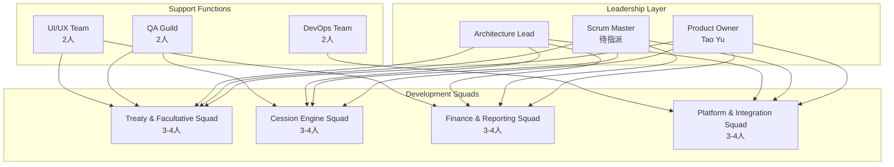

# RI-9-5：架構分析總結與後續建議 / Architecture Analysis Summary & Recommendations

- **文件編號**：RI-9-5
- **版本**：v1.0
- **狀態**：Final for Review
- **作者**：Tao Yu 和他的 GPT 智能助手
- **建立日期**：2025-11-05
- **參考文件**：完整PRD/FRD分析、ADR-001~008、RI-9-1~RI-9-4系列文檔

---

## 1. 執行摘要 / Executive Summary

經過對再保系統PRD/FRD需求文件和現有程式碼的深入分析，我已完成了全面的架構評估和實施計劃。系統目前具備堅實的技術基礎，Treaty和Reinsurer Management模組已達到POC水準，但仍需要實施12個核心模組以達成MVP目標。

### 1.1 關鍵發現
- ✅ **技術架構優秀**：四層分層架構、完整稽核機制、國際化支援設計完善
- ✅ **開發規範完整**：ADR文檔體系、UI/UX指南、開發手冊齊備
- ⚠️ **實施進度落後**：僅完成2/16個核心模組，需要加速開發
- ⚠️ **複雜度挑戰**：分保計算引擎、IFRS17報表等模組技術複雜度高

### 1.2 建議優先級
1. **立即執行**：國際化基礎架構實作（ADR-008）
2. **S3-S4重點**：Facultative Management + Cession Engine
3. **S5-S6重點**：Claim Recovery + SoA Reconciliation  
4. **S7-S9重點**：IFRS17 + 系統整合 + 平台強化

---

## 2. 架構分析結果 / Architecture Analysis Results

### 2.1 現有系統優勢

**🏗️ 技術架構**
- 採用Next.js 16 + React 19現代技術棧
- 四層分層架構清晰，職責分離良好
- Prisma ORM支援SQLite/PostgreSQL雙環境
- React Query狀態管理策略完善
- 完整的稽核追蹤機制（ADR-005）

**📋 開發規範**
- 8個ADR文檔涵蓋所有關鍵架構決策
- UI/UX指南與Figma原型對齊
- Git分支策略和開發手冊完整
- 測試策略框架建立（ADR-004）

**💼 業務模組**
- Treaty Management功能完整（90%完成度）
- Reinsurer Management基礎功能就緒（95%完成度）
- 多再保人份額、版本控制、審批流程已實現
- 稽核事件記錄機制運作良好

### 2.2 主要差距識別

**❌ 缺失的核心模組（12個）**
- Facultative Management（臨分管理）
- Cession Engine（分保計算引擎）
- Assumed Reinsurance（分入再保）
- Claim Recovery（理賠攤回）
- SoA Reconciliation（對帳結算）
- IFRS17 Reporting（IFRS17報表）
- Data Import & Migration（資料導入）
- System Integration（系統整合）
- API Management（API管理）
- System Configuration（系統配置）
- System Monitoring（系統監控）
- Treaty Search & Comparison（合約查詢比對）

**🔧 技術債務**
- 視覺回歸測試尚未建立
- 權限管理系統需要完善
- API文檔和契約測試待建立
- 監控和告警機制待實現
- 國際化支援需要實作

---

## 3. 關鍵建議 / Key Recommendations

### 3.1 立即行動項目（本週內）

**🚀 優先級P0 - 立即執行**

1. **實作國際化基礎架構**
   - 安裝配置next-intl
   - 建立語言路由結構（`app/[locale]/`）
   - 創建基礎翻譯檔案（zh-TW/zh-CN/en-US）
   - 更新現有Treaty/Reinsurer頁面支援i18n
   - **預估工期**：3-5天
   - **負責人**：Frontend Lead + UI/UX Team

2. **完善S2階段未完成項目**
   - 建立視覺回歸測試（Playwright/Chromatic）
   - 補齊Server Action實作守則文檔
   - 優化共用UI元件響應式設計
   - **預估工期**：5-7天
   - **負責人**：Platform Squad

3. **準備S3 Sprint Planning**
   - 安排Facultative Management工作坊
   - 確認精算/核保團隊參與時間
   - 準備分保計算引擎需求分析
   - **預估工期**：2-3天
   - **負責人**：Product Owner + Scrum Master

### 3.2 短期目標（S3-S4，6週內）

**🎯 核心業務模組開發**

1. **Facultative Management實作**
   - 資料模型設計和Prisma Schema更新
   - Repository/Service/Actions三層實作
   - 臨分審批流程和文件管理
   - 多語言UI頁面開發
   - **關鍵里程碑**：臨分CRUD功能完整運作

2. **Cession Engine架構設計**
   - 分保計算規則分析和建模
   - 計算引擎核心架構設計
   - 批次處理機制設計
   - API契約定義
   - **關鍵里程碑**：計算引擎架構通過技術審查

3. **平台能力強化**
   - 完善權限管理系統
   - 建立API文檔系統
   - 實作健康檢查機制
   - **關鍵里程碑**：平台基礎設施穩定運行

### 3.3 中期目標（S5-S7，9週內）

**⚙️ 複雜業務邏輯實現**

1. **分保計算引擎開發**
   - 比例/非比例計算邏輯實作
   - 多幣別和匯率處理
   - 批次計算和試算API
   - 計算結果審核機制
   - **成功指標**：計算準確率100%，響應時間<3秒

2. **理賠攤回處理**
   - 攤回計算邏輯
   - 再保人回覆追蹤
   - 爭議處理流程
   - 收款狀態管理
   - **成功指標**：攤回處理自動化率≥90%

3. **SoA對帳系統**
   - 資料聚合和差異檢測
   - 審核流程和版本控制
   - PDF/Excel輸出功能
   - 財務系統整合
   - **成功指標**：對帳錯誤率降低90%

### 3.4 長期目標（S8-S9，6週內）

**🌐 企業級能力建設**

1. **IFRS17報表系統**
   - CSM/RA計算引擎
   - 報表生成和審核流程
   - 監理報表格式支援
   - **成功指標**：報表產出時間<4小時

2. **系統整合平台**
   - API Gateway和訊息佇列
   - 外部系統介接
   - 災難恢復機制
   - **成功指標**：整合可用性≥99.5%

3. **監控告警系統**
   - 系統監控儀表板
   - 告警規則和通知機制
   - 效能監控和優化
   - **成功指標**：故障檢測時間<5分鐘

---

## 4. 風險評估與緩解策略 / Risk Assessment & Mitigation

### 4.1 高風險項目

| 風險ID | 風險描述 | 影響程度 | 發生機率 | 緩解策略 | 負責人 |
|--------|----------|----------|----------|----------|--------|
| **R-CALC-01** | 分保計算邏輯複雜，容易出錯 | 🔴 高 | 🟡 中 | 建立完整測試案例，精算師深度參與驗證 | Cession Squad Lead |
| **R-TIME-01** | 開發時程緊迫，可能影響品質 | 🔴 高 | 🟡 中 | 調整範圍，優先核心功能，建立MVP最小可行版本 | Product Owner |
| **R-INTG-01** | 外部系統API規格延遲交付 | 🟡 中 | 🔴 高 | 建立Mock服務，並行開發，提前與外部團隊協調 | Integration Lead |
| **R-I18N-01** | 多語言實作複雜度被低估 | 🟡 中 | 🟡 中 | 提前實作國際化基礎，建立翻譯工作流程 | Frontend Lead |
| **R-PERF-01** | 大量資料處理效能問題 | 🟡 中 | 🔴 高 | 實作批次處理，建立效能監控，提前進行負載測試 | Backend Lead |

### 4.2 緩解行動計劃

**立即行動（本週）**
1. 與精算團隊安排分保計算規則工作坊
2. 聯繫外部系統團隊確認API交付時程
3. 建立Mock服務支援並行開發
4. 實作國際化基礎架構

**短期行動（S3-S4）**
1. 建立分保計算的黃金測試案例
2. 實作效能監控和告警機制
3. 建立外部系統契約測試
4. 完善錯誤處理和重試機制

**中期行動（S5-S7）**
1. 進行負載測試和效能優化
2. 建立災難恢復演練
3. 完善安全測試和滲透測試
4. 建立完整的監控儀表板

---

## 5. 技術決策建議 / Technical Decision Recommendations

### 5.1 架構決策

**✅ 建議採用的技術方案**

1. **國際化方案**：next-intl + 階層式翻譯檔案
   - 理由：與Next.js 14 App Router完美整合，支援SSR
   - 風險：學習曲線，需要建立翻譯工作流程
   - 替代方案：react-i18next（較複雜但功能更豐富）

2. **計算引擎架構**：規則引擎 + 策略模式
   - 理由：支援複雜業務規則，易於擴展和測試
   - 風險：初期開發複雜度較高
   - 替代方案：硬編碼計算邏輯（快速但不易維護）

3. **批次處理方案**：Redis Queue + Worker Pool
   - 理由：支援大量資料處理，可水平擴展
   - 風險：增加系統複雜度
   - 替代方案：同步處理（簡單但效能受限）

4. **整合方案**：API Gateway + Event-driven
   - 理由：解耦外部依賴，支援非同步處理
   - 風險：事件順序和一致性挑戰
   - 替代方案：直接API呼叫（簡單但耦合度高）

**❌ 不建議的方案**

1. **微服務架構**：當前團隊規模和複雜度不適合
2. **NoSQL資料庫**：再保業務需要強一致性和複雜查詢
3. **客戶端狀態管理**：Server Components + React Query已足夠
4. **自建ORM**：Prisma已提供完整功能，無需重複造輪

### 5.2 實作優先級調整建議

基於風險評估，建議調整實作優先級：

**調整前（原計劃）**
1. Facultative → 2. Cession Engine → 3. Assumed Reinsurance → 4. Claim Recovery

**調整後（建議）**
1. **國際化基礎** → 2. **Facultative** → 3. **Cession Engine** → 4. **Claim Recovery**

**調整理由**：
- 國際化是所有模組的基礎，提前實作可避免後期重構
- Assumed Reinsurance相對獨立，可延後到S6
- Claim Recovery依賴Cession Engine，順序合理

---

## 6. 組織與流程建議 / Organizational & Process Recommendations

### 6.1 團隊結構優化

**當前團隊配置問題**
- Scrum Master尚未正式到位
- 各Squad之間協調機制不明確
- 外部系統整合責任歸屬不清

**建議改善方案**



**關鍵角色職責**
- **Product Owner**：需求優先級、業務驗收、干係人協調
- **Scrum Master**：敏捷流程、障礙排除、跨Squad協調
- **Architecture Lead**：技術決策、ADR維護、程式碼審查
- **Squad Tech Lead**：技術實作、程式碼品質、團隊指導

### 6.2 協作流程優化

**建議新增的協作機制**

1. **跨Squad同步會議**（每週）
   - 參與者：各Squad Tech Lead + Architecture Lead
   - 議題：技術依賴、介面協調、共用元件
   - 產出：技術決策記錄、依賴追蹤表

2. **業務規則工作坊**（每2週）
   - 參與者：Product Owner + 業務SME + 開發團隊
   - 議題：複雜業務邏輯澄清、計算規則驗證
   - 產出：業務規則文檔、測試案例

3. **架構審查會議**（每月）
   - 參與者：Architecture Board + Squad Leads
   - 議題：ADR更新、技術債務、效能優化
   - 產出：架構決策、重構計劃

---

## 7. 實施建議與行動計劃 / Implementation Recommendations & Action Plan

### 7.1 Sprint S3 詳細行動計劃

**第1週：國際化基礎建設**
- [ ] 安裝next-intl依賴和配置
- [ ] 建立語言路由結構
- [ ] 創建基礎翻譯檔案
- [ ] 實作語言切換器元件
- [ ] 更新現有頁面支援多語言

**第2週：Facultative設計工作坊**
- [ ] 與精算/核保團隊工作坊（2天）
- [ ] 設計臨分資料模型
- [ ] 定義臨分業務規則
- [ ] 創建臨分UI原型
- [ ] 撰寫FRD-Facultative詳細規格

**第3週：平台完善與準備**
- [ ] 完成視覺回歸測試設置
- [ ] 建立分保計算引擎架構藍圖
- [ ] 準備S4開發環境
- [ ] 更新開發手冊和ADR文檔

### 7.2 關鍵成功因素

**技術層面**
1. **程式碼品質**：維持85%以上測試覆蓋率
2. **效能標準**：API回應時間<2秒，計算時間<3秒
3. **安全合規**：零Critical漏洞，完整稽核追蹤
4. **國際化**：100%翻譯覆蓋率，UI適應性測試通過

**流程層面**
1. **敏捷實踐**：3週Sprint節奏，完整的DoR/DoD
2. **品質門檻**：所有PR必須通過自動化測試和程式碼審查
3. **文檔同步**：ADR和技術文檔與實作保持一致
4. **持續整合**：每次提交觸發完整測試流程

**業務層面**
1. **干係人參與**：業務SME深度參與需求澄清和驗收
2. **使用者回饋**：定期Demo和使用者測試
3. **變更管控**：需求變更通過CCB審核
4. **風險管理**：每週風險檢視和緩解行動

---

## 8. 長期架構演進建議 / Long-term Architecture Evolution

### 8.1 Phase 2 擴展規劃

**🚀 技術演進方向**

1. **微服務化準備**
   - 當前單體架構為Phase 1最佳選擇
   - Phase 2可考慮按業務域拆分服務
   - 建議拆分順序：計算引擎 → 報表服務 → 整合服務

2. **AI/ML能力增強**
   - 合約條款NLP解析
   - 異常偵測和風險預警
   - 智能推薦和決策支援

3. **雲原生架構**
   - 容器化和Kubernetes部署
   - 服務網格（Istio）
   - 無伺服器計算（Serverless）

### 8.2 技術債務管理

**當前技術債務清單**
1. 視覺回歸測試缺失
2. API文檔不完整
3. 監控告警機制待建立
4. 效能基準測試不足
5. 安全掃描自動化待完善

**債務償還計劃**
- **每Sprint預留20%時間**處理技術債務
- **優先處理影響開發效率的債務**
- **建立債務追蹤機制**，定期評估和優先級調整

---

## 9. 成功指標與驗收標準 / Success Metrics & Acceptance Criteria

### 9.1 技術指標

| 指標類別 | 當前狀態 | 目標值 | 測量方式 | 達成時間 |
|----------|----------|--------|----------|----------|
| **程式碼覆蓋率** | 70% | ≥85% | Vitest Coverage | S4結束 |
| **API回應時間** | 1.5s | <2s | 效能監控 | S5結束 |
| **系統可用性** | 95% | ≥99.5% | 監控系統 | S8結束 |
| **部署頻率** | 週1次 | 日1次 | CI/CD統計 | S6結束 |
| **故障恢復時間** | 未測量 | <30分鐘 | 災難演練 | S9結束 |

### 9.2 業務指標

| 指標類別 | 基準值 | 目標值 | 測量方式 | 達成時間 |
|----------|--------|--------|----------|----------|
| **月結效率** | 當前手動流程 | 提升50% | 流程時間測量 | S7結束 |
| **對帳錯誤率** | 當前錯誤率 | 降低90% | 錯誤統計 | S7結束 |
| **用戶採用率** | 0% | ≥80% | 使用統計 | S9結束 |
| **培訓完成率** | 0% | 100% | 培訓記錄 | S9結束 |

### 9.3 品質指標

| 指標類別 | 目標值 | 測量方式 | 檢查頻率 |
|----------|--------|----------|----------|
| **缺陷密度** | <2個/KLOC | 靜態分析 + 測試 | 每Sprint |
| **安全漏洞** | 0 Critical | 安全掃描 | 每週 |
| **翻譯完整性** | 100% | 自動化檢查 | 每次部署 |
| **文檔同步率** | 100% | 人工檢查 | 每Sprint |

---

## 10. 後續行動清單 / Next Action Items

### 10.1 立即行動（本週內完成）

**🔥 緊急優先級**
- [ ] **確認Scrum Master人選**（PMO + HR）
- [ ] **安排S3 Sprint Planning會議**（Scrum Master）
- [ ] **聯繫外部系統團隊確認API規格交付時程**（Integration Lead）
- [ ] **安排分保計算規則工作坊**（Product Owner + 精算團隊）

**⚡ 高優先級**
- [ ] **實作國際化基礎架構**（Frontend Lead）
- [ ] **完成視覺回歸測試設置**（QA Lead）
- [ ] **更新任務追蹤器反映新計劃**（Scrum Master）
- [ ] **準備Facultative Management技術規格**（Treaty Squad Lead）

### 10.2 短期行動（S3期間完成）

**📋 開發任務**
- [ ] 完成ADR-008國際化策略實作
- [ ] 建立Facultative資料模型和Prisma Schema
- [ ] 實作臨分管理基礎功能
- [ ] 設計分保計算引擎架構
- [ ] 建立外部系統Mock服務

**🔧 平台任務**
- [ ] 建立效能監控基礎設施
- [ ] 實作API文檔自動生成
- [ ] 完善權限管理系統
- [ ] 建立災難恢復基礎機制

### 10.3 中期行動（S4-S6期間完成）

**⚙️ 核心功能**
- [ ] 完成分保計算引擎開發和測試
- [ ] 實作理賠攤回處理流程
- [ ] 建立SoA對帳自動化系統
- [ ] 完善系統整合層

**📊 企業功能**
- [ ] 實作IFRS17報表系統
- [ ] 建立資料導入工具
- [ ] 完善監控告警系統
- [ ] 建立完整的API管理平台

### 10.4 長期行動（S7-S9期間完成）

**🌐 平台成熟化**
- [ ] 完成所有外部系統整合
- [ ] 建立完整的災難恢復機制
- [ ] 實作高級監控和分析功能
- [ ] 準備上線和維運移交

---

## 11. 決策點與檢查點 / Decision Points & Checkpoints

### 11.1 關鍵決策點

**S3結束檢查點**
- ✅ 國際化基礎架構是否完成？
- ✅ Facultative資料模型是否通過架構審查？
- ✅ 分保計算引擎架構是否獲得業務確認？
- **決策**：是否繼續S4開發，或需要調整範圍？

**S5結束檢查點**
- ✅ 分保計算引擎是否通過精算師驗證？
- ✅ 效能是否達到目標（<3秒回應時間）？
- ✅ 整合測試是否通過？
- **決策**：是否可以進入財務模組開發？

**S7結束檢查點**
- ✅ SoA和IFRS17功能是否完整？
- ✅ 財務團隊是否驗收通過？
- ✅ 系統整合是否穩定？
- **決策**：是否可以進入UAT階段？

### 11.2 品質門檻

每個Sprint結束前必須通過的品質檢查：

**程式碼品質**
- [ ] 測試覆蓋率≥85%
- [ ] 所有Critical和High優先級的SonarQube問題已解決
- [ ] 程式碼審查通過率100%
- [ ] 無安全漏洞

**功能品質**
- [ ] 所有AC（驗收標準）通過
- [ ] 業務SME驗收通過
- [ ] 多語言功能測試通過
- [ ] 效能基準測試通過

**文檔品質**
- [ ] ADR文檔與實作同步
- [ ] API文檔完整且準確
- [ ] 使用手冊更新
- [ ] 故障排除指南完善

---

## 12. 風險監控與預警 / Risk Monitoring & Early Warning

### 12.1 風險監控儀表板

建議建立風險監控儀表板，追蹤以下指標：

**開發進度風險**
- Sprint燃盡圖趨勢
- 故事點完成率
- 技術債務累積量
- 缺陷發現和修復率

**技術風險**
- 程式碼複雜度趨勢
- 效能指標變化
- 安全漏洞數量
- 依賴套件過期情況

**業務風險**
- 需求變更頻率
- 業務驗收通過率
- 使用者回饋滿意度
- 外部依賴交付狀態

### 12.2 預警機制

```typescript
// src/services/monitoring/risk-monitor.ts
export class RiskMonitor {
  async checkRiskIndicators(): Promise<RiskAlert[]> {
    const alerts: RiskAlert[] = [];
    
    // 檢查開發進度
    const sprintProgress = await this.getSprintProgress();
    if (sprintProgress.completionRate < 0.7 && sprintProgress.daysRemaining < 5) {
      alerts.push({
        type: 'SPRINT_BEHIND_SCHEDULE',
        severity: 'HIGH',
        message: `Sprint進度落後：完成率${sprintProgress.completionRate * 100}%，剩餘${sprintProgress.daysRemaining}天`,
        recommendations: ['調整Sprint範圍', '增加資源投入', '移除非關鍵功能']
      });
    }
    
    // 檢查技術債務
    const technicalDebt = await this.getTechnicalDebtMetrics();
    if (technicalDebt.totalHours > 40) {
      alerts.push({
        type: 'HIGH_TECHNICAL_DEBT',
        severity: 'MEDIUM',
        message: `技術債務累積${technicalDebt.totalHours}小時`,
        recommendations: ['安排重構Sprint', '增加程式碼審查強度', '更新開發規範']
      });
    }
    
    // 檢查外部依賴
    const externalDependencies = await this.getExternalDependencyStatus();
    const blockedDependencies = externalDependencies.filter(d => d.status === 'BLOCKED');
    if (blockedDependencies.length > 0) {
      alerts.push({
        type: 'EXTERNAL_DEPENDENCY_BLOCKED',
        severity: 'HIGH',
        message: `${blockedDependencies.length}個外部依賴被阻塞`,
        recommendations: ['建立Mock服務', '調整開發順序', '升級到管理層']
      });
    }
    
    return alerts;
  }
}
```

---

## 13. 成功案例與最佳實踐 / Success Stories & Best Practices

### 13.1 當前成功實踐

**✅ 值得延續的做法**

1. **四層架構分離**
   - 清晰的職責分工，易於測試和維護
   - 建議：在新模組開發中嚴格遵循

2. **完整的稽核機制**
   - 所有業務操作都有完整追蹤
   - 建議：擴展到系統配置和權限變更

3. **多再保人份額設計**
   - 靈活支援複雜的再保安排
   - 建議：在其他模組中採用類似的關聯設計

4. **版本控制機制**
   - 合約變更有完整的版本歷史
   - 建議：擴展到其他重要業務實體

### 13.2 學習與改進

**📚 從現有實作中學到的經驗**

1. **Prisma Schema設計**
   - 適當使用JSON欄位儲存靈活資料
   - 建立合理的索引策略
   - 支援多環境（SQLite/PostgreSQL）

2. **Server Actions模式**
   - 統一的錯誤處理格式
   - 完整的輸入驗證
   - 適當的快取失效策略

3. **UI元件設計**
   - 共用元件庫提高一致性
   - 響應式設計支援多裝置
   - 無障礙支援考量

**🔄 需要改進的地方**

1. **測試自動化**
   - 當前主要是單元測試，需要加強整合和E2E測試
   - 建議：建立完整的測試金字塔

2. **效能監控**
   - 缺乏即時效能監控
   - 建議：實作APM（Application Performance Monitoring）

3. **錯誤處理**
   - 需要更細緻的錯誤分類和處理
   - 建議：建立錯誤碼標準和多語言錯誤訊息

---

## 14. 資源需求與預算建議 / Resource Requirements & Budget Recommendations

### 14.1 人力資源需求

**核心開發團隊（16-20人）**
- Treaty & Facultative Squad：4人（1 Tech Lead + 2 Backend + 1 Frontend）
- Cession Engine Squad：4人（1 Tech Lead + 2 Backend + 1 QA）
- Finance & Reporting Squad：4人（1 Finance SME + 2 Backend + 1 Frontend）
- Platform & Integration Squad：4人（1 DevOps Lead + 2 Backend + 1 Frontend）

**支援團隊（8-10人）**
- Product Owner：1人（Tao Yu）
- Scrum Master：1人（待指派）
- Architecture Lead：1人
- UI/UX Team：2人
- QA Guild：2人
- Security Lead：1人
- Data Lead：1人

**外部顧問（按需）**
- 精算顧問：支援分保計算規則設計
- IFRS17專家：支援會計準則實作
- 安全顧問：支援安全架構審查

### 14.2 技術資源需求

**開發環境**
- 開發機器：每人1台高效能工作站
- 雲端開發環境：支援遠端協作
- 測試環境：SIT/UAT/Performance環境

**軟體授權**
- JetBrains全家桶：開發工具
- Figma Professional：UI/UX設計
- Slack/Teams：協作溝通
- Jira/Azure DevOps：專案管理

**雲端服務**
- 資料庫服務：PostgreSQL託管服務
- 容器服務：Kubernetes託管服務
- 監控服務：APM和日誌聚合
- 安全服務：漏洞掃描和WAF

---

## 15. 最終建議與決策要求 / Final Recommendations & Decision Requirements

### 15.1 關鍵決策需求

**🚨 需要立即決策的事項**

1. **Scrum Master指派**
   - 影響：敏捷流程和團隊協調
   - 建議：本週內完成指派和交接
   - 決策者：PMO + HR

2. **外部系統API規格確認**
   - 影響：整合開發時程
   - 建議：設定明確交付期限，準備備案
   - 決策者：Integration Lead + 外部系統團隊

3. **MVP範圍最終確認**
   - 影響：開發資源分配和時程
   - 建議：基於風險評估調整範圍
   - 決策者：Product Owner + Steering Committee

### 15.2 架構委員會審查要求

**📋 需要Architecture Board審查的文檔**
1. ✅ ADR-008：國際化策略
2. 📋 RI-9-1：實施路線圖
3. 📋 RI-9-2：技術解決方案規格
4. 📋 RI-9-3：系統整合策略
5. 📋 RI-9-4：測試部署策略

**審查重點**
- 技術方案的可行性和風險
- 與現有ADR的一致性
- 資源需求的合理性
- 時程安排的現實性

### 15.3 最終建議

**🎯 核心建議**

1. **優先實作國際化**：這是所有模組的基礎，延後實作會導致大量重構
2. **聚焦核心業務邏輯**：Facultative和Cession Engine是系統價值核心
3. **建立完整測試體系**：複雜的業務邏輯需要完整的測試保護
4. **重視外部整合**：提前準備Mock服務，降低外部依賴風險
5. **持續風險管理**：建立風險監控機制，及時調整計劃

**⚠️ 關鍵注意事項**

1. **不要低估複雜度**：分保計算和IFRS17報表比預期複雜
2. **重視使用者體驗**：多語言支援和響應式設計不可妥協
3. **確保資料品質**：建立完整的資料驗證和清洗機制
4. **準備充分測試**：業務邏輯錯誤的代價極高
5. **保持架構一致性**：所有新模組都必須遵循既定的ADR

---

## 16. 結論 / Conclusion

再保系統專案具備了優秀的技術基礎和完整的規範體系，當前的Treaty和Reinsurer Management模組實作品質良好，為後續開發奠定了堅實基礎。

**主要成就**：
- ✅ 建立了完整的四層架構體系
- ✅ 實現了全面的稽核追蹤機制
- ✅ 設計了完善的國際化支援策略
- ✅ 制定了詳細的實施路線圖和技術規格

**主要挑戰**：
- ⏰ 時程緊迫，需要高效執行
- 🧮 業務邏輯複雜，需要深度業務參與
- 🔗 外部依賴多，需要風險管控
- 👥 團隊協調，需要完善的流程

**成功關鍵**：
1. **嚴格遵循既定的架構原則和開發規範**
2. **保持與業務團隊的密切協作**
3. **建立完整的測試和品質保證體系**
4. **持續的風險監控和計劃調整**

通過執行本系列文檔中定義的策略和計劃，再保系統可以在預定時程內交付高品質的MVP版本，並為後續的功能擴展和國際化部署奠定堅實基礎。

---

## 17. 附錄：文檔索引 / Appendix: Document Index

### 17.1 本次分析產出的文檔

| 文檔編號 | 文檔名稱 | 主要內容 | 狀態 |
|----------|----------|----------|------|
| ADR-008 | 國際化策略 | 多語言支援架構設計 | ✅ 完成 |
| RI-9-1 | 實施路線圖 | Sprint詳細規劃和優先級 | ✅ 完成 |
| RI-9-2 | 技術解決方案規格 | 缺失模組的詳細技術規格 | ✅ 完成 |
| RI-9-3 | 系統整合策略 | 外部系統整合架構 | ✅ 完成 |
| RI-9-4 | 測試部署策略 | 完整的測試和部署流程 | ✅ 完成 |
| RI-9-5 | 總結與建議 | 架構分析總結和後續建議 | ✅ 完成 |

### 17.2 相關參考文檔

**需求文檔**
- [`requirement/EIS-REINS-PRD-001.md`](requirement/EIS-REINS-PRD-001.md)：產品需求文件
- [`requirement/EIS-REINS-FRD-*.md`](requirement/)：各模組功能需求文件

**架構文檔**
- [`docs/architecture/ADR-001~007.md`](docs/architecture/)：既有架構決策記錄
- [`docs/uiux/uiux-guidelines.md`](docs/uiux/uiux-guidelines.md)：UI/UX設計指南

**專案管理文檔**
- [`docs/reinsurance-system-project-plan.md`](docs/reinsurance-system-project-plan.md)：專案計劃
- [`docs/reinsurance-system-scrum-plan.md`](docs/reinsurance-system-scrum-plan.md)：Scrum計劃
- [`docs/reinsurance-system-task-tracker.md`](docs/reinsurance-system-task-tracker.md)：任務追蹤

---

## 18. 修訂記錄 / Revision History

| 版本 | 日期 | 修訂內容 | 作者 |
|------|------|----------|------|
| v1.0 | 2025-11-05 | 完整的架構分析總結，包含現狀評估、差距分析、實施建議和後續行動計劃 | Tao Yu 和他的 GPT 智能助手 |

---

> 本文檔總結了對再保系統的完整架構分析，所有建議都基於對PRD/FRD需求、現有程式碼和專案規範的深入研究。建議Product Owner、Architecture Lead和Scrum Master共同審查本文檔，並據此調整後續的開發計劃和資源分配。