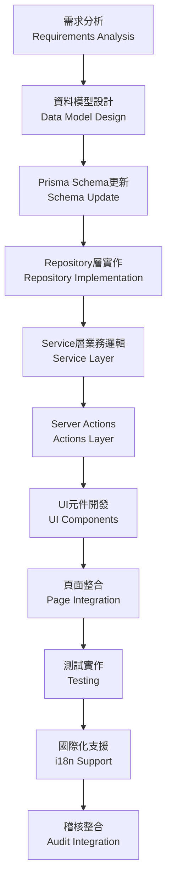
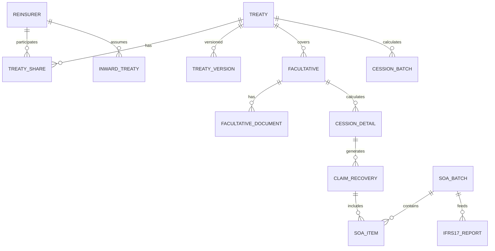
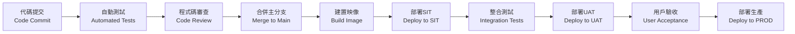

# RI-9-1：再保系統實施路線圖 / Implementation Roadmap

- **文件編號**：RI-9-1
- **版本**：v1.0
- **狀態**：Draft for Review
- **作者**：Tao Yu 和他的 GPT 智能助手
- **建立日期**：2025-11-05
- **參考文件**：PRD EIS-REINS-PRD-001.md、專案計畫、Scrum計畫、ADR-001~008

---

## 1. 執行摘要 / Executive Summary

基於對PRD/FRD需求分析和現有系統架構評估，本路線圖定義了從當前S2階段到MVP交付的詳細實施計劃。目前系統已完成Treaty和Reinsurer Management的POC，具備堅實的技術基礎，接下來將按優先級實施剩餘的14個核心模組。

### 1.1 當前狀態
- ✅ **已完成**：Treaty Management (90%)、Reinsurer Management (95%)、Audit Trail (100%)、Platform Infrastructure (70%)
- 🔄 **進行中**：UI視覺回歸測試、Server Action實作守則
- ⏳ **待開始**：Facultative、Cession Engine、Claim Recovery、SoA、IFRS17等12個模組

### 1.2 目標里程碑
- **2025-11-30**：MVP核心功能完成
- **2025-12-15**：SIT測試完成
- **2026-01-15**：UAT驗收通過
- **2026-02-01**：正式上線

---

## 2. 實施優先級矩陣 / Implementation Priority Matrix

| 優先級 | 模組 | 業務價值 | 技術複雜度 | 依賴關係 | 目標Sprint |
|--------|------|----------|------------|----------|------------|
| 🔴 P0 | 國際化支援 (ADR-008) | 高 | 中 | 無 | S3 |
| 🔴 P0 | Facultative Management | 高 | 高 | Treaty完成 | S3-S4 |
| 🔴 P0 | Cession Engine | 高 | 高 | Treaty+Facultative | S4-S5 |
| 🟡 P1 | Assumed Reinsurance | 中 | 中 | Reinsurer完成 | S5-S6 |
| 🟡 P1 | Claim Recovery | 高 | 中 | Cession Engine | S6 |
| 🟡 P1 | Access Control完善 | 高 | 中 | 無 | S6 |
| 🟢 P2 | SoA Reconciliation | 高 | 高 | Claim Recovery | S7 |
| 🟢 P2 | IFRS17 Reporting | 中 | 高 | SoA完成 | S7-S8 |
| 🟢 P2 | Data Import & Migration | 中 | 中 | 核心模組完成 | S8 |
| 🟢 P3 | Treaty Search & Comparison | 中 | 低 | Treaty完成 | S8 |
| 🟢 P3 | System Integration | 高 | 高 | 所有模組 | S8-S9 |
| 🟢 P3 | API Management | 中 | 中 | System Integration | S9 |
| 🟢 P3 | System Configuration | 低 | 低 | 無 | S9 |
| 🟢 P3 | System Monitoring | 中 | 中 | 無 | S9 |

---

## 3. Sprint 詳細規劃 / Detailed Sprint Planning

### Sprint S3：國際化基礎 + 臨分設計（3週）
**主題**：Internationalization Foundation + Facultative Design

**核心交付物**：
- ✅ ADR-008 國際化策略文檔
- 🎯 國際化基礎架構實作
- 🎯 Facultative Management 資料模型設計
- 🎯 臨分業務流程工作坊

**詳細任務**：
1. **國際化實作** (5天)
   - 安裝配置 next-intl
   - 建立語言路由結構 (`app/[locale]/`)
   - 創建基礎翻譯檔案 (zh-TW/zh-CN/en-US)
   - 實作語言切換器元件
   - 更新現有Treaty/Reinsurer頁面支援i18n

2. **Facultative 設計** (10天)
   - 與精算/核保團隊工作坊
   - 設計臨分資料模型 (Prisma Schema)
   - 定義臨分業務規則和驗證邏輯
   - 創建 FRD-Facultative 詳細規格
   - 設計臨分UI原型

3. **平台完善** (5天)
   - 完成視覺回歸測試設置
   - 補齊Server Action實作守則
   - 優化共用UI元件

**驗收標準**：
- 所有現有頁面支援三種語言切換
- Facultative資料模型通過架構審查
- 臨分業務流程獲得業務團隊確認

---

### Sprint S4：臨分開發 + 分保引擎設計（3週）
**主題**：Facultative Development + Cession Engine Design

**核心交付物**：
- 🎯 Facultative Management 完整實作
- 🎯 Cession Engine 架構設計
- 🎯 分保計算規則庫

**詳細任務**：
1. **Facultative 開發** (12天)
   - 實作 Facultative Prisma Models
   - 開發 facultative-repository.ts
   - 實作 facultative-service.ts (業務邏輯)
   - 創建 facultative-actions.ts (Server Actions)
   - 開發臨分管理UI頁面
   - 實作文件上傳功能
   - 建立臨分審批流程

2. **Cession Engine 設計** (8天)
   - 分保計算規則分析工作坊
   - 設計計算引擎架構
   - 定義計算API契約
   - 創建分保規則測試案例
   - 設計批次處理機制

**驗收標準**：
- 臨分CRUD功能完整，支援多語言
- 臨分審批流程可運行
- 分保引擎設計通過技術審查

---

### Sprint S5：分保引擎開發 + 分入再保（3週）
**主題**：Cession Engine Development + Assumed Reinsurance

**核心交付物**：
- 🎯 Cession Engine 核心實作
- 🎯 Assumed Reinsurance 基礎功能
- 🎯 計算API與試算功能

**詳細任務**：
1. **Cession Engine 開發** (12天)
   - 實作計算引擎核心邏輯
   - 開發比例/非比例計算規則
   - 實作佣金計算邏輯
   - 建立批次計算API
   - 實作試算功能
   - 建立計算結果審核機制

2. **Assumed Reinsurance** (8天)
   - 設計分入再保資料模型
   - 實作分入再保CRUD
   - 開發風險評估流程
   - 實作承作審批機制

**驗收標準**：
- 分保計算引擎可正確計算各種合約類型
- 試算API響應時間 < 3秒
- 分入再保流程可運行

---

### Sprint S6：理賠攤回 + 權限完善（3週）
**主題**：Claim Recovery + Access Control Enhancement

**核心交付物**：
- 🎯 Claim Recovery Management
- 🎯 完整的權限管理系統
- 🎯 理賠攤回追蹤機制

**詳細任務**：
1. **Claim Recovery** (12天)
   - 設計理賠攤回資料模型
   - 實作攤回計算邏輯
   - 開發再保人回覆追蹤
   - 實作爭議處理流程
   - 建立收款狀態管理

2. **Access Control** (8天)
   - 完善角色權限管理
   - 實作用戶認證系統
   - 建立權限檢查中間件
   - 實作敏感操作雙簽機制

**驗收標準**：
- 理賠攤回可自動計算並追蹤狀態
- 權限系統符合FSC合規要求
- 所有敏感操作有適當權限控制

---

### Sprint S7：SoA對帳 + IFRS17基礎（3週）
**主題**：SoA Reconciliation + IFRS17 Foundation

**核心交付物**：
- 🎯 SoA自動化對帳系統
- 🎯 IFRS17資料模型
- 🎯 財務整合介面

**詳細任務**：
1. **SoA Reconciliation** (12天)
   - 實作SoA資料聚合邏輯
   - 開發差異檢測機制
   - 實作審核流程
   - 建立PDF/Excel輸出功能
   - 實作財務系統整合

2. **IFRS17 Foundation** (8天)
   - 設計IFRS17資料模型
   - 實作CSM/RA計算基礎
   - 建立報表參數管理
   - 設計報表輸出架構

**驗收標準**：
- SoA可自動生成並處理差異
- IFRS17基礎架構就緒
- 財務整合測試通過

---

### Sprint S8：IFRS17報表 + 資料導入（3週）
**主題**：IFRS17 Reporting + Data Import & Migration

**核心交付物**：
- 🎯 完整IFRS17報表系統
- 🎯 資料導入工具
- 🎯 系統整合基礎

**詳細任務**：
1. **IFRS17 Reporting** (10天)
   - 實作IFRS17計算引擎
   - 開發報表生成邏輯
   - 實作報表審核流程
   - 建立監理報表格式

2. **Data Import** (8天)
   - 實作Excel/CSV導入功能
   - 建立資料驗證機制
   - 實作批次處理流程
   - 開發錯誤報告功能

3. **Treaty Search Enhancement** (2天)
   - 實作合約版本比對功能
   - 建立差異報告生成

**驗收標準**：
- IFRS17報表符合台灣金管會要求
- 資料導入成功率 ≥ 95%
- 合約查詢功能完整

---

### Sprint S9：平台整合 + 監控（3週）
**主題**：Platform Integration + Monitoring & Configuration

**核心交付物**：
- 🎯 系統整合層
- 🎯 API管理平台
- 🎯 監控告警系統

**詳細任務**：
1. **System Integration** (10天)
   - 實作API Gateway
   - 建立外部系統介接
   - 實作資料同步機制
   - 建立健康檢查機制

2. **API Management** (5天)
   - 實作API版本管理
   - 建立API文檔系統
   - 實作API監控

3. **System Monitoring** (5天)
   - 實作系統監控儀表板
   - 建立告警機制
   - 實作系統配置管理

**驗收標準**：
- 外部系統整合測試通過
- 監控系統可正常運作
- API管理功能完整

---

## 4. 技術實作策略 / Technical Implementation Strategy

### 4.1 模組開發模式

每個新模組遵循統一的開發模式：



### 4.2 共用元件策略

建立模組間共用的元件庫：

```typescript
// 共用業務元件
src/components/reinsurance/
├── attachment-list-editor.tsx     # 附件管理（已存在）
├── reinsurer-share-editor.tsx     # 再保人份額編輯（已存在）
├── currency-selector.tsx          # 幣別選擇器（新增）
├── date-range-picker.tsx          # 日期區間選擇器（新增）
├── amount-input.tsx               # 金額輸入框（新增）
├── percentage-input.tsx           # 百分比輸入框（新增）
└── status-badge.tsx               # 狀態標籤（新增）

// 業務流程元件
src/components/workflow/
├── approval-controls.tsx          # 審批控制（基於Treaty擴展）
├── version-history.tsx            # 版本歷史（新增）
├── document-uploader.tsx          # 文件上傳（新增）
└── calculation-summary.tsx        # 計算摘要（新增）
```

### 4.3 資料模型擴展策略

基於現有的Treaty和Reinsurer模型，逐步擴展：



---

## 5. 關鍵技術決策 / Key Technical Decisions

### 5.1 計算引擎架構

```typescript
// src/services/cession-engine/
├── calculation-engine.ts          # 核心計算邏輯
├── rule-engine.ts                 # 業務規則引擎  
├── quota-calculator.ts            # 比例合約計算器
├── excess-calculator.ts           # 非比例合約計算器
├── commission-calculator.ts       # 佣金計算器
└── batch-processor.ts             # 批次處理器

// 計算引擎介面設計
interface CessionCalculationRequest {
  policyData: PolicyData;
  treatyId?: string;
  facultativeId?: string;
  calculationDate: Date;
  currency: string;
}

interface CessionCalculationResult {
  grossPremium: Decimal;
  cededPremium: Decimal;
  retention: Decimal;
  commission: Decimal;
  netPremium: Decimal;
  breakdown: CessionBreakdown[];
}
```

### 5.2 批次處理架構

```typescript
// 批次處理支援大量資料計算
interface BatchJob {
  id: string;
  type: 'CESSION_CALCULATION' | 'SOA_GENERATION' | 'IFRS17_REPORT';
  status: 'PENDING' | 'RUNNING' | 'COMPLETED' | 'FAILED';
  progress: number;
  totalRecords: number;
  processedRecords: number;
  errorRecords: number;
  startedAt?: Date;
  completedAt?: Date;
  errorMessage?: string;
}
```

### 5.3 API設計原則

遵循RESTful設計，支援多語言回應：

```typescript
// API回應格式
interface ApiResponse<T> {
  success: boolean;
  data?: T;
  error?: string;
  errorCode?: string;
  message?: string;
  locale?: string;
  timestamp: string;
}

// 多語言錯誤處理
interface LocalizedError {
  code: string;
  message: {
    'zh-TW': string;
    'zh-CN': string;
    'en-US': string;
  };
  field?: string;
  value?: string;
}
```

---

## 6. 品質保證策略 / Quality Assurance Strategy

### 6.1 測試覆蓋率目標

| 測試類型 | 目標覆蓋率 | 工具 | 責任人 |
|----------|------------|------|--------|
| 單元測試 | ≥ 90% | Vitest | 開發團隊 |
| 整合測試 | ≥ 80% | Vitest + MSW | 開發團隊 |
| E2E測試 | 主要流程100% | Playwright | QA團隊 |
| 國際化測試 | 100% | Custom Scripts | UI/UX團隊 |

### 6.2 自動化測試策略

```typescript
// 計算引擎測試範例
describe('CessionEngine', () => {
  describe('Quota Share Calculation', () => {
    it('should calculate ceded premium correctly', () => {
      const result = cessionEngine.calculate({
        treatyType: 'PROPORTIONAL',
        cessionMethod: 'QUOTA_SHARE',
        sharePercentage: 40,
        grossPremium: 1000000,
      });
      
      expect(result.cededPremium).toBe(400000);
      expect(result.retention).toBe(600000);
    });
  });
  
  describe('Multi-language Error Messages', () => {
    it('should return localized error messages', async () => {
      const error = await cessionEngine.validateInput(invalidData, 'en-US');
      expect(error.message['en-US']).toBe('Invalid treaty configuration');
      expect(error.message['zh-TW']).toBe('合約配置無效');
    });
  });
});
```

---

## 7. 風險管理與緩解 / Risk Management & Mitigation

### 7.1 主要風險識別

| 風險ID | 風險描述 | 影響程度 | 發生機率 | 緩解策略 |
|--------|----------|----------|----------|----------|
| R-I18N-01 | 翻譯品質不一致影響用戶體驗 | 高 | 中 | 建立翻譯審核流程，母語者校對 |
| R-CALC-01 | 分保計算邏輯複雜，容易出錯 | 高 | 中 | 建立完整測試案例，精算師驗證 |
| R-PERF-01 | 大量資料計算影響系統效能 | 中 | 高 | 實作批次處理，非同步計算 |
| R-INTG-01 | 外部系統整合延遲 | 高 | 中 | 建立Mock服務，並行開發 |
| R-DATA-01 | 歷史資料品質影響遷移 | 中 | 高 | 提前進行資料分析和清洗 |

### 7.2 技術債務管理

每個Sprint預留20%時間處理技術債務：

- **程式碼重構**：定期重構複雜邏輯
- **效能優化**：監控並優化慢查詢
- **安全更新**：定期更新依賴套件
- **文檔維護**：保持ADR和API文檔同步

---

## 8. 部署與維運策略 / Deployment & Operations Strategy

### 8.1 環境策略

| 環境 | 用途 | 資料庫 | 部署方式 | 更新頻率 |
|------|------|--------|----------|----------|
| DEV | 開發測試 | SQLite | 本地 | 即時 |
| SIT | 系統整合測試 | PostgreSQL | Docker | 每日 |
| UAT | 用戶驗收測試 | PostgreSQL | K8s | 每週 |
| PROD | 生產環境 | PostgreSQL | K8s | 每月 |

### 8.2 CI/CD流程



---

## 9. 成功指標與驗收標準 / Success Metrics & Acceptance Criteria

### 9.1 技術指標

| 指標類別 | 目標值 | 測量方式 |
|----------|--------|----------|
| 程式碼覆蓋率 | ≥ 85% | Vitest Coverage Report |
| API回應時間 | < 2秒 | 效能測試 |
| 系統可用性 | ≥ 99.5% | 監控系統 |
| 安全漏洞 | 0 Critical | 安全掃描 |

### 9.2 業務指標

| 指標類別 | 目標值 | 測量方式 |
|----------|--------|----------|
| 月結效率提升 | ≥ 50% | 業務流程時間測量 |
| 對帳錯誤率降低 | ≥ 90% | 錯誤統計 |
| 用戶採用率 | ≥ 80% | 使用統計 |
| 培訓完成率 | 100% | 培訓記錄 |

---

## 10. 後續行動計劃 / Next Action Plan

### 10.1 立即行動（本週）
1. ✅ 完成ADR-008國際化策略文檔
2. 🎯 更新任務追蹤器，反映新的實施計劃
3. 🎯 安排S3 Sprint Planning會議
4. 🎯 準備Facultative Management工作坊

### 10.2 短期目標（S3）
1. 🎯 實作國際化基礎架構
2. 🎯 完成Facultative資料模型設計
3. 🎯 建立分保計算引擎架構藍圖
4. 🎯 完善現有模組的多語言支援

### 10.3 中期目標（S4-S6）
1. 🎯 完成核心業務模組開發
2. 🎯 建立完整的權限管理系統
3. 🎯 實作理賠攤回處理流程
4. 🎯 建立系統整合基礎

### 10.4 長期目標（S7-S9）
1. 🎯 完成財務相關模組（SoA、IFRS17）
2. 🎯 建立完整的監控和告警系統
3. 🎯 完成系統整合和API管理
4. 🎯 準備上線和維運

---

## 11. 資源需求與分工 / Resource Requirements & Team Structure

### 11.1 團隊配置建議

| Squad | 人員配置 | 主要職責 | S3-S9工作重點 |
|-------|----------|----------|---------------|
| **Treaty & Facultative Squad** | Tech Lead + 2 Backend + 1 Frontend | 合約和臨分模組 | Facultative開發、Treaty增強 |
| **Cession Engine Squad** | Tech Lead + 2 Backend + 1 QA | 分保計算引擎 | 計算邏輯、批次處理、測試 |
| **Claims & SoA Squad** | Tech Lead + 1 Backend + 1 Frontend | 理賠和對帳 | 攤回處理、SoA自動化 |
| **IFRS17 & Reporting Squad** | Finance SME + 1 Backend + 1 Data | 報表和合規 | IFRS17實作、報表生成 |
| **Platform Squad** | DevOps Lead + 1 Backend + 1 Frontend | 平台和整合 | 國際化、監控、API管理 |

### 11.2 外部依賴

| 依賴項目 | 提供方 | 預計交付時間 | 風險等級 |
|----------|--------|--------------|----------|
| 外部系統API規格 | EIS團隊 | 2025-11-15 | 高 |
| 歷史資料樣本 | 業務團隊 | 2025-12-01 | 中 |
| IFRS17報表格式 | 財務團隊 | 2025-12-15 | 中 |
| 用戶驗收測試場景 | 業務團隊 | 2026-01-01 | 低 |

---

## 12. 修訂記錄 / Revision History

| 版本 | 日期 | 修訂內容 | 作者 |
|------|------|----------|------|
| v1.0 | 2025-11-05 | 初版實施路線圖，基於PRD需求和現有系統分析 | Tao Yu 和他的 GPT 智能助手 |

---

> 本路線圖需與Product Owner、Scrum Master和各Squad Lead確認後執行。如有重大調整需求，請更新本文檔並通知所有相關人員。實施過程中的進度更新請同步至 `PM-REPORT-001-任務追蹤.md`。