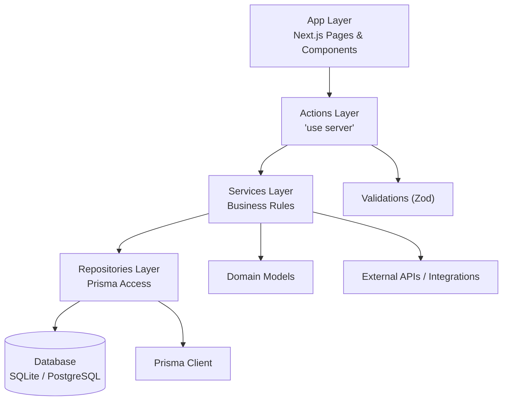

# ADR-001：再保系統 Next.js 分層架構設計

- **狀態**：提案中（待 Architecture Review 核可）
- **日期**：2025-09-12
- **決策者**：Architecture Board、DevOps Lead、Product Owner

---

## 1. 背景

再保系統採用 Next.js 14（App Router）作為前後端框架，需支援：

- Treaty、Facultative、分保引擎、理賠/SoA、IFRS17、AI Insights 等多模組協作
- 使用 React.js、shadcn/ui、TailwindCSS 建構可組態 UI
- 以 Node.js、Next.js Server Actions 處理業務流程
- Prisma 作為 ORM，在 DEV 使用 SQLite，TEST/PROD 使用 PostgreSQL
- 導入可測試、可維護、可審計的分層架構，符合 `RI/requirement/adr-ref.md` 既有規範

---

## 2. 決策

延用 ADR 參考文件中既定的四層架構模式（App → Actions → Services → Repositories），並針對再保系統進行下列擴充：

```
src/
├── app/                   # UI 層：Next.js App Router + shadcn/ui
├── actions/               # Server Actions 層：資料驗證、權限、流程編排
├── services/              # 業務服務層：再保業務規則、分保計算、流程控制
├── repositories/          # 資料存取層：Prisma ORM、資料庫交易、快取
├── lib/                   # 共用函式庫：Prisma 客戶端、設定、工具
├── domain/                # 網域模型與 Value Objects（擴充）
├── types/                 # TypeScript 型別共享（模組 DTO、表單、查詢條件）
├── validations/           # Zod schemas 與 DTO 定義
├── constants/             # 共享常量、枚舉、排序設定
├── errors/                # 模組專屬錯誤碼與例外類別
└── config/                # 環境設定、特徵旗標、服務配置
```

主要補充：
- `domain/`：封裝各模組（再保、再保人、理賠等）的 Value Object（例如分保比例、佣金區間、IFRS17 計量模型），避免散落於 service 層。
- `types/`：集中管理跨層型別（DTO、查詢條件、UI 顯示模型），禁止在各層重複定義。
- `validations/`：集中管理 Zod schema，供 Actions/Services 重複使用。
- `constants/`：維護模組的常量、選單、欄位顯示映射。
- `errors/`：統一定義錯誤碼與例外，便於 UI 與 API 對應。
- `config/`：統一管理 Next.js runtime 設定、Prisma 連線、特徵旗標。

> 模組層級的詳細範本請參考《ARCH-ADR-007-模組架構模式.md》，所有新模組應依範本建立資料夾與責任分工；如需偏離需在 PR／ADR 說明。

---

## 3. 技術棧與環境策略

| 類別 | 選用 | 說明 |
|---|---|---|
| 前端技術 | React.js、shadcn/ui、TailwindCSS、Rechart | 構建再保流程 UI、圖表分析 |
| 框架 | Next.js 14（App Router） | 混合渲染、Server Actions、最佳實踐 |
| 語言 | TypeScript / Node.js | 型別安全、提升可維護性 |
| ORM | Prisma | 支援多資料庫、Schema Driven 開發 |
| 資料庫 | DEV: SQLite3；TEST/PROD: PostgreSQL | 本地快速開發 vs. 正式環境擴充性 |
| 驗證 | Zod | Actions 層輸入輸出驗證 |
| 測試 | Vitest / Testing Library | 單元測試、整合測試 |
| DevOps | GitHub Actions/GitLab CI、Docker、Helm (TBD) | 自動化建置與部署 |

資料庫設定：
- 透過 Prisma Schema 定義資料模型，使用 `prisma migrate` 管理變更。
- 使用 `.env.development` 指向 SQLite，`.env.test`/`.env.production` 指向 PostgreSQL。
- 在 `prisma/schema.prisma` 內透過 `datasource db` 控制不同環境連線。

---

## 4. Next.js 最佳實踐落地要求

1. **App Router 檔案結構**
   - 每個功能模組位於 `src/app/(feature)/...`（例如 `src/app/treaties/page.tsx`、`src/app/reinsurers/page.tsx`）。
   - 共用 UI 元件放在 `src/components/ui/`；與特定頁面關聯的元件置於 `src/app/(feature)/_components/`。
   - 禁止於 `src/components/<feature>/page.tsx` 或任意新資料夾內建立頁面。若 PR 被發現未遵循層級規則，需退回調整。
   - 使用 Server Components 作為預設，其餘透過 `use client` opt-in；客戶端元件必須放在 `_components` 或 `components/ui`。

2. **Server Actions**
   - 所有資料存取、業務操作透過 actions 執行（`'use server'`）
   - Actions 內使用 Zod 驗證輸入，並呼叫對應 service
   - 遵循 `revalidatePath` / `revalidateTag` 控制快取

3. **Services 層**
   - 實作再保專屬業務邏輯：分保計算、佣金結構、IFRS17 套用
   - 每個 Service 以 class 或 factory pattern 實現，支援單元測試
   - 與 actions 區隔責任，避免資料庫細節外泄

4. **Repositories 層**
   - Prisma Client 封裝於 `lib/prisma.ts`
   - Repository 處理交易、包含 `withTransaction` 等封裝
   - 支援多資料來源時可透過 provider abstraction 層級實作

5. **型別與驗證**
   - `types/` 定義核心 Domain 型別、DTO
   - `validations/` 使用 Zod 與 TypeScript `z.infer` 對應
   - Input/Output interface 需在 actions 與 services 之間保持一致

6. **工作流程**
   - 新功能時先定義 Domain/Schema → Repository → Service → Action → UI
   - 實施 ADR 中的禁止規則（不可跨層依賴、禁止後端直接改 UI）

7. **UI 佈局一致性**
   - 頁面層使用共同的 `PageHeader`、`PageContainer`、`SectionCard`、`ListCard` 等元件；`PageContainer` 採全寬流體佈局（配合 `TopNavbar`/`SideNavigation` 的 64px / 208px 框架），所有內容區塊預設 `w-full` 與容器齊寬。若需限制超寬螢幕，應在頁面層另行加入 `max-w-*` 並於 UI 導則登記。
   - 色票、間距、操作行為需遵循最新版 `../08-用戶界面/UI-GUIDE-001-界面設計指南.md`（對應 Figma 導出 PDF/JSON 及 `requirement/reinsurance_uiux_codepack_v0.3`）。任何 UI 變更必須先更新導則與 Token，再同步程式碼並在 PR 中標註引用章節。
   - 針對 review 流程，PR 描述需列出遵循的 UI 章節（例如「依 UI 導則 §4.2 篩選列排版」）並附上對應截圖或開發環境連結。

---

### 4.1 層級責任與禁止事項

- App 層只允許匯入 Actions，不得直接觸碰 Services、Repositories 或 Prisma。
- Actions 層需使用 `'use server'` 宣告，負責輸入驗證、呼叫 Service、統一錯誤回傳；不得含業務規則。
- Services 層只可匯入 Repositories／Domain 型別；不得直接存取 Prisma 或 Actions。
- Repositories 層只可匯入 Prisma 客戶端與資料型別；不得包含業務邏輯。
- 後端任務開發期間，UI 元件（shadcn/ui、頁面結構、CSS）視為唯讀；僅允許新增 Actions 並在頁面中引用、替換 mock 呼叫。

常見違規：
- 在 Components 中直接呼叫 Service。
- Service 層自行 new PrismaClient。
- 建立 `route.ts` REST API 取代 Server Action。
- Repository 內寫分保計算等業務邏輯。

自動檢測建議腳本：
```bash
grep -r "import.*repositories" src/app/
grep -r "import.*prisma" src/services/
grep -r "import.*actions" src/services/
find src/app -name "route.ts" -o -name "route.js"
```
CI Pipeline 會執行此類規則，違規 PR 需補正。

---

## 5. 型別與共用資源結構

```
src/types/
├── database.ts      # Prisma 產生型別或額外型別轉換
├── domain.ts        # 網域模型介面（Treaty、Facultative 等）
├── api.ts           # Server Actions I/O 定義
└── form.ts          # 表單資料結構

src/lib/
├── prisma.ts        # Prisma client singleton
├── query-keys.ts    # React Query 查詢鍵
├── validations.ts   # 共用 Zod 工具（可再細分於 validations/）
├── utils.ts         # 共用工具函式（含日期、幣別）
└── logger.ts        # 統一紀錄器
```

`validations/` 目錄維護 Zod schema；`domain/` 維護 Value Object；`config/` 放置環境、特徵旗標、第三方服務設定。

---

## 6. 落地步驟

1. **基礎架構建立**：建立 `src/` 分層、搬移 App Router、初始化 Prisma Schema 與 TypeScript 路徑別名。
2. **資料層實作**：撰寫 Repositories（含交易封裝、Pagination 樣板），導入 SQLite / PostgreSQL 雙環境測試。
3. **業務層實作**：撰寫 Services（分保計算、佣金邏輯、IFRS17）與網域模型。
4. **Actions 層**：建立 Server Actions、接上 Zod 驗證、統一錯誤格式、安排 `revalidatePath`/tag。
5. **頁面整合**：頁面只透過 Actions 取得資料；導入 React Query Hooks 做客戶端再同步。
6. **CI 保護**：在 lint/test script 中加入跨層檢測，確保架構規則不被破壞。

> **開發者自檢清單（新增功能前）**
> - 是否依序建立：Schema → Repository → Service → Action → UI？
> - 是否僅於 `src/app/(feature)` 內建立頁面並引用 Actions，而非直接呼叫 Service/Repository？
> - 是否引用 `../08-用戶界面/UI-GUIDE-001-界面設計指南.md` 指定元件與配色？
> - 是否於 PR 描述註明使用的 ADR/UI 章節與測試指令？

---

## 5. 架構圖（概念）



---

## 6. 替代方案評估

| 選項 | 內容 | 評估結果 |
|---|---|---|
| 直接在 App 層呼叫 Prisma | 減少層次，但 UI 與資料庫耦合 | ❌ 不符合可維護與安全性 |
| 使用 API Route 替代 Server Actions | 與傳統 REST 架構相近 | ❌ 不符合 Next.js 14 建議、重複樣板 |
| 使用 NestJS / 後端獨立服務 | 後端純 API + 前端 Next.js | ⭕ 可作為未來 Phase (Plug-in)；現階段維持單體實裝 |

---

## 7. 優勢

1. 關注點分離，開發者可專注各自層級。
2. 可測試性高：Repositories 可用 Prisma Test DB、Services 用 mock 驗證業務、Actions 用整合測試。
3. 對稽核友好：Server Actions、Services 有清楚責任，利於合規與模型監控。
4. 相容未來外掛：若要抽離為微服務，可直接改寫 Actions/Repositories。

---

## 8. 影響與風險

- **正面影響**：清晰的分層、可測試性、滿足合規審計要求、利於 AI/IFRS17 等複雜邏輯整合。
- **風險**：
  - 團隊需熟悉 Server Actions 與新分層模式 → 需提供開發指引與程式碼範例。
  - SQLite / PostgreSQL 差異需在 Repository 層抽象 → 需撰寫資料庫測試與 Migration 策略。

緩解措施：
- 撰寫 `developer-onboarding.md` 說明分層使用方式。
- 於 CI Pipeline 中加入跨資料庫測試（SQLite + PostgreSQL）。

---

## 9. 後續工作

- 建立 `lib/prisma.ts` 初始化 Prisma 客戶端（含多環境設定）。
- 建立 `scripts/check-architecture.sh` 自動偵測跨層違規匯入。
- 與 ADR-002（資料庫策略）、ADR-003（React Query 狀態管理）、ADR-004（測試策略）對齊細節。
- 前端實作需遵循 `../08-用戶界面/UI-GUIDE-001-界面設計指南.md` 所定義的設計語言、色彩與互動規範；若 UI 規範更新，需同步評估對本 ADR 與程式結構的影響。
- 於 `ARCH-CHECKLIST-001-架構審查清單.md` 完成審查後更新狀態為「已接受」。

---

## 10. Treaty 模組補充指引（2025-02 新增）

- **多再保人份額資料模型**：合約 (`Treaty`) 不再持有單一 `reinsurerId`，所有分配改由 `TreatyShare` 維護。Service／Repository 操作時需使用 `createWithShares`、`updateWithShares` 等封裝方法，UI 端一律透過 `ReinsurerShareEditor` 元件輸入多筆份額。
- **版本化與審批流程**：`TreatyVersion` 表記錄草稿、提交、核准、退回等狀態快照。任何狀態變更必須呼叫 `treatyService.submitForApproval / approveTreaty / rejectTreaty`，禁止在 Actions 或 UI 直接修改 `status` 欄位。
- **通用欄位延伸**：新增 `limitAmount`、`attachmentPoint`、`commissionMinRate`、`commissionMaxRate`、`notes`、`attachments` 等欄位。其它模組引用時須一併提供驗證、UI 欄位與快照資訊。
- **再保人刪除防護**：`ReinsurerService` 刪除流程改以 `treatyShare` 檢查關聯份額，禁止再以 `Treaty` 表的外鍵判斷。

上述規則已同步寫入 `../03-開發指南/DEV-GUIDE-001-開發人員手冊.md`，後續模組（Facultative、分保引擎等）開發時應沿用相同模式，避免重複程式碼與不一致行為。

---

> 本 ADR 需在架構審查會議通過後，更新狀態並通知所有開發成員遵照實施。若未來架構調整，需新增新的 ADR 並引用此決策。***
