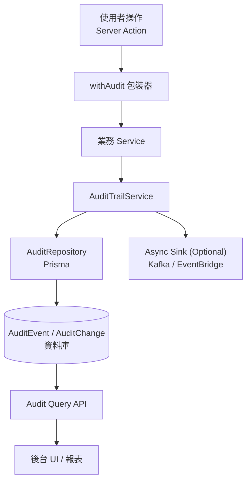

# ADR-005：全域審計與歷史紀錄機制

- **狀態**：提案中（準備送 Architecture Board 核可）
- **日期**：2025-10-29
- **決策者**：Architecture Board、Security Lead、Product Owner

---

## 1. 背景與問題

再保系統屬於高度受監理的金融系統，所有關鍵操作（合約建立/修改、審核、權限、保費計算等）都必須保有完整歷史軌跡，以滿足下列需求：

1. **法遵稽核**：主管機關要求能追溯每一次變更的責任人、時間與內容。
2. **營運溯源**：面對客戶/再保人異議時需快速查詢歷史紀錄。
3. **資安防護**：偵測異常操作、可進行行為分析。
4. **資料一致性**：提供跨模組的統一審計資料來源，避免各模組自行落地造成規格差異。

目前系統僅在業務邏輯層記錄狀態，缺乏標準化的歷史記錄機制，因此需要建立共通的 Audit Trail 架構以供所有功能沿用。

---

## 2. 決策摘要

建立一套平台級審計機制，包含：

1. **標準資料模型**：新增 `AuditEvent`、`AuditChange` 等 Prisma Model，用於儲存事件主檔與欄位差異。
2. **服務層共用元件**：提供 `auditTrailService.logEvent()` 等介面，由 Actions / Services 呼叫。
3. **Server Action 包裝器**：推出 `withAudit(actionName, handler)` helper，確保所有資料寫入點能統一記錄。
4. **Request Context 支援**：透過自訂 `AuditContext`（含 userId、session、client IP、correlationId）注入事件。
5. **查詢與介面**：預留 `/audits` 管理頁、Domain filter API，供後台查詢與下載。
6. **治理規範**：在 ADR 中定義事件分類、命名、metadata 格式、資料保存週期與敏感資訊遮罩。

> 初始版以同步寫入資料庫為主，後續可擴充為以事件匯流排進行非同步處理（Kafka / SQS），與 SIEM、Data Lake 整合。

---

## 3. 架構與流程



### 3.1 資料模型（Prisma Schema）

```prisma
model AuditEvent {
  id             String   @id @default(uuid())
  entityType     String   // e.g. "Treaty"
  entityId       String   // e.g. Treaty uuid
  action         String   // e.g. "CREATE", "UPDATE", "STATUS_CHANGE"
  actorId        String?  // user id or system service
  actorName      String?
  actorRole      String?
  triggerSource  String   // "UI", "API", "Batch"
  correlationId  String?
  requestId      String?
  ipAddress      String?
  userAgent      String?
  metadata       Json?
  createdAt      DateTime @default(now())
  changes        AuditChange[]

  @@index([entityType, entityId, createdAt])
  @@index([createdAt])
  @@index([action])
}

model AuditChange {
  id          String   @id @default(uuid())
  eventId     String
  fieldPath   String   // e.g. "status", "conditions.sharePercentage"
  oldValue    Json?
  newValue    Json?
  createdAt   DateTime @default(now())

  event       AuditEvent @relation(fields: [eventId], references: [id], onDelete: Cascade)

  @@index([eventId])
}
```

> `AuditChange.oldValue` / `newValue` 需以 `{ raw, display }` 物件儲存，確保後台報表可使用原始值，前端 UI 則以 display value 呈現。如遇下拉選單、代碼對照表等情境，`display` 為轉換後的顯示文字，`raw` 保留資料庫實際值。

### 3.2 Service 介面

```ts
type AuditEventPayload = {
  entityType: string;
  entityId: string;
  action: string;
  actor: {
    id?: string;
    name?: string;
    role?: string;
  };
  context: {
    trigger: "UI" | "API" | "Batch";
    ip?: string;
    userAgent?: string;
    correlationId?: string;
    requestId?: string;
  };
  changes?: Array<{
    fieldPath: string;
    oldValue?: unknown;
    newValue?: unknown;
  }>;
  metadata?: Record<string, unknown>;
};

auditTrailService.logEvent(payload: AuditEventPayload);
```

- **差異比較**：提供 `diffUtil.generateChanges<T>(before, after, options)`，依照白名單欄位產出 `AuditChange`。
- **批次操作**：支援一次傳入多個 `entityId`、以同一 correlationId 關聯。
- **Error Handling**：寫入失敗時記錄在應用層 Logger 並回報 Sentry，但不阻擋主要業務流程。

### 3.3 Server Action 包裝器

```ts
export function withAudit<TArgs, TResult>(
  actionLabel: string,
  handler: (input: TArgs, ctx: AuditContext) => Promise<TResult>,
) {
  return async (prevState: unknown, formData: FormData) => {
    const ctx = createAuditContext({ actionLabel, formData });
    try {
      const result = await handler(parseForm(formData), ctx);
      await ctx.flushSuccess(result);
      return result;
    } catch (error) {
      await ctx.flushFailure(error);
      throw error;
    }
  };
}
```

- `AuditContext` 會自動注入使用者資訊（來自 Session）、Correlation ID（若無則新建），並允許 handler 在任何時點呼叫 `ctx.collectChange(...)`。
- 將在 `treaty-actions.ts` 等檔案逐步替換成 `withAudit("treaty.create", handler)`。

### 3.4 查詢與 UI

- **歷史列表形式**：以表格呈現全部歷史（預設倒序），欄位包含「操作時間、操作人、來源、作業內容、動作」。
- **操作人資訊**：在登入機制導入前，以 `（尚未登入）` 為 placeholder；後續串接 User 模組時改為實際帳號與角色。
- **詳細檢視**：使用者可透過「檢視」按鈕展開欄位差異表，顯示原值/新值；若欄位眾多需提供捲動。
- **篩選與匯出**：`/audits` 頁面（與後台查詢 API）支援時間、模組、動作、使用者、關鍵字等篩選條件，並預留 CSV/JSON 匯出能力。
- **UI 元件**：提供共用 `AuditHistoryTable` Client Component，功能頁只需傳入事件資料即可重複使用。
- **分頁策略**：單一實體詳情頁預設載入全部歷史；若互動量過大，可在 `AuditTrailService.listEntityHistory` 傳入 `take/cursor` 實作分頁。

---

## 4. 實作清單

| 項目 | 說明 |
|------|------|
| Schema | 新增 `AuditEvent`、`AuditChange`、對應 migration、index 規劃。 |
| Repository | `audit-repository.ts` 提供 `createEvent`、`createEvents`、`findByEntity`、`search`。 |
| Service | `audit-trail-service.ts` 封裝 log / diff / masking，與 Async Sink integration。 |
| Utilities | `diffUtil`、`sanitize`（遮罩敏感欄位）、`getRequestContext`。 |
| Server Action helper | `withAudit`、`auditHandler` 等 wrapper，導入到現有 `treaty-actions.ts`、後續功能沿用。 |
| Middleware | Edge / Route Handler 加入 `x-correlation-id`，並在 `Providers` 中設置 `AuditContextProvider`。 |
| UI/Query | `/audits` 頁面 + API Route (`/api/audit-events`) + RBAC (僅審計/主管可讀)。 |
| Logging | 若 log 失敗，透過 logger.warn 並送 Sentry，避免 silent failure。 |
| Documentation | 更新 UI/UX 指南（新增審計列表設計）、測試策略、Runbook。 |

---

## 5. 資料治理與規範

1. **命名規則**：`action` 採 `<domain>.<verb>`（例：`treaty.create`、`treaty.status-change`、`user.login`）。
2. **敏感資料處理**：對個資、密碼等欄位需透過 `maskStrategy`（只記錄欄位名稱，值以 `***` 表示）。
3. **資料保存**：DB 保留 7 年；6 個月前資料可轉存至冷資料儲存（S3 / Data Lake）。
4. **權限控管**：僅 `AUDIT_VIEWER`、`ADMIN` 角色可存取審計畫面與 API；其他角色需走審核流程。
5. **操作人資訊**：登入機制完成前以 Placeholder (`pending-user-module`) 記錄；後續整合 Identity 後改寫為真實使用者資訊。
6. **效能保護**：`AuditEvent` 表需要定期 partition（依季度）與 index 維護；批次寫入採 transaction。
7. **欄位映射**：對於代碼/下拉欄位，`display` 必須符合 UI 顯示文字，`raw` 保留資料庫值，必要時於 service 層建立共用 mapping；報表應可選擇輸出 raw 或 display。
8. **測試策略**：
   - Unit Tests：驗證 diff 工具、遮罩規則、寫入格式。
   - Integration Tests：針對 `treaty-actions` 等端點確保 Audit Event 正確產生。
   - End-to-End：未來 Playwright 將檢查審計畫面顯示。

---

## 6. 替代方案評估

| 選項 | 內容 | 評估結果 |
|------|------|---------|
| 各模組自行寫 log table | 每個功能自建 `[entity]_history` 表 | ❌ 無法跨模組查詢、規格難以統一 |
| 使用外部 SIEM / Log Server 直接紀錄 API Log | 只收集 HTTP / Console log | ❌ 缺少欄位層級差異，難以支援營運分析 |
| 採用消息匯流排後 async 落地 | Server Action 發事件，另外服務處理 | ⭕ 長遠方向，但現階段為避免阻礙開發，先採同步直寫，未來再導入 |

---

## 7. 後續工作

1. 實作 `AuditEvent` migration 並建立 Repository/Service。
2. 將 `treaty-actions` 改用 `withAudit`；新增測試確保 CREATE/UPDATE/DELETE 會被記錄。
3. 開發 `/audits` 頁面原型，包含篩選與差異檢視。
4. 與資安團隊確認資料遮罩與保存政策。
5. 將此 ADR 納入 coding guideline，規定所有 Server Action／Batch Job 都需呼叫審計介面。

---

## 8. 參考

- 規範文件：`RI/requirement/EIS-REINS-PRD-001.md`、`ADR-001 ~ ADR-004`
- 金融業審計要求：FSC 規範、保險業內控內稽辦法
- OWASP ASVS 9.1 Audit Requirements
- AWS Well-Architected Framework – Security Pillar（Logging & Monitoring）

> 本 ADR 核准後，所有新功能必須依此架構實作審計紀錄，既有功能也需依優先順序逐步補齊。
