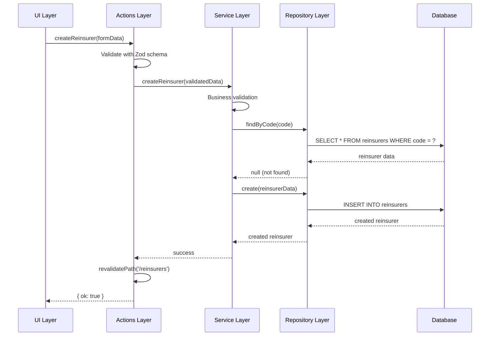
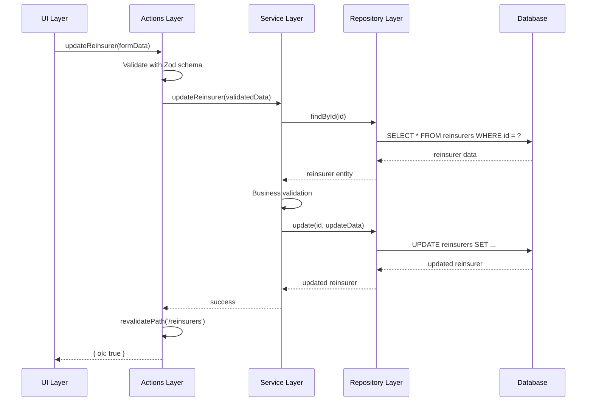
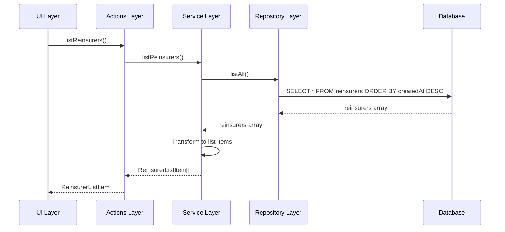

# ADR-007：模組架構模式指南

- **狀態**：提案中（待 Architecture Board 核可）
- **日期**：2025-11-02
- **決策者**：Architecture Board、模組 Tech Leads、Scrum Master

> 本指南源自再保人（Reinsurer）模組重構實戰，現已提升為全專案的模組設計規則。範例仍以再保人模組為例，實作時請依照各自領域調整命名與欄位。

## 概述

本文件將專案的 Next.js + Prisma 分層架構進一步落地為「模組級」的標準作法，採用 DDD（Domain-Driven Design）觀念，確保：

- 層級責任明確：UI、Action、Service、Repository、Domain、Validation、Constants、Errors 各司其職。
- 型別安全：跨層資料流都有清楚的 DTO 與表單型別。
- 錯誤治理一致：以錯誤碼與例外類別統一處理。
- 可測試性：每一層都能獨立撰寫測試，並透過 seed/factory 提供穩定資料。

所有新模組（Treaty、Reinsurer、Pricing、Claims⋯）都必須參考本指南佈建資料夾與責任分工；若需延伸，請提交 ADR 更新或在本文補充附錄。

## 架构设计

### 分层架构

基於 ADR-001 中定義的四層架構模式，所有功能模組應採用下列目錄與責任切分。以下範例仍以再保人（Reinsurer）模組命名，實務上請替換為對應領域。

```
src/
├── app/                   # UI层：Next.js App Router + shadcn/ui
├── actions/               # Server Actions层：数据验证、权限、流程编排
├── services/              # 业务服务层：再保业务规则、流程控制
├── repositories/          # 数据访问层：Prisma ORM、数据库事务、缓存
├── domain/                # 领域模型与Value Objects
├── types/                 # TypeScript类型定义
├── constants/             # 业务常量定义
├── errors/                # 错误类型定义
└── validations/           # Zod schemas与DTO定义
```

### 各层职责

1. **UI层 (app/)**
   - 负责用户界面展示和交互
   - 调用Server Actions处理数据操作
   - 不包含业务逻辑

2. **Server Actions层 (actions/)**
   - 处理表单验证和数据转换
   - 调用Service层执行业务操作
   - 处理错误响应和缓存失效
   - 不包含业务规则

3. **Service层 (services/)**
   - 实现业务规则和流程控制
   - 调用Repository层进行数据操作
   - 处理业务异常和验证
   - 不直接访问数据库

4. **Repository层 (repositories/)**
   - 封装数据库访问逻辑
   - 处理数据持久化和查询
   - 不包含业务逻辑

5. **Domain层 (domain/)**
   - 定义领域模型和业务实体
   - 封装业务规则和验证逻辑
   - 提供领域服务

6. **类型定义层 (types/)**
   - 定义TypeScript类型
   - 确保类型安全
   - 提供接口定义

7. **常量层 (constants/)**
   - 定义业务常量
   - 确保前后端使用相同的常量

8. **错误定义层 (errors/)**
   - 定义错误类型和错误码
   - 统一错误处理机制

## 文件设计

### 1. 类型定义文件（示例：Reinsurer 模組）`code/ri-app/src/types/reinsurer.ts`

```typescript
/**
 * Reinsurer Module Type Definitions
 * 
 * This file contains all TypeScript type definitions for the reinsurer module,
 * ensuring type safety across the application layers.
 */

import type { ReinsurerType, ReinsurerStatus } from '@prisma/client';

// ============================================================================
// Domain Entity Types
// ============================================================================

/**
 * Core Reinsurer entity interface
 * Represents the business domain model for a reinsurer
 */
export interface ReinsurerEntity {
  id: string;
  code: string;
  name: string;
  legalName?: string | null;
  rating?: string | null;
  registrationNumber?: string | null;
  taxId?: string | null;
  type: ReinsurerType;
  status: ReinsurerStatus;
  website?: string | null;
  description?: string | null;
  parentCompanyId?: string | null;
  createdAt: Date;
  updatedAt: Date;
}

// ============================================================================
// Data Transfer Objects (DTOs)
// ============================================================================

/**
 * Reinsurer creation request payload
 * Used for creating new reinsurers
 */
export interface CreateReinsurerRequest {
  code: string;
  name: string;
  legalName?: string;
  rating?: string;
  registrationNumber?: string;
  taxId?: string;
  type: ReinsurerType;
  status: ReinsurerStatus;
  website?: string;
  description?: string;
  parentCompanyId?: string;
}

/**
 * Reinsurer update request payload
 * Used for updating existing reinsurers
 */
export interface UpdateReinsurerRequest {
  id: string;
  code?: string;
  name?: string;
  legalName?: string;
  rating?: string;
  registrationNumber?: string;
  taxId?: string;
  type?: ReinsurerType;
  status?: ReinsurerStatus;
  website?: string;
  description?: string;
  parentCompanyId?: string;
}

// ============================================================================
// Response Types
// ============================================================================

/**
 * Reinsurer list item for display in tables
 * Contains minimal information for list views
 */
export interface ReinsurerListItem {
  id: string;
  code: string;
  name: string;
  legalName: string | null;
  type: ReinsurerType;
  status: ReinsurerStatus;
  rating: string | null;
  createdAt: string;
  updatedAt: string;
}

/**
 * Detailed reinsurer information
 * Contains all fields for detail views
 */
export interface ReinsurerDetail {
  id: string;
  code: string;
  name: string;
  legalName: string | null;
  rating: string | null;
  registrationNumber: string | null;
  taxId: string | null;
  type: ReinsurerType;
  status: ReinsurerStatus;
  website: string | null;
  description: string | null;
  parentCompanyId: string | null;
  createdAt: string;
  updatedAt: string;
}

// ============================================================================
// Form State Types
// ============================================================================

/**
 * Form state for reinsurer creation/editing
 * Used in React components for form management
 */
export interface ReinsurerFormState {
  code: string;
  name: string;
  legalName: string;
  rating: string;
  registrationNumber: string;
  taxId: string;
  type: ReinsurerType;
  status: ReinsurerStatus;
  website: string;
  description: string;
  parentCompanyId: string;
}

/**
 * Form validation error state
 */
export interface ReinsurerFormErrors {
  [key: string]: string | undefined;
}

// ============================================================================
// API Response Types
// ============================================================================

/**
 * Standard API response wrapper
 */
export interface ApiResponse<T = any> {
  success: boolean;
  data?: T;
  error?: string;
  errors?: Record<string, string>;
}

/**
 * Reinsurer list response
 */
export interface ReinsurerListResponse {
  reinsurers: ReinsurerListItem[];
  total: number;
  page: number;
  pageSize: number;
}

// ============================================================================
// Query/Filter Types
// ============================================================================

/**
 * Reinsurer search filters
 */
export interface ReinsurerSearchFilters {
  code?: string;
  name?: string;
  type?: ReinsurerType;
  status?: ReinsurerStatus;
  rating?: string;
}

/**
 * Reinsurer list query parameters
 */
export interface ReinsurerListQuery {
  page?: number;
  pageSize?: number;
  sortBy?: keyof ReinsurerListItem;
  sortOrder?: 'asc' | 'desc';
  filters?: ReinsurerSearchFilters;
}

// ============================================================================
// Business Logic Types
// ============================================================================

/**
 * Reinsurer validation result
 */
export interface ReinsurerValidationResult {
  isValid: boolean;
  errors: string[];
}

/**
 * Reinsurer business rules context
 */
export interface ReinsurerBusinessContext {
  userRole: string;
  permissions: string[];
  currentTime: Date;
}

// ============================================================================
// Integration Types
// ============================================================================

/**
 * Reinsurer with associated treaties
 */
export interface ReinsurerWithTreaties extends ReinsurerDetail {
  treaties: Array<{
    id: string;
    treatyCode: string;
    treatyName: string;
    status: string;
    effectiveDate: string;
    expiryDate: string;
  }>;
}

/**
 * Reinsurer summary for dashboard
 */
export interface ReinsurerSummary {
  totalReinsurers: number;
  activeReinsurers: number;
  inactiveReinsurers: number;
  byType: Record<ReinsurerType, number>;
  byStatus: Record<ReinsurerStatus, number>;
}
```

### 2. 常量定义文件（示例：Reinsurer 模組）`code/ri-app/src/constants/reinsurer.ts`

```typescript
/**
 * Reinsurer Module Constants
 * 
 * This file contains all business constants for the reinsurer module,
 * ensuring consistency between frontend and backend.
 */

import type { ReinsurerType, ReinsurerStatus } from '@prisma/client';

// ============================================================================
// Reinsurer Type Constants
// ============================================================================

/**
 * All available reinsurer types
 */
export const REINSURER_TYPES = {
  COMPANY: 'COMPANY',
  MUTUAL: 'MUTUAL',
  LLOYDS_SYNDICATE: 'LLOYDS_SYNDICATE',
  POOL: 'POOL',
  GOVERNMENT: 'GOVERNMENT',
} as const;

/**
 * Reinsurer type values array
 */
export const REINSURER_TYPE_VALUES = Object.values(REINSURER_TYPES) as ReinsurerType[];

/**
 * Reinsurer type display labels
 */
export const REINSURER_TYPE_LABELS: Record<ReinsurerType, string> = {
  [REINSURER_TYPES.COMPANY]: '公司',
  [REINSURER_TYPES.MUTUAL]: '互保公司',
  [REINSURER_TYPES.LLOYDS_SYNDICATE]: '劳合社辛迪加',
  [REINSURER_TYPES.POOL]: '共保体',
  [REINSURER_TYPES.GOVERNMENT]: '政府机构',
};

// ============================================================================
// Reinsurer Status Constants
// ============================================================================

/**
 * All available reinsurer statuses
 */
export const REINSURER_STATUSES = {
  ACTIVE: 'ACTIVE',
  INACTIVE: 'INACTIVE',
  UNDER_REVIEW: 'UNDER_REVIEW',
  SUSPENDED: 'SUSPENDED',
  BLACKLISTED: 'BLACKLISTED',
} as const;

/**
 * Reinsurer status values array
 */
export const REINSURER_STATUS_VALUES = Object.values(REINSURER_STATUSES) as ReinsurerStatus[];

/**
 * Reinsurer status display labels
 */
export const REINSURER_STATUS_LABELS: Record<ReinsurerStatus, string> = {
  [REINSURER_STATUSES.ACTIVE]: '活跃',
  [REINSURER_STATUSES.INACTIVE]: '非活跃',
  [REINSURER_STATUSES.UNDER_REVIEW]: '审核中',
  [REINSURER_STATUSES.SUSPENDED]: '暂停',
  [REINSURER_STATUSES.BLACKLISTED]: '黑名单',
};

/**
 * Reinsurer status color mappings for UI
 */
export const REINSURER_STATUS_COLORS: Record<ReinsurerStatus, string> = {
  [REINSURER_STATUSES.ACTIVE]: 'green',
  [REINSURER_STATUSES.INACTIVE]: 'gray',
  [REINSURER_STATUSES.UNDER_REVIEW]: 'yellow',
  [REINSURER_STATUSES.SUSPENDED]: 'orange',
  [REINSURER_STATUSES.BLACKLISTED]: 'red',
};

// ============================================================================
// Validation Constants
// ============================================================================

/**
 * Field length limits
 */
export const REINSURER_FIELD_LIMITS = {
  CODE_MIN: 1,
  CODE_MAX: 50,
  NAME_MIN: 1,
  NAME_MAX: 100,
  LEGAL_NAME_MAX: 150,
  RATING_MAX: 20,
  REGISTRATION_NUMBER_MAX: 40,
  TAX_ID_MAX: 40,
  WEBSITE_MAX: 255,
  DESCRIPTION_MAX: 500,
  PARENT_COMPANY_ID_MAX: 50,
} as const;

/**
 * Regular expression patterns
 */
export const REINSURER_PATTERNS = {
  WEBSITE: /^https?:\/\/.+/i,
  CODE: /^[A-Z0-9_-]+$/i,
  REGISTRATION_NUMBER: /^[A-Z0-9-]+$/i,
  TAX_ID: /^[A-Z0-9-]+$/i,
} as const;

// ============================================================================
// Business Rule Constants
// ============================================================================

/**
 * Default values
 */
export const REINSURER_DEFAULTS = {
  TYPE: REINSURER_TYPES.COMPANY,
  STATUS: REINSURER_STATUSES.ACTIVE,
} as const;

/**
 * Business rule flags
 */
export const REINSURER_BUSINESS_RULES = {
  ALLOW_CODE_CHANGE: false, // Whether reinsurer code can be changed after creation
  ALLOW_DELETE_WITH_TREATIES: false, // Whether reinsurer can be deleted with associated treaties
  REQUIRE_RATING_FOR_ACTIVE: true, // Whether rating is required for active status
} as const;

// ============================================================================
// UI Constants
// ============================================================================

/**
 * Pagination settings
 */
export const REINSURER_PAGINATION = {
  DEFAULT_PAGE_SIZE: 20,
  MAX_PAGE_SIZE: 100,
} as const;

/**
 * Sort options
 */
export const REINSURER_SORT_OPTIONS = {
  CODE: 'code',
  NAME: 'name',
  TYPE: 'type',
  STATUS: 'status',
  RATING: 'rating',
  CREATED_AT: 'createdAt',
  UPDATED_AT: 'updatedAt',
} as const;

/**
 * Form validation messages
 */
export const REINSURER_VALIDATION_MESSAGES = {
  CODE_REQUIRED: '再保人代号为必填',
  CODE_MAX_LENGTH: '再保人代号长度不得超过 50 个字符',
  CODE_INVALID_FORMAT: '再保人代号只能包含字母、数字、下划线和连字符',
  NAME_REQUIRED: '再保人名称为必填',
  NAME_MAX_LENGTH: '再保人名称长度不得超过 100 个字符',
  LEGAL_NAME_MAX_LENGTH: '法人名称长度不得超过 150 个字符',
  RATING_MAX_LENGTH: '评等长度不得超过 20 个字符',
  REGISTRATION_NUMBER_MAX_LENGTH: '登记证号码长度不得超过 40 个字符',
  TAX_ID_MAX_LENGTH: '税务识别码长度不得超过 40 个字符',
  WEBSITE_INVALID_FORMAT: '请输入有效的网址',
  DESCRIPTION_MAX_LENGTH: '描述长度不得超过 500 个字符',
  PARENT_COMPANY_ID_MAX_LENGTH: '母公司代号长度不得超过 50 个字符',
  TYPE_REQUIRED: '请选择再保人类型',
  STATUS_REQUIRED: '请选择再保人状态',
} as const;

// ============================================================================
// API Constants
// ============================================================================

/**
 * API endpoints
 */
export const REINSURER_API_ENDPOINTS = {
  LIST: '/api/reinsurers',
  CREATE: '/api/reinsurers',
  GET: '/api/reinsurers/:id',
  UPDATE: '/api/reinsurers/:id',
  DELETE: '/api/reinsurers/:id',
  SEARCH: '/api/reinsurers/search',
  SUMMARY: '/api/reinsurers/summary',
} as const;

/**
 * Cache keys
 */
export const REINSURER_CACHE_KEYS = {
  LIST: 'reinsurers:list',
  DETAIL: (id: string) => `reinsurers:detail:${id}`,
  SEARCH: 'reinsurers:search',
  SUMMARY: 'reinsurers:summary',
} as const;

/**
 * Cache TTL in seconds
 */
export const REINSURER_CACHE_TTL = {
  LIST: 300, // 5 minutes
  DETAIL: 600, // 10 minutes
  SEARCH: 300, // 5 minutes
  SUMMARY: 900, // 15 minutes
} as const;
```

### 3. 错误定义文件（示例：Reinsurer 模組）`code/ri-app/src/errors/reinsurer.errors.ts`

```typescript
/**
 * Reinsurer Module Error Definitions
 * 
 * This file contains all error types and constants for the reinsurer module,
 * providing a unified error handling mechanism.
 */

// ============================================================================
// Error Codes
// ============================================================================

/**
 * Reinsurer module error codes
 */
export const REINSURER_ERROR_CODES = {
  // Validation errors (1000-1099)
  VALIDATION_FAILED: 'R1000',
  INVALID_CODE: 'R1001',
  INVALID_NAME: 'R1002',
  INVALID_TYPE: 'R1003',
  INVALID_STATUS: 'R1004',
  INVALID_WEBSITE: 'R1005',
  INVALID_RATING: 'R1006',
  INVALID_REGISTRATION_NUMBER: 'R1007',
  INVALID_TAX_ID: 'R1008',

  // Business rule violations (1100-1199)
  CODE_ALREADY_EXISTS: 'R1100',
  CANNOT_CHANGE_CODE: 'R1101',
  CANNOT_DELETE_WITH_TREATIES: 'R1102',
  RATING_REQUIRED_FOR_ACTIVE: 'R1103',
  INVALID_STATUS_TRANSITION: 'R1104',

  // Not found errors (1200-1299)
  REINSURER_NOT_FOUND: 'R1200',
  PARENT_COMPANY_NOT_FOUND: 'R1201',

  // Permission errors (1300-1399)
  INSUFFICIENT_PERMISSIONS: 'R1300',
  UNAUTHORIZED_ACCESS: 'R1301',

  // System errors (1400-1499)
  DATABASE_ERROR: 'R1400',
  EXTERNAL_SERVICE_ERROR: 'R1401',
  INTERNAL_SERVER_ERROR: 'R1402',
} as const;

// ============================================================================
// Error Types
// ============================================================================

/**
 * Base Reinsurer Error class
 */
export abstract class ReinsurerError extends Error {
  abstract readonly code: string;
  abstract readonly statusCode: number;

  constructor(message: string, public readonly details?: any) {
    super(message);
    this.name = this.constructor.name;
    Error.captureStackTrace(this, this.constructor);
  }

  toJSON() {
    return {
      name: this.name,
      message: this.message,
      code: this.code,
      statusCode: this.statusCode,
      details: this.details,
    };
  }
}

// ============================================================================
// Validation Errors
// ============================================================================

/**
 * Validation failed error
 */
export class ReinsurerValidationError extends ReinsurerError {
  readonly code = REINSURER_ERROR_CODES.VALIDATION_FAILED;
  readonly statusCode = 400;

  constructor(message: string, public readonly field?: string, public readonly value?: any) {
    super(message);
  }
}

/**
 * Invalid code error
 */
export class InvalidReinsurerCodeError extends ReinsurerValidationError {
  readonly code = REINSURER_ERROR_CODES.INVALID_CODE;

  constructor(value: string) {
    super('Invalid reinsurer code format', 'code', value);
  }
}

/**
 * Invalid name error
 */
export class InvalidReinsurerNameError extends ReinsurerValidationError {
  readonly code = REINSURER_ERROR_CODES.INVALID_NAME;

  constructor(value: string) {
    super('Invalid reinsurer name', 'name', value);
  }
}

/**
 * Invalid type error
 */
export class InvalidReinsurerTypeError extends ReinsurerValidationError {
  readonly code = REINSURER_ERROR_CODES.INVALID_TYPE;

  constructor(value: string) {
    super('Invalid reinsurer type', 'type', value);
  }
}

/**
 * Invalid status error
 */
export class InvalidReinsurerStatusError extends ReinsurerValidationError {
  readonly code = REINSURER_ERROR_CODES.INVALID_STATUS;

  constructor(value: string) {
    super('Invalid reinsurer status', 'status', value);
  }
}

/**
 * Invalid website error
 */
export class InvalidReinsurerWebsiteError extends ReinsurerValidationError {
  readonly code = REINSURER_ERROR_CODES.INVALID_WEBSITE;

  constructor(value: string) {
    super('Invalid website URL', 'website', value);
  }
}

// ============================================================================
// Business Rule Errors
// ============================================================================

/**
 * Code already exists error
 */
export class ReinsurerCodeExistsError extends ReinsurerError {
  readonly code = REINSURER_ERROR_CODES.CODE_ALREADY_EXISTS;
  readonly statusCode = 409;

  constructor(code: string) {
    super(`Reinsurer with code '${code}' already exists`, { code });
  }
}

/**
 * Cannot change code error
 */
export class CannotChangeReinsurerCodeError extends ReinsurerError {
  readonly code = REINSURER_ERROR_CODES.CANNOT_CHANGE_CODE;
  readonly statusCode = 409;

  constructor(code: string) {
    super(`Cannot change reinsurer code '${code}' after creation`, { code });
  }
}

/**
 * Cannot delete with treaties error
 */
export class CannotDeleteReinsurerWithTreatiesError extends ReinsurerError {
  readonly code = REINSURER_ERROR_CODES.CANNOT_DELETE_WITH_TREATIES;
  readonly statusCode = 409;

  constructor(reinsurerId: string, treatyCount: number) {
    super(`Cannot delete reinsurer with ${treatyCount} associated treaties`, {
      reinsurerId,
      treatyCount,
    });
  }
}

/**
 * Rating required for active status error
 */
export class RatingRequiredForActiveStatusError extends ReinsurerError {
  readonly code = REINSURER_ERROR_CODES.RATING_REQUIRED_FOR_ACTIVE;
  readonly statusCode = 400;

  constructor() {
    super('Rating is required for active status');
  }
}

/**
 * Invalid status transition error
 */
export class InvalidReinsurerStatusTransitionError extends ReinsurerError {
  readonly code = REINSURER_ERROR_CODES.INVALID_STATUS_TRANSITION;
  readonly statusCode = 400;

  constructor(fromStatus: string, toStatus: string) {
    super(`Invalid status transition from '${fromStatus}' to '${toStatus}'`, {
      fromStatus,
      toStatus,
    });
  }
}

// ============================================================================
// Not Found Errors
// ============================================================================

/**
 * Reinsurer not found error
 */
export class ReinsurerNotFoundError extends ReinsurerError {
  readonly code = REINSURER_ERROR_CODES.REINSURER_NOT_FOUND;
  readonly statusCode = 404;

  constructor(id: string) {
    super(`Reinsurer with id '${id}' not found`, { id });
  }
}

/**
 * Parent company not found error
 */
export class ParentCompanyNotFoundError extends ReinsurerError {
  readonly code = REINSURER_ERROR_CODES.PARENT_COMPANY_NOT_FOUND;
  readonly statusCode = 404;

  constructor(id: string) {
    super(`Parent company with id '${id}' not found`, { id });
  }
}

// ============================================================================
// Permission Errors
// ============================================================================

/**
 * Insufficient permissions error
 */
export class InsufficientReinsurerPermissionsError extends ReinsurerError {
  readonly code = REINSURER_ERROR_CODES.INSUFFICIENT_PERMISSIONS;
  readonly statusCode = 403;

  constructor(action: string, requiredPermissions: string[]) {
    super(`Insufficient permissions to perform action '${action}'`, {
      action,
      requiredPermissions,
    });
  }
}

/**
 * Unauthorized access error
 */
export class UnauthorizedReinsurerAccessError extends ReinsurerError {
  readonly code = REINSURER_ERROR_CODES.UNAUTHORIZED_ACCESS;
  readonly statusCode = 401;

  constructor(resource: string) {
    super(`Unauthorized access to resource '${resource}'`, { resource });
  }
}

// ============================================================================
// System Errors
// ============================================================================

/**
 * Database error
 */
export class ReinsurerDatabaseError extends ReinsurerError {
  readonly code = REINSURER_ERROR_CODES.DATABASE_ERROR;
  readonly statusCode = 500;

  constructor(operation: string, originalError?: Error) {
    super(`Database error during operation '${operation}'`, {
      operation,
      originalError: originalError?.message,
    });
  }
}

/**
 * External service error
 */
export class ReinsurerExternalServiceError extends ReinsurerError {
  readonly code = REINSURER_ERROR_CODES.EXTERNAL_SERVICE_ERROR;
  readonly statusCode = 502;

  constructor(service: string, operation: string, originalError?: Error) {
    super(`External service '${service}' error during operation '${operation}'`, {
      service,
      operation,
      originalError: originalError?.message,
    });
  }
}

/**
 * Internal server error
 */
export class ReinsurerInternalError extends ReinsurerError {
  readonly code = REINSURER_ERROR_CODES.INTERNAL_SERVER_ERROR;
  readonly statusCode = 500;

  constructor(operation: string, originalError?: Error) {
    super(`Internal server error during operation '${operation}'`, {
      operation,
      originalError: originalError?.message,
    });
  }
}

// ============================================================================
// Error Factory Functions
// ============================================================================

/**
 * Create error from error code
 */
export function createReinsurerError(
  code: string,
  message?: string,
  details?: any
): ReinsurerError {
  switch (code) {
    case REINSURER_ERROR_CODES.INVALID_CODE:
      return new InvalidReinsurerCodeError(details?.code || '');
    case REINSURER_ERROR_CODES.CODE_ALREADY_EXISTS:
      return new ReinsurerCodeExistsError(details?.code || '');
    case REINSURER_ERROR_CODES.REINSURER_NOT_FOUND:
      return new ReinsurerNotFoundError(details?.id || '');
    case REINSURER_ERROR_CODES.CANNOT_DELETE_WITH_TREATIES:
      return new CannotDeleteReinsurerWithTreatiesError(
        details?.reinsurerId || '',
        details?.treatyCount || 0
      );
    default:
      return new ReinsurerInternalError(
        details?.operation || 'unknown',
        new Error(message || 'Unknown error')
      );
  }
}

/**
 * Check if error is a reinsurer error
 */
export function isReinsurerError(error: any): error is ReinsurerError {
  return error instanceof ReinsurerError;
}

/**
 * Get error message from error
 */
export function getReinsurerErrorMessage(error: any): string {
  if (isReinsurerError(error)) {
    return error.message;
  }
  if (error instanceof Error) {
    return error.message;
  }
  return 'An unknown error occurred';
}

/**
 * Get error code from error
 */
export function getReinsurerErrorCode(error: any): string {
  if (isReinsurerError(error)) {
    return error.code;
  }
  return REINSURER_ERROR_CODES.INTERNAL_SERVER_ERROR;
}
```

### 4. 领域模型文件（示例：Reinsurer 模組）`code/ri-app/src/domain/reinsurer.ts`

```typescript
/**
 * Reinsurer Domain Model
 * 
 * This file contains the Reinsurer domain model with business logic and validation rules,
 * following Domain-Driven Design (DDD) principles.
 */

import type { ReinsurerType, ReinsurerStatus } from '@prisma/client';
import {
  REINSURER_TYPES,
  REINSURER_STATUSES,
  REINSURER_BUSINESS_RULES,
  REINSURER_PATTERNS,
  REINSURER_FIELD_LIMITS,
} from '@/constants/reinsurer';
import {
  InvalidReinsurerCodeError,
  InvalidReinsurerNameError,
  InvalidReinsurerTypeError,
  InvalidReinsurerStatusError,
  InvalidReinsurerWebsiteError,
  RatingRequiredForActiveStatusError,
  InvalidReinsurerStatusTransitionError,
} from '@/errors/reinsurer.errors';
import type { ReinsurerEntity, ReinsurerBusinessContext } from '@/types/reinsurer';

// ============================================================================
// Value Objects
// ============================================================================

/**
 * Reinsurer Code Value Object
 * Encapsulates validation logic for reinsurer code
 */
export class ReinsurerCode {
  private readonly _value: string;

  constructor(value: string) {
    this.validate(value);
    this._value = value.toUpperCase().trim();
  }

  private validate(value: string): void {
    if (!value || value.trim().length === 0) {
      throw new InvalidReinsurerCodeError(value);
    }

    if (value.length > REINSURER_FIELD_LIMITS.CODE_MAX) {
      throw new InvalidReinsurerCodeError(value);
    }

    if (!REINSURER_PATTERNS.CODE.test(value)) {
      throw new InvalidReinsurerCodeError(value);
    }
  }

  get value(): string {
    return this._value;
  }

  equals(other: ReinsurerCode): boolean {
    return this._value === other._value;
  }

  toString(): string {
    return this._value;
  }
}

/**
 * Reinsurer Name Value Object
 * Encapsulates validation logic for reinsurer name
 */
export class ReinsurerName {
  private readonly _value: string;

  constructor(value: string) {
    this.validate(value);
    this._value = value.trim();
  }

  private validate(value: string): void {
    if (!value || value.trim().length === 0) {
      throw new InvalidReinsurerNameError(value);
    }

    if (value.length > REINSURER_FIELD_LIMITS.NAME_MAX) {
      throw new InvalidReinsurerNameError(value);
    }
  }

  get value(): string {
    return this._value;
  }

  equals(other: ReinsurerName): boolean {
    return this._value === other._value;
  }

  toString(): string {
    return this._value;
  }
}

/**
 * Reinsurer Website Value Object
 * Encapsulates validation logic for reinsurer website
 */
export class ReinsurerWebsite {
  private readonly _value: string | null;

  constructor(value: string | null | undefined) {
    if (value && value.trim().length > 0) {
      this.validate(value);
      this._value = value.trim();
    } else {
      this._value = null;
    }
  }

  private validate(value: string): void {
    if (!REINSURER_PATTERNS.WEBSITE.test(value)) {
      throw new InvalidReinsurerWebsiteError(value);
    }
  }

  get value(): string | null {
    return this._value;
  }

  equals(other: ReinsurerWebsite): boolean {
    return this._value === other._value;
  }

  toString(): string {
    return this._value || '';
  }
}

// ============================================================================
// Domain Entity
// ============================================================================

/**
 * Reinsurer Domain Entity
 * Encapsulates business logic and validation rules for a reinsurer
 */
export class Reinsurer {
  private readonly _id: string;
  private readonly _code: ReinsurerCode;
  private _name: ReinsurerName;
  private _legalName: string | null;
  private _rating: string | null;
  private _registrationNumber: string | null;
  private _taxId: string | null;
  private _type: ReinsurerType;
  private _status: ReinsurerStatus;
  private _website: ReinsurerWebsite;
  private _description: string | null;
  private _parentCompanyId: string | null;
  private readonly _createdAt: Date;
  private _updatedAt: Date;

  constructor(data: ReinsurerEntity) {
    this._id = data.id;
    this._code = new ReinsurerCode(data.code);
    this._name = new ReinsurerName(data.name);
    this._legalName = data.legalName || null;
    this._rating = data.rating || null;
    this._registrationNumber = data.registrationNumber || null;
    this._taxId = data.taxId || null;
    this._type = data.type;
    this._status = data.status;
    this._website = new ReinsurerWebsite(data.website);
    this._description = data.description || null;
    this._parentCompanyId = data.parentCompanyId || null;
    this._createdAt = data.createdAt;
    this._updatedAt = data.updatedAt;
  }

  // ============================================================================
  // Getters
  // ============================================================================

  get id(): string {
    return this._id;
  }

  get code(): ReinsurerCode {
    return this._code;
  }

  get name(): ReinsurerName {
    return this._name;
  }

  get legalName(): string | null {
    return this._legalName;
  }

  get rating(): string | null {
    return this._rating;
  }

  get registrationNumber(): string | null {
    return this._registrationNumber;
  }

  get taxId(): string | null {
    return this._taxId;
  }

  get type(): ReinsurerType {
    return this._type;
  }

  get status(): ReinsurerStatus {
    return this._status;
  }

  get website(): ReinsurerWebsite {
    return this._website;
  }

  get description(): string | null {
    return this._description;
  }

  get parentCompanyId(): string | null {
    return this._parentCompanyId;
  }

  get createdAt(): Date {
    return this._createdAt;
  }

  get updatedAt(): Date {
    return this._updatedAt;
  }

  // ============================================================================
  // Business Methods
  // ============================================================================

  /**
   * Update reinsurer name
   */
  updateName(newName: string): void {
    this._name = new ReinsurerName(newName);
    this._updatedAt = new Date();
  }

  /**
   * Update legal name
   */
  updateLegalName(newLegalName: string | null): void {
    if (newLegalName && newLegalName.trim().length > REINSURER_FIELD_LIMITS.LEGAL_NAME_MAX) {
      throw new Error('Legal name exceeds maximum length');
    }
    this._legalName = newLegalName ? newLegalName.trim() : null;
    this._updatedAt = new Date();
  }

  /**
   * Update rating
   */
  updateRating(newRating: string | null): void {
    if (newRating && newRating.trim().length > REINSURER_FIELD_LIMITS.RATING_MAX) {
      throw new Error('Rating exceeds maximum length');
    }
    this._rating = newRating ? newRating.trim() : null;
    this._updatedAt = new Date();
  }

  /**
   * Update registration number
   */
  updateRegistrationNumber(newRegistrationNumber: string | null): void {
    if (newRegistrationNumber && newRegistrationNumber.trim().length > REINSURER_FIELD_LIMITS.REGISTRATION_NUMBER_MAX) {
      throw new Error('Registration number exceeds maximum length');
    }
    this._registrationNumber = newRegistrationNumber ? newRegistrationNumber.trim() : null;
    this._updatedAt = new Date();
  }

  /**
   * Update tax ID
   */
  updateTaxId(newTaxId: string | null): void {
    if (newTaxId && newTaxId.trim().length > REINSURER_FIELD_LIMITS.TAX_ID_MAX) {
      throw new Error('Tax ID exceeds maximum length');
    }
    this._taxId = newTaxId ? newTaxId.trim() : null;
    this._updatedAt = new Date();
  }

  /**
   * Update reinsurer type
   */
  updateType(newType: ReinsurerType): void {
    if (!Object.values(REINSURER_TYPES).includes(newType)) {
      throw new InvalidReinsurerTypeError(newType);
    }
    this._type = newType;
    this._updatedAt = new Date();
  }

  /**
   * Update reinsurer status
   */
  updateStatus(newStatus: ReinsurerStatus, context?: ReinsurerBusinessContext): void {
    if (!Object.values(REINSURER_STATUSES).includes(newStatus)) {
      throw new InvalidReinsurerStatusError(newStatus);
    }

    // Validate status transition
    this.validateStatusTransition(newStatus);

    // Validate business rules
    this.validateStatusBusinessRules(newStatus, context);

    this._status = newStatus;
    this._updatedAt = new Date();
  }

  /**
   * Update website
   */
  updateWebsite(newWebsite: string | null): void {
    this._website = new ReinsurerWebsite(newWebsite);
    this._updatedAt = new Date();
  }

  /**
   * Update description
   */
  updateDescription(newDescription: string | null): void {
    if (newDescription && newDescription.trim().length > REINSURER_FIELD_LIMITS.DESCRIPTION_MAX) {
      throw new Error('Description exceeds maximum length');
    }
    this._description = newDescription ? newDescription.trim() : null;
    this._updatedAt = new Date();
  }

  /**
   * Update parent company ID
   */
  updateParentCompanyId(newParentCompanyId: string | null): void {
    if (newParentCompanyId && newParentCompanyId.trim().length > REINSURER_FIELD_LIMITS.PARENT_COMPANY_ID_MAX) {
      throw new Error('Parent company ID exceeds maximum length');
    }
    this._parentCompanyId = newParentCompanyId ? newParentCompanyId.trim() : null;
    this._updatedAt = new Date();
  }

  // ============================================================================
  // Business Rules Validation
  // ============================================================================

  /**
   * Validate status transition
   */
  private validateStatusTransition(newStatus: ReinsurerStatus): void {
    // Define allowed status transitions
    const allowedTransitions: Record<ReinsurerStatus, ReinsurerStatus[]> = {
      [REINSURER_STATUSES.ACTIVE]: [
        REINSURER_STATUSES.INACTIVE,
        REINSURER_STATUSES.UNDER_REVIEW,
        REINSURER_STATUSES.SUSPENDED,
      ],
      [REINSURER_STATUSES.INACTIVE]: [
        REINSURER_STATUSES.ACTIVE,
        REINSURER_STATUSES.UNDER_REVIEW,
      ],
      [REINSURER_STATUSES.UNDER_REVIEW]: [
        REINSURER_STATUSES.ACTIVE,
        REINSURER_STATUSES.INACTIVE,
        REINSURER_STATUSES.BLACKLISTED,
      ],
      [REINSURER_STATUSES.SUSPENDED]: [
        REINSURER_STATUSES.ACTIVE,
        REINSURER_STATUSES.INACTIVE,
        REINSURER_STATUSES.BLACKLISTED,
      ],
      [REINSURER_STATUSES.BLACKLISTED]: [
        REINSURER_STATUSES.INACTIVE,
      ],
    };

    if (!allowedTransitions[this._status].includes(newStatus)) {
      throw new InvalidReinsurerStatusTransitionError(this._status, newStatus);
    }
  }

  /**
   * Validate status business rules
   */
  private validateStatusBusinessRules(newStatus: ReinsurerStatus, context?: ReinsurerBusinessContext): void {
    // Check if rating is required for active status
    if (
      newStatus === REINSURER_STATUSES.ACTIVE &&
      REINSURER_BUSINESS_RULES.REQUIRE_RATING_FOR_ACTIVE &&
      (!this._rating || this._rating.trim().length === 0)
    ) {
      throw new RatingRequiredForActiveStatusError();
    }
  }

  // ============================================================================
  // Domain Methods
  // ============================================================================

  /**
   * Check if reinsurer is active
   */
  isActive(): boolean {
    return this._status === REINSURER_STATUSES.ACTIVE;
  }

  /**
   * Check if reinsurer can be deleted
   */
  canBeDeleted(hasActiveTreaties: boolean): boolean {
    if (hasActiveTreaties && !REINSURER_BUSINESS_RULES.ALLOW_DELETE_WITH_TREATIES) {
      return false;
    }
    return true;
  }

  /**
   * Check if code can be changed
   */
  canCodeBeChanged(): boolean {
    return REINSURER_BUSINESS_RULES.ALLOW_CODE_CHANGE;
  }

  /**
   * Get display name
   */
  getDisplayName(): string {
    return this._name.value;
  }

  /**
   * Get full identifier
   */
  getFullIdentifier(): string {
    return `${this._code.value} - ${this._name.value}`;
  }

  // ============================================================================
  // Serialization
  // ============================================================================

  /**
   * Convert to plain object
   */
  toObject(): ReinsurerEntity {
    return {
      id: this._id,
      code: this._code.value,
      name: this._name.value,
      legalName: this._legalName,
      rating: this._rating,
      registrationNumber: this._registrationNumber,
      taxId: this._taxId,
      type: this._type,
      status: this._status,
      website: this._website.value,
      description: this._description,
      parentCompanyId: this._parentCompanyId,
      createdAt: this._createdAt,
      updatedAt: this._updatedAt,
    };
  }

  /**
   * Convert to JSON
   */
  toJSON(): ReinsurerEntity {
    return this.toObject();
  }

  // ============================================================================
  // Factory Methods
  // ============================================================================

  /**
   * Create new reinsurer
   */
  static create(data: Omit<ReinsurerEntity, 'id' | 'createdAt' | 'updatedAt'>): Reinsurer {
    const now = new Date();
    return new Reinsurer({
      ...data,
      id: data.code, // Use code as ID for new reinsurers
      createdAt: now,
      updatedAt: now,
    });
  }

  /**
   * Reconstitute from persistence
   */
  static fromPersistence(data: ReinsurerEntity): Reinsurer {
    return new Reinsurer(data);
  }
}

// ============================================================================
// Domain Services
// ============================================================================

/**
 * Reinsurer Domain Service
 * Encapsulates business logic that doesn't naturally fit within the entity
 */
export class ReinsurerDomainService {
  /**
   * Validate reinsurer code uniqueness
   */
  async validateCodeUniqueness(code: string, excludeId?: string): Promise<boolean> {
    // This would typically call a repository to check uniqueness
    // For now, we'll return true (unique) as a placeholder
    return true;
  }

  /**
   * Check if reinsurer can be associated with treaties
   */
  canAssociateWithTreaties(reinsurer: Reinsurer): boolean {
    return reinsurer.isActive();
  }

  /**
   * Get recommended reinsurers for treaty
   */
  getRecommendedReinsurersForTreaty(
    reinsurers: Reinsurer[],
    treatyType: string
  ): Reinsurer[] {
    // Business logic for recommending reinsurers based on treaty type
    return reinsurers.filter(r => r.isActive() && r.type === REINSURER_TYPES.COMPANY);
  }

  /**
   * Calculate reinsurer risk score
   */
  calculateRiskScore(reinsurer: Reinsurer): number {
    let score = 50; // Base score

    // Adjust based on rating
    if (reinsurer.rating) {
      // Simple rating-based scoring (would be more complex in reality)
      if (reinsurer.rating.includes('AAA')) score += 30;
      else if (reinsurer.rating.includes('AA')) score += 20;
      else if (reinsurer.rating.includes('A')) score += 10;
      else if (reinsurer.rating.includes('BBB')) score += 5;
      else score -= 10;
    }

    // Adjust based on status
    if (reinsurer.status === REINSURER_STATUSES.ACTIVE) score += 10;
    else if (reinsurer.status === REINSURER_STATUSES.SUSPENDED) score -= 20;
    else if (reinsurer.status === REINSURER_STATUSES.BLACKLISTED) score -= 50;

    // Ensure score is within bounds
    return Math.max(0, Math.min(100, score));
  }
}
```

## 数据流向和交互方式

### 1. 创建Reinsurer流程



### 2. 更新Reinsurer流程



### 3. 查询Reinsurer列表流程



## 架构优势

1. **关注点分离**：每个层有明确的职责，降低耦合度
2. **类型安全**：通过TypeScript类型定义确保类型安全
3. **业务逻辑封装**：领域模型封装业务规则，提高可维护性
4. **错误处理统一**：统一的错误类型和处理机制
5. **可测试性**：各层可独立测试，提高代码质量
6. **可扩展性**：清晰的分层架构便于功能扩展

## 实施建议

1. **渐进式迁移**：逐步将现有代码迁移到新架构
2. **测试覆盖**：为新架构编写全面的单元测试和集成测试
3. **文档更新**：更新开发文档和API文档
4. **代码审查**：确保新代码遵循架构规范
5. **持续重构**：定期审查和重构代码，保持架构清洁

## 总结

本设计遵循DDD原则，通过清晰的分层架构、类型定义、常量管理、错误处理和领域模型，为reinsurer模块提供了一个可维护、可扩展、可测试的架构基础。该设计确保了类型安全、业务逻辑封装和统一的错误处理机制，提高了代码质量和开发效率。
