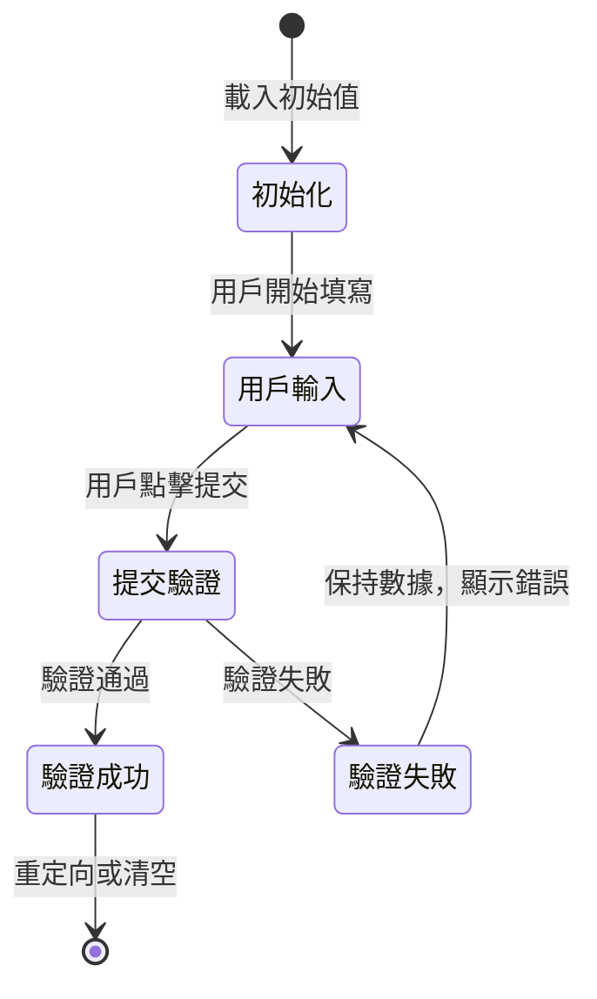

# ARCH-DESIGN-003：表單狀態管理設計

- **狀態**：設計中
- **日期**：2025-11-06
- **決策者**：Architecture Team
- **相關問題**：表單驗證失敗後用戶輸入數據被清空

---

## 1. 問題分析

### 1.1 當前問題
用戶在填寫表單時，如果驗證失敗，所有輸入的數據會被清空，導致用戶需要重新填寫所有內容。這是嚴重的用戶體驗問題。

### 1.2 根本原因分析
通過分析三個主要表單組件，發現了不一致的狀態管理模式：

#### 再保人表單 (ReinsurerForm)
- **基本字段**：使用 `defaultValue={initialValues?.field ?? ""}` ❌
- **聯繫人**：使用 `useState` + `value` + `onChange` ✅
- **問題**：基本字段在重新渲染時會丟失用戶輸入

#### 合約表單 (TreatyForm)  
- **基本字段**：使用 `defaultValue` ❌
- **動態行**：使用 `useState` ✅
- **問題**：基本字段數據不會保持

#### 臨分表單 (FacultativeForm)
- **所有字段**：使用 `defaultValue` ❌
- **問題**：所有用戶輸入都會丟失

### 1.3 技術原因
`defaultValue` 只在組件初始化時設置一次，當組件因為狀態變化重新渲染時，不會更新為用戶輸入的值。

---

## 2. 設計解決方案

### 2.1 統一表單狀態管理策略

採用**受控組件模式**，所有表單字段使用 `useState` 管理：

```typescript
// ✅ 正確的模式
const [formData, setFormData] = useState({
  code: initialValues?.code ?? "",
  name: initialValues?.name ?? "",
  // ... 其他字段
});

// 表單字段
<input
  value={formData.code}
  onChange={(e) => setFormData(prev => ({ ...prev, code: e.target.value }))}
/>
```

### 2.2 表單狀態生命週期



### 2.3 統一表單 Hook 設計

```typescript
// src/hooks/use-form-state.ts
export function useFormState<T>(
  initialValues: T,
  onSubmit: (data: T) => Promise<FormResult>
) {
  const [formData, setFormData] = useState<T>(initialValues);
  const [errors, setErrors] = useState<Record<string, string>>({});
  const [isSubmitting, setIsSubmitting] = useState(false);

  const updateField = (field: keyof T, value: any) => {
    setFormData(prev => ({ ...prev, [field]: value }));
    // 清除該字段的錯誤
    if (errors[field as string]) {
      setErrors(prev => ({ ...prev, [field as string]: undefined }));
    }
  };

  const handleSubmit = async (e: FormEvent) => {
    e.preventDefault();
    setIsSubmitting(true);
    
    try {
      const result = await onSubmit(formData);
      if (result.success) {
        // 成功時清空表單或重定向
        setFormData(initialValues);
        setErrors({});
      } else {
        // 失敗時保持數據，顯示錯誤
        setErrors(result.errors || {});
      }
    } finally {
      setIsSubmitting(false);
    }
  };

  return {
    formData,
    errors,
    isSubmitting,
    updateField,
    handleSubmit,
    setFormData
  };
}
```

---

## 3. 實施計劃

### 3.1 Phase 1: 修復當前驗證錯誤
- [ ] 修復 `bankAccount required for WIRE_TRANSFER` 驗證規則
- [ ] 確保所有必填字段驗證符合 UI 實際需求

### 3.2 Phase 2: 重構表單狀態管理
- [ ] 創建統一的 `useFormState` hook
- [ ] 重構再保人表單使用受控組件
- [ ] 重構合約表單使用受控組件  
- [ ] 重構臨分表單使用受控組件

### 3.3 Phase 3: 測試驗證
- [ ] 測試表單數據保持功能
- [ ] 測試驗證錯誤顯示
- [ ] 測試成功提交流程
- [ ] 編譯和端到端測試

---

## 4. 技術實施細節

### 4.1 受控組件轉換模式

```typescript
// ❌ 當前模式 (會丟失數據)
<input
  defaultValue={initialValues?.name ?? ""}
  name="name"
/>

// ✅ 目標模式 (保持數據)
<input
  value={formData.name}
  onChange={(e) => updateField('name', e.target.value)}
  name="name"
/>
```

### 4.2 動態字段處理

```typescript
// 聯繫人、份額等動態字段
const [contacts, setContacts] = useState(initialContacts);

// 保持現有的動態添加/刪除邏輯
const addContact = () => {
  setContacts(prev => [...prev, emptyContact]);
};
```

### 4.3 表單提交處理

```typescript
// 使用 Server Actions 但保持客戶端狀態
const handleSubmit = async (formData: FormData) => {
  const result = await serverAction(formData);
  
  if (!result.success) {
    // 保持表單數據，顯示錯誤
    setErrors(result.errors);
    return;
  }
  
  // 成功時重定向
  router.push(successUrl);
};
```

---

## 5. 驗證規則修復

### 5.1 當前驗證錯誤
根據測試日誌，需要修復：
- `financialInfo.bankAccount` 在選擇 WIRE_TRANSFER 時為必填
- 但用戶實際上沒有填寫 bankAccount

### 5.2 業務規則檢討
需要檢討以下業務規則是否合理：
- 電匯付款方式是否真的需要強制填寫銀行帳號？
- 還是應該允許後續補充？

---

## 6. 實施優先級

### P0 (立即修復)
1. 修復當前的驗證錯誤，讓表單可以正常提交
2. 修復 bankAccount 驗證規則

### P1 (本週完成)  
1. 實施統一的表單狀態管理
2. 重構所有表單使用受控組件
3. 測試數據保持功能

### P2 (下週完成)
1. 創建統一的表單 Hook
2. 建立表單狀態管理最佳實踐文檔
3. 添加表單狀態管理的測試覆蓋

---

## 7. 風險評估

| 風險 | 影響 | 緩解策略 |
|------|------|----------|
| 重構影響現有功能 | 高 | 逐步重構，保持向後兼容 |
| 性能影響 | 中 | 使用 React.memo 優化重渲染 |
| 複雜表單狀態管理 | 中 | 創建統一的 Hook 抽象複雜性 |

---

## 8. 下一步行動

1. **立即**：切換到 Code 模式修復驗證錯誤
2. **今天**：實施再保人表單的狀態保持
3. **本週**：完成所有表單的重構
4. **測試**：確保所有修復都通過編譯和功能測試

---

> **重要**：這個問題影響所有表單的用戶體驗，需要優先處理。建議立即開始實施修復。