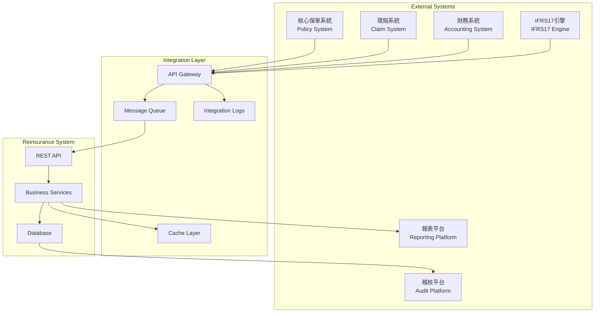

# RI-9-3：系統整合策略 / System Integration Strategy

- **文件編號**：RI-9-3
- **版本**：v1.0
- **狀態**：Draft for Architecture Review
- **作者**：Tao Yu 和他的 GPT 智能助手
- **建立日期**：2025-11-05
- **參考文件**：PRD UC-12、ADR-001~008、RI-9-1實施路線圖、RI-9-2技術解決方案

---

## 1. 整合概述 / Integration Overview

本文檔定義再保系統與外部系統的整合策略，包括核心保單系統、理賠系統、財務系統、IFRS17引擎和稽核平台的資料交換架構、API設計和同步機制。

### 1.1 整合目標
- 實現與外部系統的無縫資料流轉
- 確保資料一致性和即時性
- 提供可靠的錯誤處理和重試機制
- 支援多種整合協議和資料格式
- 建立完整的監控和告警機制

### 1.2 整合範圍



---

## 2. 整合架構設計 / Integration Architecture Design

### 2.1 API Gateway 規格

```typescript
// src/services/integration/api-gateway.ts
export interface IntegrationEndpoint {
  id: string;
  name: string;
  systemType: 'POLICY' | 'CLAIM' | 'ACCOUNTING' | 'IFRS17' | 'AUDIT';
  protocol: 'REST' | 'SOAP' | 'SFTP' | 'MQ' | 'WEBHOOK';
  baseUrl: string;
  authentication: AuthenticationConfig;
  timeout: number;
  retryPolicy: RetryPolicy;
  rateLimiting: RateLimitConfig;
  healthCheckEndpoint?: string;
  isActive: boolean;
  version: string;
  createdAt: Date;
  updatedAt: Date;
}

export interface AuthenticationConfig {
  type: 'OAUTH2' | 'BASIC' | 'API_KEY' | 'CERTIFICATE' | 'JWT';
  credentials: {
    clientId?: string;
    clientSecret?: string;
    apiKey?: string;
    username?: string;
    password?: string;
    certificatePath?: string;
    tokenEndpoint?: string;
  };
  tokenRefreshThreshold: number; // 秒
}

export interface RetryPolicy {
  maxAttempts: number;
  backoffStrategy: 'FIXED' | 'EXPONENTIAL' | 'LINEAR';
  initialDelay: number; // 毫秒
  maxDelay: number;
  retryableErrors: string[]; // HTTP狀態碼或錯誤類型
}

export class ApiGateway {
  private endpointConfigs = new Map<string, IntegrationEndpoint>();
  private circuitBreakers = new Map<string, CircuitBreaker>();
  
  async callExternalApi<TRequest, TResponse>(
    systemType: string,
    endpoint: string,
    method: HttpMethod,
    data?: TRequest,
    options?: CallOptions
  ): Promise<IntegrationResult<TResponse>> {
    const config = await this.getEndpointConfig(systemType);
    const circuitBreaker = this.getCircuitBreaker(systemType);
    
    // 檢查熔斷器狀態
    if (circuitBreaker.isOpen()) {
      throw new IntegrationError('CIRCUIT_BREAKER_OPEN', systemType);
    }
    
    try {
      // 準備請求
      const request = await this.prepareRequest(config, endpoint, method, data);
      
      // 執行請求（含重試邏輯）
      const response = await this.executeWithRetry(request, config.retryPolicy);
      
      // 記錄成功
      await this.logIntegrationCall(systemType, endpoint, method, 'SUCCESS', response.status);
      circuitBreaker.recordSuccess();
      
      return {
        success: true,
        data: response.data,
        statusCode: response.status,
        headers: response.headers,
        duration: response.duration
      };
      
    } catch (error) {
      // 記錄失敗
      await this.logIntegrationCall(systemType, endpoint, method, 'FAILED', 0, error.message);
      circuitBreaker.recordFailure();
      
      throw new IntegrationError('API_CALL_FAILED', systemType, error.message);
    }
  }
  
  private async executeWithRetry<T>(
    request: HttpRequest,
    retryPolicy: RetryPolicy
  ): Promise<HttpResponse<T>> {
    let lastError: Error;
    
    for (let attempt = 1; attempt <= retryPolicy.maxAttempts; attempt++) {
      try {
        return await this.executeRequest<T>(request);
      } catch (error) {
        lastError = error;
        
        // 檢查是否為可重試錯誤
        if (!this.isRetryableError(error, retryPolicy.retryableErrors)) {
          throw error;
        }
        
        // 最後一次嘗試失敗
        if (attempt === retryPolicy.maxAttempts) {
          throw error;
        }
        
        // 等待後重試
        const delay = this.calculateDelay(attempt, retryPolicy);
        await this.sleep(delay);
      }
    }
    
    throw lastError;
  }
}
```

### 2.2 訊息佇列整合

```typescript
// src/services/integration/message-queue.ts
export interface MessageQueueConfig {
  provider: 'REDIS' | 'RABBITMQ' | 'AWS_SQS' | 'AZURE_SERVICE_BUS';
  connectionString: string;
  queues: QueueConfig[];
}

export interface QueueConfig {
  name: string;
  type: 'INBOUND' | 'OUTBOUND';
  messageType: string;
  deadLetterQueue?: string;
  retryAttempts: number;
  visibilityTimeout: number;
}

export class MessageQueueService {
  async publishMessage<T>(
    queueName: string,
    messageType: string,
    payload: T,
    options?: PublishOptions
  ): Promise<string> {
    const message: QueueMessage<T> = {
      id: generateMessageId(),
      type: messageType,
      payload,
      timestamp: new Date(),
      correlationId: options?.correlationId,
      retryCount: 0,
      source: 'REINSURANCE_SYSTEM'
    };
    
    try {
      await this.queue.send(queueName, message);
      await this.logMessage('SENT', queueName, message.id);
      return message.id;
    } catch (error) {
      await this.logMessage('FAILED', queueName, message.id, error.message);
      throw new MessageQueueError('PUBLISH_FAILED', queueName, error.message);
    }
  }
  
  async subscribeToQueue<T>(
    queueName: string,
    handler: MessageHandler<T>
  ): Promise<void> {
    await this.queue.subscribe(queueName, async (message: QueueMessage<T>) => {
      try {
        await handler(message.payload, message);
        await this.acknowledgeMessage(queueName, message.id);
        await this.logMessage('PROCESSED', queueName, message.id);
      } catch (error) {
        await this.handleMessageError(queueName, message, error);
      }
    });
  }
  
  private async handleMessageError<T>(
    queueName: string,
    message: QueueMessage<T>,
    error: Error
  ): Promise<void> {
    message.retryCount++;
    
    if (message.retryCount >= this.getMaxRetries(queueName)) {
      // 移至死信佇列
      await this.moveToDeadLetterQueue(queueName, message);
      await this.logMessage('DEAD_LETTER', queueName, message.id, error.message);
    } else {
      // 重新排程
      await this.scheduleRetry(queueName, message);
      await this.logMessage('RETRY_SCHEDULED', queueName, message.id);
    }
  }
}
```

---

## 3. 外部系統整合規格 / External System Integration Specifications

### 3.1 保單系統整合

```typescript
// src/services/integration/policy-integration.ts
export interface PolicySystemIntegration {
  // 保單資料同步
  syncPolicyData(policyIds: string[]): Promise<PolicySyncResult>;
  
  // 保費資料獲取
  getPremiumData(criteria: PremiumQueryCriteria): Promise<PremiumData[]>;
  
  // 保單狀態監聽
  subscribePolicyEvents(): Promise<void>;
}

export interface PolicyData {
  policyNumber: string;
  productCode: string;
  lineOfBusiness: string;
  sumInsured: Decimal;
  premium: Decimal;
  currency: string;
  effectiveDate: Date;
  expiryDate: Date;
  policyHolder: PolicyHolderInfo;
  coverages: CoverageInfo[];
  endorsements: EndorsementInfo[];
}

export class PolicySystemService implements PolicySystemIntegration {
  async syncPolicyData(policyIds: string[]): Promise<PolicySyncResult> {
    const results: PolicySyncResult = {
      successful: [],
      failed: [],
      totalCount: policyIds.length,
      syncedAt: new Date()
    };
    
    // 批次處理，避免單次請求過大
    const batches = this.chunkArray(policyIds, 100);
    
    for (const batch of batches) {
      try {
        const policies = await apiGateway.callExternalApi<string[], PolicyData[]>(
          'POLICY',
          '/api/policies/batch',
          'POST',
          { policyIds: batch }
        );
        
        // 儲存到本地資料庫
        for (const policy of policies.data) {
          try {
            await this.storePolicyData(policy);
            results.successful.push(policy.policyNumber);
          } catch (error) {
            results.failed.push({
              policyId: policy.policyNumber,
              error: error.message
            });
          }
        }
        
      } catch (error) {
        // 整個批次失敗
        batch.forEach(policyId => {
          results.failed.push({
            policyId,
            error: `Batch request failed: ${error.message}`
          });
        });
      }
    }
    
    return results;
  }
  
  async subscribePolicyEvents(): Promise<void> {
    await messageQueue.subscribeToQueue<PolicyEvent>(
      'policy-events',
      async (event: PolicyEvent) => {
        switch (event.type) {
          case 'POLICY_CREATED':
            await this.handlePolicyCreated(event.data);
            break;
          case 'POLICY_UPDATED':
            await this.handlePolicyUpdated(event.data);
            break;
          case 'POLICY_CANCELLED':
            await this.handlePolicyCancelled(event.data);
            break;
        }
      }
    );
  }
}
```

### 3.2 理賠系統整合

```typescript
// src/services/integration/claim-integration.ts
export interface ClaimSystemIntegration {
  syncClaimData(claimIds: string[]): Promise<ClaimSyncResult>;
  subscribeClaimEvents(): Promise<void>;
  submitRecoveryRequest(recoveryData: RecoveryRequest): Promise<string>;
}

export interface ClaimData {
  claimId: string;
  policyNumber: string;
  claimNumber: string;
  lossDate: Date;
  reportedDate: Date;
  claimAmount: Decimal;
  paidAmount: Decimal;
  reserveAmount: Decimal;
  currency: string;
  status: ClaimStatus;
  lossType: string;
  lossLocation: string;
  adjuster: AdjusterInfo;
}

export class ClaimSystemService implements ClaimSystemIntegration {
  async syncClaimData(claimIds: string[]): Promise<ClaimSyncResult> {
    const results: ClaimSyncResult = {
      successful: [],
      failed: [],
      totalCount: claimIds.length,
      syncedAt: new Date()
    };
    
    for (const claimId of claimIds) {
      try {
        // 獲取理賠資料
        const claimData = await apiGateway.callExternalApi<void, ClaimData>(
          'CLAIM',
          `/api/claims/${claimId}`,
          'GET'
        );
        
        // 檢查是否需要建立攤回
        const needsRecovery = await this.assessRecoveryNeed(claimData.data);
        
        if (needsRecovery) {
          // 自動建立攤回案件
          const recovery = await claimRecoveryService.createRecoveryFromClaim(claimData.data);
          results.successful.push({
            claimId,
            recoveryId: recovery.id,
            action: 'RECOVERY_CREATED'
          });
        } else {
          results.successful.push({
            claimId,
            action: 'NO_RECOVERY_NEEDED'
          });
        }
        
      } catch (error) {
        results.failed.push({
          claimId,
          error: error.message
        });
      }
    }
    
    return results;
  }
  
  async subscribeClaimEvents(): Promise<void> {
    await messageQueue.subscribeToQueue<ClaimEvent>(
      'claim-events',
      async (event: ClaimEvent) => {
        switch (event.type) {
          case 'CLAIM_REPORTED':
            await this.handleClaimReported(event.data);
            break;
          case 'CLAIM_SETTLED':
            await this.handleClaimSettled(event.data);
            break;
          case 'CLAIM_REOPENED':
            await this.handleClaimReopened(event.data);
            break;
        }
      }
    );
  }
  
  private async handleClaimReported(claimData: ClaimData): Promise<void> {
    // 自動評估是否需要攤回
    const needsRecovery = await this.assessRecoveryNeed(claimData);
    
    if (needsRecovery) {
      // 建立攤回案件
      const recovery = await claimRecoveryService.createRecoveryFromClaim(claimData);
      
      // 通知相關人員
      await notificationService.send({
        type: 'RECOVERY_CREATED',
        recipients: ['claims-team@company.com'],
        data: { recoveryId: recovery.id, claimId: claimData.claimId }
      });
    }
  }
}
```

### 3.3 財務系統整合

```typescript
// src/services/integration/accounting-integration.ts
export interface AccountingSystemIntegration {
  postJournalEntries(entries: JournalEntry[]): Promise<PostingResult>;
  syncAccountBalances(accountCodes: string[]): Promise<BalanceSyncResult>;
  submitSoaEntries(soaBatchId: string): Promise<string>;
}

export interface JournalEntry {
  entryId: string;
  entryDate: Date;
  description: string;
  reference: string;
  currency: string;
  lines: JournalLine[];
  source: 'TREATY' | 'FACULTATIVE' | 'RECOVERY' | 'SOA';
  sourceId: string;
}

export interface JournalLine {
  accountCode: string;
  accountName: string;
  debitAmount?: Decimal;
  creditAmount?: Decimal;
  currency: string;
  exchangeRate?: Decimal;
  costCenter?: string;
  department?: string;
}

export class AccountingSystemService implements AccountingSystemIntegration {
  async postJournalEntries(entries: JournalEntry[]): Promise<PostingResult> {
    const results: PostingResult = {
      successful: [],
      failed: [],
      totalAmount: new Decimal(0)
    };
    
    // 驗證分錄平衡
    for (const entry of entries) {
      const validation = this.validateJournalEntry(entry);
      if (!validation.isValid) {
        results.failed.push({
          entryId: entry.entryId,
          error: validation.errors.join(', ')
        });
        continue;
      }
      
      try {
        // 發送到財務系統
        const response = await apiGateway.callExternalApi<JournalEntry, PostingResponse>(
          'ACCOUNTING',
          '/api/journal-entries',
          'POST',
          entry
        );
        
        // 更新本地狀態
        await this.updateEntryStatus(entry.entryId, 'POSTED', response.data.postingReference);
        
        results.successful.push({
          entryId: entry.entryId,
          postingReference: response.data.postingReference,
          amount: this.calculateEntryAmount(entry)
        });
        
      } catch (error) {
        results.failed.push({
          entryId: entry.entryId,
          error: error.message
        });
      }
    }
    
    return results;
  }
  
  private validateJournalEntry(entry: JournalEntry): ValidationResult {
    const errors: string[] = [];
    
    // 檢查借貸平衡
    const totalDebit = entry.lines.reduce((sum, line) => 
      sum.add(line.debitAmount || 0), new Decimal(0));
    const totalCredit = entry.lines.reduce((sum, line) => 
      sum.add(line.creditAmount || 0), new Decimal(0));
    
    if (!totalDebit.equals(totalCredit)) {
      errors.push(`分錄不平衡：借方 ${totalDebit}，貸方 ${totalCredit}`);
    }
    
    // 檢查科目代碼
    for (const line of entry.lines) {
      if (!this.isValidAccountCode(line.accountCode)) {
        errors.push(`無效的科目代碼：${line.accountCode}`);
      }
    }
    
    return {
      isValid: errors.length === 0,
      errors
    };
  }
}
```

---

## 4. 資料同步策略 / Data Synchronization Strategy

### 4.1 同步模式設計

```typescript
// src/services/integration/sync-coordinator.ts
export interface SyncJob {
  id: string;
  name: string;
  type: 'FULL_SYNC' | 'INCREMENTAL_SYNC' | 'REAL_TIME_SYNC';
  sourceSystem: string;
  targetEntities: string[];
  schedule?: CronExpression;
  lastRunAt?: Date;
  nextRunAt?: Date;
  status: SyncStatus;
  config: SyncConfig;
}

export interface SyncConfig {
  batchSize: number;
  parallelism: number;
  conflictResolution: 'SOURCE_WINS' | 'TARGET_WINS' | 'MANUAL_REVIEW';
  dataFilters: DataFilter[];
  transformations: DataTransformation[];
}

export class SyncCoordinator {
  async scheduleSyncJob(job: Omit<SyncJob, 'id' | 'status'>): Promise<string> {
    const jobId = generateJobId();
    
    // 儲存同步工作
    await syncRepository.createJob({
      ...job,
      id: jobId,
      status: 'SCHEDULED'
    });
    
    // 註冊排程
    if (job.schedule) {
      await this.scheduleRecurringJob(jobId, job.schedule);
    }
    
    return jobId;
  }
  
  async executeSyncJob(jobId: string): Promise<SyncResult> {
    const job = await syncRepository.findById(jobId);
    
    try {
      await this.updateJobStatus(jobId, 'RUNNING');
      
      let result: SyncResult;
      
      switch (job.type) {
        case 'FULL_SYNC':
          result = await this.performFullSync(job);
          break;
        case 'INCREMENTAL_SYNC':
          result = await this.performIncrementalSync(job);
          break;
        case 'REAL_TIME_SYNC':
          result = await this.performRealTimeSync(job);
          break;
      }
      
      await this.updateJobStatus(jobId, 'COMPLETED');
      await this.updateJobResult(jobId, result);
      
      return result;
      
    } catch (error) {
      await this.updateJobStatus(jobId, 'FAILED', error.message);
      throw error;
    }
  }
  
  private async performIncrementalSync(job: SyncJob): Promise<SyncResult> {
    const lastSyncTime = job.lastRunAt || new Date(0);
    const currentTime = new Date();
    
    // 獲取增量資料
    const changes = await this.getIncrementalChanges(
      job.sourceSystem,
      job.targetEntities,
      lastSyncTime,
      currentTime
    );
    
    const results: SyncResult = {
      totalRecords: changes.length,
      successfulRecords: 0,
      failedRecords: 0,
      conflicts: [],
      startTime: currentTime,
      endTime: new Date()
    };
    
    // 處理變更
    for (const change of changes) {
      try {
        await this.applyChange(change, job.config);
        results.successfulRecords++;
      } catch (error) {
        results.failedRecords++;
        
        if (error instanceof ConflictError) {
          results.conflicts.push({
            entityId: change.entityId,
            conflictType: error.type,
            sourceValue: change.newValue,
            targetValue: error.currentValue,
            resolution: job.config.conflictResolution
          });
        }
      }
    }
    
    results.endTime = new Date();
    return results;
  }
}
```

### 4.2 IFRS17引擎整合

```typescript
// src/services/integration/ifrs17-integration.ts
export interface Ifrs17EngineIntegration {
  submitReinsuranceData(data: ReinsuranceIfrs17Data): Promise<string>;
  retrieveCalculationResults(jobId: string): Promise<Ifrs17CalculationResult>;
  syncParameters(parameters: Ifrs17Parameter[]): Promise<void>;
}

export interface ReinsuranceIfrs17Data {
  reportingPeriod: Date;
  contracts: ContractData[];
  claims: ClaimData[];
  premiums: PremiumData[];
  commissions: CommissionData[];
}

export class Ifrs17EngineService implements Ifrs17EngineIntegration {
  async submitReinsuranceData(data: ReinsuranceIfrs17Data): Promise<string> {
    // 1. 資料驗證
    const validation = await this.validateIfrs17Data(data);
    if (!validation.isValid) {
      throw new Ifrs17ValidationError(validation.errors);
    }
    
    // 2. 資料轉換（符合IFRS17引擎格式）
    const transformedData = await this.transformToIfrs17Format(data);
    
    // 3. 提交到IFRS17引擎
    const response = await apiGateway.callExternalApi<any, { jobId: string }>(
      'IFRS17',
      '/api/calculations/submit',
      'POST',
      transformedData
    );
    
    // 4. 記錄提交
    await ifrs17Repository.createSubmission({
      jobId: response.data.jobId,
      reportingPeriod: data.reportingPeriod,
      dataHash: this.calculateDataHash(data),
      submittedAt: new Date(),
      status: 'SUBMITTED'
    });
    
    return response.data.jobId;
  }
  
  async retrieveCalculationResults(jobId: string): Promise<Ifrs17CalculationResult> {
    // 1. 檢查計算狀態
    const status = await apiGateway.callExternalApi<void, { status: string }>(
      'IFRS17',
      `/api/calculations/${jobId}/status`,
      'GET'
    );
    
    if (status.data.status !== 'COMPLETED') {
      throw new Ifrs17Error(`Calculation not ready: ${status.data.status}`);
    }
    
    // 2. 獲取計算結果
    const results = await apiGateway.callExternalApi<void, Ifrs17CalculationResult>(
      'IFRS17',
      `/api/calculations/${jobId}/results`,
      'GET'
    );
    
    // 3. 儲存結果到本地
    await ifrs17Repository.storeCalculationResults(jobId, results.data);
    
    return results.data;
  }
}
```

---

## 5. 事件驅動架構 / Event-Driven Architecture

### 5.1 事件定義

```typescript
// src/types/events.ts
export interface DomainEvent {
  id: string;
  type: string;
  aggregateId: string;
  aggregateType: string;
  version: number;
  data: any;
  metadata: EventMetadata;
  occurredAt: Date;
}

export interface EventMetadata {
  correlationId: string;
  causationId?: string;
  userId?: string;
  source: string;
  locale?: string;
}

// 再保系統事件類型
export type ReinsuranceEvent = 
  | TreatyCreatedEvent
  | TreatyApprovedEvent
  | FacultativeSubmittedEvent
  | CessionCalculatedEvent
  | RecoveryCreatedEvent
  | SoaGeneratedEvent;

export interface TreatyCreatedEvent extends DomainEvent {
  type: 'TREATY_CREATED';
  data: {
    treatyId: string;
    treatyCode: string;
    treatyName: string;
    reinsurerIds: string[];
    effectiveDate: Date;
  };
}

export interface CessionCalculatedEvent extends DomainEvent {
  type: 'CESSION_CALCULATED';
  data: {
    calculationId: string;
    policyNumber: string;
    treatyId?: string;
    facultativeId?: string;
    cededAmount: Decimal;
    calculatedAt: Date;
  };
}
```

### 5.2 事件處理器

```typescript
// src/services/events/event-handlers.ts
export class ReinsuranceEventHandlers {
  @EventHandler('TREATY_CREATED')
  async handleTreatyCreated(event: TreatyCreatedEvent): Promise<void> {
    // 1. 通知相關團隊
    await notificationService.send({
      type: 'TREATY_CREATED',
      recipients: this.getTreatyStakeholders(event.data.treatyId),
      template: 'treaty-created',
      data: event.data,
      locale: event.metadata.locale
    });
    
    // 2. 更新快取
    await cacheManager.invalidateByTags(['treaty', 'treaty-list']);
    
    // 3. 同步到外部系統
    await this.syncTreatyToExternalSystems(event.data);
  }
  
  @EventHandler('CESSION_CALCULATED')
  async handleCessionCalculated(event: CessionCalculatedEvent): Promise<void> {
    // 1. 檢查是否需要生成SoA
    const shouldGenerateSoa = await this.shouldGenerateSoa(event.data);
    
    if (shouldGenerateSoa) {
      await soaService.addToNextBatch(event.data);
    }
    
    // 2. 更新IFRS17資料
    await ifrs17Service.updateCoverageUnits(event.data);
    
    // 3. 記錄計算歷史
    await calculationHistoryService.record(event.data);
  }
  
  @EventHandler('RECOVERY_CREATED')
  async handleRecoveryCreated(event: RecoveryCreatedEvent): Promise<void> {
    // 1. 自動提交給再保人
    await claimRecoveryService.submitToReinsurers(event.data.recoveryId);
    
    // 2. 設定提醒排程
    await reminderService.scheduleReminders(event.data.recoveryId, [
      { days: 30, type: 'FIRST_REMINDER' },
      { days: 60, type: 'ESCALATION' },
      { days: 90, type: 'MANAGEMENT_ALERT' }
    ]);
  }
}
```

---

## 6. 錯誤處理與重試機制 / Error Handling & Retry Mechanisms

### 6.1 錯誤分類與處理

```typescript
// src/services/integration/error-handler.ts
export enum IntegrationErrorType {
  NETWORK_ERROR = 'NETWORK_ERROR',
  AUTHENTICATION_ERROR = 'AUTHENTICATION_ERROR', 
  VALIDATION_ERROR = 'VALIDATION_ERROR',
  BUSINESS_LOGIC_ERROR = 'BUSINESS_LOGIC_ERROR',
  TIMEOUT_ERROR = 'TIMEOUT_ERROR',
  RATE_LIMIT_ERROR = 'RATE_LIMIT_ERROR',
  SYSTEM_UNAVAILABLE = 'SYSTEM_UNAVAILABLE'
}

export class IntegrationErrorHandler {
  async handleError(
    error: IntegrationError,
    context: IntegrationContext
  ): Promise<ErrorHandlingResult> {
    // 記錄錯誤
    await this.logError(error, context);
    
    // 根據錯誤類型決定處理策略
    switch (error.type) {
      case IntegrationErrorType.NETWORK_ERROR:
      case IntegrationErrorType.TIMEOUT_ERROR:
        return this.handleRetryableError(error, context);
        
      case IntegrationErrorType.AUTHENTICATION_ERROR:
        return this.handleAuthenticationError(error, context);
        
      case IntegrationErrorType.RATE_LIMIT_ERROR:
        return this.handleRateLimitError(error, context);
        
      case IntegrationErrorType.VALIDATION_ERROR:
      case IntegrationErrorType.BUSINESS_LOGIC_ERROR:
        return this.handleNonRetryableError(error, context);
        
      default:
        return this.handleUnknownError(error, context);
    }
  }
  
  private async handleRetryableError(
    error: IntegrationError,
    context: IntegrationContext
  ): Promise<ErrorHandlingResult> {
    const retryPolicy = context.endpoint.retryPolicy;
    
    if (context.attemptCount < retryPolicy.maxAttempts) {
      // 計算延遲時間
      const delay = this.calculateBackoffDelay(
        context.attemptCount,
        retryPolicy.backoffStrategy,
        retryPolicy.initialDelay,
        retryPolicy.maxDelay
      );
      
      // 排程重試
      await this.scheduleRetry(context, delay);
      
      return {
        action: 'RETRY_SCHEDULED',
        retryAfter: delay,
        message: `將在 ${delay}ms 後重試`
      };
    } else {
      // 超過重試次數，移至死信佇列
      await this.moveToDeadLetterQueue(context);
      
      return {
        action: 'MOVED_TO_DLQ',
        message: '超過最大重試次數，已移至死信佇列'
      };
    }
  }
  
  private async handleAuthenticationError(
    error: IntegrationError,
    context: IntegrationContext
  ): Promise<ErrorHandlingResult> {
    // 嘗試重新認證
    try {
      await this.refreshAuthentication(context.endpoint);
      
      // 重新執行原始請求
      return {
        action: 'RETRY_WITH_NEW_AUTH',
        message: '認證已更新，將重新執行請求'
      };
    } catch (authError) {
      // 認證失敗，通知管理員
      await this.notifyAuthenticationFailure(context.endpoint, authError);
      
      return {
        action: 'AUTHENTICATION_FAILED',
        message: '認證更新失敗，已通知管理員'
      };
    }
  }
}
```

### 6.2 熔斷器機制

```typescript
// src/services/integration/circuit-breaker.ts
export class CircuitBreaker {
  private state: 'CLOSED' | 'OPEN' | 'HALF_OPEN' = 'CLOSED';
  private failureCount = 0;
  private lastFailureTime?: Date;
  private nextAttemptTime?: Date;
  
  constructor(
    private config: {
      failureThreshold: number;
      timeout: number;
      monitoringPeriod: number;
    }
  ) {}
  
  async execute<T>(operation: () => Promise<T>): Promise<T> {
    if (this.state === 'OPEN') {
      if (this.shouldAttemptReset()) {
        this.state = 'HALF_OPEN';
      } else {
        throw new CircuitBreakerError('Circuit breaker is OPEN');
      }
    }
    
    try {
      const result = await operation();
      this.onSuccess();
      return result;
    } catch (error) {
      this.onFailure();
      throw error;
    }
  }
  
  private onSuccess(): void {
    this.failureCount = 0;
    this.state = 'CLOSED';
  }
  
  private onFailure(): void {
    this.failureCount++;
    this.lastFailureTime = new Date();
    
    if (this.failureCount >= this.config.failureThreshold) {
      this.state = 'OPEN';
      this.nextAttemptTime = new Date(Date.now() + this.config.timeout);
    }
  }
  
  private shouldAttemptReset(): boolean {
    return this.nextAttemptTime ? new Date() >= this.nextAttemptTime : false;
  }
  
  isOpen(): boolean {
    return this.state === 'OPEN';
  }
}
```

---

## 7. 監控與日誌 / Monitoring & Logging

### 7.1 整合日誌規格

```typescript
// src/services/integration/integration-logger.ts
export interface IntegrationLog {
  id: string;
  timestamp: Date;
  systemType: string;
  endpoint: string;
  method: string;
  requestId: string;
  correlationId?: string;
  status: 'SUCCESS' | 'FAILED' | 'TIMEOUT' | 'RETRY';
  statusCode?: number;
  duration: number;
  requestSize?: number;
  responseSize?: number;
  errorMessage?: string;
  retryAttempt?: number;
}

export class IntegrationLogger {
  async logCall(log: Omit<IntegrationLog, 'id' | 'timestamp'>): Promise<void> {
    const logEntry: IntegrationLog = {
      ...log,
      id: generateLogId(),
      timestamp: new Date()
    };
    
    // 儲存到資料庫
    await integrationLogRepository.create(logEntry);
    
    // 發送到外部日誌系統
    if (this.shouldSendToExternalLogger(log.status)) {
      await this.sendToExternalLogger(logEntry);
    }
    
    // 更新指標
    await this.updateMetrics(logEntry);
  }
  
  async generateIntegrationReport(
    systemType?: string,
    dateRange?: { start: Date; end: Date }
  ): Promise<IntegrationReport> {
    const logs = await integrationLogRepository.findByFilters({
      systemType,
      dateRange
    });
    
    return {
      totalCalls: logs.length,
      successfulCalls: logs.filter(l => l.status === 'SUCCESS').length,
      failedCalls: logs.filter(l => l.status === 'FAILED').length,
      averageResponseTime: this.calculateAverageResponseTime(logs),
      errorBreakdown: this.analyzeErrors(logs),
      systemBreakdown: this.analyzeBySystem(logs),
      timeSeriesData: this.generateTimeSeries(logs)
    };
  }
}
```

### 7.2 健康檢查儀表板

```typescript
// src/services/monitoring/health-dashboard.ts
export interface HealthDashboard {
  overallStatus: 'HEALTHY' | 'DEGRADED' | 'UNHEALTHY';
  lastUpdated: Date;
  systems: SystemHealth[];
  alerts: ActiveAlert[];
  metrics: DashboardMetrics;
}

export interface SystemHealth {
  systemType: string;
  status: 'HEALTHY' | 'DEGRADED' | 'UNHEALTHY';
  responseTime: number;
  errorRate: number;
  lastSuccessfulCall?: Date;
  lastFailedCall?: Date;
  circuitBreakerState: 'CLOSED' | 'OPEN' | 'HALF_OPEN';
}

export class HealthDashboardService {
  async getDashboardData(): Promise<HealthDashboard> {
    const systems = await this.checkAllSystems();
    const alerts = await this.getActiveAlerts();
    const metrics = await this.collectDashboardMetrics();
    
    const overallStatus = this.determineOverallStatus(systems);
    
    return {
      overallStatus,
      lastUpdated: new Date(),
      systems,
      alerts,
      metrics
    };
  }
  
  private async checkAllSystems(): Promise<SystemHealth[]> {
    const systemTypes = ['POLICY', 'CLAIM', 'ACCOUNTING', 'IFRS17', 'AUDIT'];
    
    return Promise.all(
      systemTypes.map(async (systemType) => {
        try {
          const healthCheck = await this.performHealthCheck(systemType);
          return {
            systemType,
            status: 'HEALTHY',
            responseTime: healthCheck.responseTime,
            errorRate: await this.calculateErrorRate(systemType),
            lastSuccessfulCall: healthCheck.timestamp,
            circuitBreakerState: this.getCircuitBreakerState(systemType)
          };
        } catch (error) {
          return {
            systemType,
            status: 'UNHEALTHY',
            responseTime: 0,
            errorRate: 100,
            lastFailedCall: new Date(),
            circuitBreakerState: this.getCircuitBreakerState(systemType)
          };
        }
      })
    );
  }
}
```

---

## 8. 安全整合 / Security Integration

### 8.1 API安全策略

```typescript
// src/services/integration/security-service.ts
export class IntegrationSecurityService {
  async validateApiRequest(request: ApiRequest): Promise<ValidationResult> {
    // 1. API Key驗證
    const apiKeyValid = await this.validateApiKey(request.headers.authorization);
    if (!apiKeyValid) {
      return { isValid: false, error: 'Invalid API key' };
    }
    
    // 2. IP白名單檢查
    const ipAllowed = await this.checkIpWhitelist(request.clientIp);
    if (!ipAllowed) {
      return { isValid: false, error: 'IP not in whitelist' };
    }
    
    // 3. Rate Limiting
    const rateLimitOk = await this.checkRateLimit(request.clientIp, request.endpoint);
    if (!rateLimitOk) {
      return { isValid: false, error: 'Rate limit exceeded' };
    }
    
    // 4. 輸入驗證
    const inputValid = await this.validateInput(request.body, request.endpoint);
    if (!inputValid.isValid) {
      return { isValid: false, error: inputValid.errors.join(', ') };
    }
    
    return { isValid: true };
  }
  
  async encryptSensitiveData(data: any): Promise<EncryptedData> {
    const sensitiveFields = ['taxId', 'personalInfo', 'bankAccount'];
    const encrypted = { ...data };
    
    for (const field of sensitiveFields) {
      if (encrypted[field]) {
        encrypted[field] = await this.encrypt(encrypted[field]);
      }
    }
    
    return {
      data: encrypted,
      encryptedFields: sensitiveFields.filter(field => data[field]),
      encryptionVersion: this.getEncryptionVersion()
    };
  }
}
```

### 8.2 資料傳輸安全

```typescript
// src/services/integration/secure-transport.ts
export class SecureTransportService {
  async sendSecureMessage<T>(
    targetSystem: string,
    message: T,
    options: SecureTransportOptions = {}
  ): Promise<SecureTransportResult> {
    // 1. 資料加密
    const encryptedPayload = await this.encryptPayload(message, options.encryptionKey);
    
    // 2. 數位簽章
    const signature = await this.signPayload(encryptedPayload, options.signingKey);
    
    // 3. 建立安全信封
    const secureEnvelope: SecureEnvelope = {
      payload: encryptedPayload,
      signature,
      timestamp: new Date(),
      sender: 'REINSURANCE_SYSTEM',
      recipient: targetSystem,
      messageId: generateMessageId(),
      encryptionAlgorithm: 'AES-256-GCM',
      signatureAlgorithm: 'RSA-SHA256'
    };
    
    // 4. 傳送
    const response = await this.transmitSecureEnvelope(targetSystem, secureEnvelope);
    
    // 5. 驗證回應
    await this.verifyResponse(response, options.expectedSignature);
    
    return {
      messageId: secureEnvelope.messageId,
      transmitted: true,
      responseVerified: true,
      transmissionTime: response.duration
    };
  }
}
```

---

## 9. 效能監控與優化 / Performance Monitoring & Optimization

### 9.1 效能指標收集

```typescript
// src/services/monitoring/performance-monitor.ts
export interface PerformanceMetrics {
  apiResponseTimes: Record<string, number[]>;
  databaseQueryTimes: Record<string, number[]>;
  calculationTimes: Record<string, number[]>;
  memoryUsage: MemoryUsageMetrics;
  cpuUsage: CpuUsageMetrics;
  networkLatency: Record<string, number[]>;
}

export class PerformanceMonitor {
  async collectMetrics(): Promise<PerformanceMetrics> {
    return {
      apiResponseTimes: await this.collectApiResponseTimes(),
      databaseQueryTimes: await this.collectDatabaseMetrics(),
      calculationTimes: await this.collectCalculationMetrics(),
      memoryUsage: await this.collectMemoryMetrics(),
      cpuUsage: await this.collectCpuMetrics(),
      networkLatency: await this.collectNetworkMetrics()
    };
  }
  
  async analyzePerformanceBottlenecks(): Promise<BottleneckAnalysis> {
    const metrics = await this.collectMetrics();
    const bottlenecks: PerformanceBottleneck[] = [];
    
    // 分析API回應時間
    for (const [endpoint, times] of Object.entries(metrics.apiResponseTimes)) {
      const avgTime = times.reduce((sum, time) => sum + time, 0) / times.length;
      if (avgTime > 2000) { // 超過2秒
        bottlenecks.push({
          type: 'API_SLOW_RESPONSE',
          component: endpoint,
          severity: avgTime > 5000 ? 'HIGH' : 'MEDIUM',
          metrics: { averageTime: avgTime, samples: times.length },
          recommendations: this.getApiOptimizationRecommendations(endpoint, avgTime)
        });
      }
    }
    
    // 分析資料庫查詢
    for (const [query, times] of Object.entries(metrics.databaseQueryTimes)) {
      const avgTime = times.reduce((sum, time) => sum + time, 0) / times.length;
      if (avgTime > 1000) { // 超過1秒
        bottlenecks.push({
          type: 'DATABASE_SLOW_QUERY',
          component: query,
          severity: avgTime > 3000 ? 'HIGH' : 'MEDIUM',
          metrics: { averageTime: avgTime, samples: times.length },
          recommendations: this.getDatabaseOptimizationRecommendations(query, avgTime)
        });
      }
    }
    
    return {
      bottlenecks,
      overallScore: this.calculatePerformanceScore(metrics),
      recommendations: this.generateGlobalRecommendations(bottlenecks)
    };
  }
}
```

---

## 10. 災難恢復與備援 / Disaster Recovery & Backup

### 10.1 備援策略

```typescript
// src/services/integration/disaster-recovery.ts
export interface DisasterRecoveryPlan {
  backupStrategy: BackupStrategy;
  recoveryProcedures: RecoveryProcedure[];
  rpoTarget: number; // Recovery Point Objective (分鐘)
  rtoTarget: number; // Recovery Time Objective (分鐘)
  testSchedule: TestSchedule;
}

export interface BackupStrategy {
  databaseBackup: {
    frequency: 'HOURLY' | 'DAILY' | 'WEEKLY';
    retention: number; // 天數
    location: 'LOCAL' | 'CLOUD' | 'BOTH';
    encryption: boolean;
  };
  fileBackup: {
    frequency: 'DAILY' | 'WEEKLY';
    retention: number;
    includePaths: string[];
    excludePaths: string[];
  };
  configurationBackup: {
    frequency: 'DAILY';
    includeSecrets: boolean;
    versionControl: boolean;
  };
}

export class DisasterRecoveryService {
  async executeBackup(backupType: 'FULL' | 'INCREMENTAL'): Promise<BackupResult> {
    const backupId = generateBackupId();
    const startTime = new Date();
    
    try {
      // 1. 資料庫備份
      const dbBackupPath = await this.backupDatabase(backupType);
      
      // 2. 檔案備份
      const fileBackupPath = await this.backupFiles(backupType);
      
      // 3. 配置備份
      const configBackupPath = await this.backupConfiguration();
      
      // 4. 驗證備份完整性
      const verification = await this.verifyBackup({
        database: dbBackupPath,
        files: fileBackupPath,
        config: configBackupPath
      });
      
      const result: BackupResult = {
        backupId,
        type: backupType,
        status: verification.isValid ? 'SUCCESS' : 'FAILED',
        startTime,
        endTime: new Date(),
        size: verification.totalSize,
        location: verification.location,
        verification
      };
      
      // 5. 記錄備份結果
      await backupRepository.recordBackup(result);
      
      return result;
      
    } catch (error) {
      const result: BackupResult = {
        backupId,
        type: backupType,
        status: 'FAILED',
        startTime,
        endTime: new Date(),
        error: error.message
      };
      
      await backupRepository.recordBackup(result);
      throw new BackupError('Backup failed', error);
    }
  }
  
  async testRecovery(backupId: string): Promise<RecoveryTestResult> {
    // 在隔離環境中測試恢復
    const testEnvironment = await this.createTestEnvironment();
    
    try {
      // 1. 恢復資料庫
      await this.restoreDatabase(backupId, testEnvironment);
      
      // 2. 恢復檔案
      await this.restoreFiles(backupId, testEnvironment);
      
      // 3. 恢復配置
      await this.restoreConfiguration(backupId, testEnvironment);
      
      // 4. 驗證系統功能
      const functionalTest = await this.runFunctionalTests(testEnvironment);
      
      // 5. 驗證資料完整性
      const dataIntegrityTest = await this.runDataIntegrityTests(testEnvironment);
      
      return {
        backupId,
        testEnvironment: testEnvironment.id,
        success: functionalTest.passed && dataIntegrityTest.passed,
        functionalTestResults: functionalTest,
        dataIntegrityResults: dataIntegrityTest,
        recoveryTime: testEnvironment.recoveryDuration
      };
      
    } finally {
      await this.cleanupTestEnvironment(testEnvironment);
    }
  }
}
```

---

## 11. 整合測試策略 / Integration Testing Strategy

### 11.1 契約測試

```typescript
// tests/integration/contract-tests/policy-system.contract.test.ts
import { describe, it, expect } from 'vitest';
import { pact } from '@pact-foundation/pact';

describe('Policy System Contract Tests', () => {
  const provider = pact({
    consumer: 'Reinsurance System',
    provider: 'Policy System',
    port: 1234
  });
  
  beforeAll(() => provider.setup());
  afterAll(() => provider.finalize());
  
  it('should get policy data with correct format', async () => {
    // 定義期望的API契約
    await provider
      .given('policy exists')
      .uponReceiving('a request for policy data')
      .withRequest({
        method: 'GET',
        path: '/api/policies/POL-2025-001',
        headers: {
          'Authorization': 'Bearer token',
          'Content-Type': 'application/json'
        }
      })
      .willRespondWith({
        status: 200,
        headers: { 'Content-Type': 'application/json' },
        body: {
          policyNumber: 'POL-2025-001',
          productCode: 'FIRE-01',
          sumInsured: 1000000,
          premium: 50000,
          currency: 'TWD',
          effectiveDate: '2025-01-01T00:00:00Z',
          expiryDate: '2025-12-31T23:59:59Z'
        }
      });
    
    // 執行實際API呼叫
    const result = await policySystemService.getPolicyData('POL-2025-001');
    
    expect(result.policyNumber).toBe('POL-2025-001');
    expect(result.sumInsured).toBe(1000000);
  });
});
```

### 11.2 端到端整合測試

```typescript
// tests/integration/e2e/treaty-to-calculation.test.ts
describe('Treaty to Calculation E2E Flow', () => {
  it('should complete full treaty creation to cession calculation flow', async () => {
    // 1. 建立再保人
    const reinsurer = await reinsurerService.createReinsurer({
      code: 'TEST-RIN-001',
      name: 'Test Reinsurer',
      type: 'COMPANY',
      status: 'ACTIVE'
    });
    
    // 2. 建立合約
    const treaty = await treatyService.createTreaty({
      treatyName: 'Test Treaty',
      treatyType: 'PROPORTIONAL',
      lineOfBusiness: 'FIRE',
      effectiveDate: '2025-01-01',
      expiryDate: '2025-12-31',
      cessionMethod: 'QUOTA_SHARE',
      currency: 'TWD',
      shares: [{
        reinsurerId: reinsurer.id,
        sharePercentage: 50,
        commissionRate: 10
      }]
    });
    
    // 3. 核准合約
    await treatyService.approveTreaty(treaty.id);
    
    // 4. 模擬保單資料
    const policyData = createTestPolicyData({
      lineOfBusiness: 'FIRE',
      premium: 100000,
      effectiveDate: '2025-06-01'
    });
    
    // 5. 執行分保計算
    const calculation = await cessionEngine.calculate({
      policyData,
      treatyId: treaty.id,
      calculationType: 'PREMIUM'
    });
    
    // 6. 驗證計算結果
    expect(calculation.cededAmount).toBe(50000); // 50% of 100000
    expect(calculation.commissionAmount).toBe(5000); // 10% of 50000
    expect(calculation.breakdown).toHaveLength(1);
    expect(calculation.breakdown[0].reinsurerId).toBe(reinsurer.id);
    
    // 7. 驗證稽核記錄
    const auditEvents = await auditRepository.findByEntity('Treaty', treaty.id);
    expect(auditEvents).toHaveLength(3); // CREATE, APPROVE, CALCULATE
  });
});
```

---

## 12. 資料一致性保證 / Data Consistency Guarantees

### 12.1 分散式交易管理

```typescript
// src/services/integration/transaction-coordinator.ts
export interface DistributedTransaction {
  id: string;
  operations: TransactionOperation[];
  status: 'PENDING' | 'COMMITTED' | 'ABORTED';
  coordinator: string;
  participants: string[];
  timeout: number;
  createdAt: Date;
}

export interface TransactionOperation {
  id: string;
  type: 'CREATE' | 'UPDATE' | 'DELETE';
  system: string;
  entity: string;
  data: any;
  compensationData?: any; // 用於回滾
  status: 'PENDING' | 'PREPARED' | 'COMMITTED' | 'ABORTED';
}

export class TransactionCoordinator {
  async executeDistributedTransaction(
    operations: Omit<TransactionOperation, 'id' | 'status'>[]
  ): Promise<TransactionResult> {
    const transactionId = generateTransactionId();
    
    // 1. 建立分散式交易
    const transaction: DistributedTransaction = {
      id: transactionId,
      operations: operations.map(op => ({
        ...op,
        id: generateOperationId(),
        status: 'PENDING'
      })),
      status: 'PENDING',
      coordinator: 'REINSURANCE_SYSTEM',
      participants: [...new Set(operations.map(op => op.system))],
      timeout: 30000, // 30秒
      createdAt: new Date()
    };
    
    try {
      // 2. 準備階段 - 所有參與者準備
      await this.preparePhase(transaction);
      
      // 3. 提交階段 - 所有參與者提交
      await this.commitPhase(transaction);
      
      return {
        transactionId,
        status: 'COMMITTED',
        operations: transaction.operations
      };
      
    } catch (error) {
      // 4. 中止階段 - 回滾所有變更
      await this.abortPhase(transaction);
      
      throw new DistributedTransactionError(
        'Transaction failed and rolled back',
        transactionId,
        error
      );
    }
  }
  
  private async preparePhase(transaction: DistributedTransaction): Promise<void> {
    const preparePromises = transaction.operations.map(async (operation) => {
      try {
        await this.prepareOperation(operation);
        operation.status = 'PREPARED';
      } catch (error) {
        operation.status = 'ABORTED';
        throw error;
      }
    });
    
    await Promise.all(preparePromises);
  }
  
  private async commitPhase(transaction: DistributedTransaction): Promise<void> {
    const commitPromises = transaction.operations.map(async (operation) => {
      await this.commitOperation(operation);
      operation.status = 'COMMITTED';
    });
    
    await Promise.all(commitPromises);
    transaction.status = 'COMMITTED';
  }
  
  private async abortPhase(transaction: DistributedTransaction): Promise<void> {
    const abortPromises = transaction.operations
      .filter(op => op.status === 'PREPARED')
      .map(async (operation) => {
        await this.abortOperation(operation);
        operation.status = 'ABORTED';
      });
    
    await Promise.all(abortPromises);
    transaction.status = 'ABORTED';
  }
}
```

### 12.2 資料同步衝突解決

```typescript
// src/services/integration/conflict-resolver.ts
export interface DataConflict {
  entityType: string;
  entityId: string;
  field: string;
  sourceValue: any;
  targetValue: any;
  sourceTimestamp: Date;
  targetTimestamp: Date;
  conflictType: 'UPDATE_CONFLICT' | 'DELETE_CONFLICT' | 'CREATE_CONFLICT';
}

export class ConflictResolver {
  async resolveConflict(conflict: DataConflict): Promise<ConflictResolution> {
    const strategy = await this.getResolutionStrategy(conflict.entityType, conflict.field);
    
    switch (strategy.type) {
      case 'TIMESTAMP_WINS':
        return this.resolveByTimestamp(conflict);
        
      case 'SOURCE_WINS':
        return this.resolveBySource(conflict);
        
      case 'BUSINESS_RULE':
        return this.resolveByBusinessRule(conflict, strategy.rule);
        
      case 'MANUAL_REVIEW':
        return this.escalateToManualReview(conflict);
        
      default:
        throw new ConflictResolutionError('Unknown resolution strategy', conflict);
    }
  }
  
  private async resolveByTimestamp(conflict: DataConflict): Promise<ConflictResolution> {
    const winner = conflict.sourceTimestamp > conflict.targetTimestamp ? 'SOURCE' : 'TARGET';
    
    return {
      resolution: winner,
      finalValue: winner === 'SOURCE' ? conflict.sourceValue : conflict.targetValue,
      reason: `Resolved by timestamp: ${winner} has newer data`,
      appliedAt: new Date()
    };
  }
  
  private async resolveByBusinessRule(
    conflict: DataConflict,
    rule: BusinessRule
  ): Promise<ConflictResolution> {
    // 執行業務規則
    const ruleResult = await this.executeBusinessRule(rule, conflict);
    
    return {
      resolution: ruleResult.winner,
      finalValue: ruleResult.value,
      reason: `Resolved by business rule: ${rule.name}`,
      appliedAt: new Date(),
      ruleApplied: rule.name
    };
  }
}
```

---

## 13. 整合測試與驗證 / Integration Testing & Validation

### 13.1 整合測試套件

```typescript
// tests/integration/integration-test-suite.ts
export class IntegrationTestSuite {
  async runFullIntegrationTest(): Promise<IntegrationTestResult> {
    const results: IntegrationTestResult = {
      testSuite: 'Full Integration Test',
      startTime: new Date(),
      tests: [],
      overallStatus: 'PENDING'
    };
    
    try {
      // 1. 測試保單系統整合
      results.tests.push(await this.testPolicySystemIntegration());
      
      // 2. 測試理賠系統整合
      results.tests.push(await this.testClaimSystemIntegration());
      
      // 3. 測試財務系統整合
      results.tests.push(await this.testAccountingSystemIntegration());
      
      // 4. 測試IFRS17引擎整合
      results.tests.push(await this.testIfrs17EngineIntegration());
      
      // 5. 測試端到端流程
      results.tests.push(await this.testEndToEndFlow());
      
      results.endTime = new Date();
      results.overallStatus = results.tests.every(t => t.passed) ? 'PASSED' : 'FAILED';
      
    } catch (error) {
      results.endTime = new Date();
      results.overallStatus = 'ERROR';
      results.error = error.message;
    }
    
    return results;
  }
  
  private async testEndToEndFlow(): Promise<TestResult> {
    const testName = 'End-to-End Integration Flow';
    
    try {
      // 完整業務流程測試
      const scenario = new IntegrationTestScenario();
      
      // 1. 從保單系統獲取保單
      const policy = await scenario.createTestPolicy();
      
      // 2. 建立合約
      const treaty = await scenario.createTestTreaty();
      
      // 3. 執行分保計算
      const calculation = await scenario.performCessionCalculation(policy, treaty);
      
      // 4. 建立理賠
      const claim = await scenario.createTestClaim(policy);
      
      // 5. 處理攤回
      const recovery = await scenario.processClaimRecovery(claim, treaty);
      
      // 6. 生成SoA
      const soa = await scenario.generateSoa([calculation], [recovery]);
      
      // 7. 產生IFRS17報表
      const ifrs17Report = await scenario.generateIfrs17Report([treaty]);
      
      // 8. 驗證財務分錄
      const journalEntries = await scenario.verifyJournalEntries(soa);
      
      return {
        testName,
        passed: true,
        duration: scenario.getTotalDuration(),
        details: {
          policyId: policy.id,
          treatyId: treaty.id,
          calculationId: calculation.id,
          recoveryId: recovery.id,
          soaId: soa.id,
          reportId: ifrs17Report.id,
          journalEntryCount: journalEntries.length
        }
      };
      
    } catch (error) {
      return {
        testName,
        passed: false,
        error: error.message,
        duration: 0
      };
    }
  }
}
```

---

## 14. 部署與維運整合 / Deployment & Operations Integration

### 14.1 部署協調

```yaml
# scripts/deploy-with-integrations.yml
apiVersion: batch/v1
kind: Job
metadata:
  name: reinsurance-system-deployment
spec:
  template:
    spec:
      containers:
      - name: deploy-coordinator
        image: reinsurance-system-deploy:latest
        env:
        - name: ENVIRONMENT
          value: "production"
        - name: DATABASE_URL
          valueFrom:
            secretKeyRef:
              name: database-secret
              key: url
        command:
        - /bin/bash
        - -c
        - |
          echo "Starting coordinated deployment..."
          
          # 1. 預檢查外部系統狀態
          ./scripts/check-external-systems.sh
          
          # 2. 備份當前資料
          ./scripts/backup-database.sh
          
          # 3. 部署資料庫變更
          ./scripts/deploy-database.sh
          
          # 4. 部署應用程式
          ./scripts/deploy-application.sh
          
          # 5. 驗證整合功能
          ./scripts/validate-integrations.sh
          
          # 6. 通知相關系統
          ./scripts/notify-integration-partners.sh
          
          echo "Deployment completed successfully!"
      restartPolicy: Never
```

### 14.2 維運監控整合

```typescript
// src/services/monitoring/operations-monitor.ts
export class OperationsMonitor {
  async startMonitoring(): Promise<void> {
    // 1. 啟動健康檢查排程
    await this.scheduleHealthChecks();
    
    // 2. 啟動效能監控
    await this.startPerformanceMonitoring();
    
    // 3. 啟動整合監控
    await this.startIntegrationMonitoring();
    
    // 4. 啟動告警系統
    await this.startAlertingSystem();
  }
  
  private async scheduleHealthChecks(): Promise<void> {
    // 每5分鐘檢查一次外部系統健康狀態
    setInterval(async () => {
      const healthStatus = await healthDashboardService.getDashboardData();
      
      // 檢查是否有系統不健康
      const unhealthySystems = healthStatus.systems.filter(s => s.status === 'UNHEALTHY');
      
      if (unhealthySystems.length > 0) {
        await this.handleUnhealthySystems(unhealthySystems);
      }
      
      // 更新監控儀表板
      await this.updateMonitoringDashboard(healthStatus);
      
    }, 5 * 60 * 1000);
  }
  
  private async handleUnhealthySystems(systems: SystemHealth[]): Promise<void> {
    for (const system of systems) {
      // 觸發告警
      await alertService.triggerAlert({
        type: 'SYSTEM_UNHEALTHY',
        severity: 'HIGH',
        system: system.systemType,
        message: `${system.systemType} system is unhealthy`,
        timestamp: new Date()
      });
      
      // 啟動熔斷器
      const circuitBreaker = this.getCircuitBreaker(system.systemType);
      circuitBreaker.open();
      
      // 記錄事件
      await integrationLogRepository.create({
        systemType: system.systemType,
        event: 'SYSTEM_UNHEALTHY',
        details: system,
        timestamp: new Date()
      });
    }
  }
}
```

---

## 15. 修訂記錄 / Revision History

| 版本 | 日期 | 修訂內容 | 作者 |
|------|------|----------|------|
| v1.0 | 2025-11-05 | 初版系統整合策略，涵蓋API Gateway、訊息佇列、外部系統整合、災難恢復等完整架構 | Tao Yu 和他的 GPT 智能助手 |

---

> 本整合策略需與外部系統提供方確認API規格和整合時程。實作時需要與各外部系統團隊密切協作，確保整合介面的穩定性和可靠性。所有整合點都必須建立完整的監控和告警機制。