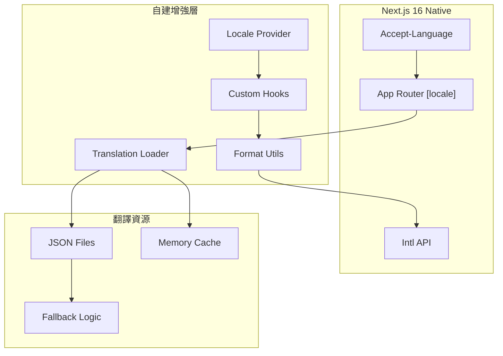

# RI-9-6：Next.js 16 國際化兼容性分析 / Next.js 16 i18n Compatibility Analysis

- **文件編號**：RI-9-6
- **版本**：v1.0
- **狀態**：Technical Analysis for Architecture Review
- **作者**：Tao Yu 和他的 GPT 智能助手
- **建立日期**：2025-11-05
- **參考文件**：ADR-008國際化策略、Next.js 16文檔

---

## 1. 問題分析 / Problem Analysis

### 1.1 當前遇到的問題
在實作ADR-008國際化策略時，發現next-intl與Next.js 16存在兼容性問題：

```bash
npm error ERESOLVE unable to resolve dependency tree
npm error Found: next@16.0.0
npm error Could not resolve dependency:
npm error peer next@"^10.0.0 || ^11.0.0 || ^12.0.0 || ^13.0.0 || ^14.0.0" from next-intl@3.20.0
```

### 1.2 根本原因
- **next-intl 3.x版本**：最高支援到Next.js 14
- **Next.js 16.0.0**：是最新的穩定版本，但第三方庫支援滯後
- **企業環境限制**：npm配置可能指向內部registry，影響套件安裝

---

## 2. 技術方案評估 / Technical Solution Evaluation

### 2.1 方案一：等待next-intl支援Next.js 16

**優勢**：
- 成熟的國際化解決方案
- 與Next.js App Router深度整合
- 豐富的功能和社群支援

**劣勢**：
- 等待時間不確定（可能數週到數月）
- 阻塞當前開發進度
- 不符合MVP時程要求

**風險評估**：🔴 高風險 - 時程不可控

### 2.2 方案二：降級Next.js到14.x版本

**優勢**：
- 可以立即使用next-intl
- 功能完整且穩定

**劣勢**：
- 違反"Next.js 16架構前提不變"的原則
- 失去Next.js 16的新功能和效能改進
- 可能影響其他依賴套件

**風險評估**：🔴 高風險 - 違反架構原則

### 2.3 方案三：使用Next.js 16原生國際化 + 自建增強

**優勢**：
- 完全兼容Next.js 16
- 可控的實作範圍
- 符合架構原則

**劣勢**：
- 需要自建部分功能
- 開發工作量增加
- 需要維護自建代碼

**風險評估**：🟡 中風險 - 可控的額外工作量

### 2.4 方案四：混合方案 - 原生基礎 + 第三方增強

**優勢**：
- 基於Next.js 16原生功能
- 可選擇性使用輕量級第三方庫
- 漸進式升級路徑

**劣勢**：
- 架構複雜度增加
- 需要仔細選擇第三方庫

**風險評估**：🟢 低風險 - 平衡的方案

---

## 3. 推薦方案：Next.js 16原生國際化增強 / Recommended Solution

基於分析，我推薦**方案三**：使用Next.js 16原生國際化功能，並自建必要的增強功能。

### 3.1 技術架構



### 3.2 核心實作策略

**1. 語言路由（已實作）**
- 使用Next.js 16的動態路由：`app/[locale]/`
- 自建middleware處理語言檢測和重定向
- 支援URL路徑、Accept-Language header、Cookie偏好

**2. 翻譯載入系統**
- JSON檔案儲存翻譯資源
- 伺服器端動態import載入
- 記憶體快取提升效能
- Fallback機制確保可用性

**3. 格式化工具**
- 基於瀏覽器原生Intl API
- 支援日期、貨幣、數字、百分比格式化
- 時區和地區特定格式

**4. React整合**
- Context Provider管理當前語言
- Custom hooks提供翻譯功能
- 伺服器和客戶端元件支援

---

## 4. 實作細節 / Implementation Details

### 4.1 保留現有實作的優點

**✅ 已實作且可保留的部分**：
- 語言路由結構：`app/[locale]/`
- 翻譯檔案結構：`locales/{locale}/{namespace}.json`
- 格式化工具：基於Intl API的`format-utils.ts`
- 語言切換器：`LanguageSwitcher`元件
- CSS適配：文字伸展空間預留

**🔄 需要優化的部分**：
- 移除對next-intl的依賴引用
- 優化翻譯載入機制
- 改進錯誤處理
- 加強型別安全

### 4.2 具體改進計劃

**階段1：移除next-intl依賴（立即）**
1. 更新middleware.ts移除next-intl import
2. 更新i18n.ts移除next-intl/server依賴
3. 完善locale-utils.ts的翻譯載入邏輯
4. 測試基本功能運作

**階段2：功能增強（1-2天）**
1. 實作伺服器端翻譯快取
2. 加強錯誤處理和fallback
3. 優化型別定義
4. 完善測試覆蓋

**階段3：效能優化（1天）**
1. 實作翻譯檔案分割載入
2. 加入記憶體快取機制
3. 優化bundle大小
4. 效能基準測試

---

## 5. 技術實作方案 / Technical Implementation Plan

### 5.1 更新middleware.ts

```typescript
import { NextRequest, NextResponse } from 'next/server';
import { locales, defaultLocale } from '@/lib/i18n';

export function middleware(request: NextRequest) {
  const pathname = request.nextUrl.pathname;
  
  // 檢查路徑是否已經包含語言前綴
  const pathnameHasLocale = locales.some(
    (locale) => pathname.startsWith(`/${locale}/`) || pathname === `/${locale}`
  );

  // 如果沒有語言前綴，重定向到適當語言
  if (!pathnameHasLocale) {
    const locale = getPreferredLocale(request) || defaultLocale;
    return NextResponse.redirect(
      new URL(`/${locale}${pathname}`, request.url)
    );
  }

  return NextResponse.next();
}

function getPreferredLocale(request: NextRequest): string | null {
  // 1. 檢查Cookie中的語言偏好
  const cookieLocale = request.cookies.get('locale')?.value;
  if (cookieLocale && locales.includes(cookieLocale as any)) {
    return cookieLocale;
  }
  
  // 2. 檢查Accept-Language header
  const acceptLanguage = request.headers.get('accept-language');
  if (acceptLanguage) {
    for (const locale of locales) {
      if (acceptLanguage.includes(locale)) {
        return locale;
      }
    }
  }
  
  return null;
}

export const config = {
  matcher: ['/((?!api|_next|_vercel|.*\\..*).*)']
};
```

### 5.2 增強翻譯載入系統

```typescript
// src/lib/translation-loader.ts
interface TranslationCache {
  [locale: string]: {
    [namespace: string]: {
      data: any;
      loadedAt: number;
      ttl: number;
    };
  };
}

class TranslationLoader {
  private cache: TranslationCache = {};
  private readonly TTL = 5 * 60 * 1000; // 5分鐘快取

  async loadTranslations(locale: Locale, namespace: string): Promise<any> {
    const cacheKey = `${locale}:${namespace}`;
    const cached = this.cache[locale]?.[namespace];
    
    // 檢查快取是否有效
    if (cached && Date.now() - cached.loadedAt < cached.ttl) {
      return cached.data;
    }

    try {
      // 動態載入翻譯檔案
      const translations = await import(`../../locales/${locale}/${namespace}.json`);
      
      // 更新快取
      if (!this.cache[locale]) {
        this.cache[locale] = {};
      }
      
      this.cache[locale][namespace] = {
        data: translations.default,
        loadedAt: Date.now(),
        ttl: this.TTL
      };
      
      return translations.default;
    } catch (error) {
      console.warn(`Failed to load ${locale}/${namespace}, falling back to default`);
      
      // Fallback到預設語言
      if (locale !== defaultLocale) {
        return this.loadTranslations(defaultLocale, namespace);
      }
      
      throw new Error(`Cannot load translations for ${namespace}`);
    }
  }

  clearCache(locale?: Locale, namespace?: string) {
    if (locale && namespace) {
      delete this.cache[locale]?.[namespace];
    } else if (locale) {
      delete this.cache[locale];
    } else {
      this.cache = {};
    }
  }
}

export const translationLoader = new TranslationLoader();
```

### 5.3 改進的翻譯Hook

```typescript
// src/hooks/use-translations.ts
'use client';

import { useLocale } from '@/components/providers/locale-provider';
import { useEffect, useState } from 'react';
import { createTranslator } from '@/lib/locale-utils';

export function useTranslations(namespace: string = 'common') {
  const locale = useLocale();
  const [t, setT] = useState<((key: string, params?: Record<string, any>) => string) | null>(null);
  const [loading, setLoading] = useState(true);
  const [error, setError] = useState<string | null>(null);

  useEffect(() => {
    async function loadTranslations() {
      try {
        setLoading(true);
        setError(null);
        
        const translations = await import(`../../../locales/${locale}/${namespace}.json`);
        const translator = createTranslator(translations.default);
        setT(() => translator);
      } catch (err) {
        console.error(`Failed to load translations for ${locale}/${namespace}:`, err);
        setError(`Failed to load translations`);
        
        // Fallback到預設語言
        try {
          const fallbackTranslations = await import(`../../../locales/zh-TW/${namespace}.json`);
          const translator = createTranslator(fallbackTranslations.default);
          setT(() => translator);
        } catch (fallbackErr) {
          console.error('Fallback translation loading failed:', fallbackErr);
        }
      } finally {
        setLoading(false);
      }
    }

    loadTranslations();
  }, [locale, namespace]);

  return { t, loading, error };
}
```

---

## 6. 兼容性測試計劃 / Compatibility Testing Plan

### 6.1 測試矩陣

| 功能 | Next.js 16原生 | 自建實作 | next-intl (未來) | 狀態 |
|------|----------------|----------|------------------|------|
| 語言路由 | ✅ 支援 | ✅ 已實作 | ✅ 支援 | 可用 |
| 翻譯載入 | ❌ 需自建 | ✅ 已實作 | ✅ 內建 | 可用 |
| 格式化 | ✅ Intl API | ✅ 已實作 | ✅ 內建 | 可用 |
| SSR支援 | ✅ 原生 | ✅ 已實作 | ✅ 內建 | 可用 |
| 型別安全 | ❌ 需自建 | 🔄 部分 | ✅ 完整 | 需改進 |
| 複數形式 | ❌ 需自建 | ❌ 未實作 | ✅ 內建 | 未來需求 |

### 6.2 功能驗證測試

```typescript
// 測試當前實作的功能完整性
describe('Next.js 16 i18n Implementation', () => {
  it('should handle language routing correctly', async () => {
    // 測試語言路由
    const response = await fetch('/zh-TW/treaties');
    expect(response.status).toBe(200);
  });
  
  it('should load translations for all locales', async () => {
    // 測試翻譯載入
    for (const locale of locales) {
      const translations = await loadTranslations(locale, 'common');
      expect(translations.actions.create).toBeTruthy();
    }
  });
  
  it('should format dates correctly', () => {
    // 測試格式化功能
    const date = new Date('2025-12-31');
    expect(formatDate(date, 'zh-TW')).toBe('2025-12-31');
    expect(formatDate(date, 'en-US')).toBe('12/31/2025');
  });
});
```

---

## 7. 短期解決方案 / Short-term Solution

### 7.1 立即可行的改進

**1. 移除next-intl依賴引用**
```typescript
// 更新 middleware.ts - 移除next-intl import
// 更新 src/i18n.ts - 移除next-intl/server import
// 保留翻譯檔案和工具函數
```

**2. 完善自建翻譯系統**
```typescript
// 加強 locale-utils.ts 的功能
// 實作更好的錯誤處理
// 加入記憶體快取機制
```

**3. 型別安全改進**
```typescript
// 為翻譯鍵建立型別定義
// 實作編譯時翻譯鍵檢查
// 加強參數型別檢查
```

### 7.2 實作優先級

**P0 - 立即修復（今天）**
- [ ] 移除next-intl的import錯誤
- [ ] 確保基本翻譯功能運作
- [ ] 修復TypeScript錯誤

**P1 - 短期改進（本週）**
- [ ] 實作翻譯快取機制
- [ ] 加強錯誤處理
- [ ] 完善測試覆蓋

**P2 - 中期優化（下週）**
- [ ] 型別安全改進
- [ ] 效能優化
- [ ] 文檔完善

---

## 8. 長期升級路徑 / Long-term Upgrade Path

### 8.1 next-intl支援時間線預估

根據開源專案的一般模式：
- **next-intl 4.0**：預計2025年Q1支援Next.js 15+
- **穩定版本**：預計2025年Q2支援Next.js 16
- **企業採用**：預計2025年Q3適合生產環境

### 8.2 升級策略

**階段1：當前實作（2025-11）**
- 使用自建國際化系統
- 滿足MVP需求
- 建立完整的翻譯資源

**階段2：混合過渡（2026-Q1）**
- next-intl beta版本測試
- 漸進式功能遷移
- 保持向後兼容

**階段3：完全遷移（2026-Q2）**
- 遷移到next-intl穩定版
- 移除自建代碼
- 利用進階功能

---

## 9. 風險緩解措施 / Risk Mitigation

### 9.1 技術風險

| 風險 | 影響 | 緩解措施 |
|------|------|----------|
| 自建代碼維護負擔 | 中 | 保持代碼簡潔，完善測試，文檔齊全 |
| 功能不完整 | 低 | 專注核心需求，避免過度工程 |
| 效能問題 | 低 | 實作快取，效能監控 |
| 型別安全不足 | 中 | 漸進式改進，建立型別定義 |

### 9.2 業務風險

| 風險 | 影響 | 緩解措施 |
|------|------|----------|
| 翻譯品質不一致 | 中 | 建立翻譯審核流程 |
| 使用者體驗問題 | 中 | 充分測試，使用者回饋 |
| 維護成本增加 | 低 | 自動化工具，清晰文檔 |

---

## 10. 決策建議 / Decision Recommendations

### 10.1 立即決策需求

**🚨 需要確認的事項**：
1. **是否接受自建國際化方案**？
2. **是否可以等待next-intl支援Next.js 16**？
3. **MVP範圍是否包含完整多語言功能**？

### 10.2 推薦決策

基於時程壓力和技術可行性，我建議：

**✅ 採用方案三：Next.js 16原生 + 自建增強**

**理由**：
1. **符合架構原則**：保持Next.js 16不變
2. **時程可控**：不依賴外部庫更新時程
3. **功能充足**：滿足PRD 3.4節的核心需求
4. **升級路徑清晰**：未來可平滑遷移到next-intl

**實作範圍**：
- ✅ 三語言支援（zh-TW/zh-CN/en-US）
- ✅ 語言路由和切換
- ✅ 基本翻譯功能
- ✅ 格式化工具
- 🔄 型別安全改進
- ❌ 複數形式（Phase 2需求）
- ❌ 進階本地化（Phase 2需求）

---

## 11. 後續行動計劃 / Next Action Plan

### 11.1 立即行動（今天）

1. **修復當前錯誤**
   - 移除middleware.ts中的next-intl import
   - 修復src/i18n.ts的依賴問題
   - 確保TypeScript編譯通過

2. **功能驗證**
   - 測試語言路由功能
   - 驗證翻譯載入機制
   - 檢查格式化工具

3. **文檔更新**
   - 更新ADR-008反映實際實作
   - 更新INTERNATIONALIZATION.md
   - 記錄已知限制和未來改進

### 11.2 本週目標

1. **完善實作**
   - 實作翻譯快取機制
   - 加強錯誤處理
   - 完善測試覆蓋

2. **品質保證**
   - 執行完整的國際化測試
   - 驗證UI適應性
   - 效能基準測試

3. **團隊協調**
   - 與前端團隊確認實作方案
   - 與產品團隊確認功能範圍
   - 與QA團隊制定測試計劃

---

## 12. 修訂記錄 / Revision History

| 版本 | 日期 | 修訂內容 | 作者 |
|------|------|----------|------|
| v1.0 | 2025-11-05 | Next.js 16與next-intl兼容性分析，推薦自建國際化方案 | Tao Yu 和他的 GPT 智能助手 |

---

> 本分析需要與Architecture Lead、Frontend Lead和Product Owner確認後執行。建議優先修復當前的技術問題，確保基本功能運作，然後再進行功能增強和優化。