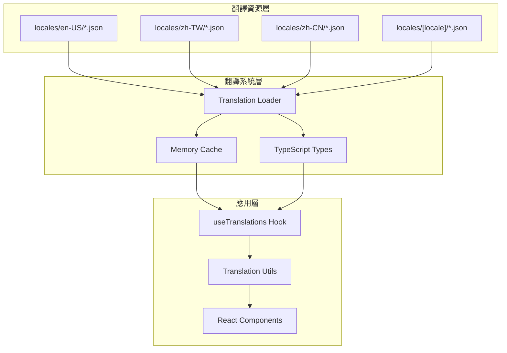

# RI-9-8：國際化重構計劃 / Internationalization Refactoring Plan

- **文件編號**：RI-9-8
- **版本**：v1.0
- **狀態**：Architecture Design Document
- **作者**：Tao Yu 和他的 GPT 智能助手
- **建立日期**：2025-11-05
- **參考文件**：ADR-008國際化策略、RI-9-6 Next.js 16兼容性分析

---

## 1. 問題識別 / Problem Identification

### 1.1 當前國際化方案的嚴重問題

**🔴 硬編碼語言判斷**：
```tsx
// ❌ 不可擴展的寫法
{locale === 'en-US' ? 'Operation Time' : locale === 'zh-CN' ? '操作时间' : '操作時間'}
```

**🔴 發現的問題範圍**：
經過全面代碼檢視，發現 **35個位置** 存在硬編碼語言判斷：

1. **審計歷史表格** (`audit-history-table.tsx`)：5個硬編碼
2. **首頁** (`[locale]/page.tsx`)：8個硬編碼  
3. **再保人詳情頁** (`reinsurers/[id]/page.tsx`)：15個硬編碼
4. **再保人編輯頁** (`reinsurers/[id]/edit/page.tsx`)：1個硬編碼
5. **再保人新增頁** (`reinsurers/new/page.tsx`)：1個硬編碼
6. **合約列表頁** (`treaties/page.tsx`)：2個硬編碼
7. **合約新增頁** (`treaties/new/page.tsx`)：1個硬編碼
8. **合約詳情頁** (`treaties/[treatyId]/page.tsx`)：7個硬編碼
9. **合約編輯頁** (`treaties/[treatyId]/edit/page.tsx`)：1個硬編碼

### 1.2 架構問題分析

**❌ 當前問題**：
- **不可擴展**：每增加一種語言需要修改所有組件
- **維護困難**：翻譯散佈在35個位置
- **型別不安全**：沒有編譯時翻譯鍵檢查
- **效能問題**：每次渲染都執行條件判斷
- **測試困難**：需要為每種語言組合寫測試

**✅ 現有優勢**：
- JSON翻譯檔案結構良好
- 已有 `useTranslations` Hook
- 支援參數替換和fallback機制

---

## 2. 可擴展國際化架構設計 / Scalable i18n Architecture

### 2.1 核心設計原則

1. **翻譯鍵驅動** (Translation Key Driven)
2. **組件語言無關** (Component Language Agnostic)  
3. **型別安全** (Type Safe)
4. **效能優化** (Performance Optimized)
5. **易於維護** (Maintainable)

### 2.2 架構圖



### 2.3 翻譯檔案結構重新設計

#### 新增專用翻譯命名空間：

**audit.json** - 審計相關翻譯
```json
{
  "table": {
    "headers": {
      "operationTime": "Operation Time",
      "operator": "Operator",
      "source": "Source", 
      "operationContent": "Operation Content",
      "action": "Action"
    },
    "actions": {
      "view": "View",
      "hide": "Hide"
    },
    "messages": {
      "noData": "No audit history available",
      "fieldChanges": "Field Changes",
      "noFieldChanges": "This operation did not modify any fields."
    },
    "fields": {
      "field": "Field",
      "oldValue": "Old Value", 
      "newValue": "New Value"
    }
  }
}
```

**business.json** - 業務邏輯翻譯
```json
{
  "reinsurer": {
    "summary": {
      "single": "{primaryName} ({percentage})",
      "multiple": "{primaryName} and {count} others"
    }
  },
  "address": {
    "registered": "Registered Address",
    "operating": "Operating Address",
    "street": "Street Address",
    "city": "City",
    "stateProvince": "State/Province",
    "postalCode": "Postal Code",
    "country": "Country"
  },
  "contact": {
    "title": "Contact {index}",
    "name": "Name",
    "phone": "Phone", 
    "fax": "Fax",
    "email": "Email",
    "noData": "No contact information"
  },
  "financial": {
    "title": "Financial & Settlement",
    "currency": "Currency",
    "billingType": "Billing Type",
    "paymentMethod": "Payment Method",
    "paymentCycle": "Payment Cycle",
    "bankName": "Bank Name",
    "bankAccount": "Bank Account",
    "capital": "Capital",
    "relatedParty": "Related Party",
    "yes": "Yes",
    "no": "No"
  }
}
```

**ui.json** - UI元素翻譯
```json
{
  "sections": {
    "basicInfo": "Basic Information",
    "addressInfo": "Address Information", 
    "contactInfo": "Contact Information",
    "financialInfo": "Financial & Settlement",
    "creditRating": "Credit & Risk Rating",
    "systemInfo": "System Information",
    "auditHistory": "Audit History",
    "attachmentsNotes": "Attachments & Notes",
    "reinsurerInfo": "Reinsurer Information"
  },
  "descriptions": {
    "reinsurerBasic": "Reinsurer identification information and status.",
    "reinsurerAddress": "Reinsurer's registered and operating addresses.",
    "reinsurerContact": "Reinsurer contact information.",
    "reinsurerFinancial": "Reinsurer's financial information and settlement methods.",
    "reinsurerCredit": "Reinsurer's credit rating information.",
    "treatyAuditHistory": "Complete operation history for this treaty. Click view to see field differences.",
    "reinsurerAuditHistory": "Complete operation history for this reinsurer. Click view to see field differences."
  }
}
```

---

## 3. 重構實施計劃 / Refactoring Implementation Plan

### 3.1 階段一：翻譯資源擴展 (Phase 1)

**目標**：建立完整的翻譯鍵體系

**任務**：
1. 創建新的翻譯命名空間檔案
2. 將所有硬編碼文字提取到翻譯檔案
3. 建立翻譯鍵的TypeScript型別定義

**預估時間**：1-2天

### 3.2 階段二：組件重構 (Phase 2)

**目標**：移除所有硬編碼語言判斷

**優先級排序**：
1. **P0 - 審計歷史表格**：影響所有詳情頁面
2. **P1 - 首頁**：用戶第一印象
3. **P2 - 再保人詳情頁**：最多硬編碼（15個）
4. **P3 - 合約相關頁面**：業務核心功能

**重構策略**：
```tsx
// ❌ 重構前
{locale === 'en-US' ? 'Operation Time' : locale === 'zh-CN' ? '操作时间' : '操作時間'}

// ✅ 重構後  
{t('audit.table.headers.operationTime')}
```

**預估時間**：2-3天

### 3.3 階段三：業務邏輯國際化 (Phase 3)

**目標**：重構複雜的業務邏輯翻譯

**範例**：
```tsx
// ❌ 重構前
const formatReinsurerSummary = (primaryName: string, count: number) => {
  if (locale === 'en-US') {
    return `${primaryName} and ${count - 1} others`;
  } else if (locale === 'zh-CN') {
    return `${primaryName} 等 ${count} 家`;
  } else {
    return `${primaryName} 等 ${count} 家`;
  }
};

// ✅ 重構後
const formatReinsurerSummary = (primaryName: string, count: number) => {
  if (count === 1) {
    return t('business.reinsurer.summary.single', { 
      primaryName, 
      percentage: formatPercentage(sharePercentage) 
    });
  }
  return t('business.reinsurer.summary.multiple', { 
    primaryName, 
    count: count - 1 
  });
};
```

**預估時間**：1-2天

---

## 4. 型別安全改進 / Type Safety Enhancement

### 4.1 翻譯鍵型別定義

```typescript
// src/types/i18n-keys.ts
export interface TranslationKeys {
  audit: {
    table: {
      headers: {
        operationTime: string;
        operator: string;
        source: string;
        operationContent: string;
        action: string;
      };
      actions: {
        view: string;
        hide: string;
      };
      messages: {
        noData: string;
        fieldChanges: string;
        noFieldChanges: string;
      };
    };
  };
  business: {
    reinsurer: {
      summary: {
        single: string;
        multiple: string;
      };
    };
  };
  ui: {
    sections: Record<string, string>;
    descriptions: Record<string, string>;
  };
}
```

### 4.2 增強的翻譯Hook

```typescript
// src/hooks/use-translations.ts (增強版)
export function useTranslations<T extends keyof TranslationKeys>(
  namespace: T
): {
  t: (key: string, params?: Record<string, any>) => string;
  loading: boolean;
  error: string | null;
} {
  // 實作邏輯...
}
```

---

## 5. 重構優先級與時程 / Refactoring Priority & Timeline

### 5.1 立即修復 (今天)

**P0 - 審計歷史表格**：
- 影響範圍：所有詳情頁面
- 修復方式：創建 `audit.json` 並重構組件
- 預估時間：2小時

### 5.2 本週完成 (本週)

**P1 - 首頁重構**：
- 影響範圍：用戶第一印象
- 修復方式：擴展 `common.json` 和 `ui.json`
- 預估時間：1天

**P2 - 再保人頁面**：
- 影響範圍：15個硬編碼位置
- 修復方式：創建 `business.json` 和 `reinsurer.json`
- 預估時間：1-2天

### 5.3 下週完成 (下週)

**P3 - 合約頁面**：
- 影響範圍：合約相關功能
- 修復方式：擴展 `treaty.json`
- 預估時間：1天

---

## 6. 翻譯檔案擴展計劃 / Translation Files Extension Plan

### 6.1 新增翻譯檔案

```
locales/
├── en-US/
│   ├── common.json (已存在，需擴展)
│   ├── treaty.json (已存在，需擴展)
│   ├── reinsurer.json (已存在，需擴展)
│   ├── audit.json (新增)
│   ├── business.json (新增)
│   └── ui.json (新增)
├── zh-TW/
│   └── (相同結構)
└── zh-CN/
    └── (相同結構)
```

### 6.2 翻譯鍵命名規範

**層級結構**：
- `namespace.category.subcategory.key`
- 最多4層深度
- 使用camelCase命名

**範例**：
```json
{
  "audit": {
    "table": {
      "headers": {
        "operationTime": "..."
      }
    }
  }
}
```

---

## 7. 效能優化策略 / Performance Optimization

### 7.1 翻譯載入優化

**當前問題**：
- 每個組件都可能載入翻譯
- 沒有預載入機制
- 缺乏智能快取

**解決方案**：
```typescript
// 預載入關鍵翻譯
export async function preloadCriticalTranslations(locale: Locale) {
  return Promise.all([
    translationLoader.loadTranslations(locale, 'common'),
    translationLoader.loadTranslations(locale, 'ui'),
    translationLoader.loadTranslations(locale, 'business')
  ]);
}
```

### 7.2 組件層級優化

**策略**：
- 在頁面層級載入所需翻譯
- 通過Context向下傳遞
- 避免重複載入

---

## 8. 測試策略 / Testing Strategy

### 8.1 翻譯完整性測試

```typescript
describe('Translation Completeness', () => {
  it('should have all required keys for all locales', () => {
    const requiredKeys = extractKeysFromComponents();
    for (const locale of locales) {
      for (const key of requiredKeys) {
        expect(getTranslation(locale, key)).toBeDefined();
      }
    }
  });
});
```

### 8.2 組件國際化測試

```typescript
describe('Component i18n', () => {
  it('should render correctly in all locales', () => {
    for (const locale of locales) {
      render(<AuditHistoryTable />, { locale });
      expect(screen.getByText(/operation time|操作时间|操作時間/i)).toBeInTheDocument();
    }
  });
});
```

---

## 9. 遷移策略 / Migration Strategy

### 9.1 漸進式重構

**原則**：
- 不破壞現有功能
- 逐步替換硬編碼
- 保持向後兼容

**步驟**：
1. 建立新翻譯檔案
2. 重構單一組件
3. 測試驗證
4. 逐步推廣

### 9.2 風險緩解

**風險**：翻譯遺漏導致顯示問題
**緩解**：
- 完善的fallback機制
- 自動化翻譯檢查
- 分階段部署

---

## 10. 長期維護策略 / Long-term Maintenance

### 10.1 翻譯管理工具

**建議工具**：
- 翻譯鍵提取腳本
- 翻譯完整性檢查
- 自動化翻譯更新

### 10.2 團隊協作流程

**流程**：
1. 開發者使用翻譯鍵
2. 翻譯團隊補充內容
3. 自動化檢查完整性
4. CI/CD整合驗證

---

## 11. 實施時程表 / Implementation Timeline

| 階段 | 任務 | 時間 | 負責人 |
|------|------|------|--------|
| Phase 1 | 翻譯資源擴展 | 1-2天 | 前端團隊 |
| Phase 2 | 組件重構 | 2-3天 | 前端團隊 |
| Phase 3 | 業務邏輯國際化 | 1-2天 | 前端團隊 |
| Phase 4 | 測試與驗證 | 1天 | QA團隊 |
| Phase 5 | 文檔更新 | 0.5天 | 技術寫作 |

**總預估時間**：5-8天

---

## 12. 成功指標 / Success Metrics

### 12.1 技術指標

- ✅ 零硬編碼語言判斷
- ✅ 100%翻譯鍵覆蓋
- ✅ 型別安全檢查通過
- ✅ 效能測試通過

### 12.2 業務指標

- ✅ 所有語言模式正確顯示
- ✅ 新增語言支援時間 < 1天
- ✅ 翻譯更新時間 < 1小時
- ✅ 零翻譯相關bug

---

## 13. 風險評估 / Risk Assessment

| 風險 | 影響 | 機率 | 緩解措施 |
|------|------|------|----------|
| 翻譯遺漏 | 中 | 中 | 自動化檢查、完善fallback |
| 效能影響 | 低 | 低 | 預載入、快取優化 |
| 開發時程延遲 | 中 | 中 | 分階段實施、並行開發 |
| 團隊學習成本 | 低 | 中 | 文檔完善、培訓支援 |

---

## 14. 後續行動 / Next Actions

### 14.1 立即行動 (今天)

1. **更新ADR-008**：反映新的國際化架構
2. **創建翻譯檔案**：audit.json, business.json, ui.json
3. **重構審計表格**：移除硬編碼判斷

### 14.2 本週目標

1. **完成P0-P2重構**：審計表格、首頁、再保人頁面
2. **建立型別定義**：翻譯鍵型別安全
3. **完善測試**：翻譯完整性和組件測試

### 14.3 品質保證

1. **代碼審查**：確保無硬編碼遺漏
2. **多語言測試**：驗證所有語言正確顯示
3. **效能測試**：確保翻譯載入效能

---

## 15. 修訂記錄 / Revision History

| 版本 | 日期 | 修訂內容 | 作者 |
|------|------|----------|------|
| v1.0 | 2025-11-05 | 國際化重構計劃，識別35個硬編碼問題並提出可擴展架構 | Tao Yu 和他的 GPT 智能助手 |

---

> 本文檔基於實際代碼分析，識別出系統性的國際化架構問題。建議立即開始重構，以避免技術債務持續累積。重構完成後，系統將能夠輕鬆支援任意數量的語言，大幅提升可維護性和擴展性。