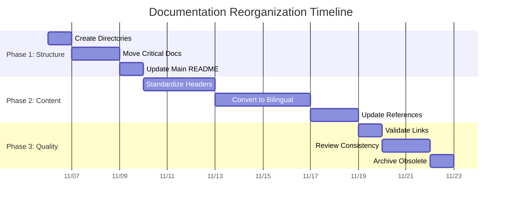
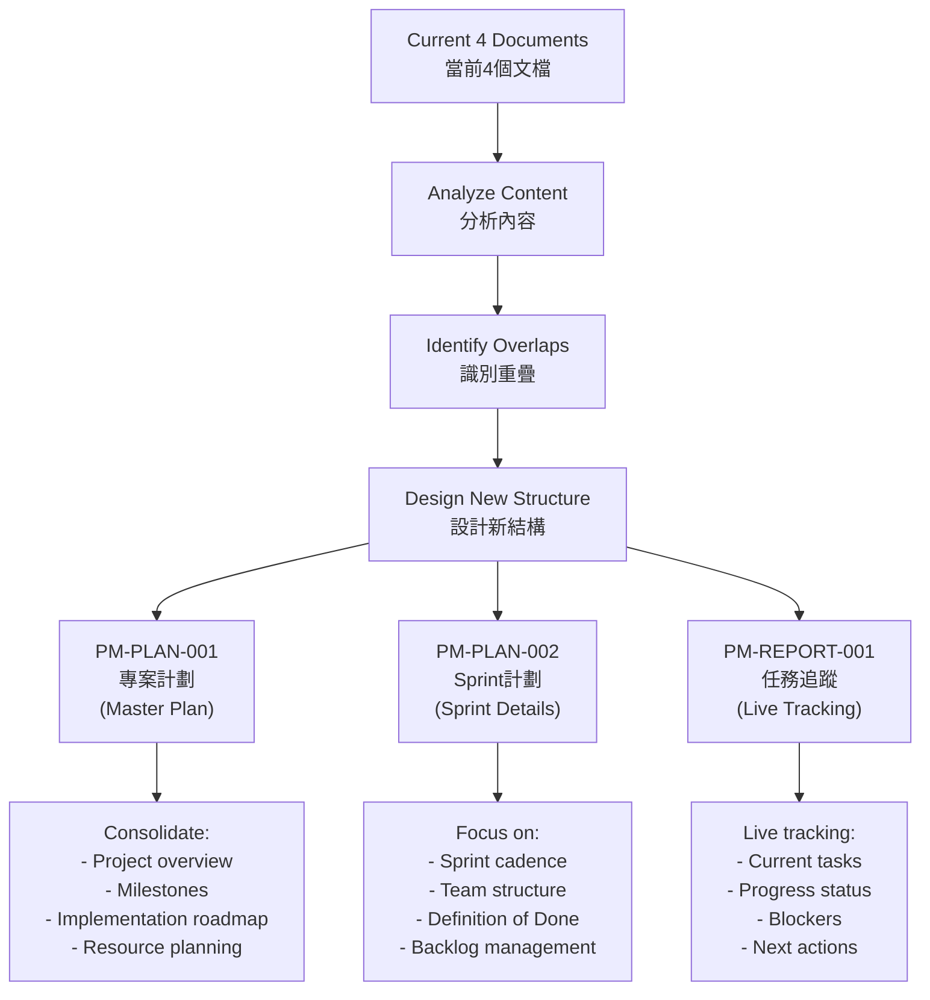

# DOC-PLAN-001: Documentation Reorganization Implementation Plan / 文檔重組實施計劃

## Document Information / 文檔資訊
- **Document ID / 文檔編號**: DOC-PLAN-001
- **Version / 版本**: v1.0
- **Status / 狀態**: Active
- **Author / 作者**: Tao Yu 和他的 GPT 智能助手
- **Created Date / 建立日期**: 2025-11-06
- **Last Updated / 最後更新**: 2025-11-06
- **Related Documents / 相關文檔**: [DOC-STD-001](./DOC-STD-001-文檔標準與結構規範.md), [DOC-TEMPLATE-001](./DOC-TEMPLATE-001-文檔模板標準.md)

---

## 1. Executive Summary / 執行摘要

This implementation plan details the systematic reorganization of all project documentation to follow the new DOC-STD-001 standards, including unified numbering, logical categorization, bilingual content, and consolidated project progress tracking.

本實施計劃詳細說明了所有專案文檔的系統性重組，以遵循新的 DOC-STD-001 標準，包括統一編號、邏輯分類、雙語內容和整合的專案進度追蹤。

---

## 2. Current State Analysis / 現狀分析

### 2.1 Document Inventory / 文檔清單

**Total Documents / 文檔總數**: 50+ markdown files
**Categories Identified / 識別的類別**:
- Project Management: 8 documents / 專案管理：8個文檔
- Architecture: 8 documents / 架構：8個文檔  
- Development: 6 documents / 開發：6個文檔
- Operations: 3 documents / 運維：3個文檔
- Quality: 2 documents / 品質：2個文檔
- Business: 15+ documents / 業務：15+個文檔
- Miscellaneous: 10+ documents / 其他：10+個文檔

### 2.2 Key Issues Identified / 識別的關鍵問題

1. **Inconsistent Numbering / 編號不一致**
   - RI-X-Y format (legacy project phases) / RI-X-Y 格式（舊專案階段）
   - RI-XXX-Y format (module-based) / RI-XXX-Y 格式（基於模組）
   - No numbering (newer documents) / 無編號（較新文檔）

2. **Scattered Organization / 分散組織**
   - 40+ files in root docs directory / 根 docs 目錄中有 40+ 檔案
   - No logical grouping / 無邏輯分組
   - Difficult navigation / 導航困難

3. **Content Duplication / 內容重複**
   - 4 documents tracking project progress / 4個文檔追蹤專案進度
   - Overlapping implementation details / 重疊的實施細節
   - Inconsistent information / 資訊不一致

4. **Language Inconsistency / 語言不一致**
   - Mix of Chinese-only and English-only documents / 中文和英文文檔混合
   - Inconsistent bilingual formatting / 雙語格式不一致

---

## 3. Implementation Strategy / 實施策略

### 3.1 Three-Phase Approach / 三階段方法



### 3.2 Priority Matrix / 優先級矩陣

| Priority / 優先級 | Documents / 文檔 | Rationale / 理由 |
|-------------------|------------------|------------------|
| 🔴 Critical / 關鍵 | Project progress documents / 專案進度文檔 | Daily usage, multiple overlaps / 日常使用，多重重疊 |
| 🟡 High / 高 | Architecture ADRs / 架構 ADR | Technical foundation / 技術基礎 |
| 🟡 High / 高 | Development guides / 開發指南 | Developer onboarding / 開發者入職 |
| 🟢 Medium / 中 | Operations guides / 運維指南 | Deployment and maintenance / 部署和維護 |
| 🟢 Medium / 中 | Business processes / 業務流程 | User documentation / 用戶文檔 |
| ⚪ Low / 低 | Historical documents / 歷史文檔 | Archive and reference / 歸檔和參考 |

---

## 4. Phase 1: Structure Creation / 階段1：結構創建

### 4.1 Directory Creation Plan / 目錄創建計劃

**New Directory Structure / 新目錄結構**:
```
docs/
├── 01-專案管理/          # Project Management
├── 02-架構設計/          # Architecture  
├── 03-開發指南/          # Development
├── 04-運維部署/          # Operations
├── 05-業務流程/          # Business Processes
├── 06-品質保證/          # Quality Assurance
├── 07-文檔管理/          # Documentation Management
├── 08-用戶界面/          # User Interface
└── 99-歷史歸檔/          # Historical Archive
```

### 4.2 Critical Document Moves / 關鍵文檔移動

**Immediate Actions / 立即行動**:

1. **Project Progress Consolidation / 專案進度整合**
   ```
   reinsurance-system-task-tracker.md → 01-專案管理/PM-REPORT-001-任務追蹤.md
   reinsurance-system-project-plan.md → 01-專案管理/PM-PLAN-001-專案計劃.md
   reinsurance-system-scrum-plan.md → 01-專案管理/PM-PLAN-002-Sprint計劃.md
   RI-9-1-implementation-roadmap.md → [MERGE INTO PM-PLAN-001]
   ```

2. **Architecture Documents / 架構文檔**
   ```
   architecture/ADR-*.md → 02-架構設計/ARCH-ADR-*-[中文標題].md
   ```

3. **Development Guides / 開發指南**
   ```
   RI-8-1-developer-handbook.md → 03-開發指南/DEV-GUIDE-001-開發人員手冊.md
   environment-setup-guide.md → 03-開發指南/DEV-GUIDE-002-環境設置指南.md
   environment-quick-start.md → 03-開發指南/DEV-GUIDE-003-環境快速開始.md
   ```

---

## 5. Phase 2: Content Standardization / 階段2：內容標準化

### 5.1 Header Standardization / 標頭標準化

**Template Application / 模板應用**:
- Apply DOC-TEMPLATE-001 standard header / 應用 DOC-TEMPLATE-001 標準標頭
- Add document metadata / 添加文檔元數據
- Include revision history / 包含修訂記錄

### 5.2 Bilingual Conversion / 雙語轉換

**Conversion Strategy / 轉換策略**:
1. **Technical Documents / 技術文檔**: English primary, Chinese translation / 英文為主，中文翻譯
2. **Business Documents / 業務文檔**: Chinese primary, English translation / 中文為主，英文翻譯
3. **Mixed Documents / 混合文檔**: Maintain both languages equally / 平等維護兩種語言

### 5.3 Content Consolidation / 內容整合

**Project Progress Documents / 專案進度文檔**:
- Merge overlapping content from 4 documents into 3 / 將4個文檔的重疊內容合併為3個
- Establish single source of truth for each aspect / 為每個方面建立單一真實來源
- Cross-reference between related documents / 相關文檔間交叉引用

---

## 6. Phase 3: Quality Assurance / 階段3：品質保證

### 6.1 Link Validation / 連結驗證

**Process / 流程**:
1. Identify all internal references / 識別所有內部引用
2. Update paths to new structure / 更新路徑到新結構
3. Test all links functionality / 測試所有連結功能
4. Fix broken references / 修復斷開的引用

### 6.2 Content Review / 內容審查

**Review Criteria / 審查標準**:
- Accuracy and currency / 準確性和時效性
- Bilingual consistency / 雙語一致性
- Template compliance / 模板合規性
- Terminology consistency / 術語一致性

---

## 7. Detailed Migration Plan / 詳細遷移計劃

### 7.1 Project Management Documents / 專案管理文檔

| Current File / 當前檔案 | New File / 新檔案 | Action / 行動 | Priority / 優先級 |
|-------------------------|-------------------|---------------|-------------------|
| `reinsurance-system-task-tracker.md` | `01-專案管理/PM-REPORT-001-任務追蹤.md` | Move + enhance / 移動+增強 | 🔴 Critical |
| `reinsurance-system-project-plan.md` | `01-專案管理/PM-PLAN-001-專案計劃.md` | Consolidate + standardize / 整合+標準化 | 🔴 Critical |
| `reinsurance-system-scrum-plan.md` | `01-專案管理/PM-PLAN-002-Sprint計劃.md` | Move + simplify / 移動+簡化 | 🔴 Critical |
| `RI-1-3-project-charter.md` | `01-專案管理/PM-CHARTER-001-專案章程.md` | Move + standardize / 移動+標準化 | 🟡 High |
| `RI-9-1-implementation-roadmap.md` | **Merge into PM-PLAN-001** | Consolidate content / 整合內容 | 🔴 Critical |

### 7.2 Architecture Documents / 架構文檔

| Current File / 當前檔案 | New File / 新檔案 | Action / 行動 | Priority / 優先級 |
|-------------------------|-------------------|---------------|-------------------|
| `architecture/ADR-001-layered-architecture.md` | `02-架構設計/ARCH-ADR-001-分層架構.md` | Move + bilingual / 移動+雙語 | 🟡 High |
| `architecture/ADR-002-database-strategy.md` | `02-架構設計/ARCH-ADR-002-資料庫策略.md` | Move + bilingual / 移動+雙語 | 🟡 High |
| `architecture/ADR-003-react-query-strategy.md` | `02-架構設計/ARCH-ADR-003-React查詢策略.md` | Move + bilingual / 移動+雙語 | 🟡 High |
| `architecture/ADR-004-testing-strategy.md` | `02-架構設計/ARCH-ADR-004-測試策略.md` | Move + bilingual / 移動+雙語 | 🟡 High |
| `architecture/ADR-005-audit-trail.md` | `02-架構設計/ARCH-ADR-005-稽核軌跡.md` | Move + bilingual / 移動+雙語 | 🟡 High |
| `architecture/ADR-006-git-branching-strategy.md` | `02-架構設計/ARCH-ADR-006-Git分支策略.md` | Move + bilingual / 移動+雙語 | 🟡 High |
| `architecture/ADR-007-module-architecture-pattern.md` | `02-架構設計/ARCH-ADR-007-模組架構模式.md` | Move + bilingual / 移動+雙語 | 🟡 High |
| `architecture/ADR-008-internationalization-strategy.md` | `02-架構設計/ARCH-ADR-008-國際化策略.md` | Move + bilingual / 移動+雙語 | 🟡 High |

### 7.3 Development Documents / 開發文檔

| Current File / 當前檔案 | New File / 新檔案 | Action / 行動 | Priority / 優先級 |
|-------------------------|-------------------|---------------|-------------------|
| `RI-8-1-developer-handbook.md` | `03-開發指南/DEV-GUIDE-001-開發人員手冊.md` | Move + enhance / 移動+增強 | 🟡 High |
| `environment-setup-guide.md` | `03-開發指南/DEV-GUIDE-002-環境設置指南.md` | Move + bilingual / 移動+雙語 | 🟡 High |
| `environment-quick-start.md` | `03-開發指南/DEV-GUIDE-003-環境快速開始.md` | Move + bilingual / 移動+雙語 | 🟡 High |
| `ri-app-development-guide.md` | `03-開發指南/DEV-GUIDE-004-應用開發指南.md` | Move + enhance / 移動+增強 | 🟡 High |
| `internationalization-implementation-guide.md` | `03-開發指南/DEV-GUIDE-005-國際化實施指南.md` | Move + enhance / 移動+增強 | 🟡 High |

### 7.4 Operations Documents / 運維文檔

| Current File / 當前檔案 | New File / 新檔案 | Action / 行動 | Priority / 優先級 |
|-------------------------|-------------------|---------------|-------------------|
| `vercel-deployment-guide.md` | `04-運維部署/OPS-DEPLOY-001-Vercel部署指南.md` | Move + enhance / 移動+增強 | 🟢 Medium |
| `vercel-deployment.md` | `04-運維部署/OPS-DEPLOY-002-Vercel部署配置.md` | Move + standardize / 移動+標準化 | 🟢 Medium |
| `git-branching-strategy.md` | `04-運維部署/OPS-PROCESS-001-Git分支流程.md` | Move + standardize / 移動+標準化 | 🟢 Medium |

### 7.5 Quality Documents / 品質文檔

| Current File / 當前檔案 | New File / 新檔案 | Action / 行動 | Priority / 優先級 |
|-------------------------|-------------------|---------------|-------------------|
| `environment-checklist.md` | `06-品質保證/QA-CHECKLIST-001-環境檢查清單.md` | Move + standardize / 移動+標準化 | 🟢 Medium |
| `RI-FAC-1-implementation-summary.md` | `06-品質保證/QA-REPORT-001-臨分實施總結.md` | Move + enhance / 移動+增強 | 🟢 Medium |

### 7.6 UI/UX Documents / 用戶界面文檔

| Current File / 當前檔案 | New File / 新檔案 | Action / 行動 | Priority / 優先級 |
|-------------------------|-------------------|---------------|-------------------|
| `uiux/uiux-guidelines.md` | `08-用戶界面/UI-GUIDE-001-界面設計指南.md` | Move + enhance / 移動+增強 | 🟢 Medium |

---

## 8. Content Consolidation Strategy / 內容整合策略

### 8.1 Project Progress Documents Consolidation / 專案進度文檔整合

**Current Overlapping Documents / 當前重疊文檔**:
1. `reinsurance-system-task-tracker.md` - Task tracking / 任務追蹤
2. `reinsurance-system-project-plan.md` - Project planning / 專案規劃
3. `reinsurance-system-scrum-plan.md` - Sprint planning / Sprint 規劃
4. `RI-9-1-implementation-roadmap.md` - Implementation details / 實施細節

**Consolidation Plan / 整合計劃**:



### 8.2 Content Distribution / 內容分配

**PM-PLAN-001 (Master Project Plan) / PM-PLAN-001（主專案計劃）**:
- Project overview and objectives / 專案概覽和目標
- Milestone roadmap / 里程碑路線圖
- Implementation strategy / 實施策略
- Resource requirements / 資源需求
- Risk management / 風險管理
- Success metrics / 成功指標

**PM-PLAN-002 (Sprint Plan) / PM-PLAN-002（Sprint 計劃）**:
- Sprint cadence and ceremonies / Sprint 節奏和儀式
- Team structure and roles / 團隊結構和角色
- Definition of Ready/Done / 就緒/完成定義
- Backlog management process / Backlog 管理流程

**PM-REPORT-001 (Task Tracker) / PM-REPORT-001（任務追蹤）**:
- Current sprint status / 當前 Sprint 狀態
- Task progress tracking / 任務進度追蹤
- Blockers and issues / 阻礙和問題
- Next actions / 下一步行動

---

## 9. Reference Update Plan / 引用更新計劃

### 9.1 Internal Reference Mapping / 內部引用映射

**High-Impact References / 高影響引用**:
- Task tracker references in multiple documents / 任務追蹤器在多個文檔中的引用
- ADR references in development guides / 開發指南中的 ADR 引用
- Cross-references between project documents / 專案文檔間的交叉引用

### 9.2 External Reference Strategy / 外部引用策略

**Requirement Directory References / requirement 目錄引用**:
- Maintain `../requirement/` relative path format / 維護 `../requirement/` 相對路徑格式
- Update documentation to clarify requirement vs. documentation separation / 更新文檔以澄清需求與文檔的分離
- Add clear navigation between docs and requirements / 在文檔和需求間添加清晰導航

---

## 10. Implementation Timeline / 實施時間表

### 10.1 Week 1: Critical Structure / 第1週：關鍵結構

**Day 1-2: Directory Setup / 第1-2天：目錄設置**
- [ ] Create new directory structure / 創建新目錄結構
- [ ] Move critical project progress documents / 移動關鍵專案進度文檔
- [ ] Consolidate overlapping content / 整合重疊內容

**Day 3-4: Architecture Migration / 第3-4天：架構遷移**
- [ ] Move all ADR documents / 移動所有 ADR 文檔
- [ ] Standardize ADR headers / 標準化 ADR 標頭
- [ ] Update architecture references / 更新架構引用

**Day 5: Development Guides / 第5天：開發指南**
- [ ] Move development documents / 移動開發文檔
- [ ] Update developer handbook / 更新開發人員手冊
- [ ] Consolidate environment guides / 整合環境指南

### 10.2 Week 2: Content Enhancement / 第2週：內容增強

**Day 1-3: Bilingual Conversion / 第1-3天：雙語轉換**
- [ ] Convert high-priority documents to bilingual / 將高優先級文檔轉換為雙語
- [ ] Standardize terminology / 標準化術語
- [ ] Review translation quality / 審查翻譯品質

**Day 4-5: Reference Updates / 第4-5天：引用更新**
- [ ] Update all internal references / 更新所有內部引用
- [ ] Fix external references / 修復外部引用
- [ ] Validate link functionality / 驗證連結功能

### 10.3 Week 3: Final Quality / 第3週：最終品質

**Day 1-2: Validation / 第1-2天：驗證**
- [ ] Comprehensive link testing / 全面連結測試
- [ ] Content consistency review / 內容一致性審查
- [ ] Template compliance check / 模板合規檢查

**Day 3: Archive and Cleanup / 第3天：歸檔和清理**
- [ ] Archive obsolete documents / 歸檔過時文檔
- [ ] Remove duplicate content / 移除重複內容
- [ ] Final structure validation / 最終結構驗證

---

## 11. Success Criteria / 成功標準

### 11.1 Structural Success / 結構成功

- [ ] All documents follow DOC-STD-001 naming convention / 所有文檔遵循 DOC-STD-001 命名約定
- [ ] Logical directory organization with numbered categories / 邏輯目錄組織，帶編號類別
- [ ] No content duplication / 無內容重複
- [ ] Clear document hierarchy / 清晰的文檔層次結構

### 11.2 Content Success / 內容成功

- [ ] 100% bilingual content for all documents / 所有文檔100%雙語內容
- [ ] Standard headers and metadata / 標準標頭和元數據
- [ ] Functional internal references / 有效的內部引用
- [ ] Consistent terminology across documents / 文檔間術語一致

### 11.3 Usability Success / 可用性成功

- [ ] Easy navigation and discovery / 易於導航和發現
- [ ] Clear document purpose and scope / 清晰的文檔目的和範圍
- [ ] Reduced time to find information / 減少查找資訊的時間
- [ ] Improved developer onboarding experience / 改善開發者入職體驗

---

## 12. Risk Management / 風險管理

### 12.1 Implementation Risks / 實施風險

| Risk / 風險 | Impact / 影響 | Probability / 機率 | Mitigation / 緩解 |
|-------------|---------------|-------------------|------------------|
| Broken references during migration / 遷移期間引用斷開 | High / 高 | Medium / 中 | Systematic reference mapping / 系統性引用映射 |
| Content loss during consolidation / 整合期間內容丟失 | High / 高 | Low / 低 | Backup before changes / 變更前備份 |
| Team confusion during transition / 轉換期間團隊混亂 | Medium / 中 | High / 高 | Clear communication plan / 清晰溝通計劃 |
| Translation quality issues / 翻譯品質問題 | Medium / 中 | Medium / 中 | Native speaker review / 母語者審查 |

### 12.2 Mitigation Strategies / 緩解策略

1. **Backup Strategy / 備份策略**: Git branch for rollback / Git 分支用於回滾
2. **Incremental Migration / 增量遷移**: Phase-by-phase implementation / 分階段實施
3. **Validation Process / 驗證流程**: Systematic testing at each phase / 每個階段系統性測試
4. **Communication Plan / 溝通計劃**: Regular updates to team / 定期向團隊更新

---

## 13. Post-Implementation Maintenance / 實施後維護

### 13.1 Ongoing Responsibilities / 持續責任

| Role / 角色 | Responsibilities / 責任 |
|-------------|------------------------|
| Documentation Team / 文檔團隊 | Maintain standards, review new documents / 維護標準，審查新文檔 |
| Project Manager / 專案經理 | Update project progress documents / 更新專案進度文檔 |
| Developers / 開發者 | Follow standards for new documentation / 遵循新文檔標準 |
| Architects / 架構師 | Maintain ADR documents / 維護 ADR 文檔 |

### 13.2 Review Schedule / 審查計劃

- **Weekly / 每週**: Check for new documents compliance / 檢查新文檔合規性
- **Monthly / 每月**: Review document accuracy and currency / 審查文檔準確性和時效性
- **Quarterly / 每季**: Comprehensive structure and standards review / 全面結構和標準審查

---

## 14. Communication Plan / 溝通計劃

### 14.1 Stakeholder Notification / 利益相關者通知

**Before Implementation / 實施前**:
- [ ] Notify all team members of upcoming changes / 通知所有團隊成員即將到來的變更
- [ ] Share new standards and structure / 分享新標準和結構
- [ ] Provide training on new conventions / 提供新約定的培訓

**During Implementation / 實施期間**:
- [ ] Daily updates on migration progress / 遷移進度的每日更新
- [ ] Immediate notification of broken links / 斷開連結的即時通知
- [ ] Support for questions and issues / 問題和疑問的支援

**After Implementation / 實施後**:
- [ ] Final structure announcement / 最終結構公告
- [ ] Updated navigation guide / 更新的導航指南
- [ ] Feedback collection and improvements / 反饋收集和改進

---

## 15. Next Actions / 下一步行動

### 15.1 Immediate Actions (Today) / 立即行動（今天）

1. **Create Directory Structure / 創建目錄結構**
   - Create all numbered category directories / 創建所有編號類別目錄
   - Set up proper permissions / 設置適當權限

2. **Start Critical Document Migration / 開始關鍵文檔遷移**
   - Begin with project progress documents / 從專案進度文檔開始
   - Focus on task tracker consolidation / 專注於任務追蹤器整合

### 15.2 This Week Actions / 本週行動

1. **Complete Phase 1 / 完成階段1**
   - Migrate all critical documents / 遷移所有關鍵文檔
   - Establish new structure / 建立新結構
   - Update main navigation / 更新主導航

2. **Begin Phase 2 / 開始階段2**
   - Start content standardization / 開始內容標準化
   - Begin bilingual conversion / 開始雙語轉換

---

## Revision History / 修訂記錄

| Version / 版本 | Date / 日期 | Changes / 變更內容 | Author / 作者 |
|----------------|-------------|-------------------|---------------|
| v1.0 | 2025-11-06 | Initial implementation plan with detailed migration strategy and timeline / 初版實施計劃，包含詳細遷移策略和時間表 | Tao Yu 和他的 GPT 智能助手 |

---

> **Maintenance / 維護**: Documentation Team / 文檔團隊  
> **Review Cycle / 審查週期**: Weekly during implementation, Monthly after / 實施期間每週，實施後每月  
> **Next Review / 下次審查**: 2025-11-13