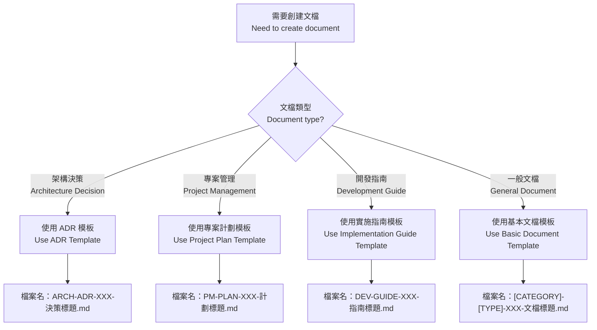

# DOC-TEMPLATE-001: Document Template Standard / 文檔模板標準

## Document Information / 文檔資訊
- **Document ID / 文檔編號**: DOC-TEMPLATE-001
- **Version / 版本**: v1.0
- **Status / 狀態**: Draft for Review
- **Author / 作者**: Tao Yu 和他的 GPT 智能助手
- **Created Date / 建立日期**: 2025-11-06
- **Last Updated / 最後更新**: 2025-11-06
- **Related Documents / 相關文檔**: [DOC-STD-001](./DOC-STD-001-文檔標準與結構規範.md)

---

## 1. Executive Summary / 執行摘要

This document provides standardized templates for all project documentation to ensure consistency, quality, and maintainability across the reinsurance system project.

本文檔為所有專案文檔提供標準化模板，以確保再保險系統專案的一致性、品質和可維護性。

---

## 2. Standard Document Template / 標準文檔模板

### 2.1 Basic Document Template / 基本文檔模板

```markdown
# [CATEGORY]-[TYPE]-[NUMBER]: [Document Title] / [文檔標題]

## Document Information / 文檔資訊
- **Document ID / 文檔編號**: [CATEGORY]-[TYPE]-[NUMBER]
- **Version / 版本**: v[X.Y]
- **Status / 狀態**: [Draft/Review/Approved/Archived]
- **Author / 作者**: [Author Name]
- **Created Date / 建立日期**: YYYY-MM-DD
- **Last Updated / 最後更新**: YYYY-MM-DD
- **Related Documents / 相關文檔**: [Links to related documents]

---

## 1. Executive Summary / 執行摘要

[Brief overview of the document purpose and key points in both languages]
[文檔目的和要點的簡要概述，使用雙語]

---

## 2. [Main Content Section 1] / [主要內容章節1]

[Content organized in logical sections with bilingual headers]
[內容按邏輯章節組織，使用雙語標頭]

### 2.1 [Subsection] / [子章節]

[Detailed content with examples, diagrams, or code blocks as needed]
[詳細內容，根據需要包含範例、圖表或代碼塊]

---

## 3. [Main Content Section 2] / [主要內容章節2]

[Continue with additional sections as needed]
[根據需要繼續添加其他章節]

---

## Revision History / 修訂記錄

| Version / 版本 | Date / 日期 | Changes / 變更內容 | Author / 作者 |
|----------------|-------------|-------------------|---------------|
| v1.0 | YYYY-MM-DD | Initial version / 初版 | [Author Name] |

---

> **Maintenance / 維護**: [Responsible person or team]  
> **Review Cycle / 審查週期**: [Monthly/Quarterly/Annually]  
> **Next Review / 下次審查**: YYYY-MM-DD
```

---

## 3. Architecture Decision Record Template / 架構決策記錄模板

### 3.1 ADR Template / ADR 模板

```markdown
# ARCH-ADR-[NUMBER]: [Decision Title] / [決策標題]

## Document Information / 文檔資訊
- **Document ID / 文檔編號**: ARCH-ADR-[NUMBER]
- **Version / 版本**: v1.0
- **Status / 狀態**: [Proposed/Accepted/Deprecated/Superseded]
- **Date / 日期**: YYYY-MM-DD
- **Decision Makers / 決策者**: [Names and roles]
- **Stakeholders / 利益相關者**: [Affected parties]

---

## 1. Context / 背景

[Describe the architectural issue or problem that needs to be addressed]
[描述需要解決的架構問題或挑戰]

### 1.1 Problem Statement / 問題陳述
[Clear statement of the problem]
[問題的清晰陳述]

### 1.2 Requirements / 需求
[Key requirements and constraints]
[關鍵需求和約束條件]

---

## 2. Decision / 決策

[Describe the architectural decision that was made]
[描述所做的架構決策]

### 2.1 Chosen Solution / 選擇的解決方案
[Detailed description of the solution]
[解決方案的詳細描述]

### 2.2 Implementation Guidelines / 實施指南
[How to implement this decision]
[如何實施此決策]

---

## 3. Rationale / 理由

[Explain the reasoning behind the decision]
[解釋決策背後的理由]

### 3.1 Benefits / 好處
[Positive aspects of this decision]
[此決策的積極方面]

### 3.2 Trade-offs / 權衡
[What we're giving up or compromising]
[我們放棄或妥協的內容]

---

## 4. Consequences / 後果

### 4.1 Positive Consequences / 積極後果
[Benefits and improvements]
[好處和改進]

### 4.2 Negative Consequences / 消極後果
[Risks and limitations]
[風險和限制]

---

## 5. Alternatives Considered / 考慮的替代方案

### 5.1 Alternative 1 / 替代方案1
[Description and why it was rejected]
[描述和拒絕原因]

---

## 6. Compliance and Validation / 合規性和驗證

### 6.1 Compliance Checklist / 合規檢查清單
- [ ] Follows established patterns / 遵循既定模式
- [ ] Documented in code / 在代碼中記錄
- [ ] Tested and validated / 已測試和驗證
- [ ] Team training completed / 團隊培訓完成

---

## Revision History / 修訂記錄

| Version / 版本 | Date / 日期 | Changes / 變更內容 | Author / 作者 |
|----------------|-------------|-------------------|---------------|
| v1.0 | YYYY-MM-DD | Initial ADR / 初版 ADR | [Author Name] |
```

---

## 4. File Naming Convention / 檔案命名約定

### 4.1 Standard Format / 標準格式

```
[CATEGORY]-[TYPE]-[NUMBER]-[中文標題].md
```

### 4.2 Examples / 範例

- `PM-PLAN-001-專案計劃.md`
- `ARCH-ADR-001-分層架構.md`
- `DEV-GUIDE-001-開發人員手冊.md`
- `OPS-DEPLOY-001-Vercel部署指南.md`
- `DOC-STD-001-文檔標準與結構規範.md`

### 4.3 Naming Rules / 命名規則

1. **Category and Type in English / 類別和類型使用英文**: For consistency in sorting / 為了排序一致性
2. **Chinese title / 中文標題**: For better readability / 為了更好的可讀性
3. **No spaces in filename / 檔案名無空格**: Use hyphens instead / 使用連字號代替
4. **Sequential numbering / 順序編號**: Within each category-type combination / 在每個類別-類型組合內

---

## 5. Template Selection Guide / 模板選擇指南

### 5.1 Decision Tree / 決策樹



### 5.2 Template Mapping / 模板映射

| Document Purpose / 文檔目的 | Template / 模板 | File Naming / 檔案命名 |
|------------------------------|-----------------|------------------------|
| Architecture decisions / 架構決策 | ADR Template | ARCH-ADR-XXX-決策標題.md |
| Project planning / 專案規劃 | Project Plan Template | PM-PLAN-XXX-計劃標題.md |
| Development guides / 開發指南 | Implementation Guide | DEV-GUIDE-XXX-指南標題.md |
| Operational procedures / 運維程序 | Basic Document | OPS-GUIDE-XXX-程序標題.md |
| Business processes / 業務流程 | Basic Document | BIZ-PROCESS-XXX-流程標題.md |
| Quality standards / 品質標準 | Basic Document | QA-STD-XXX-標準標題.md |

---

## 6. Implementation Checklist / 實施檢查清單

### 6.1 Before Creating New Document / 創建新文檔前
- [ ] Determine appropriate category and type / 確定適當的類別和類型
- [ ] Check if similar document already exists / 檢查是否已存在類似文檔
- [ ] Select appropriate template / 選擇適當的模板
- [ ] Assign sequential number / 分配順序編號

### 6.2 During Document Creation / 文檔創建期間
- [ ] Use standard header format / 使用標準標頭格式
- [ ] Include all required metadata / 包含所有必需的元數據
- [ ] Write content in bilingual format / 以雙語格式撰寫內容
- [ ] Add relevant examples and diagrams / 添加相關範例和圖表

### 6.3 After Document Creation / 文檔創建後
- [ ] Review content for accuracy / 審查內容準確性
- [ ] Validate all links and references / 驗證所有連結和引用
- [ ] Update related documents / 更新相關文檔
- [ ] Notify relevant stakeholders / 通知相關利益相關者

---

## Revision History / 修訂記錄

| Version / 版本 | Date / 日期 | Changes / 變更內容 | Author / 作者 |
|----------------|-------------|-------------------|---------------|
| v1.0 | 2025-11-06 | Initial template standard with Chinese filename convention / 初版模板標準，採用中文檔案名約定 | Tao Yu 和他的 GPT 智能助手 |

---

> **Maintenance / 維護**: Documentation Team / 文檔團隊  
> **Review Cycle / 審查週期**: Quarterly / 每季度  
> **Next Review / 下次審查**: 2026-02-06