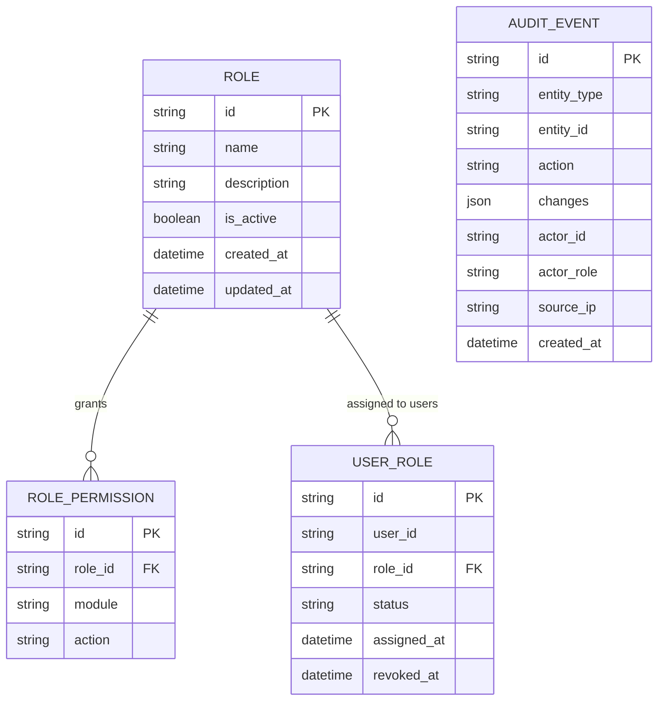

# 再保系統 FRD – Access Control & Audit Trail  
# Reinsurance System FRD – Access Control & Audit Trail

---

## 🏷️ Title Block
| 欄位 | 說明 |
|---|---|
| 文件名稱 | 再保系統功能需求文件 – 權限與稽核模組 |
| 版本 | v1.0 |
| 文件狀態 | Draft |
| 作者 | Tao Yu 和他的 GPT 智能助手 |
| 修訂日期 | 2025-11-03 |
| 參考 PRD | `EIS-REINS-PRD-001.md`（UC-11 權限與稽核） |

---

## 1. 功能概述
權限與稽核模組提供 Role-Based Access Control（RBAC）、職責分離與操作稽核記錄，確保系統符合臺灣 FSC、SOX、GDPR 等監理與合規要求。

---

## 2. 角色與權限
| 角色 | 職責 | 權限摘要 |
|---|---|---|
| 系統管理員 System Admin | 建立角色、設定權限、管理使用者帳號。 | 角色/權限管理、啟用/停用帳號。 |
| 安全審計員 Security Auditor | 檢視稽核紀錄、輸出報表。 | Read-only 稽核查詢、匯出。 |
| 模組管理者 Module Owner | 管理特定模組（合約、臨分等）的權限配置。 | 查看權限配置、提出調整申請。 |
| 一般使用者 End User | 依角色取得功能存取權。 | 依職務權限操作。 |

---

## 3. 前置條件
- 使用者帳號需透過身份驗證系統（SSO / AD）建立。  
- 角色與權限矩陣由資安與業務單位定義。  
- 稽核資料存放須滿足公司保留政策（7 年）。

---

## 4. 功能需求
| 編號 | 功能 | 描述 | 來源 |
|---|---|---|---|
| FRD-AA-01 | 角色管理 | 建立/修改角色、設定模組與操作權限，支援職責分離規則。 | PRD UC-11 |
| FRD-AA-02 | 使用者授權 | 將角色指派給使用者；敏感模組需雙人核准（選配）。 | PRD UC-11 |
| FRD-AA-03 | 權限稽核 | 查詢角色/使用者權限、變更歷史。 | PRD UC-11 |
| FRD-AA-04 | 操作稽核 | 所有資料異動、審核、匯出等動作寫入 AuditEvent。 | PRD UC-11 |
| FRD-AA-05 | 稽核報表 | 生成 CSV/PDF，供內控、稽核單位使用。 | PRD UC-11 |
| FRD-AA-06 | 通知 | 超權、連續登入失敗、黑名單操作等觸發通知。 | PRD UC-11 業務規則 |

---

## 5. 介面需求摘要
- **角色管理頁**：列出角色、描述、授權模組、最後更新人/時間；提供新增、編輯、停用。  
- **使用者授權頁**：顯示使用者與其角色；支援申請流程（送審/核准）。  
- **稽核查詢頁**：提供條件（日期、模組、操作者、動作類型、IP），可導出報表。  
- UI 套用 `docs/uiux/uiux-guidelines.md` 標準，需符合法規要求的資料顯示。

---

## 6. 資料模型（簡化）

---

## 7. 欄位定義
| 欄位 | 說明 | 規則 |
|---|---|---|
| module | 模組代碼 | TREATY / FAC / CESSION / CLAIM / SOA / IFRS17 / ADMIN 等。 |
| action | 操作 | VIEW / CREATE / EDIT / DELETE / APPROVE / EXPORT 等。 |
| status (USER_ROLE) | 使用者授權狀態 | Active / Pending / Revoked。 |
| changes (AUDIT_EVENT) | 欄位差異 | JSON 格式 `{ field, oldValue, newValue }`。 |

---

## 8. 驗收標準
1. 管理員可建立/維護角色與權限；調整時需記錄 AuditEvent。  
2. 指派使用者角色時，若角色屬敏感模組，需經主管核准。  
3. 系統自動記錄所有資料異動、匯出、審批、登入事件。  
4. 稽核報表可依時間、模組、操作者輸出，並包含欄位差異。  
5. 超權或登入異常時觸發通知，並可在監控頁面查看。

---

## 9. 非功能性需求
| 類別 | 說明 |
|---|---|
| 安全 | 支援 SSO、雙因子驗證；敏感操作需再次驗證。 |
| 稽核 | AuditEvent 保存 7 年；可與 SIEM 整合。 |
| 效能 | 查詢稽核紀錄時，10,000 筆內 5 秒內回應。 |
| 可用性 | 介面需清楚顯示權限差異；可匯出角色矩陣。 |

---

## 10. 錯誤處理
| 代碼 | 描述 | 行為 |
|---|---|---|
| AA-E001 | 角色名稱重複 | 阻止儲存並提示更換。 |
| AA-E002 | 未授權即嘗試敏感操作 | 立即阻擋並寫入稽核記錄。 |
| AA-E003 | 稽核報表產生失敗 | 重試並發出告警。 |

---

## 11. 修訂紀錄
| 版本 | 日期 | 說明 |
|---|---|---|
| v1.0 | 2025-11-03 | 首版：依 PRD UC-11 撰寫權限與稽核模組 FRD。 |

