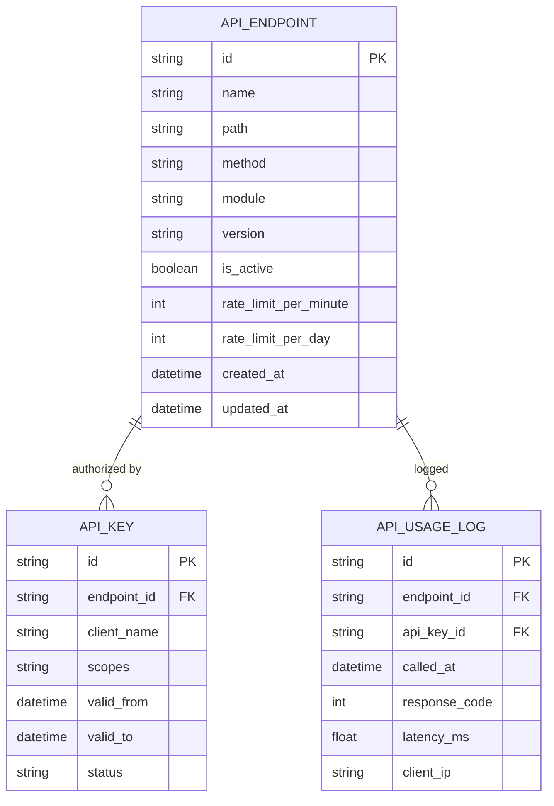

# 再保系統 FRD – API Interface Management  
# Reinsurance System FRD – API Interface Management

---

## 🏷️ Title Block
| 欄位 | 說明 |
|---|---|
| 文件名稱 | 再保系統功能需求文件 – API 介面管理模組 |
| 版本 | v1.0 |
| 文件狀態 | Draft |
| 作者 | Tao Yu 和他的 GPT 智能助手 |
| 修訂日期 | 2025-11-03 |
| 參考 PRD | `EIS-REINS-PRD-001.md`（UC-14 API 介面管理） |

---

## 1. 功能概述
API 介面管理模組讓系統管理員設定、測試、監控再保系統對外 API 介面（保單、理賠、財務等），並控制 API 金鑰、權限、節流與健康狀態。

---

## 2. 使用者角色
| 角色 | 職責 | 權限摘要 |
|---|---|---|
| API 管理員 API Admin | 設定端點、憑證、節流策略。 | 建立/修改/停用 API，產生金鑰。 |
| 安全人員 Security Officer | 檢視 API 使用情況、審核存取。 | 查看日誌、核准金鑰申請。 |
| 開發者 Developer | 取得 API 金鑰與文件，調用 API。 | 申請金鑰、測試 API。 |

---

## 3. 功能需求
| 編號 | 功能 | 描述 | 來源 |
|---|---|---|---|
| FRD-API-01 | 端點設定 | 建立 API 端點（URL、方法、描述、屬於哪個模組）。 | PRD UC-14 |
| FRD-API-02 | 驗證管理 | 支援 API Key、OAuth2、Client Certificate；管理金鑰有效期。 | PRD UC-14 |
| FRD-API-03 | 節流與配額 | 設定每分鐘/每日呼叫次數；支援 burst 限制。 | PRD UC-14 |
| FRD-API-04 | 測試工具 | 在後台測試端點，顯示請求/回應。 | PRD UC-14 |
| FRD-API-05 | 使用量監控 | 顯示各端點呼叫統計、錯誤率；支援匯出。 | PRD UC-14 |
| FRD-API-06 | 通知告警 | 失敗率超標、異常流量觸發警示。 | PRD UC-14 |
| FRD-API-07 | 稽核日志 | 記錄端點變更、金鑰發放/撤銷、使用情況。 | PRD UC-14 |

---

## 4. UI 要求
- **API 列表頁**：顯示端點、方法、版本、狀態、最近呼叫時間；提供搜尋、篩選。  
- **端點詳情頁**：展示需求欄位、回應範例、金鑰要求、節流設定。  
- **金鑰管理頁**：列出金鑰持有人、有效期、Scopes；可停用/更新。  
- **監控儀表板**：趨勢圖、錯誤率、延遲、流量來源。  
- UI 要求符合 `docs/uiux/uiux-guidelines.md`。

---

## 5. 資料模型（簡化）

---

## 6. 欄位定義
| 欄位 | 說明 | 規則 |
|---|---|---|
| path | API 路徑 | 需唯一，例如 `/api/treaties`. |
| method | HTTP 方法 | GET / POST / PUT / DELETE。 |
| module | 所屬模組 | POLICY / CLAIM / FINANCE / AUDIT 等。 |
| rate_limit_per_minute | 節流 | 0 表示不限。 |
| scopes | 權限範圍 | 例如 `treaty.read`, `treaty.write`。 |
| status | 金鑰狀態 | Active / Suspended / Revoked。 |

---

## 7. 驗收標準
1. API 管理員可建立端點、設定節流、生成金鑰，並成功測試。  
2. 當金鑰逾期或被停用時，API 呼叫需被拒絕並回應相應錯誤碼。  
3. 監控儀表板顯示每日流量、錯誤率、延遲；可匯出報表。  
4. 當呼叫量超過節流或出現大量錯誤時，發送通知給管理員。  
5. 所有變更（端點設定、金鑰發放、節流調整）寫入 AuditEvent。

---

## 8. 非功能需求
| 類別 | 說明 |
|---|---|
| 安全 | 支援 HTTPS/TLS、IP 白名單、存取記錄；金鑰需加密儲存。 |
| 效能 | API 管理控制台需於 2 秒內回應；監控資料每 1 分鐘更新一次。 |
| 稽核 | 端點設定與金鑰歷史保留 7 年。 |

---

## 9. 錯誤處理
| 代碼 | 描述 | 行為 |
|---|---|---|
| API-E001 | 端點路徑重複 | 阻止儲存並提示。 |
| API-E002 | 金鑰過期 | API 回傳 401 Unauthorized，並提示更新。 |
| API-E003 | 節流超限 | API 回傳 429 Too Many Requests。 |
| API-E004 | 測試失敗 | 顯示錯誤資訊與回應內容。 |

---

## 10. 修訂紀錄
| 版本 | 日期 | 說明 |
|---|---|---|
| v1.0 | 2025-11-03 | 首版：依 PRD UC-14 撰寫 API 介面管理模組 FRD。 |

