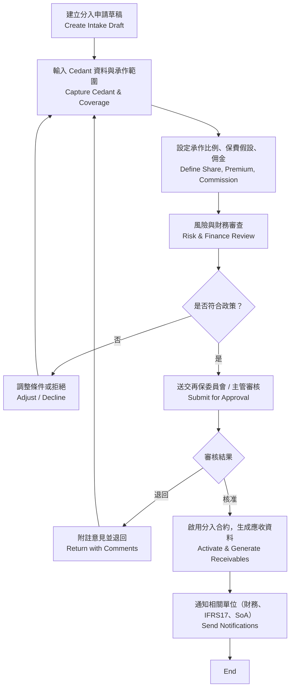
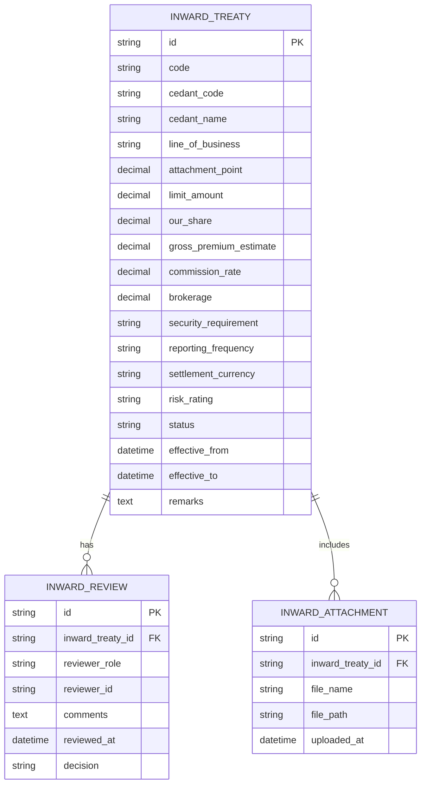

# 再保系統 FRD – Assumed Reinsurance Intake  
# Reinsurance System FRD – Assumed Reinsurance Intake

---

## 🏷️ Title Block
| 欄位 | 說明 |
|---|---|
| 文件名稱 | 再保系統功能需求文件 – 分入再保承接模組 |
| 版本 | v1.0 |
| 文件狀態 | Draft |
| 作者 | Tao Yu 和他的 GPT 智能助手 |
| 修訂日期 | 2025-11-03 |
| 參考 PRD | `EIS-REINS-PRD-001.md`（UC-06 分入再保承接） |
| 原型 | 待補（以 PRD 描述為基礎） |

---

## 1. 功能概述
分入再保承接模組讓公司以再保人身份接受 cedant 的風險，紀錄承作條件、份額與損益預估，並支援後續對帳、IFRS17 與財務流程。

---

## 2. 角色與權限
| 角色 | 職責 | 權限摘要 |
|---|---|---|
| 分入經辦 Assumed UW | 建立分入申請、維護草稿、上傳文件。 | 建立/編輯草稿、提交審核。 |
| 分入主管 Assumed Manager | 審核、核准或退回分入案件。 | 審核、退回、鎖定案件。 |
| 風險管理 Risk Officer | 評估 cedant 信用品質、提出意見。 | 檢視並填寫風險評估欄位。 |
| 財務 Finance | 取得預估保費、佣金、技術備抵資訊。 | 查閱唯讀、匯出報表。 |

---

## 3. 前置條件
- Cedant（出單公司）資料與評等資訊可供選擇/輸入。  
- 分入政策與承作上限（RBC、風險偏好）已設定。  
- 若需擔保品，須與財務流程銜接。

---

## 4. 業務流程

---

## 5. 功能需求對照
| 編號 | 功能 | 描述 | 來源 |
|---|---|---|---|
| FRD-AR-01 | Cedant 管理 | 選擇或新增 cedant 資料、評等、聯絡方式。 | PRD UC-06 |
| FRD-AR-02 | 承作條件輸入 | 承保範圍、起賠點、限額、我方份額、預估保費、佣金、報表頻率。 | PRD UC-06 |
| FRD-AR-03 | 風險評估 | 紀錄風險指標（評等、RBC、風險敞口），提供建議。 | PRD UC-06 業務規則 |
| FRD-AR-04 | 擔保品管理 | 若需信用擔保（L/C、保證金），紀錄條件與到期日。 | PRD UC-06 |
| FRD-AR-05 | 審核流程 | 草稿 → 風險評估 → 主管核准；保留歷程。 | PRD UC-06 |
| FRD-AR-06 | 預估收益 | 計算預估分入保費、佣金、技術備抵、盈利預測。 | PRD UC-06 |
| FRD-AR-07 | 同步財務/IFRS17 | 核准後將參數傳送至財務與 IFRS17 模組。 | PRD UC-06/09 |
| FRD-AR-08 | 稽核與版本 | 每次修改、核准皆建立版本與 AuditEvent。 | PRD UC-06 |

---

## 6. UI 需求摘要
- **清單頁**：顯示分入案代號、Cedant、險種、承作期間、預估保費、狀態、經辦；提供篩選與排序。  
- **詳情頁**：分區顯示「Cedant 資訊」「承作條件」「風險評估」「擔保品」「附件」「系統資訊」。  
- **建立/編輯表單**：采用 `FormGrid columns="three"`；成功訊息顯示「分入再保案件已建立 / 已更新」。  
- **審核流程**：詳情頁呈現審核歷程與意見；退回需顯示理由。  
- UI 需符合 `docs/uiux/uiux-guidelines.md`，未來提供 Figma 原型後需再校對細節。

---

## 7. 資料模型（簡化）

---

## 8. 欄位定義
| 欄位 | 說明 | 規則 |
|---|---|---|
| code | 分入合約代號 | string(20)，唯一。 |
| cedant_code/cedant_name | 出單公司資料 | 可選自既有清單或手動輸入。 |
| line_of_business | 承保險種 | 代碼表。 |
| attachment_point | 起賠點 | decimal(15,2)，>0。 |
| limit_amount | 最高責任額 | decimal(15,2)。 |
| our_share | 我方承作比例 | decimal(5,2)，0-100%。 |
| gross_premium_estimate | 預估分入保費 | decimal(15,2)。 |
| commission_rate | 佣金 | decimal(5,2)。 |
| brokerage | 經紀佣金 | decimal(5,2)。 |
| security_requirement | 擔保品條件 | Text。 |
| reporting_frequency | 申報頻率 | Monthly / Quarterly / Annual。 |
| risk_rating | Cedant 信用評等 | 參考外部評等；可為 N/A。 |
| status | 狀態 | Draft / Under Review / Approved / Declined / Active。 |

---

## 9. 驗收標準
1. 新增分入案時可輸入完整資料並通過驗證；核准後狀態切換為 Active。  
2. 再保委員會/主管審核可查看所有資訊，並留下意見、決議。  
3. 風險評估必須填寫評等與建議；若評等低於公司標準需提示擔保品需求。  
4. 核准後自動產生應收資料與 IFRS17 所需參數（CSM、RA 初始化）。  
5. 匯出功能可導出分入案件清單及審核歷程。  
6. 稽核紀錄完整記錄每次異動與審核結果。

---

## 10. 非功能性需求
| 類別 | 說明 |
|---|---|
| 效能 | 清單查詢 1,000 筆內 3 秒內回應；儲存草稿 3 秒內完成。 |
| 安全 | 含敏感合作資訊；需依角色控管瀏覽與下載權限。 |
| 稽核 | 所有決策、調整、附件上傳均需記錄 AuditEvent。 |
| 可用性 | 表單支援鍵盤操作；評估欄位需提供提示或建議範例。 |

---

## 11. 錯誤處理
| 代碼 | 描述 | 系統行為 |
|---|---|---|
| AR-E001 | 我方承作比例超出公司上限 | 顯示警示並禁止提交。 |
| AR-E002 | Cedant 評等不足 | 提示需附擔保品或經主管核准。 |
| AR-E003 | 必填欄位缺漏 | 高亮欄位並顯示訊息。 |
| AR-E004 | 核准後修改關鍵欄位 | 阻止修改，需透過改版流程。 |

---

## 12. 修訂紀錄
| 版本 | 日期 | 說明 |
|---|---|---|
| v1.0 | 2025-11-03 | 首版：依 PRD UC-06 撰寫分入再保承接模組 FRD。 |

