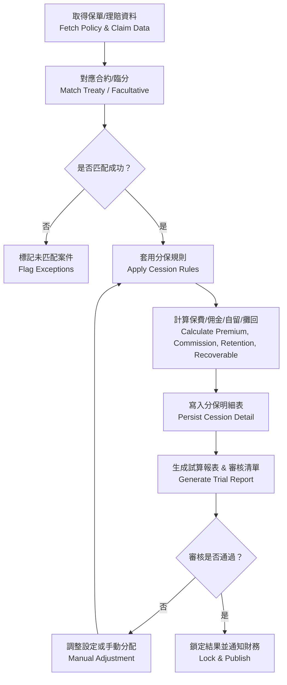

# 再保系統 FRD – Cession Engine  
# Reinsurance System FRD – Cession Engine

---

## 🏷️ Title Block
| 欄位 | 說明 |
|---|---|
| 文件名稱 | 再保系統功能需求文件 – 分保計算引擎 |
| 版本 | v1.0 |
| 文件狀態 | Draft |
| 作者 | Tao Yu 和他的 GPT 智能助手 |
| 修訂日期 | 2025-11-03 |
| 參考 PRD | `EIS-REINS-PRD-001.md`（UC-05 分保計算） |

---

## 1. 功能概述
分保計算引擎負責將保單與理賠資料套用對應的再保合約與臨分條件，計算分出保費、佣金、自留額與攤回金額。結果供財務、SoA、IFRS17 以及報表使用。

---

## 2. 使用者角色
| 角色 | 職責 | 權限摘要 |
|---|---|---|
| 分保經辦 Cession Analyst | 觸發計算、檢視結果、處理異常。 | 執行批次、查詢結果、調整設定。 |
| 分保主管 Cession Manager | 審核計算結果、核准調整。 | 審核、鎖定結果、導出報表。 |
| 財務 Finance | 取得最終分保結果以入帳。 | 查閱唯讀、匯出。 |
| 系統管理員 | 維護批次排程與參數、監控引擎。 | 排程、監控、權限。 |

---

## 3. 前置條件
- 合約、臨分、再保人資料為最新狀態。  
- 保單與理賠資料已由核心系統同步。  
- 需要的參數（計價公式、匯率）皆準備完畢。

---

## 4. 計算流程

---

## 5. 功能需求
| 編號 | 功能 | 描述 | 來源 |
|---|---|---|---|
| FRD-CE-01 | 合約匹配 | 依保單屬性、險種、期間、地區匹配最適合約/臨分；支援優先順序。 | PRD UC-05 |
| FRD-CE-02 | 分保計算 | 支援比例、非比例、混合條款；計算原保費、自留額、分保保費、佣金、再保費調整。 | PRD UC-05 |
| FRD-CE-03 | 理賠攤回計算 | 根據合約層次與臨分分配計算攤回比例與金額。 | PRD UC-07 |
| FRD-CE-04 | 異常清單 | 未匹配、資料缺漏、超出限額等需列入例外清單，供經辦處理。 | PRD UC-05 |
| FRD-CE-05 | 試算與核准 | 提供試算報表供主管審核；核准後鎖定結果。 | PRD UC-05 |
| FRD-CE-06 | 版本與回溯 | 每次運行需保留批次編號、版本、參數；支援重新試算。 | PRD UC-05 |
| FRD-CE-07 | 系統整合 | 計算結果同步至 SoA、IFRS17、財務分錄、理賠攤回。 | PRD UC-05/08/09 |
| FRD-CE-08 | 稽核 | 每次運行、人工調整、重新鎖定皆須寫入 AuditEvent。 | PRD UC-08 |

---

## 6. 計算邏輯摘要

1. **比例合約（Quota / Surplus）**  
   - 分出保費 = 原保費 × 分保比例。  
   - 自留額 = 原保額 × (1 - 分保比例)。  
   - 佣金 = 分出保費 × 佣金率。
2. **非比例合約（XOL）**  
   - 生效條件：賠款超過起賠點。  
   - 分出金額 = min(理賠金額 - 起賠點, 限額)。  
   - 佣金視合約設定（可固定或浮動）。
3. **混合 / 多層級**  
   - 須按照層級順序計算，並支援多再保人份額。  
   - 臨分覆寫：若有臨分案，優先計算臨分部分，再將剩餘金額按合約處理。

---

## 7. 輸出資料（Cession Detail）
| 欄位 | 說明 |
|---|---|
| cession_batch_id | 計算批次編號 |
| policy_no | 保單號 |
| treaty_code | 合約代號 |
| fac_case_code | 臨分案代號（若有） |
| coverage_period | 保障期間 |
| gross_premium | 原保費 |
| retention | 自留額 |
| ceded_premium | 分出保費 |
| commission | 再保佣金 |
| recoverable | 攤回金額（理賠） |
| reinsurer_id | 再保人 |
| status | Draft / Approved / Locked |
| remarks | 備註或人工調整說明 |

---

## 8. 驗收準則
1. 可針對指定期間、產品線或批次成功執行分保計算並取得結果。  
2. 計算結果與合約條款一致；臨分覆蓋時正確扣除。  
3. 異常清單列出未匹配或資料缺漏案件並可導出。  
4. 核准後結果鎖定並不可任意修改；如需調整需開啟新批次。  
5. 產出的結果可被 SoA、IFRS17、財務模組成功引用。  
6. 所有批次與人工操作皆有稽核紀錄（含操作者、時間、差異）。

---

## 9. 非功能性需求
| 類別 | 說明 |
|---|---|
| 效能 | 單批次 10,000 筆保單在 30 分鐘內完成計算；支援平行批次。 |
| 可用性 | 提供批次狀態監控、錯誤通知、重新執行功能。 |
| 安全 | 僅授權角色可執行批次或調整結果；傳輸採用 HTTPS。 |
| 稽核 | 批次資訊、異常處理、人工調整均需寫入 AuditEvent。 |

---

## 10. 錯誤處理
| 代碼 | 描述 | 系統行為 |
|---|---|---|
| CE-E001 | 無對應合約/臨分 | 列入異常清單，設定狀態為 `UNMATCHED`。 |
| CE-E002 | 各層限額或自留計算錯誤 | 停止計算並通知經辦查核設定。 |
| CE-E003 | 批次資料來源缺漏 | 拋出錯誤並記錄於系統監控。 |
| CE-E004 | 核准後再執行計算 | 阻止並提示需建立新批次。 |

---

## 11. 修訂紀錄
| 版本 | 日期 | 說明 |
|---|---|---|
| v1.0 | 2025-11-03 | 首版：依 PRD UC-05 撰寫分保計算引擎 FRD。 |

