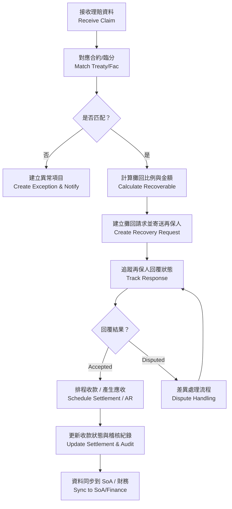
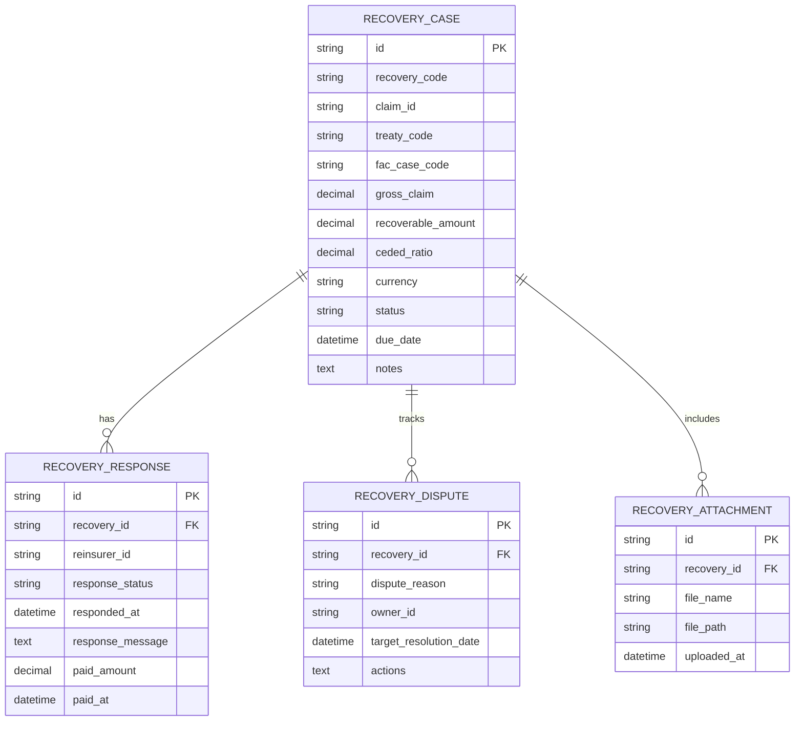

# 再保系統 FRD – Claim Recovery Management  
# Reinsurance System FRD – Claim Recovery Management

---

## 🏷️ Title Block
| 欄位 | 說明 |
|---|---|
| 文件名稱 | 再保系統功能需求文件 – 理賠攤回管理模組 |
| 版本 | v1.0 |
| 文件狀態 | Draft |
| 作者 | Tao Yu 和他的 GPT 智能助手 |
| 修訂日期 | 2025-11-03 |
| 參考 PRD | `EIS-REINS-PRD-001.md`（UC-07 理賠攤回處理） |

---

## 1. 功能概述
理賠攤回管理模組負責將理賠資料對應至合約/臨分條件，計算應攤回金額、追蹤再保人回覆與付款狀態，並把資訊轉交 SoA、財務與稽核。

---

## 2. 角色與權限
| 角色 | 職責 | 權限摘要 |
|---|---|---|
| 理賠攤回經辦 Recovery Analyst | 建立攤回案件、維護狀態、上傳證明。 | 建立/編輯案件、提交再保人。 |
| 理賠主管 Recovery Manager | 審核攤回結果、處理爭議。 | 審核、調整狀態、批准差異。 |
| 財務 Finance | 追蹤應收款、核對 SoA。 | 查閱唯讀、更新收款資訊。 |
| 系統管理員 | 維護狀態代碼與通知設定。 | 系統設定、權限管理。 |

---

## 3. 前置條件
- 理賠事件已在理賠系統核定並同步。  
- 分保計算引擎已提供對應的分保結果（或重新計算）。  
- 再保人主檔、聯絡資訊完整。

---

## 4. 業務流程

---

## 5. 功能需求
| 編號 | 功能 | 描述 | 來源 |
|---|---|---|---|
| FRD-CR-01 | 攤回案件建立 | 由系統自動或人工建立攤回案件，記錄保單、合約、理賠資訊。 | PRD UC-07 |
| FRD-CR-02 | 攤回計算 | 套用分保計算引擎或臨分條件，計算 recoverable amount。 | PRD UC-07 |
| FRD-CR-03 | 再保人通知 | 產生攤回請求、寄送 SoA-to-Date 或電郵；記錄發送時間。 | PRD UC-07 |
| FRD-CR-04 | 回覆追蹤 | 管理 Pending / Accepted / Disputed / Paid 狀態，記錄回覆日期與訊息。 | PRD UC-07 |
| FRD-CR-05 | 差異處理 | 若爭議，記錄原因、負責人、預計解決日；支援多輪往返。 | PRD UC-07 |
| FRD-CR-06 | 財務整合 | 產生應收帳款、收款確認、與 SoA 對帳，提供匯出。 | PRD UC-07/UC-08 |
| FRD-CR-07 | 稽核 | 所有狀態變更、回覆、附件操作需寫入 AuditEvent。 | PRD UC-07 |

---

## 6. UI 規格摘要
- 清單頁顯示攤回案件編號、理賠編號、合約、再保人、金額、狀態、經辦；支援篩選「待回覆」「已逾期」「爭議中」。  
- 詳情頁包含：「案件摘要」「分保資訊」「再保人回覆」「附件」「流程歷程」。  
- 「建立攤回」表單使用 `SectionCard`：基本資料、計算結果、附件。  
- 成功訊息：「攤回案件已建立」「攤回資料已更新」「攤回案件已結清」。  
- UI 需符合 `docs/uiux/uiux-guidelines.md`。若後續提供 Figma 圖需再比對調整。

---

## 7. 資料模型（簡化）

---

## 8. 欄位定義
| 欄位 | 說明 | 規則 |
|---|---|---|
| recovery_code | 攤回案件代號 | string(20)，唯一，格式建議 REC-YYYY-####。 |
| claim_id | 理賠編號 | 連結理賠系統。 |
| treaty_code / fac_case_code | 對應合約 / 臨分案 | FK。 |
| gross_claim | 原理賠金額 | decimal(15,2)。 |
| recoverable_amount | 攤回金額 | decimal(15,2)。 |
| ceded_ratio | 攤回比例 | decimal(5,2)。 |
| status | 案件狀態 | Draft / Pending / Accepted / Disputed / Paid / Closed。 |
| due_date | 應收日期 | Date。 |
| response_status | 再保人回覆 | Pending / Accepted / Adjusted / Declined。 |
| paid_amount | 實際收款 | decimal(15,2)。 |
| dispute_reason | 爭議原因 | Text。 |

---

## 9. 驗收標準
1. 攤回案件可成功建立並套用分保計算引擎的比例與金額。  
2. 再保人回覆流程透明，狀態與記錄可追蹤；爭議案件有負責人與處理歷程。  
3. 收款完成可更新付款日期與金額，並同步至 SoA/財務。  
4. 提供匯出報表（CSV/PDF）供財務與稽核使用。  
5. 所有狀態與金額變動寫入稽核纪录。

---

## 10. 非功能需求
| 類別 | 說明 |
|---|---|
| 效能 | 清單查詢 1,500 筆內 3 秒內回應；批次通知再保人不超過 2 分鐘。 |
| 通知 | 可設定自動提醒（到期前 N 天、回覆逾期）。 |
| 安全 | 再保人聯絡資料與附件需透過 HTTPS，存放於受控儲存體。 |
| 稽核 | AuditEvent 保存 7 年；支援查詢條件（案件、再保人、狀態）。 |

---

## 11. 錯誤處理
| 代碼 | 描述 | 系統行為 |
|---|---|---|
| CR-E001 | 找不到對應合約 | 列入異常清單並通知經辦。 |
| CR-E002 | 計算失敗 | 停止流程並提示原因（通常為缺失資料）。 |
| CR-E003 | 再保人回覆格式錯誤 | 要求重新輸入或上傳文件。 |
| CR-E004 | 已收款案件重複結案 | 阻止動作並顯示警示。 |

---

## 12. 修訂紀錄
| 版本 | 日期 | 說明 |
|---|---|---|
| v1.0 | 2025-11-03 | 首版：依 PRD UC-07 撰寫理賠攤回管理 FRD。 |

