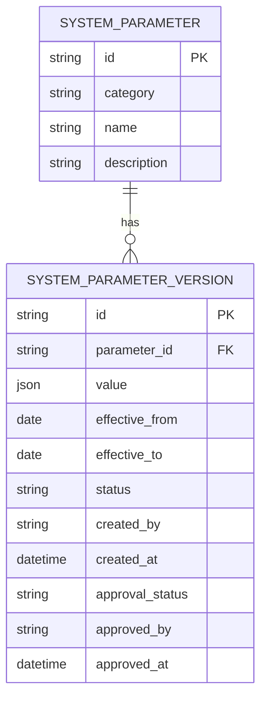

# 再保系統 FRD – System Configuration & Parameters  
# Reinsurance System FRD – System Configuration & Parameters

---

## 🏷️ Title Block
| 欄位 | 說明 |
|---|---|
| 文件名稱 | 再保系統功能需求文件 – 系統設定與參數模組 |
| 版本 | v1.0 |
| 文件狀態 | Draft |
| 作者 | Tao Yu 和他的 GPT 智能助手 |
| 修訂日期 | 2025-11-03 |
| 參考 PRD | `EIS-REINS-PRD-001.md`（UC-15 系統設定與參數維護） |

---

## 1. 功能概述
系統設定與參數模組提供集中化的參數維護（再保人類型、狀態、佣金範圍、匯率、操作上限等），支援版本化管理與審核，確保設定在全系統一致。

---

## 2. 使用者角色
| 角色 | 職責 | 權限摘要 |
|---|---|---|
| 參數管理員 Config Admin | 建立/修改參數、設定生效日期。 | 建立/編輯、提交審核。 |
| 參數審核員 Config Approver | 審核參數變更、核准或退回。 | 審核、鎖定。 |
| 查詢使用者 Viewer | 檢視參數與歷史版本。 | 唯讀。 |

---

## 3. 功能需求
| 編號 | 功能 | 描述 | 來源 |
|---|---|---|---|
| FRD-CP-01 | 參數分類 | 支援分類：再保人類型/狀態、佣金上限、匯率、工作流程設定等。 | PRD UC-15 |
| FRD-CP-02 | 版本化 | 參數調整需建立新版本，支援生效日/失效日設定。 | PRD UC-15 |
| FRD-CP-03 | 審核流程 | 草稿 → 審核 → 生效；退回需提供意見。 | PRD UC-15 |
| FRD-CP-04 | 差異比較 | 顯示舊值、新值與差異摘要。 | PRD UC-15 |
| FRD-CP-05 | 影響分析 | 顯示受影響模組（例如提高佣金上限會影響合約建立）。 | PRD UC-15 |
| FRD-CP-06 | 稽核 | 參數變更動作寫入 AuditEvent。 | PRD UC-15 |

---

## 4. UI 要求
- **參數清單**：顯示分類、名稱、目前有效版本、生效日、狀態；提供搜尋。  
- **編輯頁**：分區顯示基本資訊、值設定、生效期間、影響模組；提供差異檢視。  
- **版本歷史**：展示所有版本與審核狀態，可回溯。  
- UI 樣式參照 `docs/uiux/uiux-guidelines.md`。

---

## 5. 資料模型（簡化）

---

## 6. 欄位定義
| 欄位 | 說明 | 規則 |
|---|---|---|
| category | 參數分類 | REINSURER_TYPE / COMMISSION_LIMIT / CESSION_RULE 等。 |
| value | 參數值 | JSON（可存列表或範圍）。 |
| effective_from/to | 生效、失效日 | 可為 null 表示長期有效。 |
| status | 版本狀態 | Draft / Pending / Active / Archived。 |
| approval_status | 審核狀態 | Pending / Approved / Rejected。 |

---

## 7. 驗收標準
1. 可按分類查詢參數並檢視目前生效值。  
2. 建立新版本時可設定生效/失效日期，避免與既有版本重疊。  
3. 審核流程完整，退回時保留意見；核准後自動切換生效版本。  
4. 調整後受影響模組透過提示告知使用者。  
5. AuditEvent 記錄所有變更、審核行為。

---

## 8. 非功能需求
| 類別 | 說明 |
|---|---|
| 安全 | 僅授權用戶可查看或變更敏感參數。 |
| 稽核 | 參數歷史保留 7 年；提供匯出功能。 |
| 效能 | 參數讀取需高可用（可快取），但變更需立即刷新快取。 |

---

## 9. 錯誤處理
| 代碼 | 描述 | 行為 |
|---|---|---|
| CP-E001 | 版本日期重疊 | 阻止儲存並顯示提醒。 |
| CP-E002 | 未審核即嘗試生效 | 阻止操作並提示。 |
| CP-E003 | 重要參數缺少審核意見 | 強制要求填寫。 |

---

## 10. 修訂紀錄
| 版本 | 日期 | 說明 |
|---|---|---|
| v1.0 | 2025-11-03 | 首版：依 PRD UC-15 撰寫系統設定與參數模組 FRD。 |

