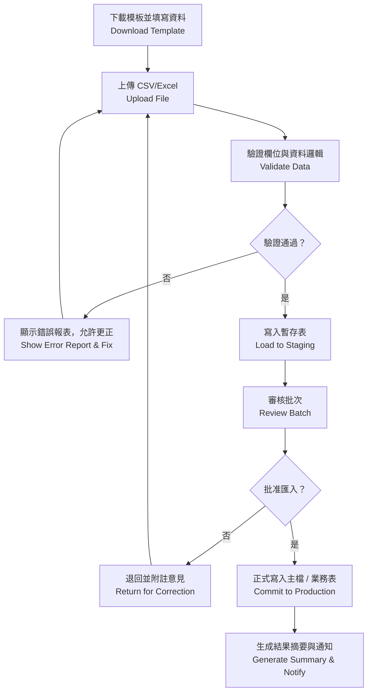
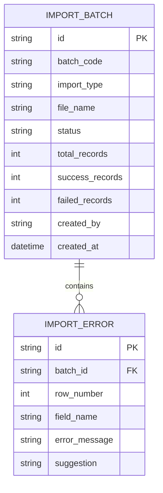

# 再保系統 FRD – Data Import & Migration  
# Reinsurance System FRD – Data Import & Migration

---

## 🏷️ Title Block
| 欄位 | 說明 |
|---|---|
| 文件名稱 | 再保系統功能需求文件 – 資料導入與遷移模組 |
| 版本 | v1.0 |
| 文件狀態 | Draft |
| 作者 | Tao Yu 和他的 GPT 智能助手 |
| 修訂日期 | 2025-11-03 |
| 參考 PRD | `EIS-REINS-PRD-001.md`（UC-10 資料導入與遷移） |

---

## 1. 功能概述
資料導入模組支援由舊系統或 Excel/CSV 檔案匯入再保相關資料（再保人、合約、臨分、理賠、歷史 SoA 等），協助系統初建與批次維護。

---

## 2. 使用者角色
| 角色 | 職責 | 權限摘要 |
|---|---|---|
| 匯入經辦 Import Operator | 上傳資料、檢視驗證結果、提交審核。 | 上傳、編輯暫存資料、查看錯誤報表。 |
| 匯入審核 Import Approver | 審核匯入批次、核准或退回。 | 審核、鎖定批次、產出報表。 |
| 系統管理員 | 維護模板、欄位定義、排程。 | 模板管理、參數設定、權限管理。 |

---

## 3. 前置條件
- 匯入模板（欄位、格式）事先定義並提供給使用者。  
- 權限設定允許相關人員操作匯入功能。  
- 需要的參考代碼與映射已存在（例如再保人代碼、險種、幣別）。

---

## 4. 匯入流程

---

## 5. 功能需求
| 編號 | 功能 | 描述 | 來源 |
|---|---|---|---|
| FRD-DI-01 | 模板管理 | 提供各資料類型模板（再保人、合約、臨分、理賠、SoA）；支援版本控制。 | PRD UC-10 |
| FRD-DI-02 | 上傳與驗證 | 上傳 CSV/Excel；驗證必填、格式、代碼映射、邏輯（份額、日期等）。 | PRD UC-10 |
| FRD-DI-03 | 錯誤報告 | 產出錯誤報表（Excel），顯示錯誤欄位、原因、建議。 | PRD UC-10 |
| FRD-DI-04 | 暫存審核 | 匯入資料寫入暫存表；審核人可查看差異、樣本。 | PRD UC-10 |
| FRD-DI-05 | 正式匯入 | 核准後寫入主檔，必要時產生 AuditEvent 與版本記錄。 | PRD UC-10 |
| FRD-DI-06 | 回溯與報表 | 保存匯入批次紀錄、統計成功/失敗筆數，可匯出。 | PRD UC-10 |

---

## 6. UI 要求
- 匯入儀表板顯示批次清單、類型、狀態、上傳者、建立時間、成功/失敗筆數。  
- 上傳頁需顯示模板下載按鈕、檔案選擇、驗證結果摘要。  
- 錯誤報表提供下載連結；每筆錯誤列出行號、欄位、錯誤原因、建議。  
- 審核頁顯示差異摘要，提供「批准」「退回」按鈕與意見欄位。  
- UI 依 `docs/uiux/uiux-guidelines.md` 調整（標準 PageHeader + SectionCard）。

---

## 7. 資料模型（簡化）

---

## 8. 欄位定義
| 欄位 | 說明 | 規則 |
|---|---|---|
| batch_code | 匯入批次代號 | string(20)；格式 IMP-YYYYMMDD-###。 |
| import_type | 匯入類型 | enum：REINSURER / TREATY / FAC / CLAIM / SOA。 |
| status | 批次狀態 | Uploaded / Validated / Pending Approval / Approved / Rejected / Completed。 |
| total_records | 總筆數 | int。 |
| success_records | 成功筆數 | int。 |
| failed_records | 失敗筆數 | int。 |
| error_message | 錯誤訊息 | string；詳細描述問題。 |

---

## 9. 驗收標準
1. 使用者可下載模板並成功上傳資料；驗證錯誤時提供清楚訊息與報表。  
2. 審核人員可檢視批次摘要、差異；核准後資料寫入主檔。  
3. 匯入成功/失敗筆數統計正確；歷史批次可查詢並匯出。  
4. 稽核紀錄保留匯入批次、操作者、審核意見。  
5. 匯入操作符合權限管控；系統錯誤發出告警。

---

## 10. 非功能需求
| 類別 | 說明 |
|---|---|
| 效能 | 單批次 10,000 筆驗證於 5 分鐘內完成；匯入主檔不超過 10 分鐘。 |
| 安全 | 檔案上傳使用 HTTPS，儲存於安全區域；過期自動清除。 |
| 稽核 | AuditEvent 記錄上傳、審核、匯入完成等行為，保存 7 年。 |
| 可用性 | 使用者需能快速定位錯誤，支援再次上傳修正檔案。 |

---

## 11. 錯誤處理
| 代碼 | 描述 | 系統行為 |
|---|---|---|
| DI-E001 | 模板格式錯誤 | 阻止上傳並提示下載新模板。 |
| DI-E002 | 欄位驗證失敗 | 顯示錯誤報表，允許更正後重新上傳。 |
| DI-E003 | 審核前重複上傳 | 允許，但需沿用同批次或建立新批次。 |
| DI-E004 | 正式匯入失敗 | 回滾變更並通知系統管理員。 |

---

## 12. 修訂紀錄
| 版本 | 日期 | 說明 |
|---|---|---|
| v1.0 | 2025-11-03 | 首版：依 PRD UC-10 撰寫資料導入模組 FRD。 |

