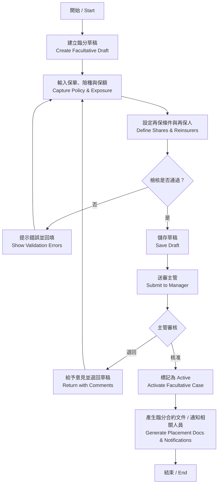
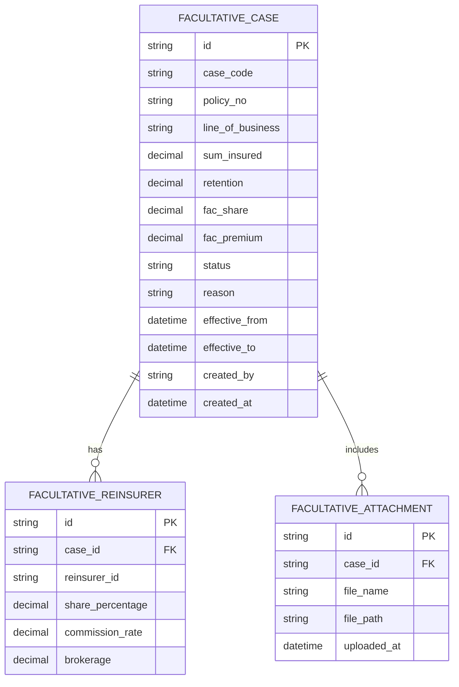

# 再保系統 FRD – Facultative Management  
# Reinsurance System FRD – Facultative Management

---

## 🏷️ Title Block
| 欄位 | 說明 |
|---|---|
| 文件名稱 | 再保系統功能需求文件 – 臨分管理模組 |
| 版本 | v1.0 |
| 文件狀態 | Draft |
| 作者 | Tao Yu 和他的 GPT 智能助手 |
| 修訂日期 | 2025-11-03 |
| 參考 PRD | `EIS-REINS-PRD-001.md`（UC-04 建立臨分案） |
| 參考原型 | 後續提供（暫以 PRD 描述為主） |

---

## 1. 功能概述 / Overview
臨分管理模組負責針對超出合約保障範圍或特殊風險的再保案件，提供建立、維護、審核與追蹤能力，確保臨分資料與合約、理賠及 SoA 流程連動。

---

## 2. 角色與權限 / Roles
| 角色 | 職責 | 權限摘要 |
|---|---|---|
| 臨分經辦 Facultative Underwriter | 建立臨分案、維護草稿、上傳文件。 | 建立/編輯草稿、上傳附件、提交審核。 |
| 臨分主管 Facultative Manager | 審核臨分案、核准或退回。 | 審核、退回、查看稽核及附件。 |
| 合約/理賠協調 Treaty/Claims Coordinator | 檢核臨分是否與合約、理賠同步。 | 查閱、關聯保單/理賠資料。 |
| 系統管理員 | 維護參數、權限、稽核資料。 | 參數設定、權限管理。 |

---

## 3. 前置條件
- 再保人主檔、險種、幣別、保單資料可供選擇。  
- 若臨分為已存在案件之調整，須處於草稿或待審狀態。

---

## 4. 業務流程 / Business Flow

---

## 5. 功能需求對照
| 編號 | 功能 | 說明 | 來源 |
|---|---|---|---|
| FRD-FAC-01 | 基本資料輸入 | 保單號、被保人、險種、保額、自留額、臨分比例等。 | PRD UC-04 |
| FRD-FAC-02 | 合約匹配 | 自動搜尋現有合約，若無符合則建立臨分案；記錄原因。 | PRD UC-04 |
| FRD-FAC-03 | 再保人配置 | 選擇再保人及份額、佣金；允許多家分配。 | PRD UC-04 |
| FRD-FAC-04 | 文件管理 | 上傳 Slip、簽單、批覆等附件，支援版本管理。 | PRD UC-04 |
| FRD-FAC-05 | 審核流程 | 草稿 → 待審 → 生效；退回需附意見。 | PRD UC-04 |
| FRD-FAC-06 | 狀態與通知 | 狀態包含 Draft/Pending/Active/Closed；送審與核准時通知經辦、主管、財務。 | PRD UC-04 |
| FRD-FAC-07 | 稽核 | 建立、修改、核准、關閉等動作寫入 AuditEvent。 | PRD UC-04 |
| FRD-FAC-08 | 合約/理賠連動 | 若臨分案與保單或理賠事件關聯，需記錄外鍵並在後續流程引用。 | PRD UC-04/UC-07 |

---

## 6. UI & 原型要求
- 表單應採 `SectionCard` 區分：**案件資訊**、**再保人配置**、**附件**、**備註**。  
- 清單需提供狀態、承保期間、再保人、經辦等欄位；操作含檢視、編輯、複製臨分案。  
- 成功訊息：「臨分案已成功建立」「臨分案已更新」；退回時顯示主管意見。  
- 欄位與樣式遵循 `docs/uiux/uiux-guidelines.md`（後續補充原型時需對齊）。

---

## 7. 資料模型（簡化）

---

## 8. 欄位定義 / Field Dictionary
| 欄位 | 說明 | 型別 / 規則 |
|---|---|---|
| case_code | 臨分案代號 | string(20)，唯一，可自動生成。 |
| policy_no | 原保單號 | string(30)，必填，需存在於保單資料集或手動輸入。 |
| line_of_business | 險種 | string(50)，由參考代碼提供。 |
| sum_insured | 保額 | decimal(15,2)，必填，>0。 |
| retention | 自留額 | decimal(15,2)，可為 0。 |
| fac_share | 臨分比例 | decimal(5,2)，0-100%。 |
| fac_premium | 臨分保費 | decimal(15,2)。 |
| status | 狀態 | enum：DRAFT / PENDING / ACTIVE / CLOSED / CANCELLED。 |
| reason | 建立理由 | text，說明為何需臨分。 |
| reinsurer_id | 再保人 ID | FK 至再保人主檔；可多筆。 |
| share_percentage | 再保人份額 | decimal(5,2)，加總 = fac_share。 |
| commission_rate | 佣金 | decimal(5,2)。 |
| brokerage | 經紀佣金 | decimal(5,2)，可為 0。 |

---

## 9. 驗收標準 / Acceptance Criteria
1. 臨分案可成功建立，在清單與詳情中顯示完整資訊。  
2. 當臨分比例與再保人份額不一致時，顯示錯誤並阻止送審。  
3. 核准後生成審批紀錄；任何調整需重新送審。  
4. 已綁定合約/理賠的臨分案不可刪除；可透過狀態轉為 Closed。  
5. 附件上傳支援多檔案，並可下載；版本更新需保留歷史檔案。  
6. 稽核紀錄清楚顯示變更欄位與舊值/新值。  
7. 清單頁篩選與排序符合需求，頁面反應時間符合非功能需求。

---

## 10. 非功能性需求 / NFR
| 類別 | 說明 |
|---|---|
| 效能 | 清單查詢 1,000 筆內 3 秒內回應；儲存草稿 3 秒內完成。 |
| 安全 | 依角色控制編輯/審核權限；敏感欄位（保額、保費）需 HTTPS 傳輸。 |
| 稽核 | 每次異動寫入 AuditEvent，保存 7 年。 |
| 可用性 | 表單支援鍵盤操作與錯誤提示；附件上傳顯示進度。 |
| 可追蹤性 | 案件狀態、審核歷史可查詢；可篩選待審臨分案。 |

---

## 11. 錯誤處理 / Error Handling
| 錯誤代碼 | 說明 | 系統行為 |
|---|---|---|
| FAC-E001 | 再保人份額總和不等於臨分比例 | 顯示錯誤並禁止送審。 |
| FAC-E002 | 必填欄位缺漏（保單號、保額、再保人等） | 高亮欄位並提示說明。 |
| FAC-E003 | 再保人不可用（黑名單或 Suspended） | 顯示「該再保人無法參與臨分」。 |
| FAC-E004 | 已綁定合約/理賠無法刪除 | 顯示說明並阻止刪除。 |

---

## 12. 修訂紀錄 / Revision History
| 版本 | 日期 | 說明 |
|---|---|---|
| v1.0 | 2025-11-03 | 首版：依 PRD UC-04 撰寫臨分管理 FRD。 |

