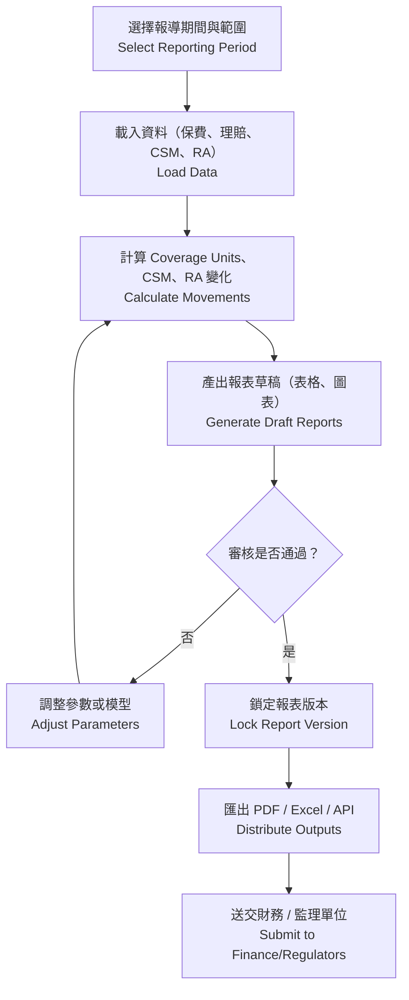
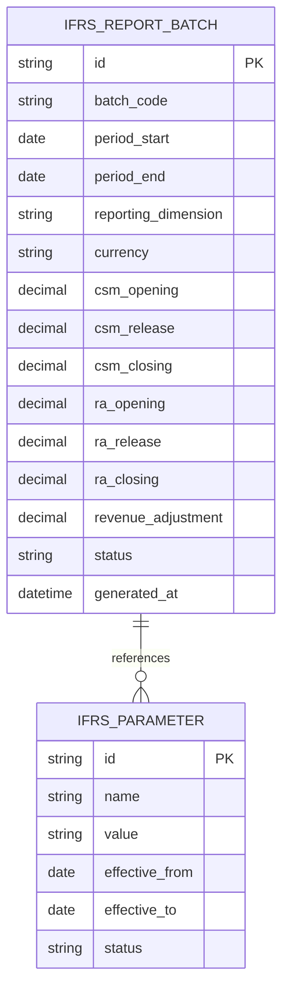

# 再保系統 FRD – IFRS17 Reporting  
# Reinsurance System FRD – IFRS17 Reporting

---

## 🏷️ Title Block
| 欄位 | 說明 |
|---|---|
| 文件名稱 | 再保系統功能需求文件 – IFRS17 報表模組 |
| 版本 | v1.0 |
| 文件狀態 | Draft |
| 作者 | Tao Yu 和他的 GPT 智能助手 |
| 修訂日期 | 2025-11-03 |
| 參考 PRD | `EIS-REINS-PRD-001.md`（UC-09 IFRS17 報表生成） |

---

## 1. 功能概述
IFRS17 報表模組負責彙整再保合約、臨分、分保計算與攤回資料，依 IFRS17 標準計算 CSM、RA、Loss Component 等指標，產出合規報表並提供財務系統使用。

---

## 2. 角色與權限
| 角色 | 職責 | 權限摘要 |
|---|---|---|
| 財務報導 Finance Reporting | 觸發報表、檢視結果、匯出檔案。 | 建立批次、查閱報表、提交審核。 |
| IFRS17 專員 IFRS17 Analyst | 調整模型參數、檢視計算明細。 | 編輯參數、重跑批次。 |
| 主管 Finance Controller | 審核報表、鎖定版本、送交總帳。 | 審核、退回、鎖定。 |
| 系統管理員 | 維護排程、權限、參考代碼。 | 系統設定、排程管理。 |

---

## 3. 前置條件
- 分保計算與 SoA 已完成所需期間的數據。  
- IFRS17 模型參數（折現率、風險調整方法、Coverage Units）已設定。  
- 權限設定允許相關人員啟動報表與審核。

---

## 4. 業務流程

---

## 5. 功能需求
| 編號 | 功能 | 描述 | 來源 |
|---|---|---|---|
| FRD-IFRS-01 | 報導期間設定 | 支援月度、季度、年度；可按合約群組或再保人產出。 | PRD UC-09 |
| FRD-IFRS-02 | 資料彙整 | 整合分保保費、佣金、理賠、調整、Coverage Units、CSM/RA 基數。 | PRD UC-09 |
| FRD-IFRS-03 | CSM 計算 | 計算期初、期末、釋放、Loss Component；支援匯率換算。 | PRD UC-09 |
| FRD-IFRS-04 | RA 計算 | 根據風險調整方法（例如百分比法）計算 RA 變化。 | PRD UC-09 |
| FRD-IFRS-05 | 報表輸出 | 生成法遵格式（PDF/Excel）、提供 API 給財務系統。 | PRD UC-09 |
| FRD-IFRS-06 | 審核與版本控管 | 草稿 → 審核 → 鎖定；各版本可回溯；記錄審核意見。 | PRD UC-09 |
| FRD-IFRS-07 | 稽核紀錄 | 每次運行、參數調整、鎖定動作寫入 AuditEvent。 | PRD UC-09 |

---

## 6. 報表輸出範例（摘要）
- **CSM & RA Movement Summary**：期初、當期變動、期末數。  
- **Reinsurance Revenue Impact**：分保保費、佣金、Loss Component 調整。  
- **Coverage Units & Service Pattern**：顯示當期 Coverage Units 與釋放比例。  
- **差異分析**：與上期或預算比較，附註原因。

---

## 7. 資料模型（簡化）

---

## 8. 欄位定義
| 欄位 | 說明 | 規則 |
|---|---|---|
| batch_code | 報表批次代號 | string(20)，唯一。 |
| reporting_dimension | 報導維度 | 合約群組 / 再保人 / 產品線。 |
| csm_opening / closing | 期初 / 期末 CSM | decimal(18,2)。 |
| csm_release | 本期 CSM 釋放 | decimal(18,2)。 |
| ra_opening / closing | 期初 / 期末 RA | decimal(18,2)。 |
| ra_release | 本期 RA 釋放 | decimal(18,2)。 |
| revenue_adjustment | 再保收益調整 | decimal(18,2)。 |
| status | 報表狀態 | Draft / Pending / Approved / Locked。 |

---

## 9. 驗收標準
1. 可成功針對指定期間/維度生成報表並計算 CSM、RA、Revenue Adjustment。  
2. 報表內容符合臺灣金管會與 IFRS17 要求，提供必要欄位與註腳。  
3. 報表可匯出 PDF/Excel 並透過 API 同步給財務或報導平台。  
4. 審核流程與版本管控完整，調整參數後能重新生成報表並保留歷史版本。  
5. AuditEvent 記錄運行、參數調整、審核與鎖定事件。

---

## 10. 非功能需求
| 類別 | 說明 |
|---|---|
| 效能 | 單維度報表 2,000 筆資料內於 15 分鐘內完成；支援排程。 |
| 安全 | 報表含敏感財務資訊，必須採 HTTPS 下載並有權限控管。 |
| 稽核 | 所有運行批次與輸出檔案需記錄操作者與時間，保存 7 年。 |
| 可用性 | 圖形化儀表板顯示主要指標；異常系統發出提醒。 |

---

## 11. 錯誤處理
| 代碼 | 描述 | 行為 |
|---|---|---|
| IFRS-E001 | 缺少所需資料（例如 Coverage Units） | 停止批次並提示需補資料。 |
| IFRS-E002 | 參數期間重疊或缺失 | 阻止運行，要求調整參數。 |
| IFRS-E003 | 匯出檔案失敗 | 重試並記錄告警。 |
| IFRS-E004 | 鎖定後試圖修改數值 | 阻止修改並提示需開新批次。 |

---

## 12. 修訂紀錄
| 版本 | 日期 | 說明 |
|---|---|---|
| v1.0 | 2025-11-03 | 首版：依 PRD UC-09 撰寫 IFRS17 報表模組 FRD。 |

