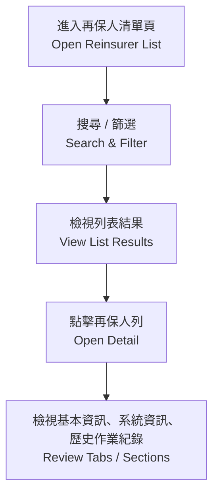
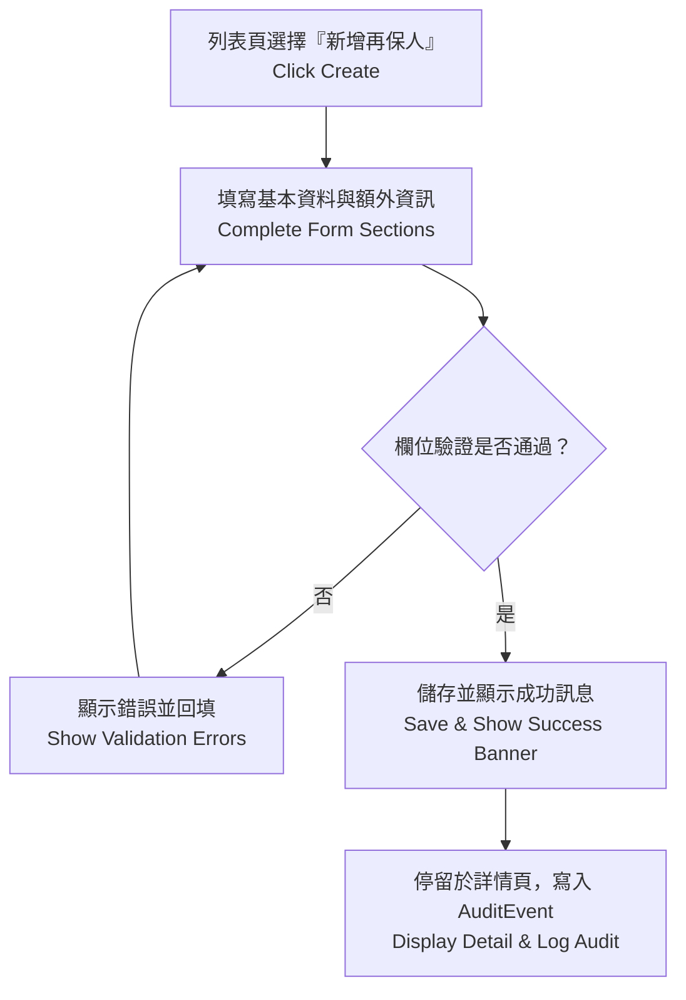
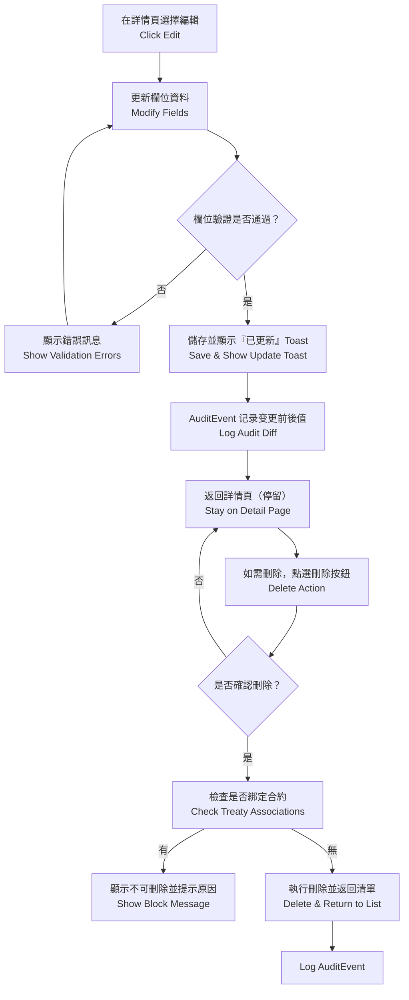
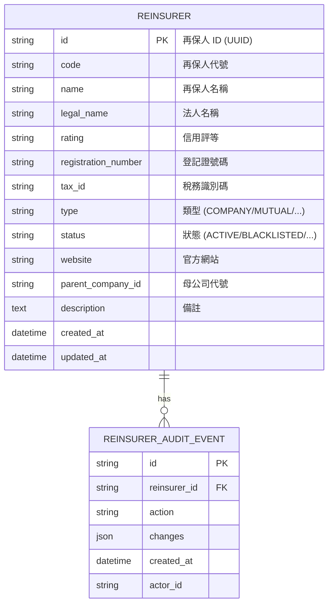

# 再保系統 FRD – Reinsurer Management  
# Reinsurance System FRD – Reinsurer Management

---

## 🏷️ Title Block / 文件基本資訊
| 欄位 Field | 說明 Description |
|---|---|
| 文件名稱 / Document Title | 再保系統功能需求文件 – 再保人管理模組 |
| 版本 / Version | v1.0 |
| 文件狀態 / Status | Draft |
| 作者 / Author | Tao Yu 和他的 GPT 智能助手 |
| 修訂日期 / Revised On | 2025-11-03 |
| 參考 PRD / Reference PRD | `requirement/EIS-REINS-PRD-001.md`（對應 UC-01 再保人資料管理） |
| 參考原型 / Reference Prototypes | `requirement/导出pdf json/1-1-再保人管理.*`、`requirement/导出pdf json/1-2-再保人管理-新增再保人.*` |

---

## 1. 功能概述 / Function Overview
本文件定義「再保人管理模組」之功能需求，涵蓋**清單檢視**、**詳情檢視**、**新增**、**維護**、**刪除**與**稽核紀錄**。  
This FRD specifies the *Reinsurer Management* module, covering list/detail views, create, update, delete, and audit tracking per PRD UC-01 and the associated UI prototypes.

---

## 2. 使用者角色 / User Roles

| 角色 Role | 職責 Responsibility | 權限摘要 Permissions |
|---|---|---|
| 再保經辦 Reinsurance Officer | 建立、維護再保人主檔。 | 建立、編輯、檢視清單與詳情、上傳附件。 |
| 再保主管 Reinsurance Manager | 審核關鍵變更（選擇性流程，可由組織決定）。 | 檢視詳情、核准或退回敏感調整、檢視稽核紀錄。 |
| 內控 / 法遵 Compliance | 檢視再保人狀態、變更歷程、黑名單資訊。 | 唯讀查詢、導出報表、檢視稽核。 |
| 系統管理員 System Admin | 維護參考代碼（類型、狀態）、管理權限。 | 參數設定、權限配置、稽核資料留存。 |

---

## 3. 前置條件 / Preconditions
- 使用者已登入並擁有再保人管理權限。  
- 再保人類型、狀態、評等等選單代碼已在系統設定完成。  
- 若為編輯／刪除，再保人紀錄須存在且符合商業規則（例如未綁定合約方可刪除）。

---

## 4. 業務流程 / Business Processes

### 4.1 清單與詳情（List & Detail）

### 4.2 建立再保人（Create）

### 4.3 維護 / 刪除（Update / Delete）

---

## 5. 功能需求對照 / Functional Requirements Mapping

| 編號 ID | 功能 Function | 描述 Description | 對應 PRD / Prototype |
|---|---|---|---|
| FRD-RM-01 | 再保人清單 | 提供搜尋（代號、名稱、類型、狀態、評等）與分頁、排序；操作包含「檢視」「編輯」「刪除」。 | PRD UC-01；原型 1-1 |
| FRD-RM-02 | 再保人詳情 | 顯示基本資料、額外資訊、系統資訊、歷史作業紀錄四個 Section；支援返回列表、編輯、刪除。 | PRD UC-01；原型 1-1 詳情視圖 |
| FRD-RM-03 | 建立表單 | 表單區塊包含基本資料（代號、名稱、法人名稱、評等等）、狀態、類型、額外資訊；欄位對齊遵循 UI 指南。 | PRD UC-01；原型 1-2 |
| FRD-RM-04 | 欄位驗證 | 代號必填且唯一；URL 格式檢查；狀態為 ACTIVE 時若無評等需提示確認；字串欄位皆去除前後空白。 | PRD UC-01 業務規則 |
| FRD-RM-05 | 狀態邏輯 | BLACKLISTED 再保人不可供合約選擇；刪除操作須確定未綁定合約、臨分或分入記錄。 | PRD UC-01 業務規則 |
| FRD-RM-06 | 成功 / 錯誤訊息 | 建立成功顯示「再保人已成功建立」、保留在詳情頁；維護成功顯示「再保人資料已更新」；刪除成功返回列表並顯示 Toast。 | PRD UC-01 驗收準則 |
| FRD-RM-07 | 稽核整合 | 新增、修改、刪除皆寫入 AuditEvent，包含欄位差異與操作者；歷史作業紀錄透過 AuditHistoryTable 顯示。 | PRD UC-01；PRD UC-08 |
| FRD-RM-08 | UI 一致性 | 清單與表單遵循 `docs/uiux/uiux-guidelines.md`；表格背景、按鈕樣式、欄位佈局符合 Figma。 | UI 指南、原型 1-1 / 1-2 |
| FRD-RM-09 | 匯出 / 報表 (Future) | 留白欄位供未來擴充：可導出再保人清單或稽核報表。 | PRD Future Scope |

---

## 6. 介面規格 / UI Specifications
- **清單頁**：  
  - 頂部 `PageHeader` 顯示標題「再保人管理」與右上「新增再保人」按鈕（Primary Button）。  
  - `ListCard` 內包含篩選條件區與資料表，表格欄位：代號、名稱、法人名稱、類型、狀態、評等、建立日期、操作。  
  - 操作列包含「檢視」「編輯」為 `ghost` variant，刪除使用 `DeleteReinsurerButton`（secondary danger 風格）。
- **新增 / 編輯表單頁**：  
  - 使用 `SectionCard` 劃分區塊：「基本資料」「補充資訊」「備註」。  
  - `FormGrid columns="three"`，欄位寬度一致；欄位包含 `code`, `name`, `legalName`, `rating`, `registrationNumber`, `taxId`, `type`, `status`, `website`, `parentCompanyId`, `description` 等。  
  - 底部行動區：左側返回列表（Secondary），右側儲存（Primary）；儲存時禁用按鈕並顯示 Loading。
- **詳情頁**：  
  - 頂部 `PageHeader` 顯示再保人名稱與麵包屑。  
  - 第一段落顯示基本資料（含標籤與值），第二段落為額外資訊，第三段為系統資訊（顯示 ID、建立時間、更新時間），第四段由共用 `AuditHistoryTable` 呈現稽核事件。  
  - 成功訊息透過 `<Alert variant="success">` 顯示並保留於頁面頂部。

---

## 7. 資料模型 / Data Model（簡化）

---

## 8. 欄位定義 / Field Dictionary

| 欄位 Field | 型別 Type | 規則 Rules / 說明 Description |
|---|---|---|
| code | string(20) | 必填；建立後不可修改；唯一；自動大寫；前後空白 trimmed。 |
| name | string(100) | 必填；顯示名稱。 |
| legalName | string(150) | 選填；法人全名。 |
| rating | string(10) | 選填；可輸入 AM Best / S&P 等評等或自訂代碼。 |
| registrationNumber | string(50) | 選填；格式字母 + 數字。 |
| taxId | string(20) | 選填；支援數字與 `-`。 |
| type | enum | COMPANY / MUTUAL / LLOYDS_SYNDICATE / POOL / GOVERNMENT (由系統設定提供)。 |
| status | enum | ACTIVE / INACTIVE / UNDER_REVIEW / SUSPENDED / BLACKLISTED。 |
| website | string | 選填；URL 格式（可含 `https://`）。 |
| parentCompanyId | string(20) | 選填；可連結其他再保人代號。 |
| description | text | 選填；支援多行敘述。 |
| created_at | datetime | 系統自動生成（UTC）。 |
| updated_at | datetime | 系統自動更新（UTC）。 |

---

## 9. 驗收標準 / Acceptance Criteria
1. 再保人清單可依條件搜尋並正確顯示資料；操作按鈕符合 UI 規格。  
2. 建立再保人時，欄位驗證與錯誤訊息符合 PRD 定義；成功後停留詳情頁並顯示成功提示。  
3. 編輯成功後顯示「再保人資料已更新」，並可於稽核紀錄檢視差異。  
4. 代號重複、缺少必填欄位、URL 格式錯誤等情境可準確阻擋並提示。  
5. BLACKLISTED 再保人不得出現在合約建立畫面的再保人下拉選單（需提供 API / 服務層控管）。  
6. 刪除操作需二次確認；若已綁定合約/臨分，顯示明確阻擋訊息；成功刪除後返回列表並顯示 Toast。  
7. 所有新增/修改/刪除皆建立 AuditEvent，詳情頁歷史紀錄與欄位名稱一致。  
8. 介面文字、顏色、按鈕樣式與間距符合 `docs/uiux/uiux-guidelines.md` 與 Figma 原型。

---

## 10. 錯誤處理 / Error Handling

| 錯誤代碼 Code | 描述 Description | 系統行為 System Response |
|---|---|---|
| RM-E001 | 缺少必填欄位（代號、名稱、類型、狀態） | 高亮欄位並顯示訊息「請完成必填欄位」。 |
| RM-E002 | 代號重複 | 阻止儲存，顯示「再保人代號已存在」。 |
| RM-E003 | URL 格式錯誤 | 顯示「請輸入有效的網址」。 |
| RM-E004 | 刪除受限 | 若已綁定合約或臨分，顯示「此再保人已被使用，無法刪除」。 |
| RM-E005 | 狀態切換警示 | 若從非 BLACKLISTED 切換為 BLACKLISTED，提示「此再保人將不可被合約選用，是否確認？」 |

---

## 11. 非功能性需求 / Non-Functional Requirements

| 類別 Category | 說明 Description |
|---|---|
| 效能 Performance | 清單查詢 2,000 筆內需於 2 秒內回應；儲存動作 3 秒內完成。 |
| 安全 Security | 僅授權角色可進行新增/維護/刪除；敏感操作需記錄操作者與 IP。 |
| 稽核 Audit | AuditEvent 必須保留欄位差異、操作者、時間與原因，保存至少 7 年。 |
| 國際化 i18n | 支援中英文顯示；欄位標籤與訊息可國際化。 |
| 可用性 Usability | 表單支援鍵盤操作、欄位快速跳轉；錯誤訊息清楚指向欄位。 |

---

## 12. 修訂紀錄 / Revision History

| 版本 Version | 日期 Date | 說明 Notes |
|---|---|---|
| v1.0 | 2025-11-03 | 首版：依 PRD UC-01 與 Figma 原型撰寫，再保人管理模組完整功能。 |

