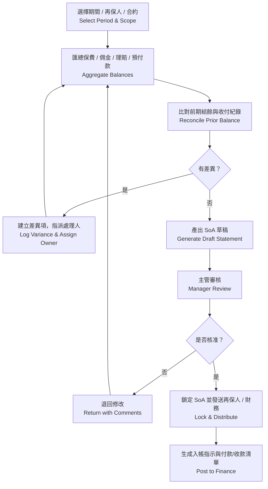
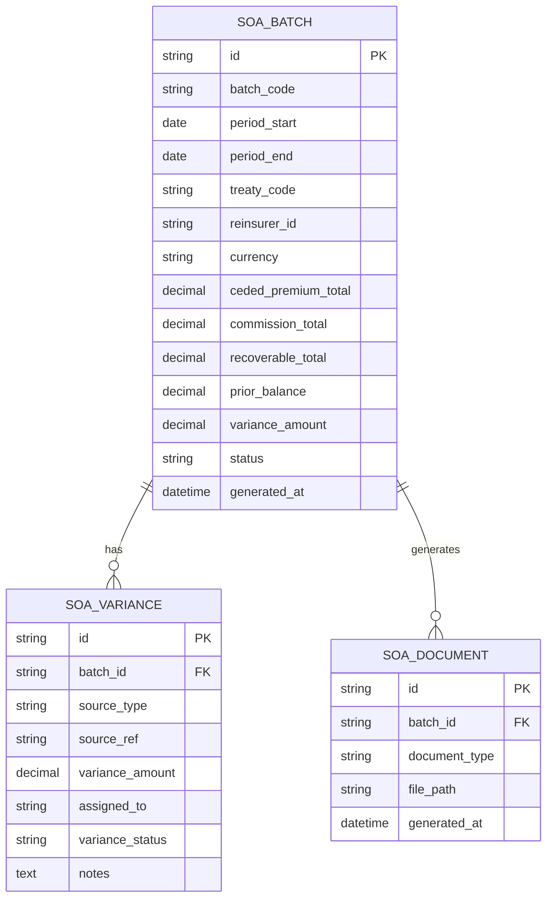

# 再保系統 FRD – Statement of Account Reconciliation  
# Reinsurance System FRD – Statement of Account Reconciliation

---

## 🏷️ Title Block
| 欄位 | 說明 |
|---|---|
| 文件名稱 | 再保系統功能需求文件 – SoA 對帳與結算模組 |
| 版本 | v1.0 |
| 文件狀態 | Draft |
| 作者 | Tao Yu 和他的 GPT 智能助手 |
| 修訂日期 | 2025-11-03 |
| 參考 PRD | `EIS-REINS-PRD-001.md`（UC-08 SoA 對帳與結算） |

---

## 1. 功能概述
SoA 模組整合分保保費、佣金、攤回與預付款資料，生成再保對帳單，協助財務與再保團隊進行結算與應收應付管理。

---

## 2. 角色與權限
| 角色 | 職責 | 權限摘要 |
|---|---|---|
| SoA 經辦 SoA Operator | 建立對帳批次、處理差異。 | 建立/編輯草稿、標記差異、提交審核。 |
| SoA 主管 SoA Manager | 審核並核准 SoA；處理例外。 | 審核、退回、鎖定對帳單。 |
| 財務 Finance | 入帳、付款、收款管理。 | 查閱唯讀、更新收款狀態、導出報表。 |
| 系統管理員 | 維護排程與參數。 | 排程設定、權限管理。 |

---

## 3. 前置條件
- 分保計算、攤回、臨分等資料已完成並可供匯總。  
- 匯率、參考參數已從財務系統更新。  
- 權限設定允許經辦建立或審核 SoA。

---

## 4. 業務流程

---

## 5. 功能需求
| 編號 | 功能 | 說明 | 來源 |
|---|---|---|---|
| FRD-SOA-01 | 批次設定 | 依期間、再保人、合約、多幣別產出對帳批次。 | PRD UC-08 |
| FRD-SOA-02 | 資料匯總 | 聚合分保保費、佣金、攤回、預付款與收付明細。 | PRD UC-08 |
| FRD-SOA-03 | 差異管理 | 差異清單需顯示來源、金額、負責人及狀態。 | PRD UC-08 |
| FRD-SOA-04 | 審核流程 | 草稿 → 待審 → 核准；核准後鎖定版本。 | PRD UC-08 |
| FRD-SOA-05 | SoA 文件 | 生成 PDF/Excel，包含明細、附件；可寄送再保人。 | PRD UC-08 |
| FRD-SOA-06 | 財務整合 | 核准後產生會計分錄、更新應收/應付、同步財務系統。 | PRD UC-08 |
| FRD-SOA-07 | 稽核 | 每次生成、調整、核准需寫入 AuditEvent（含差異處理）。 | PRD UC-08 |

---

## 6. UI 需求摘要
- 批次清單顯示期間、範圍、再保人、幣別、狀態、差異數、經辦。  
- 差異詳情頁需提供篩選與指派功能，狀態含 Pending / In Progress / Resolved。  
- SoA 詳情頁以 `SectionCard` 呈現「保費與佣金」「理賠攤回」「預付款與調整」「差異清單」「審核歷程」。  
- 成功訊息：「SoA 草稿已建立」「SoA 已核准並發送」。

---

## 7. 資料模型（簡化）

---

## 8. 欄位定義
| 欄位 | 說明 | 規則 |
|---|---|---|
| batch_code | 對帳批次代號 | string(20)，唯一；格式 SOA-YYYYQ#-###。 |
| period_start / end | 對帳期間 | Date。 |
| treaty_code / reinsurer_id | 合約與再保人識別 | 可為 ALL 表示多合約合併。 |
| currency | 結算幣別 | ISO 3 碼。 |
| variance_amount | 差異總額 | decimal(15,2)。 |
| status | 批次狀態 | Draft / Pending / Approved / Locked / Sent。 |
| variance_status | 差異狀態 | Pending / In Progress / Resolved / Waived。 |

---

## 9. 驗收標準
1. 能依選定期間／再保人建立 SoA 草稿並正確匯總金額。  
2. 差異清單可指派處理人與追蹤狀態，處理完成後可重新生成 SoA。  
3. 核准後鎖定結果，提供 PDF/Excel 檔案並寄送再保人/財務。  
4. 財務系統可接收對應分錄與應收/應付資料。  
5. 所有調整與核准動作皆有稽核紀錄。

---

## 10. 非功能需求
| 類別 | 說明 |
|---|---|
| 效能 | 單批次聚合 5,000 筆明細需在 10 分鐘內完成； UI 查詢 2 秒內回應。 |
| 安全 | SoA 檔案傳輸需加密；僅授權使用者可下載。 |
| 稽核 | AuditEvent 保存 7 年；版本可回溯。 |
| 通知 | 核准或差異逾期需自動通知相關人員。 |

---

## 11. 錯誤處理
| 代碼 | 描述 | 系統行為 |
|---|---|---|
| SOA-E001 | 聚合資料缺漏 | 停止批次並列入異常清單。 |
| SOA-E002 | 差異未處理即核准 | 阻止核准並顯示待處理項。 |
| SOA-E003 | 輸出檔案失敗 | 重試並記錄監控告警。 |
| SOA-E004 | 已鎖定批次被修改 | 阻止修改，提示需建立新批次。 |

---

## 12. 修訂紀錄
| 版本 | 日期 | 說明 |
|---|---|---|
| v1.0 | 2025-11-03 | 首版：依 PRD UC-08 撰寫 SoA 對帳與結算模組 FRD。 |

