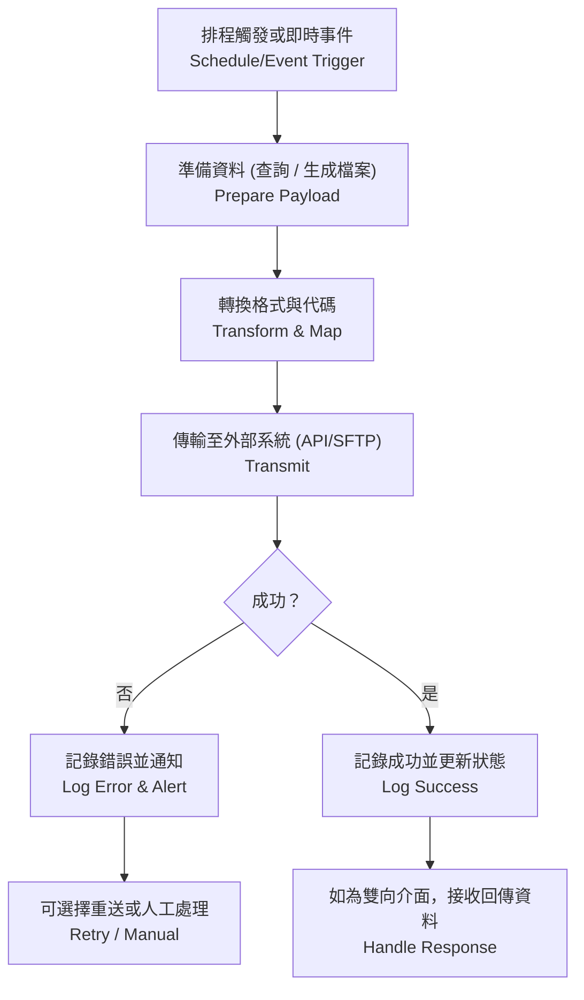
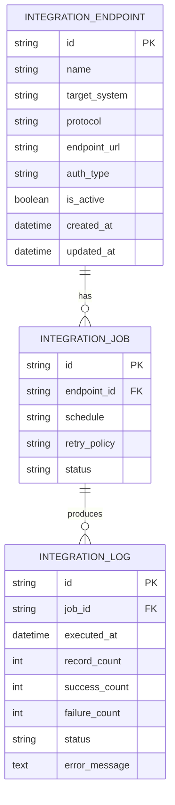

# 再保系統 FRD – System Integration  
# Reinsurance System FRD – System Integration

---

## 🏷️ Title Block
| 欄位 | 說明 |
|---|---|
| 文件名稱 | 再保系統功能需求文件 – 系統整合模組 |
| 版本 | v1.0 |
| 文件狀態 | Draft |
| 作者 | Tao Yu 和他的 GPT 智能助手 |
| 修訂日期 | 2025-11-03 |
| 參考 PRD | `EIS-REINS-PRD-001.md`（UC-12 系統整合） |

---

## 1. 功能概述
系統整合模組提供再保系統與核心保單、理賠、財務、IFRS17、稽核平台之間的資料交換能力，確保資料一致性與流程連通。

---

## 2. 介接對象
| 系統 | 資料內容 | 方向 | 頻率 |
|---|---|---|---|
| 核心保單系統 | 保單、批改、保費、保障資訊 | 介入 | 日批 + 即時 |
| 理賠系統 | 理賠通知、核定、支付 | 介入 | 日批 + 即時 |
| 財務系統 | 再保應收/應付、總帳分錄 | 雙向 | 日批 / 月結 |
| IFRS17 引擎 | Coverage Units、CSM/RA 參數與結果 | 雙向 | 月/季 |
| 稽核平台 (SIEM) | 操作稽核事件 | 介出 | 即時或 5 分鐘內 |

---

## 3. 功能需求
| 編號 | 功能 | 描述 | 來源 |
|---|---|---|---|
| FRD-SI-01 | 介面管理 | 設定 API/SFTP/SOAP 端點、驗證方式、資料格式與排程。 | PRD UC-12 |
| FRD-SI-02 | 資料映射 | 定義欄位映射、代碼轉換、匯率處理，支援 JSON/CSV/XML。 | PRD UC-12 |
| FRD-SI-03 | 健康檢查 | 監控連線、逾時、重試次數，提供狀態儀表板。 | PRD UC-12 |
| FRD-SI-04 | 例外處理 | 失敗時記錄原因並通知系統管理員，可手動重送。 | PRD UC-12 |
| FRD-SI-05 | 日誌與稽核 | 留存傳輸日誌，寫入 AuditEvent，保留 7 年。 | PRD UC-08/12 |

---

## 4. 整體流程

---

## 5. UI / 管理介面
- **介面設定頁**：列出所有介面（名稱、系統、協定、狀態、最後傳輸時間）；提供新增/編輯功能。  
- **排程管理頁**：設定排程頻率、執行時間、重試策略。  
- **傳輸日誌頁**：顯示傳輸批次、筆數、成功/失敗比率、錯誤訊息；支援條件篩選與匯出。  
- **通知設定頁**：可設定當錯誤或逾時時需通知的人員與方式。

---

## 6. 資料模型（簡化）

---

## 7. 欄位定義
| 欄位 | 說明 | 規則 |
|---|---|---|
| protocol | 協定 | REST / SOAP / SFTP / MQ。 |
| auth_type | 驗證 | OAuth2 / Basic / API Key / SSH。 |
| schedule | 排程 | Cron 表達式或時間間隔。 |
| retry_policy | 重試策略 | 次數、間隔、回退策略。 |
| status | 狀態 | Active / Inactive / Suspended；Log 狀態：Success / Failed / Partial。 |

---

## 8. 驗收標準
1. 可成功設定與啟用介面端點，測試連線通過。  
2. 排程按設定時間執行；失敗時可自動重試並通知。  
3. 介面日誌清楚顯示傳輸結果與錯誤；可匯出報表。  
4. AuditEvent 記錄介面設定變更、排程異動、手動重送。  
5. 外部系統成功接收/回傳資料，內容與再保系統一致。

---

## 9. 非功能需求
| 類別 | 說明 |
|---|---|
| 效能 | API 呼叫需於 5 秒內完成（正常情況）；批次傳輸支援平行處理。 |
| 安全 | 所有傳輸採用加密通道；敏感資料需遮罩或加密。 |
| 可用性 | 提供監控儀表板，顯示介面狀態、錯誤趨勢。 |
| 稽核 | 傳輸日誌與設定歷史保留至少 7 年。 |

---

## 10. 錯誤處理
| 代碼 | 描述 | 系統行為 |
|---|---|---|
| SI-E001 | 連線失敗 | 重試並記錄，連續失敗時通知管理員。 |
| SI-E002 | 驗證錯誤 | 停止傳輸並提示更新憑證或金鑰。 |
| SI-E003 | 資料格式錯誤 | 記錄錯誤並將批次移至例外處理。 |
| SI-E004 | 超時 | 依重試策略再執行，仍失敗則通知。 |

---

## 11. 修訂紀錄
| 版本 | 日期 | 說明 |
|---|---|---|
| v1.0 | 2025-11-03 | 首版：依 PRD UC-12 撰寫系統整合模組 FRD。 |

