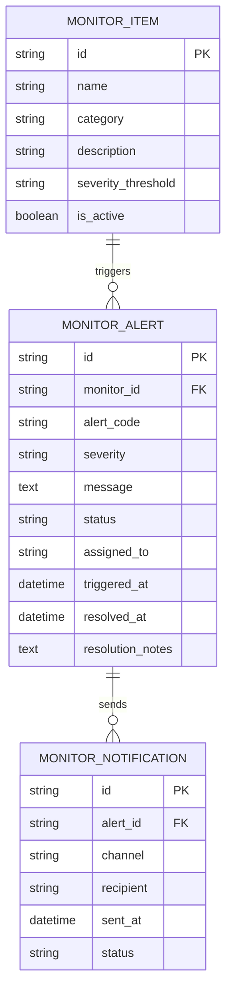

# 再保系統 FRD – System Monitoring & Notification  
# Reinsurance System FRD – System Monitoring & Notification

---

## 🏷️ Title Block
| 欄位 | 說明 |
|---|---|
| 文件名稱 | 再保系統功能需求文件 – 系統監控與通知模組 |
| 版本 | v1.0 |
| 文件狀態 | Draft |
| 作者 | Tao Yu 和他的 GPT 智能助手 |
| 修訂日期 | 2025-11-03 |
| 參考 PRD | `EIS-REINS-PRD-001.md`（UC-16 系統監控與通知） |

---

## 1. 功能概述
系統監控與通知模組監控批次排程、API、分保計算、SoA、IFRS17 等作業狀態，並於錯誤或異常時即時通知相關人員。

---

## 2. 角色與權限
| 角色 | 職責 | 權限摘要 |
|---|---|---|
| 系統管理員 Sys Admin | 設定監控項目、通知規則、排程。 | 管理監控項目與接收者。 |
| 作業支援 Ops Support | 監控實際作業狀態、處理告警。 | 查看儀表板、標記處理中/已完成。 |
| 模組負責人 Module Owner | 接收與模組相關通知，協助處理。 | 查閱指定模組告警。 |

---

## 3. 監控項目
| 項目 | 指標 | 告警條件 | 通知對象 |
|---|---|---|---|
| 批次排程 | 成功率、耗時 | 超過預設時間未完成、失敗 | Ops、模組負責人 |
| API | 呼叫次數、錯誤率、延遲 | 錯誤率 > 5%、超過節流 | API 管理員 |
| 分保計算 | 批次狀態 | 失敗或結果異常 | 分保經辦、主管 |
| SoA | 生成狀態、差異 | 差異未處理逾期 | SoA 經辦/主管 |
| IFRS17 | 批次完成情況 | 批次失敗 | 財務報導 |
| 安全 | 登入失敗、超權行為 | 連續失敗三次、超權嘗試 | 系統管理員、安全官 |

---

## 4. 功能需求
| 編號 | 功能 | 描述 | 來源 |
|---|---|---|---|
| FRD-SM-01 | 監控儀表板 | 顯示各監控項目狀態（正常、警示、錯誤）、歷史趨勢。 | PRD UC-16 |
| FRD-SM-02 | 通知設定 | 設定通知通道（Email/Slack/Teams）、收件者、升級規則。 | PRD UC-16 |
| FRD-SM-03 | 告警管理 | 標記告警為「處理中」「已解決」，記錄處理紀要。 | PRD UC-16 |
| FRD-SM-04 | 報表匯出 | 產出每日/每週監控報表。 | PRD UC-16 |
| FRD-SM-05 | 整合日誌 | 與 AuditEvent、Integration Log 等資料結合。 | PRD UC-16 |

---

## 5. UI 要求
- 儀表板以卡片呈現各監控項目；顏色區分狀態（綠=正常、黃=警示、紅=錯誤）。  
- 告警清單提供篩選（模組、等級、時間），可導出 CSV。  
- 通知設定介面可選擇事件類型、頻率、通道、收件者。  
- UI 需符合`docs/uiux/uiux-guidelines.md`。

---

## 6. 資料模型（簡化）

---

## 7. 驗收標準
1. 監控儀表板實時顯示各項目狀態，數據更新頻率符合需求（即時或 5 分鐘內）。  
2. 異常事件能依設定自動通知相關人員；通知內容清楚含事件描述與處理連結。  
3. 告警處理流程支援指派與備註，結案後可追蹤處理歷程。  
4. 報表可定期匯出或寄送（每日、每週）。  
5. 所有通知與操作記錄寫入 AuditEvent，提供稽核查詢。

---

## 8. 非功能需求
| 類別 | 說明 |
|---|---|
| 可用性 | 監控模組需 99.5% 以上可用率；支援行動裝置瀏覽。 |
| 效能 | 儀表板載入時間 < 2 秒；告警觸發至通知發送 < 1 分鐘。 |
| 安全 | 通知訊息不得顯示敏感資料；僅授權使用者可存取監控介面。 |

---

## 9. 錯誤處理
| 代碼 | 描述 | 系統行為 |
|---|---|---|
| SM-E001 | 監控指標收集失敗 | 顯示警告並重試，必要時通知系統管理員。 |
| SM-E002 | 通知發送失敗 | 重試並記錄，連續失敗通知管理員。 |
| SM-E003 | 告警處理無指派 | 要求指派負責人後才能變更狀態。 |

---

## 10. 修訂紀錄
| 版本 | 日期 | 說明 |
|---|---|---|
| v1.0 | 2025-11-03 | 首版：依 PRD UC-16 撰寫系統監控與通知模組 FRD。 |

