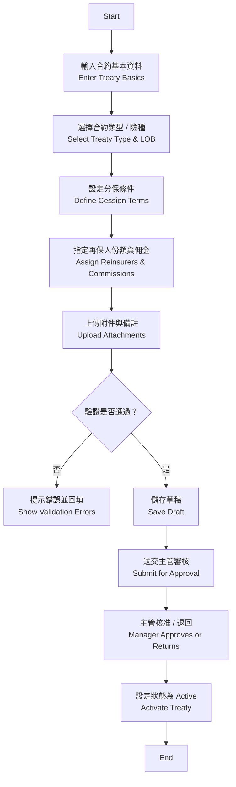
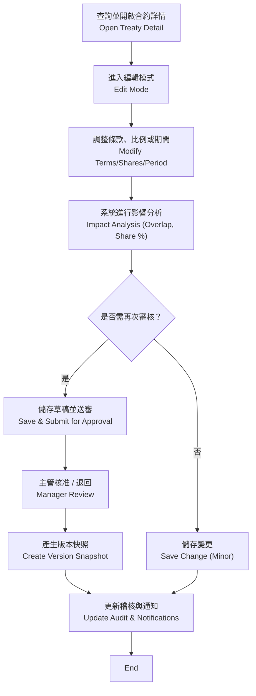
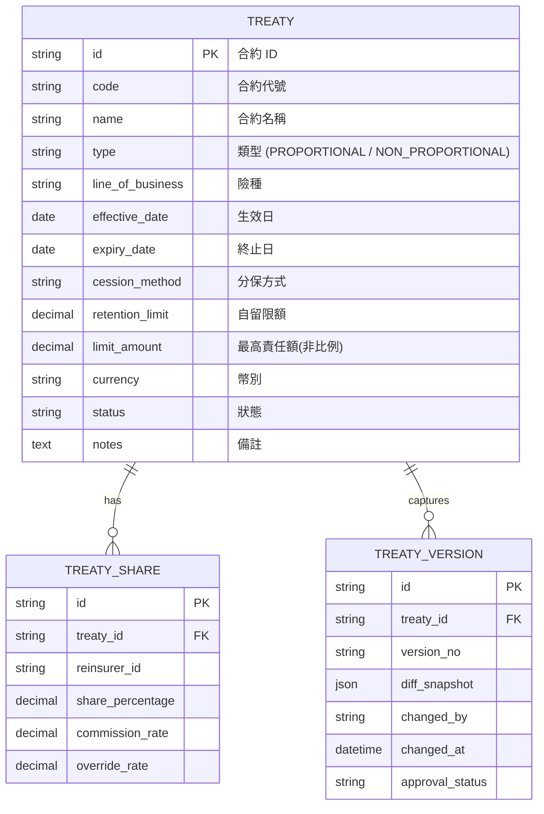

# 再保系統 FRD – Treaty Management  
# Reinsurance System FRD – Treaty Management

---

## 🏷️ Title Block / 文件基本資訊
| 欄位 Field | 說明 Description |
|---|---|
| 文件名稱 / Document Title | 再保系統功能需求文件 – 合約管理模組 |
| 版本 / Version | v2.0 |
| 文件狀態 / Status | Draft |
| 作者 / Author | Tao Yu 和他的 GPT 智能助手 |
| 修訂日期 / Revised On | 2025-11-03 |
| 參考 PRD / Reference PRD | `requirement/EIS-REINS-PRD-001.md`（對應 UC-02 建立再保合約、UC-03 維護再保合約） |
| 參考原型 / Reference Prototypes | `requirement/导出pdf json/2-1-合約管理.*`、`requirement/导出pdf json/2-2-合約管理-新增合約.*` |

---

## 1. 功能概述 / Function Overview
本文件敘述「合約管理模組」的功能需求，涵蓋**建立新合約**與**維護既有合約**兩個使用情境。  
This Functional Requirements Document (FRD) describes the features for the *Treaty Management* module, covering both **Create Treaty** and **Maintain Treaty** use cases.

---

## 2. 角色與權限 / User Roles & Permissions

| 角色 Role | 職責 Responsibility | 權限摘要 Permissions |
|---|---|---|
| 再保經辦 Reinsurance Officer | 建立、維護合約草稿；提交審核。 | 建立 / 編輯草稿、檢視所有合約、上傳附件 |
| 再保主管 Reinsurance Manager | 審核合約異動；批准或退回。 | 查看待審項目、核准 / 退回、查看稽核軌跡 |
| 再保審計 / 內控 Audit / Compliance | 檢視版本差異、下載稽核報表。 | 唯讀查詢、稽核記錄、導出報表 |
| 系統管理員 System Admin | 維護共用參數、管理權限與稽核資料。 | 參數設定、權限配置、維護代碼表 |

---

## 3. 前置條件 / Preconditions
- 使用者已登入並擁有相對應權限（經辦或主管）。  
- 再保人主檔、險種（LOB）、幣別、共用參數等皆已建立。  
- 若為維護既有合約，該合約必須處於可編輯狀態（非 Active 或需啟動修訂流程）。

---

## 4. 業務流程 / Business Processes

### 4.1 建立合約（對應 PRD UC-02）

### 4.2 維護合約（對應 PRD UC-03）

---

## 5. 功能需求對照 / Functional Requirements

| 編號 ID | 功能 Function | 描述 Description | 對應 PRD / Prototype |
|---|---|---|---|
| FRD-TM-01 | 合約基本資料維護 | 輸入代號、名稱、生效/終止日、年度、幣別。 | PRD UC-02 欄位表；原型 2-2 |
| FRD-TM-02 | 合約類型與分保條件 | 支援比例 (Quota Share, Surplus) 與非比例 (XOL, Stop Loss)；自動套用對應欄位。 | PRD UC-02；原型 2-2 |
| FRD-TM-03 | 再保人份額設定 | 可新增多家再保人，設定份額、佣金、費率；總和需 ≤ 100%。 | PRD UC-02；原型 2-2 |
| FRD-TM-04 | 限額與自留控管 | 非比例合約需輸入起賠點、限額、自留額；比例合約需設定保額上限。 | PRD UC-02 |
| FRD-TM-05 | 檢核與警示 | 驗證日期邏輯、份額總和、佣金範圍、合約重疊等；提供明確錯誤訊息。 | PRD UC-02 §業務規則 |
| FRD-TM-06 | 草稿與審核流程 | 草稿可多次儲存；提交後需主管審核；退回時保留修改建議。 | PRD UC-02、UC-03 |
| FRD-TM-07 | 版本管理 | 每次核准建立版本快照，保留差異、操作者、時間戳。 | PRD UC-03 |
| FRD-TM-08 | 狀態管理 | 支援 Draft / Pending / Active / Suspended / Closed；終止需記錄原因。 | PRD UC-02/03 |
| FRD-TM-09 | 稽核與通知 | 所有異動寫入 AuditEvent；送審、核准、退回觸發通知（Email/Slack）。 | PRD UC-02/03、UC-08 |
| FRD-TM-10 | UI 導覽 | 合約清單、詳情與新增頁應符合 Figma 版面與 `docs/uiux/uiux-guidelines.md`。 | 原型 2-1、2-2；UI 指南 |

---

## 6. 介面與樣式要求 / UI Requirements
- **列表頁 (2-1 合約管理)**：遵循 PageHeader + SectionCard 範式，支援搜尋、篩選、操作按鈕（檢視/編輯/刪除）。  
- **建立/編輯頁 (2-2 新增合約)**：表單分為「合約基本資訊」、「分保條件」、「再保人配置」、「附件與備註」四個 SectionCard，欄位對齊採 `FormGrid columns="three"` 佈局。  
- 成功訊息採用 Toast/Alert：「合約已成功建立」、「合約資料已更新」。  
- 使用者在草稿與送審階段需顯示流程狀態旗標（Pending, Active 等）。

---

## 7. 資料模型 / Data Model（簡化）

---

## 8. 關鍵欄位定義 / Field Dictionary

| 欄位 Field | 型別 Type | 說明 Description |
|---|---|---|
| code | string(20) | 手輸或系統產生，需唯一（格式建議 TRYYYY-XXXX）。 |
| name | string(100) | 合約中文名稱。 |
| type | enum | PROPORTIONAL / NON_PROPORTIONAL。 |
| line_of_business | string(50) | Fire / Motor / Life / Health… |
| effective_date / expiry_date | date | 合約期間，終止日不可早於生效日。 |
| cession_method | enum | QUOTA_SHARE / SURPLUS / XOL / STOP_LOSS / FACULTATIVE。 |
| retention_limit | decimal(15,2) | 自留額；比例合約可為 0，非比例必填。 |
| limit_amount | decimal(15,2) | 非比例合約之最高責任額。 |
| currency | string(3) | ISO 代碼（TWD, USD, JPY…）。 |
| share_percentage | decimal(5,2) | 再保人份額，合計需 ≤ 100%。 |
| commission_rate | decimal(5,2) | 再保佣金。 |
| override_rate | decimal(5,2) | Optional，若有 override/經紀佣金。 |
| status | enum | DRAFT / PENDING / ACTIVE / SUSPENDED / CLOSED。 |
| version_no | string(10) | 版本號（v1.0, v1.1…）。 |
| diff_snapshot | json | 差異內容（欄位、舊值、新值）。 |

---

## 9. 驗收標準 / Acceptance Criteria
1. 使用者可依 Figma 介面成功建立草稿並送審，所有驗證符合 PRD 規則。  
2. 再保人份額總和超過 100% 時顯示錯誤並禁止提交。  
3. 核准後生成版本快照，詳情頁可檢視差異與稽核記錄。  
4. 維護合約時，變更需遵循審核流程；退回時保留原草稿。  
5. 合約狀態改為 Active 後，關鍵欄位（分保方式、再保人份額、生效日）不可直接修改，若需調整需建立新版本。  
6. 所有建立、修改、核准動作均寫入 AuditEvent，並可於稽核報表查詢。

---

## 10. 錯誤處理 / Error Handling

| 錯誤代碼 Code | 描述 Description | 系統行為 System Response |
|---|---|---|
| TM-E001 | 缺少必填欄位 | 顯示紅框與訊息，禁止儲存。 |
| TM-E002 | 日期邏輯錯誤 | 提示「終止日不可早於生效日」。 |
| TM-E003 | 再保人份額超過 100% | 顯示警示並禁止送審。 |
| TM-E004 | 合約代號重複 | 阻止儲存，要求更換代號。 |
| TM-E005 | 合約期間重疊 | 列出衝突合約並要求調整。 |

---

## 11. 非功能性需求 / Non-Functional Requirements

| 類別 Category | 說明 Description |
|---|---|
| 效能 Performance | 合約列表查詢 3,000 筆內須於 3 秒內回應；儲存草稿於 2 秒內完成。 |
| 安全 Security | 僅授權角色可建立或審核；操作需符合公司 RBAC。 |
| 稽核 Audit | 依 PRD UC-08 需保存 7 年稽核記錄，支援欄位差異檢視。 |
| 可用性 Usability | 介面符合 `docs/uiux/uiux-guidelines.md`，支援中英文切換。 |

---

## 12. 修訂紀錄 / Revision History

| 版本 Version | 日期 Date | 說明 Notes |
|---|---|---|
| v2.0 | 2025-11-03 | 依 PRD 更新重新命名文件，合併建立/維護合約情境；同步 Figma 與 UI 指南。 |
| v1.1 | 2025-10-23 | 初版（僅覆蓋「建立合約」流程，舊版檔名 `EIS-REINS-FRD-UC-01.md`）。 |

