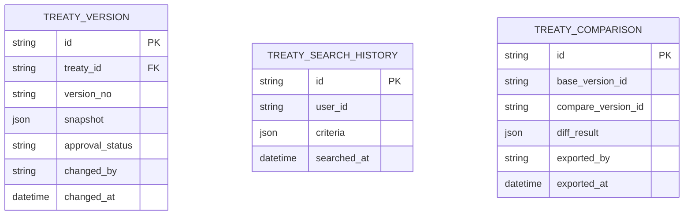

# 再保系統 FRD – Treaty Search & Comparison  
# Reinsurance System FRD – Treaty Search & Comparison

---

## 🏷️ Title Block
| 欄位 | 說明 |
|---|---|
| 文件名稱 | 再保系統功能需求文件 – 合約查詢與比對模組 |
| 版本 | v1.0 |
| 文件狀態 | Draft |
| 作者 | Tao Yu 和他的 GPT 智能助手 |
| 修訂日期 | 2025-11-03 |
| 參考 PRD | `EIS-REINS-PRD-001.md`（UC-13 再保合約查詢與比對） |

---

## 1. 功能概述
合約查詢與比對模組提供強化的搜尋、篩選、比較功能，協助核保、審計與風控人員快速掌握合約內容與版本差異。

---

## 2. 使用者角色
| 角色 | 職責 | 權限摘要 |
|---|---|---|
| 核保人 Underwriter | 查詢合約、比較條款、評估覆蓋範圍。 | 查詢、比對、匯出。 |
| 稽核/法遵 Auditor | 分析版本差異、查閱審核歷程。 | 查詢、導出稽核報表。 |
| 再保主管 Manager | 檢視關鍵合約、核准變更。 | 查詢、查看差異、核准。 |
| 系統管理員 | 維護索引與權限。 | 系統設定。 |

---

## 3. 功能需求
| 編號 | 功能 | 描述 | 來源 |
|---|---|---|---|
| FRD-TS-01 | 搜尋條件 | 依合約代號、名稱、險種、再保人、期間、狀態、幣別、多關鍵字搜尋。 | PRD UC-13 |
| FRD-TS-02 | 篩選與排序 | 提供狀態、類型、最新更新時間、審核狀態等篩選；排序支援多欄位。 | PRD UC-13 |
| FRD-TS-03 | 合約比對 | 選擇兩份合約或不同版本進行欄位差異比較，顯示舊值/新值。 | PRD UC-13 |
| FRD-TS-04 | 差異報表 | 生成差異報表，可匯出 PDF/Excel；標註重點欄位。 | PRD UC-13 |
| FRD-TS-05 | 稽核連結 | 單擊差異可導至稽核歷程；顯示變更操作者、時間、理由。 | PRD UC-13 |
| FRD-TS-06 | 替代搜尋 | 若無結果，提供相似合約或臨分案建議。 | Future Enhancement |

---

## 4. UI 要求
- 搜尋條件區使用 `FormGrid columns="three"`，提供快速清除與儲存常用條件。  
- 結果列表顯示主要欄位：代號、名稱、險種、再保人、期間、狀態、最新版本、最後更新。  
- 比對視窗以雙欄格式呈現，重要差異高亮；支援展開/收合欄位群組。  
- 匯出按鈕位於頂端操作區，產出時間與操作者需記錄。  
- UI 符合 `docs/uiux/uiux-guidelines.md`。

---

## 5. 資料模型（簡化）


---

## 6. 欄位差異呈現
差異資料以 JSON 儲存：
```json
[
  { "field": "commission_rate", "oldValue": "10%", "newValue": "12%" },
  { "field": "limit_amount", "oldValue": "10,000,000", "newValue": "12,500,000" }
]
```
介面需將欄位名稱映射為易讀文字（參考 PRD 欄位定義）。

---

## 7. 驗收標準
1. 搜尋可依多條件組合執行並在 3 秒內回應（1,000 筆內）。  
2. 差異比對能正確顯示欄位舊值與新值，支援匯出。  
3. 匯出報表包含查詢條件、比較版本、差異欄位、產出時間。  
4. 稽核歷程可從比對畫面跳轉；記錄明確。  
5. 未找到資料時提供提示並建議其他條件。

---

## 8. 非功能需求
| 類別 | 說明 |
|---|---|
| 效能 | 對索引建立（ElasticSearch / 專用索引）確保快速搜尋。 |
| 安全 | 依權限決定可見欄位；敏感資料（佣金）僅授權角色可見。 |
| 稽核 | 搜尋與匯出需寫入 AuditEvent（含條件、操作者）。 |

---

## 9. 錯誤處理
| 代碼 | 描述 | 行為 |
|---|---|---|
| TS-E001 | 查詢條件格式錯誤 | 提示並阻止執行。 |
| TS-E002 | 匯出失敗 | 重試並發出告警。 |
| TS-E003 | 無權限查看差異欄位 | 鎖定欄位值並顯示提示。 |

---

## 10. 修訂紀錄
| 版本 | 日期 | 說明 |
|---|---|---|
| v1.0 | 2025-11-03 | 首版：依 PRD UC-13 撰寫合約查詢與比對模組 FRD。 |

