# 再保系統產品需求文件 (PRD) / Reinsurance System Product Requirements Document

---

## 🏷️ Title Block / 文件基本資訊

| 欄位 Field | 說明 Description |
|-------------|------------------|
| 文件名稱 / Document Title | 再保系統產品需求文件 Reinsurance System PRD |
| 版本 / Version | v1.0 (Draft) |
| 文件狀態 / Status | Draft for Internal Review |
| 文件編號 / Document ID | EIS-REINS-PRD-001 |
| 作者 / Author | Tao Yu 和他的 GPT 智能助手 |
| 建立日期 / Created On | 2025-9-25 |
| 最近修訂 / Last Updated | 2025-11-03 |
| 專案名稱 / Project Name | Reinsurance System (Taiwan Market + Global Scalability) |
| 核心技術 / Core Tech Focus | AI-assisted requirement gathering, system design & code generation |
| 目標版本 / Target Version | MVP by 2025-11-30 |
| 審核人 / Reviewer | Qili Zhang, Ran Guo |

---

## 1. 簡介 / Introduction

本 PRD 的目的是將 BRD（商業需求文件）中所定義的高階業務需求，轉化為具體、可執行的產品功能、使用案例 (Use Cases)、介面流程 (UI Flow)、資料結構與整合需求。  
This PRD aims to translate the high-level business requirements from the BRD into actionable product functions, detailed use cases, user interface flows, data structures, and integration requirements.

本系統以 AI 輔助分析為主要設計理念，期望自動化再保合約管理、臨分處理、分保計算、IFRS17 報表產出與 SoA 對帳流程，並支援資料導入、API 整合與跨模組擴充。  
The system is designed around AI-assisted analysis, aiming to automate treaty management, facultative processing, cession calculation, IFRS17 report generation, and SoA reconciliation, while supporting data import, API integration, and cross-module extensibility.

---

## 2. 專案目標 / Project Objectives

### 🎯 2.1 目標概述 / Objective Overview

本專案旨在建立一套**獨立且可外掛式再保系統 (Standalone Reinsurance System)**，能與 EIS Suite 或其他核心保險系統無縫整合，並特別針對台灣市場需求優化，同時保留國際化可擴展架構。  
The project aims to build an independent and pluggable reinsurance system that integrates seamlessly with EIS Suite or other core insurance systems, optimized for the Taiwan market while maintaining global scalability.

### 🧭 2.2 SMART 目標 / SMART Goals

| 指標類型 | 說明 (中文) | Description (English) |
|-----------|-------------|------------------------|
| **Specific** | 建立獨立再保系統，涵蓋 Treaty、Facultative、分保引擎、SoA 對帳、IFRS17 報表。 | Build an independent reinsurance system covering Treaty, Facultative, Cession Engine, SoA Reconciliation, and IFRS17 Reporting. |
| **Measurable** | 系統導入後，對帳錯誤率下降 90%，月結效率提升 50%。 | Reduce reconciliation error rate by 90% and improve closing efficiency by 50%. |
| **Achievable** | 利用 AI 技術輔助需求整理、系統設計與程式建置，降低人力投入。 | Leverage AI to assist in requirements, design, and code generation to reduce manual effort. |
| **Relevant** | 對應台灣壽險與產險公司再保痛點。 | Address key reinsurance pain points for Taiwan’s life and P&C insurers. |
| **Time-bound** | 2025 年 11 月底完成 MVP，12 月初交付第一版成果。 | Complete MVP by end of November 2025, first deliverable in early December 2025. |

---

## 3. 範圍與邊界 / Scope & Boundaries

### 3.1 包含範圍 / In Scope

| 模組 Module | 功能描述 Description |
|--------------|-----------------------|
| **再保人管理 (Reinsurer Management)** | 維護再保人主檔、授權狀態與聯絡窗口；支援清單檢視、詳情、建立、編輯、刪除與稽核紀錄串接。 Maintain reinsurer master data, authorization status, contacts, and provide list/detail/create/update/delete with audit integration. |
| **合約管理 (Treaty Management)** | 管理再保合約主檔、條款、比例設定、期間與對手方資訊。 Manage reinsurance treaty master data, clauses, quota shares, duration, and counterparties. |
| **臨分管理 (Facultative Management)** | 處理個別風險再保（非合約內部的單件臨時分保）。 Handle ad-hoc reinsurance per policy or risk outside treaty coverage. |
| **分保計算引擎 (Cession Engine)** | 根據契約條件計算分保保費、理賠與佣金。 Compute ceded premiums, claims, and commissions per defined treaty terms. |
| **分入再保 (Assumed Reinsurance)** | 以本保險公司作為再保人承作之分入再保業務，MVP 僅涵蓋再保人主檔關聯、合約建檔與核保資料的登錄流程，後續階段擴充試算與對帳。 Assumed reinsurance where the insurer acts as reinsurer; MVP covers reinsurer linkage, treaty setup, and underwriting data capture with later phases extending to pricing and settlement. |
| **理賠攤回 (Claim Recovery)** | 支援理賠攤回處理與追蹤再保人回覆狀態。 Support claim recovery processing and reinsurer settlement tracking. |
| **SoA 對帳與結算 (Statement of Account)** | 自動生成 SoA，進行再保結算與對帳。 Automate SoA generation, reconciliation, and settlement. |
| **IFRS17 報表支援** | 依 IFRS17 標準生成 CSM、RA 與再保收益相關報表。 Generate IFRS17-related reports such as CSM, RA, and reinsurance revenue adjustments. |
| **資料遷移與導入 (Data Migration & Import)** | 提供自 Excel/CSV 或舊系統批次匯入功能。 Support data import from Excel/CSV or legacy database migration. |
| **權限與稽核 (Access & Audit)** | 管理角色權限、操作稽核與歷史紀錄。 Manage user roles, audit trails, and transaction logs. |

---

### 3.2 不包含範圍 / Out of Scope (Phase 1)

| 模組 Module | 說明 Description |
|--------------|------------------|
| **再再保 (Retrocession)** | 再保人將風險再分出的作業不在第一階段。 Retrocession process excluded from initial release. |
| **擔保品管理 (Collateral Management)** | 非核心功能，預留架構供未來擴充。 Not core for MVP; placeholder for future expansion. |
| **美國報表 (Schedule F Reporting)** | 僅限美國 NAIC 需求，不屬台灣市場標準。 US NAIC-specific reporting not relevant for Taiwan phase. |

---

### 3.3 延伸功能 (Future Scope)

- AI 自動合約解析 (AI Contract Parsing)  
- 再保費率預測與最佳化 (AI Rate Optimization)  
- 再保人風險信用評等分析 (Reinsurer Risk Profiling)  
- 協同審批與電子簽章 (Collaborative Workflow & e-Signature)

### 3.4 全球化與多語系支援 / Globalization & Multi‑language Support

- **系統定位**：本專案必須自第一版起支援多國語言（最少含繁體中文、簡體中文、英文），確保可於亞太與全球客戶部署。  
- **技術原則**：所有 UI 文案、提示、錯誤訊息、郵件模板需以 i18n Key 管理，禁止硬寫文字。行動層與服務層回傳訊息亦需提供語系化字串。  
- **內容治理**：翻譯資源集中於 `locales/<lang>/`（或後續 ADR 指定位置），需納入版本控制並由產品/在地化人員審核。  
- **Fallback 與組態**：未提供翻譯時需回退至預設語系（繁體中文），並允許依租戶或使用者偏好切換語言。  
- **UI 考量**：版面需預留 30% 以上文字伸展空間、支援不同字體長度，並符合 UI/UX 導則新增之多語系規範。  
- **時區與格式**：日期、金額、數字格式與幣別顯示應依語系與地區自動調整（例如 `2025-12-31` vs `31 Dec 2025`）。

---

## 4. 使用案例總覽 / Use Case Overview

本文件涵蓋 14 個核心使用案例，橫跨再保合約、臨分、分入再保與系統營運治理流程。  
This document covers 14 core use cases across treaty, facultative, assumed reinsurance, and supporting operational capabilities.

| 編號 | 使用案例名稱 (中文) | Use Case (English) |
|------|----------------------|--------------------|
| UC-01 | 再保人資料管理 | Manage Reinsurer Directory |
| UC-02 | 建立再保合約 | Create Reinsurance Treaty |
| UC-03 | 維護再保合約 | Maintain Treaty |
| UC-04 | 建立臨分案 | Create Facultative Case |
| UC-05 | 分保計算 | Perform Cession Calculation |
| UC-06 | 分入再保承接 | Assumed Reinsurance Intake |
| UC-07 | 理賠攤回處理 | Claim Recovery |
| UC-08 | SoA 對帳與結算 | Statement of Account Reconciliation |
| UC-09 | IFRS17 報表生成 | IFRS17 Reporting |
| UC-10 | 資料導入與遷移 | Data Import & Migration |
| UC-11 | 權限與稽核 | Access Control & Audit Trail |
| UC-12 | 系統整合 | System Integration |
| UC-13 | 再保合約查詢與比對 | Treaty Search & Comparison |
| UC-14 | API 介面管理 | API Interface Management |
| UC-15 | 系統設定與參數維護 | System Configuration & Parameters |
| UC-16 | 系統監控與通知 | System Monitoring & Notification |

---

## UC-01：再保人資料管理 / Manage Reinsurer Directory

### 🎯 目的 / Objective
建立並維護再保人主檔，提供清單檢視、詳情頁面、建立與維護流程，並串接系統稽核紀錄，以支援再保對手方管理。  
Maintain the reinsurer master directory with list/detail views, create & update workflows, and integrated audit trail to support counterparty management.

> UI 參考：`requirement/导出pdf json/1-1-再保人管理.*`、`requirement/导出pdf json/1-2-再保人管理-新增再保人.*`；共用設計規則請見 `docs/uiux/uiux-guidelines.md`。

### 🧩 主要流程 / Main Flow
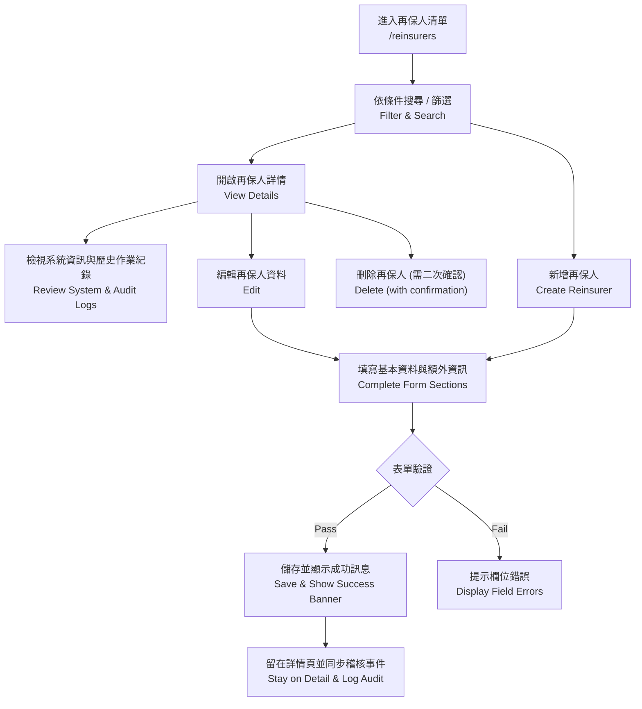

### 🧾 欄位定義 / Key Data Fields

| 欄位 Field | 說明 Description | 規則 Rules | 範例 Example |
|---|---|---|---|
| code | 再保人代號 | 建立時必填且不可重複；編輯時不可修改。 | RIN-001 |
| name | 再保人名稱 | 必填，顯示於清單與詳情標題。 | Global Reinsurance Co. |
| legalName | 法人名稱 | 選填；顯示於詳情。 | Global Reinsurance Company Ltd. |
| rating | 信用評等 | 選填；Active 狀態建議提供。 | A+ |
| registrationNumber | 登記證號碼 | 選填；格式為字母 + 數字。 | FSC-2025-01 |
| taxId | 稅務識別碼 | 選填；支援英數字。 | 12345678-9 |
| type | 再保人類型 | 必填；下拉選單（公司、互助會、勞合社聯營體、政府等）。 | COMPANY |
| status | 狀態 | 必填；預設 ACTIVE，支援無效、審核中、黑名單等。 | ACTIVE |
| website | 官方網站 | 選填；需為合法 URL。 | https://www.example.com |
| parentCompanyId | 母公司代號 | 選填；可連結同系統其他再保人。 | RIN-HOLD-01 |
| description | 備註 | 選填；支援多行文字。 | 主要承作財產保險。 |

### ⚙️ 業務規則 / Business Rules
- 再保人代號（code）不可重複；建立時需檢查唯一性。
- 切換狀態為 `ACTIVE` 時建議提供評等（Rating）；若缺漏，系統提示確認。
- 黑名單 (`BLACKLISTED`) 狀態的再保人，不可於合約建立時選為對手方。
- 所有新增、修改、刪除操作需寫入 `AuditEvent`，紀錄欄位異動前後值。
- 刪除前需檢查是否已綁定合約；若存在關聯，禁止刪除並提示使用者。

### ✅ 驗收準則 / Acceptance Criteria
- 清單顯示分頁、搜尋與排序；欄位包含代號、名稱、法人名稱、類型、狀態、評等、建立日期。
- 新增成功後停留於詳情頁，顯示「再保人已成功建立」提示，並可於歷史作業紀錄看到新增事件。
- 編輯成功後保留在詳情頁，顯示「再保人資料已更新」提示，並更新稽核紀錄。
- 刪除操作需二次確認，成功後返回清單並顯示成功訊息。
- UI 與欄位行為符合 `docs/uiux/uiux-guidelines.md` 及 Figma 原型（欄位對齊、按鈕樣式、訊息提示）。
- 相關 API / Server Action 成功寫入稽核與快取失效（`revalidatePath("/reinsurers")`）。

---

## UC-02：建立再保合約 / Create Reinsurance Treaty

### 🎯 目的 / Objective
建立新的再保合約（Treaty），支援比例與非比例類型，並定義期間、層級、再保人份額與佣金條件。  
Create a new reinsurance treaty supporting both proportional and non-proportional types, defining duration, layers, shares, and commission terms.

### 🧩 主要流程 / Main Flow
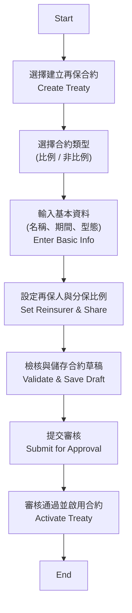

### 🧾 欄位定義 / Key Data Fields

| 欄位 Field | 說明 Description | 範例 Example |
|---|---|---|
| treaty_id | 合約編號 / Unique Treaty ID | TR2025-0001 |
| treaty_name | 合約名稱 / Treaty Name | 2025 財產保險比例合約 |
| treaty_type | 合約類型（比例 / 非比例） / Type | Quota Share / XOL |
| line_of_business | 險種別 / Line of Business | Fire / Motor / Life |
| effective_date | 生效日 / Effective Date | 2025-01-01 |
| expiry_date | 終止日 / Expiry Date | 2025-12-31 |
| cession_method | 分保方式 / Cession Method | Quota, Surplus, XOL |
| reinsurer_id | 再保人代號 / Reinsurer ID | RIN-001 |
| share_percentage | 再保人分保比例 / Share % | 40% |
| commission_rate | 佣金比率 / Commission % | 10% |
| currency | 幣別 / Currency | TWD / USD |
| product_code | 產品代碼 / Product Code | FIRE-01 |
| coverage_id | 保險項目代碼 / Coverage ID | COV-F001 |
| peril_id | 災別代碼 / Peril ID | EQ, TC, FL |
| geo_region | 地理區域 / Geographic Region | North Taiwan |
| status | 狀態 / Status | Draft / Active / Closed |

### ⚙️ 業務規則 / Business Rules
- 每一合約需至少指定一再保人，且總分保比例不得超過 100%。  
- 佣金比率不得為負值；若有分段佣金（Sliding Scale），需設定上下限區間。  
- 合約期間不得重疊相同險種。  
- 非比例合約需設定責任限額 (Limit) 與自留額 (Retention)。  

### ✅ 驗收準則 / Acceptance Criteria
- 使用者可成功新增合約並於列表中顯示。  
- 系統自動生成合約編號（格式：TRYYYY-XXXX）。  
- 系統驗證再保人份額合計 = 100% 時方可提交。  
- 審批通過後狀態變更為「Active」。  

---

## UC-03：維護再保合約 / Maintain Reinsurance Treaty

### 🎯 目的 / Objective
允許使用者修改既有合約（如佣金調整、延展合約期間），同時保留修改紀錄供稽核。  
Allow users to modify existing treaties (e.g., commission adjustment, period extension) with full audit tracking.

### 🧩 主要流程 / Main Flow
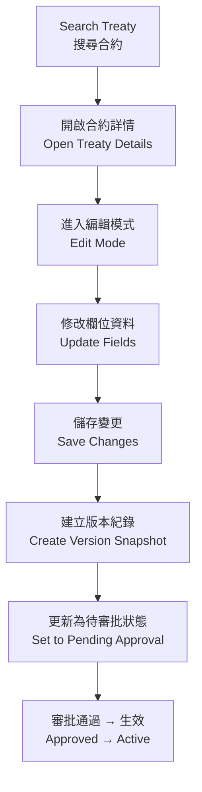

### 🧾 關鍵欄位與版本控制 / Key Fields & Versioning

| 欄位 Field | 說明 Description | 範例 Example |
|---|---|---|
| version_no | 版本號 | v1.1 |
| change_reason | 修改原因 | 延長合約至 2026 年 |
| modified_by | 修改人員 | user_id |
| modified_on | 修改時間 | 2025-07-10 |
| approval_status | 審批狀態 | Pending / Approved / Rejected |

### ⚙️ 業務規則 / Business Rules
- 所有調整需維持分保比例總和 ≤ 100%，並重新計算相關佣金或 Sliding Scale。
- 調整合約期間時需同步檢查與其他合約的重疊衝突。
- 重大變更（如新增再保人、調整責任限額）需觸發重新審批流程並通知相關單位。
- 每次修改均建立版本快照，保留歷史資料供查詢與回溯。

### ✅ 驗收準則 / Acceptance Criteria
- 編輯完成後可在詳情頁檢視最新版本並於歷史紀錄看到前版差異。
- 審批流程可記錄簽核意見，未核准前不可切換為 Active。
- 調整造成的再保人分攤比例、責任額度及佣金變化應即時更新。

---

## UC-04：建立臨分案 / Create Facultative Case

### 🎯 目的 / Objective
針對超出合約範圍或特殊風險，建立臨時分保案。  
Create facultative cases for risks not covered by existing treaties.

### 🧩 主要流程 / Main Flow
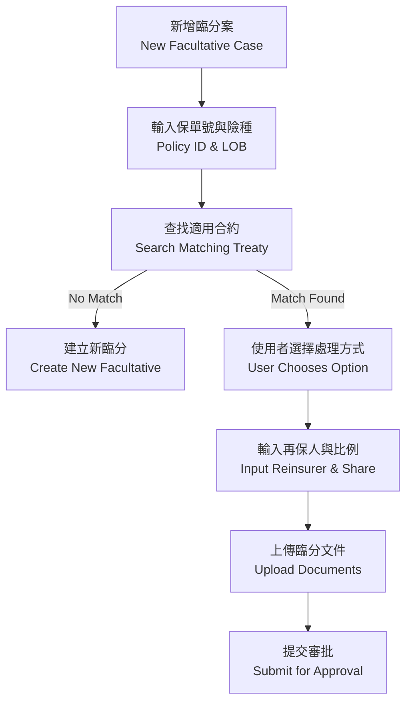

### 🧱 臨分主要欄位 / Facultative Case Fields

| 欄位名稱 | 英文名稱 | 類型 | 說明 |
|---|---|---|---|
| 臨分編號 | fac_id | String | 系統自動生成唯一 ID |
| 原保單號碼 | policy_no | String | 來源保單編號 |
| 再保人代碼 | reinsurer_code | String | 對應再保人識別碼 |
| 保額 | sum_insured | Decimal | 原保單保額 |
| 臨分比例 | fac_share | Decimal | 再保人承保比例 |
| 臨分保費 | fac_premium | Decimal | 分出保費金額 |
| 文件上傳 | attachments | File | 臨分協議或簽單檔案 |

---

## UC-05：分保計算 / Perform Cession Calculation

### 🎯 目的 / Objective
依合約條款自動計算應分保費與理賠金額。  
Automatically calculate ceded premium and claim amounts based on treaty terms.

### 🧩 主要流程 / Main Flow
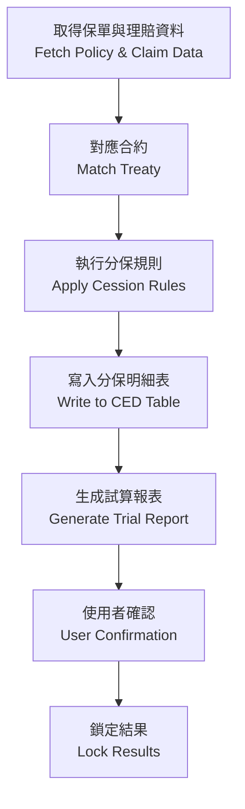

### 🧾 主要計算項目 / Key Calculation Fields

| 項目 | 說明 | 範例 |
|---|---|---|
| gross_premium | 原保費 | 1,000,000 |
| retention | 自留額 | 200,000 |
| ceded_premium | 分出保費 | 800,000 |
| commission | 再保佣金 | 80,000 |
| claim_gross | 原理賠 | 500,000 |
| claim_recoverable | 攤回金額 | 400,000 |

---

## UC-06：分入再保承接 / Assumed Reinsurance Intake

### 🎯 目的 / Purpose
紀錄與評估分入再保（Assumed Reinsurance）合約，讓公司作為再保人承作他社風險，配合臺灣市場常見之海外回分與共保需求。  
Capture and assess assumed reinsurance treaties so the insurer can accept cedants’ risks, aligning with Taiwan market practices such as quota-share inward business and regional retro placements.

### 🧩 流程說明 / Main Flow

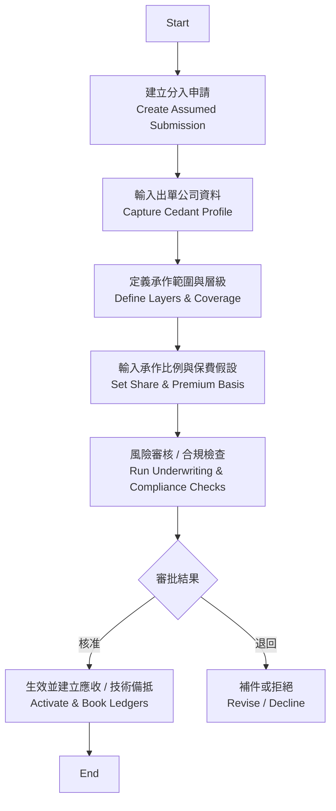

### 🧾 主要欄位 / Key Data Fields

| 欄位 Field | 說明 Description | 範例 Example |
|---|---|---|
| inward_treaty_code | 分入合約代號 | INW-2025-001 |
| cedant_name / cedant_code | 出單公司名稱 / 代碼 | Taiwan Life / CED-001 |
| line_of_business | 承保險種 | Property Cat, Life, Health |
| inforce_period | 承作期間 | 2025-01-01 ~ 2025-12-31 |
| attachment_point | 起賠點 / 自留額 | TWD 50,000,000 |
| limit_amount | 最高責任額 | TWD 300,000,000 |
| our_share | 我方承作比例 | 20% |
| gross_premium_estimate | 預估分入保費 | TWD 45,000,000 |
| brokerage / override | 仲介佣金或 Override | 5% |
| security_requirement | 擔保品 / 信用品質要求 | Letter of Credit, RBC ≥ 200% |
| reporting_frequency | 申報頻率 | Quarterly Bordereaux |
| settlement_currency | 結算幣別 | USD |
| status | 流程狀態 | Draft / Under Review / Active / Declined |

### ⚙️ 業務規則 / Business Rules
- 必須檢視 cedant 信用品質（AM Best / S&P 等級或當地監理評等）；未達標時須附加擔保品或保證金。
- 我方承作比例不得超出公司自訂的風險承作上限與資本適足率（RBC）政策，超過時需提交再保委員會核准。
- 所有分入合約文件（協議、Slip、承保批覆）需上傳歸檔並寫入 AuditEvent。
- 生效後需自動產生應收保費、技術備抵與預估理賠敞口，並同步財務 / IFRS17 模組。

### ✅ 驗收準則 / Acceptance Criteria
- 使用者可建立、編輯、審核與啟用分入再保合約；整個流程均有稽核紀錄。
- 成功啟用後，可於報表匯出預估保費、佣金、責任額度與申報頻率。
- 合約啟用時可同步至財務與 IFRS17 模組，以利收益認列與保留備抵計算。

---

## UC-07：理賠攤回處理 / Claim Recovery Management

### 🎯 目的 / Purpose
依據再保合約條款自動計算攤回金額、追蹤再保人回覆與付款狀態，並支援財務入帳與稽核。  
Automatically compute recoverable amounts per treaty terms, track reinsurer responses and settlements, and support downstream accounting/audit needs.

### 🧩 流程說明 / Process Flow

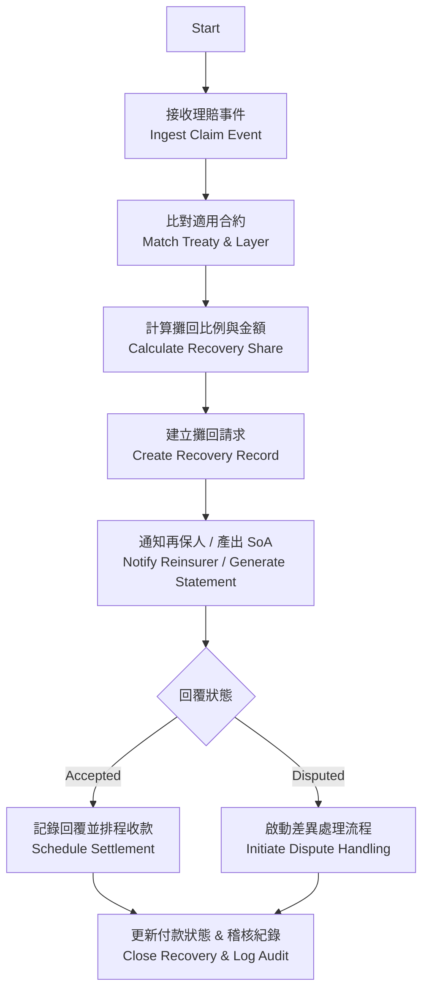

### 🧾 主要欄位 / Key Data Fields

| 欄位 Field | 說明 Description | 範例 Example |
|---|---|---|
| recovery_id | 攤回案件編號 | REC-2025-0008 |
| claim_id | 原理賠編號 | CLM-2025-0102 |
| treaty_code | 契約代號 | TR2025-0001 |
| reinsurer_code | 再保人代碼 | RIN-001 |
| loss_date | 出險日期 | 2025-04-18 |
| ceded_ratio | 攤回比例 | 80% |
| recoverable_amount | 應攤回金額 | TWD 320,000 |
| recovery_currency | 結算幣別 | TWD |
| due_date | 預計收款日 | 2025-05-31 |
| response_status | 再保人回覆狀態 | Pending / Accepted / Disputed / Paid |
| settlement_reference | 收款參考號 | SWIFT-1234 |
| dispute_reason | 爭議原因 | Coverage Exclusion |

### ⚙️ 業務規則 / Business Rules
- 依合約條款自動判斷攤回比例；若存在多層或臨分，需分拆記錄並合計。
- 攤回請求須附上理賠明細、核定書與相關附件；缺件時不得送出。
- 超過既定天數未回覆需發送提醒並升級給再保協調窗口。
- 若再保人爭議，需建立差異項並記錄處理進度；結論後更新最終攤回金額。
- 付款完成後需自動產生日記帳資料，對應財務系統應收帳款與 SoA。
- 所有狀態變更均寫入 AuditEvent，保留欄位前後值與操作者。

### ✅ 驗收準則 / Acceptance Criteria
- 可從理賠事件自動生成攤回案件，系統計算金額與比例正確，並可人工調整（受權控管）。
- 再保人回覆狀態、付款資訊與附件完整記錄，可匯出報表供財務對帳。
- 爭議流程需支援備註、附件與多次往返，結案後有完整歷程。
- 攤回資料可同步至 SoA 與財務系統，並在稽核頁面查詢到所有變更記錄。

---

## UC-08：SoA 對帳與結算 / Statement of Account Reconciliation

### 🎯 目的 / Purpose
彙整當期分保保費、佣金、攤回與預付款，產出再保對帳單（Statement of Account），並驅動結算與財務入帳。  
Consolidate period premiums, commissions, recoveries, and prepayments to generate Statements of Account that drive settlement and accounting postings.

### 🧩 流程說明 / Process Flow

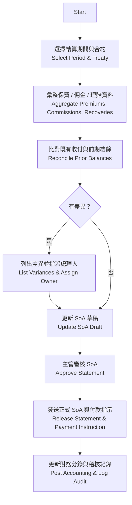

### 🧾 主要欄位 / Key Data Fields

| 欄位 Field | 說明 Description | 範例 Example |
|---|---|---|
| soa_id | 對帳單號 | SOA-2025-Q1-TR001 |
| treaty_code | 合約 / 臨分代號 | TR2025-0001 |
| reconciled_period | 結算期間 | 2025-01-01 ~ 2025-03-31 |
| ceded_premium_total | 分出保費合計 | TWD 12,000,000 |
| commission_total | 佣金合計 | TWD 1,200,000 |
| recoverable_total | 攤回金額合計 | TWD 4,500,000 |
| prior_balance | 期初結餘 | TWD 300,000 |
| variance_amount | 異常差異 | TWD -50,000 |
| settlement_currency | 結算幣別 | USD |
| payment_due_date | 預計付款日 | 2025-04-30 |
| approval_status | 審核狀態 | Draft / Pending / Approved / Released |
| variance_notes | 差異說明 | Awaiting cedant supporting documents |

### ⚙️ 業務規則 / Business Rules
- SoA 支援以合約、再保人、期間、幣別等條件產出，可一次出具多份 Statement。
- 系統自動比對前期結餘與已收付金額，差異超過門檻需指定負責人處理並記錄原因。
- 審核需分兩層（經辦與主管），簽核意見與附件需寫入 AuditEvent。
- 正式 SoA 發送後需鎖定；若需調整，必須建立補充 SoA 或調整單並保留關聯。
- SoA 與財務系統整合：自動產生應收/應付分錄與匯率換算，更新再保人帳齡分析。
- SoA 版本與發送歷程需保留至少 7 年，以符合金融監理稽核要求。

### ✅ 驗收準則 / Acceptance Criteria
- 能以指定期間產出 SoA，內容含保費、佣金、理賠、結餘與異常明細，可匯出 PDF / Excel。
- 差異清單提供狀態追蹤與提醒機制，處理完成後可重新生成最新 SoA。
- 審核流程與簽核紀錄完整，正式 SoA 備份及匯出檔案可追溯。
- 財務系統可接收 SoA 產出的分錄檔或透過 API 取得資料，確保帳務一致。

---

## UC-09：IFRS17 報表生成 / IFRS17 Reporting

### 🎯 目的 / Purpose
根據 IFRS17 標準，自動產出再保相關的 CSM、RA 與收益報表，並提供財會與監理申報所需之明細。  
Produce IFRS17-compliant reports covering CSM, RA, and reinsurance revenue adjustments, supplying detailed data for finance and regulatory reporting.

### 🧩 流程說明 / Process Flow

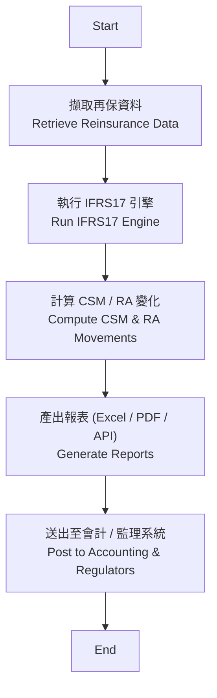

### 🧾 主要欄位 / Key Data Fields

| 欄位 Field | 說明 Description | 範例 Example |
|---|---|---|
| report_id | 報表批次編號 | IFRS17-2025-Q1 |
| reporting_period | 報導期間 | 2025-01-01 ~ 2025-03-31 |
| treaty_code | 合約 / 臨分代號 | TR2025-0001 |
| coverage_units | Coverage Units 變動 | 12,345 |
| csm_opening / csm_closing | 期初 / 期末 CSM | 5,600,000 / 5,100,000 |
| csm_release | 本期 CSM 釋放 | 500,000 |
| ra_opening / ra_closing | 期初 / 期末 RA | 1,200,000 / 1,050,000 |
| ra_release | 本期 RA 釋放 | 150,000 |
| revenue_adjustment | 再保收益調整 | -80,000 |
| loss_component_change | 損失組件變動 | 0 |
| currency | 報表幣別 | TWD |
| approval_status | 審核狀態 | Draft / Approved / Posted |

### ⚙️ 業務規則 / Business Rules
- 股票與債券等資產資訊由會計系統提供；IFRS17 引擎需支援多幣別換算並記錄匯率來源。
- 報表需符合臺灣金管會與 IFRS17 指引，含 CSM、RA、Loss Component、保費分攤與佣金等腳註明細。
- 允許以合約、產品線、再保人或 IFRS17 群組（Group of Contracts）為維度產出報表。
- 報表產出後需經財務單位審核並鎖定；任何調整需建立調整批次且保留 AuditEvent。
- 與總帳整合時，自動生成分錄（CSM 釋放、RA 調整、再保收益），並提供回傳狀態。

### ✅ 驗收準則 / Acceptance Criteria
- 可針對指定期間與合約生成 IFRS17 報表，包含必要明細欄位並符合格式要求。
- 報表可匯出 PDF / Excel 或透過 API 傳送至會計與報表平台。
- 報表審核與鎖定流程完善，調整批次有完整追蹤與備註。
- 系統可記錄生成版本並保留歷史，以供財務與稽核查驗。

---

## UC-10：資料導入與遷移 / Data Import & Migration

### 🎯 目的 / Purpose
支援舊系統或 Excel 管理的再保資料導入，以利系統初期建置與大批量維護。  
Support bulk onboarding of reinsurance data from legacy systems or spreadsheets for initial setup and ongoing maintenance.

### 📋 流程說明 / Process Flow

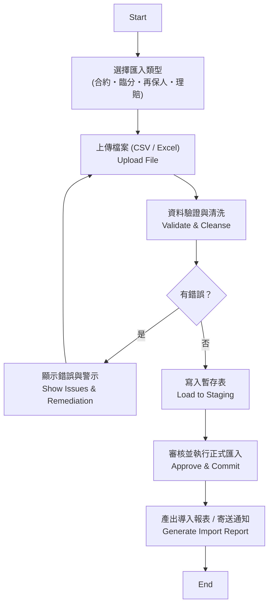

### 🧾 主要欄位 / Key Data Fields

| 欄位 Field | 說明 Description | 範例 Example |
|---|---|---|
| batch_id | 匯入批次編號 | IMP-2025-0007 |
| import_type | 匯入類型 | Treaty / Facultative / Reinsurer / Claim |
| source_system | 資料來源 | Legacy-ReSystem |
| total_records | 總筆數 | 1,200 |
| success_records | 成功筆數 | 1,180 |
| failed_records | 失敗筆數 | 20 |
| error_report_path | 錯誤報表路徑 | /imports/IMP-2025-0007-errors.xlsx |
| approved_by | 審核人員 | finance_ops |

### ⚙️ 業務規則 / Business Rules
- 支援 CSV、Excel，以及經由 API 的批次匯入，需定義欄位模板與資料驗證規則。
- 欄位驗證包含必填、型態、代碼對照（如再保人代碼）、幣別與日期格式；錯誤需以報表提供修正建議。
- 匯入流程需分為上傳、暫存審核、正式入庫三階段，避免直接寫入造成資料污染。
- 審核權限依角色區分，審核紀錄與匯入結果需寫入 AuditEvent，保存 7 年。
- 匯入完成後需觸發快取重建與 SoA/IFRS17 前置計算，確保分析資料一致。

### ✅ 驗收準則 / Acceptance Criteria
- 使用者可下載欄位模板、上傳資料並得到即時驗證結果，錯誤可匯出報表。
- 審核通過後正式匯入，資料同步至相關模組（合約、再保人、臨分、理賠）。
- 系統提供匯入結果摘要與通知（Email / Slack），並可查詢歷史批次狀態。
- 匯入造成的新增 / 更新 / 刪除均有稽核紀錄可追溯。

---

## UC-11：權限與稽核 / Access Control & Audit Trail

### 🎯 目的 / Purpose
提供多層角色權限管理與完整稽核追蹤，以符合法遵（FSC）、內控暨 SOX / GDPR 等規範。  
Provide multi-tier role management and full audit traceability to comply with FSC regulations, internal controls, and SOX/GDPR requirements.

### 📋 流程說明 / Process Flow

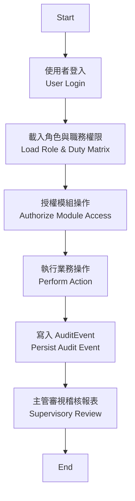

### ⚙️ 業務規則 / Business Rules
- 預設角色含 Underwriter、Operations、Finance、Compliance、System Admin，可自訂子角色並落實職責分離。
- 高風險操作（刪除合約、調整分保比例、刪除再保人）需二次確認並註記原因，可選擇啟用雙簽流程。
- 稽核事件須紀錄 `actorId / actorName / action / entityType / entityId / correlationId / metadata`，保存 7 年。
- 當發生超權或連續登入失敗時需即時通知系統管理員，並自動鎖定帳號一段時間。
- 稽核報表需支援條件查詢與匯出，並可透過 API 與 SIEM / DLP 系統整合。

### ✅ 驗收準則 / Acceptance Criteria
- 不同角色登入後僅可看到授權模組與操作按鈕；未授權操作會顯示錯誤並寫入告警。
- 合約或再保人資料異動後，稽核畫面顯示欄位差異、操作者、時間戳與來源 IP。
- 稽核報表可排程寄送主管單位，並可匯出 CSV / PDF；歷程完整可追溯。
- 權限異動（新增角色、調整可用模組）同樣建立 AuditEvent，確保權限管理透明。

---

## UC-12：系統整合 / System Integration

### 🎯 目的 / Purpose
與核心保單系統、理賠系統及財務系統整合，確保資料自動流轉。  
Integrate with core policy, claims, and accounting systems to ensure seamless data flow.

### 📋 系統架構圖 / System Integration Diagram

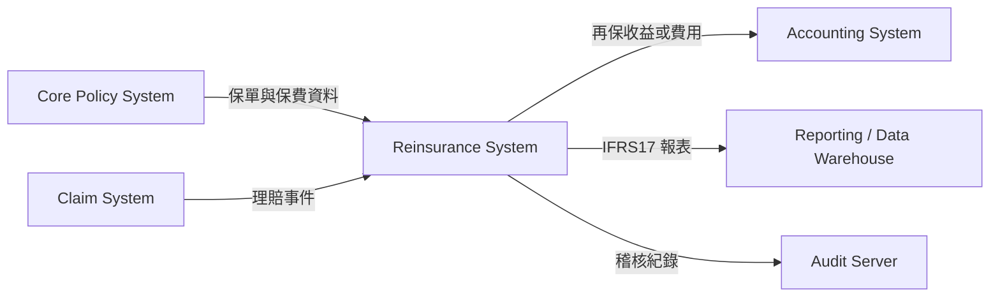

### ✅ 驗收準則 / Acceptance Criteria
- 接口支援雙向資料同步，包含保單、理賠、財務分錄與審計事件。
- 系統整合異常可在監控儀表板與通知通路上即時警示。
- 提供健康檢查與重試機制，確保批次及即時 API 的可靠性。
- 整合設定有版本與生效控管，可安全回滾。

---

## UC-13：再保合約查詢與比對 / Treaty Search & Comparison

### 🎯 目的 / Purpose
支援多條件查詢、歷史版本比對與差異報告，協助核保與審計人員快速掌握合約變動。  
Enable multi-criteria treaty search, version comparison, and difference reporting for underwriters and auditors.

### 📋 流程說明 / Process Flow

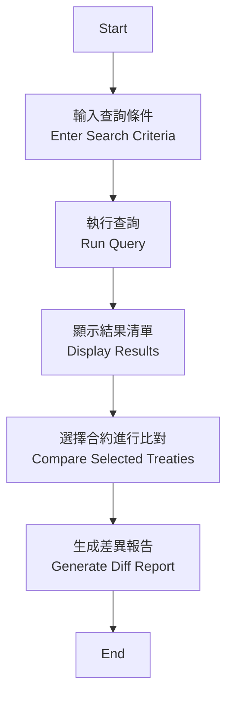

### ✅ 驗收準則 / Acceptance Criteria
- 查詢條件至少支援合約代號、險種、期間、狀態、再保人、幣別等欄位。
- 差異報告顯示欄位名稱、舊值、新值與異動日期，可匯出 Excel / PDF。
- 查詢結果可透過 API 提供，供資料倉儲或監理報表使用。
- 報表與查詢具備權限控管，僅授權人員可檢視敏感資料。

---

## UC-14：API 介面管理 / API Interface Management

### 🎯 目的 / Purpose
管理與外部系統（保單、理賠、會計）的 API 接口設定。  
Configure and monitor API integrations with policy, claims, and accounting systems.

### 📋 流程說明 / Process Flow

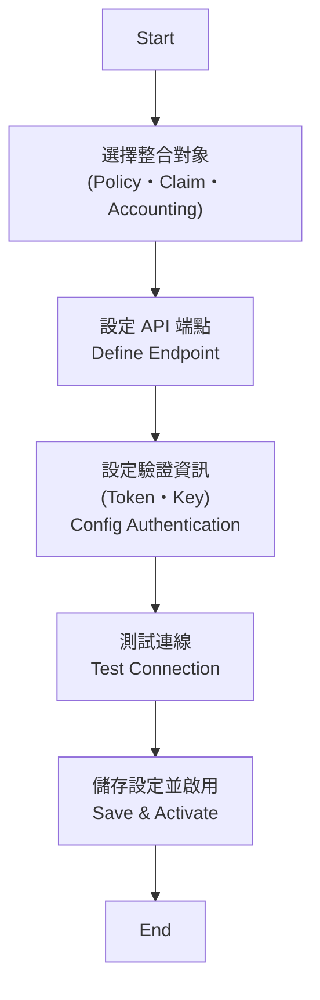

### ✅ 驗收準則 / Acceptance Criteria
- 支援 REST / SOAP / SFTP 等協議，能設定端點、逾時、重試、節流。
- 異常時觸發告警並記錄在系統監控儀表板。
- 介面設定需記錄版本、金鑰、有效期限，可追蹤與回溯。

---

## UC-15：系統設定與參數維護 / System Configuration & Parameters

### 🎯 目的 / Purpose
支援系統層級參數設定與版本化管理。  
Enable centralized configuration management and parameter versioning.

### 📋 流程說明 / Process Flow

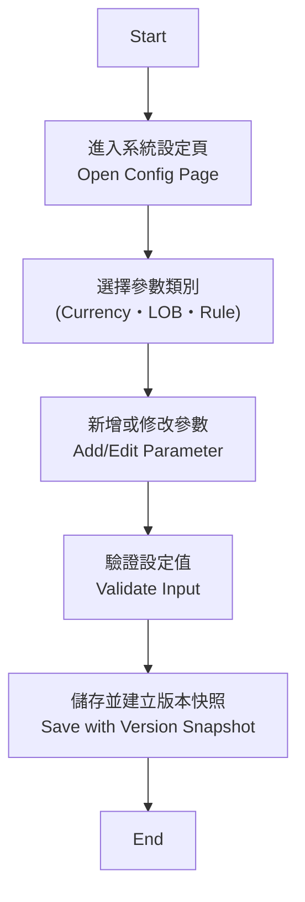

### ✅ 驗收準則 / Acceptance Criteria
- 參數異動強制輸入原因並自動建立版本，可查詢歷史與還原。
- 支援預先設定生效日 / 失效日，避免臨時手動調整造成風險。
- 關鍵參數（如分保比例上下限）異動需觸發通知或簽核流程。

---

## UC-16：系統監控與通知 / System Monitoring & Notification

### 🎯 目的 / Purpose
監控系統運行狀態，並在錯誤或異常時發送即時通知。  
Monitor system health and dispatch real-time alerts when exceptions occur.

### 📋 流程說明 / Process Flow

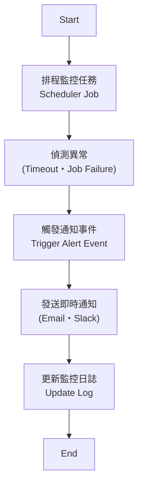

### 🧠 通知機制 / Notification Mechanism

| 類型 | 管道 | 範例 |
|------|------|------|
| 錯誤通知 | Email | System Alert: Cession Engine Failure |
| 異常警告 | Slack / Teams | `[ALERT] IFRS17 Report Delay > 30 min` |
| 系統恢復 | Dashboard | Status: Normal |
| 定期摘要 | Email | Weekly Monitoring Summary |

---

## 📚 附錄一：資料欄位字典 / Appendix A: Data Field Dictionary

以下為主要資料實體的欄位摘要：

### 📘 Reinsurer (再保人主檔)

| 欄位名稱 | 英文名稱 | 類型 | 說明 |
|-----------|-----------|------|------|
| reinsurer_id | 再保人 ID | String | 系統自動生成 UUID |
| code | 再保人代號 | String | 人工維護，建立後不可修改；需唯一 |
| name | 再保人名稱 | String | 對外顯示名稱 |
| legal_name | 法人名稱 | String | 正式法定名稱 |
| rating | 信用評等 | String | 供風險控管參考，可為空值 |
| registration_no | 登記證號碼 | String | 主管機關登記編號 |
| tax_id | 稅籍編號 | String | 統一編號或稅籍識別 |
| type | 類型 | Enum | COMPANY / MUTUAL / LLOYDS_SYNDICATE / POOL / GOVERNMENT |
| status | 狀態 | Enum | ACTIVE / INACTIVE / UNDER_REVIEW / SUSPENDED / BLACKLISTED |
| website | 官方網站 | String | URL |
| parent_company_id | 母公司代號 | String | 對應同系統再保人 |
| description | 備註 | Text | 自由描述欄位 |
| created_at | 建立時間 | DateTime | 系統生成 |
| updated_at | 更新時間 | DateTime | 系統更新 |

---

### 📘 Treaty (再保合約主檔)

| 欄位名稱 | 英文名稱 | 類型 | 說明 |
|-----------|-----------|------|------|
| treaty_id | 合約編號 | String | 唯一識別碼，自動生成 |
| treaty_name | 合約名稱 | String | 再保合約名稱 |
| treaty_type | 合約類型 | Enum | 比例 / 非比例 |
| start_date | 起始日 | Date | 合約生效日 |
| end_date | 結束日 | Date | 合約終止日 |
| reinsurer_code | 再保人代碼 | String | 對應再保公司 |
| commission_rate | 佣金率 | Decimal | 分出佣金比率 |
| cession_ratio | 分保比例 | Decimal | 合約的分保比例 |
| limit_amount | 限額 | Decimal | 合約最高責任額 |
| currency | 幣別 | String | 主幣別 (e.g., TWD, USD) |

---

### 📘 Inward Treaty (分入再保主檔)

| 欄位名稱 | 英文名稱 | 類型 | 說明 |
|-----------|-----------|------|------|
| inward_treaty_id | 分入合約 ID | String | 系統自動生成 UUID |
| inward_treaty_code | 分入合約代號 | String | 人工維護，需唯一 |
| cedant_code | 出單公司代碼 | String | 來源保險公司識別 |
| cedant_name | 出單公司名稱 | String | 來源保險公司名稱 |
| line_of_business | 承保險種 | Enum | Property / Life / Health 等 |
| coverage_scope | 承作範圍 | Text | 條件摘要、承作區域 |
| attachment_point | 起賠點 / 自留額 | Decimal | Cedant 自留或起賠點 |
| limit_amount | 最高責任額 | Decimal | 我方承擔之最高額度 |
| our_share | 我方承作比例 | Decimal | 承作百分比 |
| gross_premium_estimate | 預估分入保費 | Decimal | 承作預期保費 |
| brokerage | 仲介佣金 | Decimal | Broker 或 Cedant 酬金 |
| reporting_frequency | 申報頻率 | Enum | Monthly / Quarterly / Annual |
| settlement_currency | 結算幣別 | String | TWD / USD / JPY 等 |
| status | 狀態 | Enum | Draft / Under Review / Active / Declined |
| effective_from | 生效日 | Date | 承作開始日期 |
| effective_to | 終止日 | Date | 承作結束日期 |

---

### 📘 Facultative (臨分案件)

| 欄位名稱 | 英文名稱 | 類型 | 說明 |
|-----------|-----------|------|------|
| fac_id | 臨分編號 | String | 唯一識別碼 |
| policy_no | 原保單號碼 | String | 來源保單 |
| reinsurer_code | 再保人代碼 | String | 再保公司代碼 |
| fac_share | 臨分比例 | Decimal | 臨分承保比例 |
| fac_premium | 臨分保費 | Decimal | 臨分分出金額 |
| attachment | 上傳附件 | File | 簽單或協議文件 |

---

### 📘 Claim (理賠攤回)

| 欄位名稱 | 英文名稱 | 類型 | 說明 |
|-----------|-----------|------|------|
| claim_id | 理賠編號 | String | 保單理賠編號 |
| treaty_id | 合約編號 | String | 對應再保合約 |
| recovery_ratio | 攤回比例 | Decimal | 根據合約自動計算 |
| recovery_amount | 攤回金額 | Decimal | 應由再保人支付之金額 |
| recovery_status | 攤回狀態 | Enum | Pending / Paid / Closed |

---

### 📘 SoA (對帳與結算)

| 欄位名稱 | 英文名稱 | 類型 | 說明 |
|-----------|-----------|------|------|
| soa_id | 對帳單號 | String | 自動生成 ID |
| period_start | 期間起 | Date | 對帳起始日期 |
| period_end | 期間迄 | Date | 對帳結束日期 |
| variance_amount | 差異金額 | Decimal | 對帳差異 |
| settlement_status | 結算狀態 | Enum | Settled / Pending |

---

## 📗 附錄二：業務名詞解釋 / Appendix B: Business Glossary

| 名稱 | 英文對應 | 說明 |
|------|-----------|------|
| 比例合約 | Proportional Treaty | 依比例分享風險與保費，例如 Quota Share、Surplus |
| 非比例合約 | Non-Proportional Treaty | 超過自留額後才觸發再保，例如 Excess of Loss |
| 臨時再保 | Facultative Reinsurance | 單件風險再保，獨立於合約之外 |
| 分入再保 | Assumed Reinsurance | 本公司作為再保人承作他社風險，常見於共保或海外回分 |
| 攤回 | Recovery | 再保公司分攤的理賠金額 |
| CSM | Contractual Service Margin | IFRS17 下的未實現收益項目 |
| RA | Risk Adjustment | IFRS17 下的風險補償項目 |
| SoA | Statement of Account | 對帳與結算用報表 |
| Retrocession | 再再保 | 再保人將風險再轉給其他再保人 |

---

## 附錄三：系統模組關聯圖 / Appendix C: System Module Overview

> 說明：為避免 Mermaid 解析錯誤，以下節點一律以引號包住，使用 ` ` 斷行，並將斜線 `/` 改為「・」。

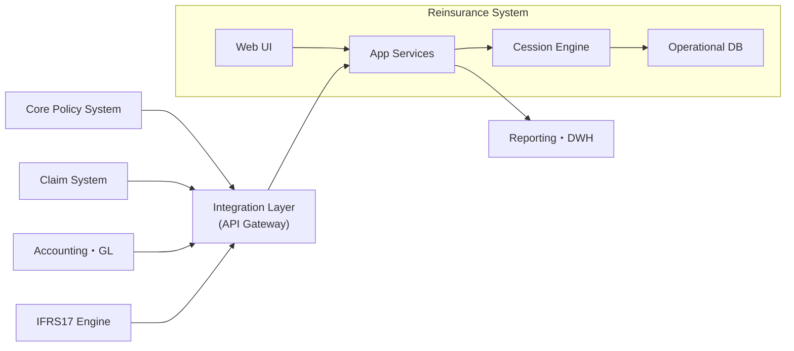

---
