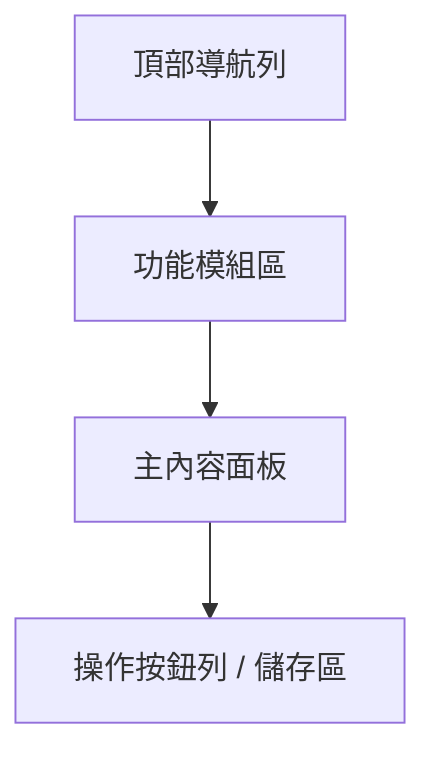
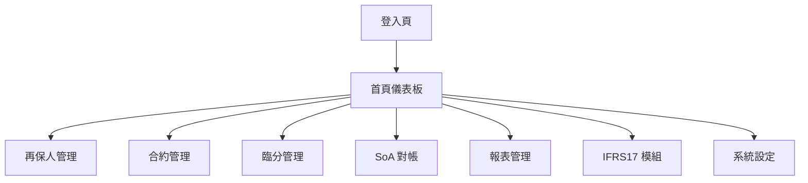
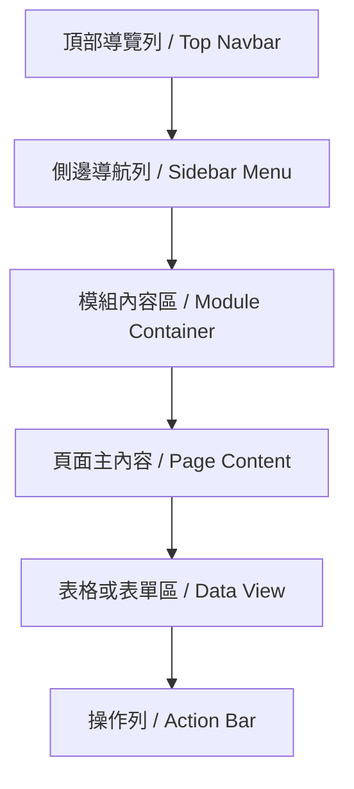
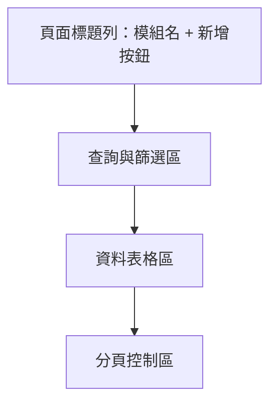
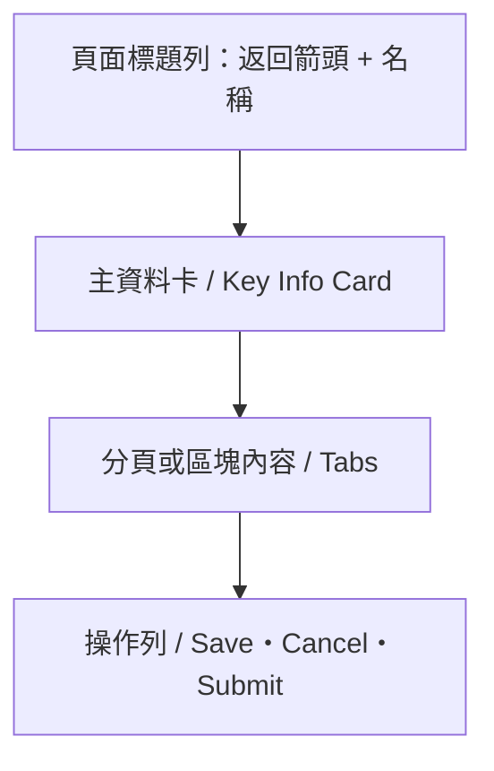

# 再保系統 UI/UX 設計規範 v0.2  
# Reinsurance System UI/UX Design Specification v0.2  

---

## 1. 設計目標與原則 / Design Goals & Principles

再保系統的 UI/UX 設計旨在提供簡潔、高可讀性、易維護的操作體驗，並符合金融系統對穩定性與專業性的要求。整體風格以深藍為主色，輔以灰白與藍綠，強化資訊層級與操作提示。

The Reinsurance System UI/UX design emphasizes clarity, consistency, and scalability across insurance product types.  
Main palette: deep blue for stability, gray-white for readability, and aqua-green for action highlights.

---

## 2. 色彩系統 / Color System

| 類別 | 色碼 | 用途 |
|------|------|------|
| 主色 Primary | `#1E2A39` | 頂部導航列、標題、主要按鈕背景 |
| 輔色 Accent | `#00A9A5` | 新增/主要操作按鈕、高亮資訊 |
| 次要背景 Secondary BG | `#F5F6F7` | 模組背景、頁面區分 |
| 強調文字 Text Emphasis | `#2E3A59` | 模組標題、資料表頭 |
| 警示色 Alert | `#E74C3C` | 錯誤訊息、刪除操作 |

---

## 3. 字體系統 / Typography System

| 類別 | 中文字體 | 英文字體 | 字重 | 用途 |
|------|-----------|-----------|------|------|
| 標題 Title | 微軟正黑體 | Roboto Bold | 700 | 模組名稱、頁面主標 |
| 內文 Body | 微軟正黑體 | Roboto Regular | 400 | 表格內容、描述文字 |
| 標籤 Label | 微軟正黑體 | Roboto Medium | 500 | 按鈕、表單欄位名 |
| 輔助文字 Hint | 微軟正黑體 | Roboto Light | 300 | 提示文字、說明性標註 |

---

## 4. 介面元件 / Component Library

| 元件名稱 | 樣式說明 |
|-----------|-----------|
| 按鈕（Button） | 主色按鈕用於主要操作；輔色按鈕用於新增、導出等行為。 |
| 輸入框（Input Field） | 使用灰底與藍綠聚焦框，支援輸入驗證。 |
| 下拉選單（Dropdown） | 可篩選選項，展開時背景變為亮灰。 |
| 表格（Table） | 採灰白底條紋交錯；標頭深藍，內容灰黑。 |
| 分頁（Tabs） | 高亮分頁顯示藍綠底線。 |
| 對話框（Modal） | 使用半透明遮罩，主要操作按鈕置右。 |

---

## 5. 版面模板 / Layout Templates

---

## 6. 互動規則 / Interaction Rules

1. 所有新增、刪除、儲存操作需二次確認對話框。  
2. 操作成功後以右上角 Toast 提示框顯示。  
3. 表格欄位支援排序與即時篩選。  
4. 欄位驗證失敗時以紅框提示。  
5. 鍵盤快捷鍵：Ctrl+N 新增、Ctrl+S 儲存、Esc 關閉對話框。

---

## 7. 系統導覽結構 / System Navigation Overview

---

## 8. 頁面框架與層級規範 / Page Framework & Hierarchy Rules

### 8.1 全域框架結構 / Global Layout Architecture

**說明：**
- **頂部導覽列**：顯示系統標誌、使用者資訊、通知。
- **側邊導航列**：列出一級模組（再保人、合約、臨分、報表、設定等）。
- **模組內容區**：每個模組作為獨立路由入口（Module Container）。
- **頁面主內容**：依模組呈現清單或詳情頁。
- **操作列**：統一於頁面底部或右側顯示「儲存 / 取消 / 送審」。

---

### 8.2 一級與二級菜單層級 / Menu Hierarchy

| 層級 | 範例 | 對應位置 | 備註 |
|------|------|------------|------|
| 一級模組 | 再保人管理、合約管理、臨分案 | 側邊欄主選單 | 固定於框架中 |
| 二級頁面 | 新增、詳情、對帳結果 | 內容容器中 | 以路由或 Tab 呈現 |

> 新增一級模組時，需在 Sidebar Menu 加入條目，並建立對應模組容器；所有頁面均套用標準模板（List / Detail）。

---

### 8.3 Layout 元件職責 / Layout Component Responsibilities

| 元件 | 控制者 | 描述 |
|------|--------|------|
| Header / Sidebar | App Shell | 全域共用，不隨頁變動 |
| Module Container | 各模組入口 | 控制內部 Tab、狀態與路由 |
| Page Template | 通用模板 | 提供清單或詳情結構 |
| Form / Table | 模組內組件 | 含欄位與欄位驗證 |

---

### 8.4 背景與邊界色彩規範 / Visual Frame Styling

| 區域 | 色碼 | 規範 |
|------|------|------|
| 頂部 / 側邊框架 | `#1E2A39` | 固定深藍底，白色字體 |
| 模組內容背景 | `#F5F6F7` | 較亮灰底，內距 16px |
| 主要內容卡片 | `#FFFFFF` | 使用陰影與圓角 8px |
| 操作列 | `#FFFFFF` | 右對齊按鈕組，間距 8px |

---

## 9. 清單頁與詳情頁模板 / List & Detail Page Templates

### 9.1 清單頁模板 / List Page Template

**行為規範：**
- 新增按鈕固定置右上角。
- 篩選列可展開/收起。
- 表格支援固定表頭、欄寬自動撐開。
- 空狀態顯示提示文字與「新增」快捷鍵。

---

### 9.2 詳情頁模板 / Detail Page Template

**行為規範：**
- 詳情頁使用完整路由（非 Modal），網址含 `/detail/:id`。  
- Modal 僅用於快速新增、刪除等非主要流程。  
- Tabs 用於多區塊（例：基本資料、層級設定、分保明細）。  
- 操作列固定於底部，隨頁滾動時保持浮動可見。  

---

### 9.3 響應式與可擴充設計 / Responsive & Scalable Design

- 桌面版 ≥1440px；標準寬度 1280px。  
- 手機與平板版可選擇隱藏 Sidebar 或以 Drawer 顯示。  
- 保留右側 16px 內距供未來工具列或 AI 助手介面使用。  

---

## 10. 無障礙與鍵盤操作 / Accessibility & Keyboard Shortcuts

- 所有互動元件均提供 aria 標籤與焦點樣式。  
- Enter 觸發搜尋；Esc 關閉對話框；Tab 鍵依序導覽欄位。  
- 模組切換後焦點自動回到主標題區，以利螢幕閱讀器追蹤。  

---

## 11. 效能與稽核要求 / Performance & Audit

| 類別 | 規範 |
|------|------|
| 響應時間 | 清單查詢 < 2 秒；分頁切換 < 1 秒 |
| 資料驗證 | 前端驗證必填欄位、日期範圍、百分比加總 |
| 稽核紀錄 | 所有新增、修改、刪除操作自動寫入操作日誌 |

---

**文件版本紀錄 / Revision History**

| 版本 | 日期 | 說明 |
|------|------|------|
| v0.1 | 2025-10-27 | 初版建立（含色彩、字體、互動規則） |
| v0.2 | 2025-10-29 | 新增框架層級結構、清單與詳情模板、延伸設計規範 |

