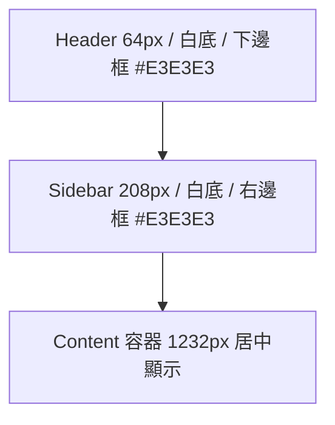
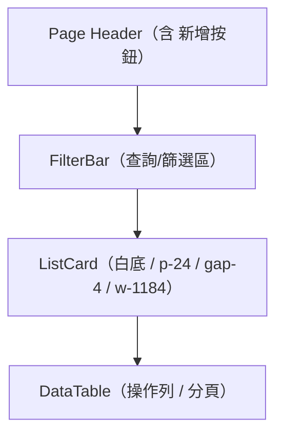
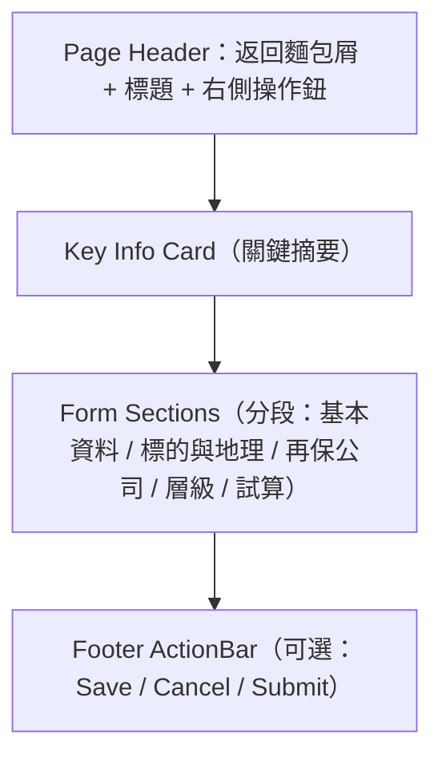

# 再保系統 UI/UX 設計規範 v0.3（以 Figma 為準，Next.js 相容）

> 目的：本規範以 **你提供的 Figma PDF/JSON** 為「視覺與間距」唯一事實來源（Ground Truth），並對齊 **ADR-001 Layered Architecture** 的 Presentation 層，產出可被 **Next.js 14（App Router）+ TypeScript + TailwindCSS + shadcn/ui** 穩定復刻的 UI 行為與樣式標準。之後無論用哪個模型（Codex/其他）做程式碼自動生成，都需遵循本規範。

---

## 0. 範圍 / Scope
- 本文件規範 **App Shell（Header/Sidebar）**、**List Page**、**Detail Page** 的版式、色彩、間距、互動行為與無障礙；
- 定義 **Design Tokens**、**Tailwind 指南**、**shadcn 元件映射**、**Next.js 路由與檔案結構**；
- 視覺尺寸依 Figma：**Navbar 64px、Sidebar 208px、Content 1232px、Card padding 24px、常用表單欄寬 272px、清單卡片寬 1184px**。

---

## 1. 設計 Token（Figma → 開發）

### 1.1 色彩（Colors）
- `--bg-page: #F6F8FB`（整體頁面底色）
- `--bg-surface: #FFFFFF`（卡片/表單底色）
- `--border-subtle: #E3E3E3`（Header/Sidebar 分隔線、表格邊界）
- `--text-muted: #595959`（標籤、次要文字）
- `--brand: #1677FF`（主按鈕、連結、Sidebar 選中狀態）
- `--sidebar-active: #F3F9FF`（Sidebar 選中背景）
- `--success: #27AE60`、`--warning: #F39C12`、`--disabled: #BFBFBF`
- `--danger: #E74C3C`（刪除/錯誤）

### 1.2 字體與字級（Typography）
- Font Family：`PingFang TC`（中文）/ `Inter`（英文備用）
- 標題（Page Title）：`text-2xl font-semibold`
- 標籤（Label）：`text-sm text-[var(--text-muted)]`
- 內文（Body）：`text-base`
- 麵包屑：`text-xs text-[var(--text-muted)]`

### 1.3 間距與圓角（Spacing & Radius）
- Navbar 高：`64px`；Sidebar 寬：`208px`
- Content 固定寬：`1232px`（centered）；清單卡片：`w-1184px`
- Card Padding：`24px`；區塊間距（Section Gap）：`24px`；欄寬（表單常用）：`272px`
- 元件圓角：`8px`；按鈕圓角：`8px`；輸入框圓角：`6px`
- 陰影：卡片 `shadow-sm`，浮層 `shadow-lg`

> **一律以 Token 命名引用**，避免硬編碼 HEX 與 px。

---

## 2. App Shell（Header / Sidebar）



### 2.1 Header（頂部列）
- 內容：LOGO（左）/ 使用者與通知（右）
- 樣式：白底、`border-b border-[var(--border-subtle)]`
- Z-index：`z-30`（高於內容卡片/表單）

### 2.2 Sidebar（側邊欄）
- 寬度固定 `208px`；白底、`border-r` 分隔
- 節點樣式：
  - 預設：`text-gray-700 hover:bg-gray-50`
  - 選中：`bg-[var(--sidebar-active)] text-[var(--brand)] font-semibold`
- 圖示與字距：`gap-3`；左右內距 `px-4`；行高 `h-10`

### 2.3 Content 容器
- 位置：`left: 208px; top: 64px;`（Layout 層處理）
- 寬度：`1232px`；左右居中；頁面卡片與區塊 `gap-6`

---

## 3. Page Header（頁首卡片）
- 背景：白底卡片；Padding：`pt-3 pb-4 px-6`（≈ 24px）
- 結構：麵包屑（左上）→ 主標題（左下）→ 主要操作鈕（右側）
- 按鈕配置：
  - 詳情頁：`次要（取消）` + `主要（儲存）` + `次要（提交審核）` 視頁面而定
  - 次要鈕：白底灰框 `border-[#D9D9D9]`
  - 主要鈕：`bg-[var(--brand)] text-white`

---

## 4. List Page 模板



### 4.1 FilterBar（查詢列）
- 欄寬：單欄 `272px`；多欄 `gap-4`；`label` 使用 `text-sm text-muted`
- 元件：`Input`、`Select`、`DatePicker`、`Checkbox/Radio`、`Button(搜尋/清除)`

### 4.2 DataTable（資料表格）
- 樣式：白底、條紋或分隔線；表頭 `text-[var(--text-muted)]`
- 欄位：列表頁定義必含「狀態 Tag」「操作（編輯/刪除）」
- 分頁：置底對齊右側；每頁大小可選（10/20/50）

### 4.3 新增按鈕
- 位置：Page Header 右側固定；`Button variant=primary`

---

## 5. Detail Page 模板



### 5.1 表單分段與欄寬
- 一列最多 3 欄（每欄 272px）；段間距 `24px`
- 標題行：分段標題 `text-base font-medium`，下方分隔線 `#E3E3E3`
- 驗證：欄位下方顯示錯誤文字 `text-xs text-[var(--danger)]`

### 5.2 互動規則
- **主要操作**置於 Page Header 右側；頁尾可配置冗餘 ActionBar
- **提交檢核**：如比例合計需 = 100% 才允許送審；否則 Toast + 欄位標示
- **刪除/送審** 必彈出二次確認 Dialog

---

## 6. 元件庫映射（shadcn/ui）與 Tailwind 指南

| 功能 | shadcn 元件 | Tailwind 例 | 備註 |
|---|---|---|---|
| 按鈕 | `Button` | `rounded-lg` `h-10` `px-4` | `variant="primary|secondary|danger"` 擴充 |
| 輸入框 | `Input` | `rounded-md` `h-10` | `:invalid` 顯示紅框 |
| 下拉 | `Select` | `w-[272px]` | 支援搜尋/過濾 |
| 分頁 | `Pagination` | `justify-end` | 每頁大小選擇器 `Select` |
| 表格 | `Table` | `text-sm` `border-b` | 表頭 muted、奇偶行底色 |
| 標籤 | `Badge` | `rounded-md` | 狀態（綠/橘/灰） |
| 分段 | `Separator` | `border-[var(--border-subtle)]` | 用於段落下分隔 |
| 對話框 | `Dialog` | `shadow-lg` | 刪除/送審確認 |
| 提示 | `Toast` | — | 成功/錯誤/警示 標準文案 |
| 分頁籤 | `Tabs` | `data-[state=active]:text-[var(--brand)]` | 詳情頁多區塊 |

> **Tailwind 擴充建議**：在 `tailwind.config.ts` 內把上述 Token 映射到 `theme.extend.colors` 與 `spacing`，並新增 `container` 設定 `maxWidth: '1232px'`。

---

## 7. Next.js 14（App Router）檔案結構建議

```
/app
  /(shell)
    layout.tsx        // Header + Sidebar + Content 容器
    globals.css       // :root Token、Reset、Utility
  /reinsurers
    page.tsx          // List Page
    new/page.tsx      // Detail（新增）
    [id]/page.tsx     // Detail（檢視/編輯）
  /treaties
    page.tsx
    new/page.tsx
    [id]/page.tsx
/components
  PageHeader.tsx
  ListCard.tsx
  DataTable.tsx
  FilterBar.tsx
  FormSection.tsx
  ActionBar.tsx
  Sidebar.tsx
  ...（shadcn 封裝）
```

- `layout.tsx` 放置 **固定 Header/Sidebar** 與 Content 容器（1232px）
- `PageHeader` 統一渲染麵包屑、標題與右側操作鈕（props 控制）
- List 與 Detail 採用 **模板式組件**，減少樣式分歧

---

## 8. 驗證、無障礙與回饋（A11y / Validation / Feedback）
- A11y：所有互動元件具 `aria-*`、焦點樣式；模組切換時把焦點送回頁標題
- 鍵盤：`Enter` 觸發查詢、`Esc` 關閉 Dialog、Tab/Shift+Tab 正確導覽
- 驗證：提交前前端校驗必填、日期區間、百分比合計；錯誤以欄位下訊息與 Toast 同步顯示
- 成功/失敗訊息：統一 Toast 文案，3 秒自動消失，可手動關閉

---

## 9. List 與 Detail 的欄位規範（片段）

### 9.1 再保人管理（List）
- 欄位：代碼 / 名稱 / 國家 / 信用評級 / 聯絡人 / 狀態 / 操作
- 搜尋條件：代碼、名稱、公司類型（保險/再保/經紀）、狀態（有效/失效）

### 9.2 再保人（Detail-新增）
- 分段：基本資料、聯絡人、財務與結算、信用風險評核
- 必填：代碼、名稱、公司類型、營業登記地址、主要聯絡人（含 email）

### 9.3 合約管理（List）
- 欄位：合約編碼 / 名稱 / 生效日起 / 生效日迄 / 狀態（綠/橘/灰） / 操作
- 搜尋條件：年度、編碼、類型（QS/Surplus/XOL/SL）、大類（比例/非比例）、審核狀態

### 9.4 合約（Detail-新增）
- 分段：基本資料、標的與地理、再保公司與比例、層級與限額、試算
- 檢核：再保公司分保比例總和 = 100%；層級限額為正；日期起不得晚於迄

---

## 10. 視覺容錯與 Mermaid 規範
- Mermaid 節點一律 **加引號**，斜線改為 `・`，避免解析器版本差異
- 介面圖僅表結構，**不取代 Figma**；任何衝突以 Figma 為準

---

## 11. 版本與變更
- v0.3：
  - 以 Figma 為唯一視覺依據；
  - 明確化 Navbar/Sidebar/Content 常數；
  - 新增 Tailwind/shadcn/Next.js 對應；
  - 定義 List/Detail 模板與欄位分段；
  - 加入 A11y、驗證與 Toast 規範。

